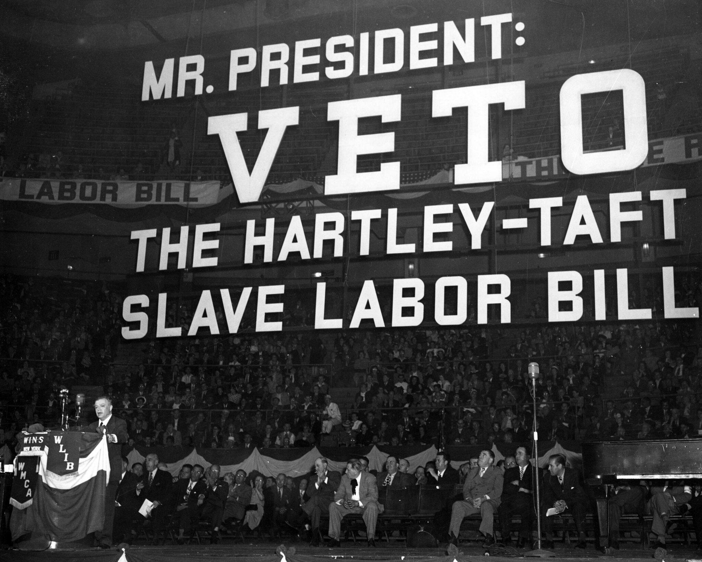

In today's rapidly evolving labor market and financial sectors, the intersection of regulatory frameworks and innovative trading strategies is more crucial than ever. At the forefront of influencing labor relations in the United States is the Taft-Hartley Act, officially termed the Labor Management Relations Act of 1947. This legislation remains instrumental in shaping labor laws and governing union activities, defining the legal landscape in which unions and employers operate. It introduced constraints that altered the dynamics between unionized and non-unionized entities, reflecting a post-war shift in policy perspectives.

Simultaneously, the financial markets are experiencing a transformative change with the rise of algorithmic trading. This form of trading leverages high-speed computations and complex algorithms to execute trades more efficiently than traditional methods. Algo trading introduces new needs in terms of regulatory oversight, pushing for an understanding of both contemporary and emerging rules. The convergence of these two domains—labor regulations and financial market innovations—invites a comprehensive look at the interconnectedness of statutory measures and technological advancements.

This article examines the implications of the Taft-Hartley Act on union legislation, focusing on how these regulations interact with the expanding field of algorithmic trading. Both areas have profound impacts; labor laws influence workforce dynamics, and trading strategies affect market operations. Understanding their intersection is paramount for framing effective regulatory environments that ensure fair labor practices while fostering innovation in financial markets.

## Table of Contents

## What is the Taft-Hartley Act?

The Taft-Hartley Act, officially known as the Labor Management Relations Act of 1947, was a significant amendment to the National Labor Relations Act (NLRA) of 1935. Its enactment marked a pivotal change in U.S. labor policy, aiming to address perceived imbalances in labor-management relations and to curtail certain union practices that were considered excessive or disruptive to industry stability.

One of the primary features of the Taft-Hartley Act was the imposition of several key restrictions on union activities. These restrictions were intended to regulate union power and provide a more equitable framework for both unionized and non-unionized entities. Notably, the Act prohibited secondary boycotts, a tactic where unions would target businesses associated with their primary adversaries, thereby extending economic pressure beyond the immediate dispute. Jurisdictional strikes, which involved unions competing for work assignments, were also outlawed. Additionally, the Act placed limitations on union political activities, notably barring unions from making direct contributions to federal election campaigns.

The passage of the Taft-Hartley Act came despite considerable opposition from President Harry S. Truman, who vetoed the bill. Truman's veto underscored the contentious nature of the legislation, as he viewed it as a threat to the strength of labor unions and their established rights. However, the U.S. Congress overrode his veto, a testament to the prevailing political climate and calls for labor reform in the post-World War II United States. This legislative move reflected a shift in labor policy during this period, highlighting the growing congressional inclination towards restraining union influence to enhance industrial peace and economic recovery after the war.

The Taft-Hartley Act remains a fundamental component of U.S. labor law, impacting the way unions operate and negotiate within the labor market. Its introduction of a more balanced power dynamic between unions and employers would continue to shape labor relations and policy discussions for decades to come.

## Impact on Union Legislation

The Taft-Hartley Act of 1947 fundamentally reshaped the framework surrounding labor unions in the United States by introducing significant disclosure requirements and imposing restrictions on various union activities. A critical component of the Act was the empowerment of states to enact 'right-to-work' laws, which diminish the influence of union security agreements. These laws allow employees to work without being compelled to join a union or pay union dues, thereby weakening the financial base and bargaining power of unions.

Furthermore, the Taft-Hartley Act aimed to curb the proliferation of strikes that disrupted national industries, thereby placing greater emphasis on maintaining industrial operations over union demands. It introduced measures to restrict secondary boycotts, jurisdictional strikes, and certain political activities by unions. These restrictions were intended to prevent unions from exercising excessive leverage over employers and to safeguard the national economy from industrial disruptions.

However, the changes introduced by the Taft-Hartley Act were not without controversy. Many labor organizations resisted these restrictions, arguing that the Act unfairly tipped the balance of power in favor of employers and undermined collective bargaining rights. The requirement for union leaders to sign affidavits affirming they were not members of the Communist Party further fueled tensions, as it was perceived as an infringement on personal beliefs.

The Act's attempt to create a more balanced interaction between unions and employers sparked significant debate and legal challenges, illustrating the complex dynamics between labor rights and business interests. Despite its intention to mitigate disruptive industrial actions, the Taft-Hartley Act continues to be a contentious topic in discussions around labor law and union activities.

## The Role of Algorithmic Trading

Algorithmic trading, or algo trading, signifies a transformative shift in financial market operations. It uses the impressive computational power and advanced algorithms to execute trades with extraordinary speed and precision. This form of trading harnesses extensive data analysis and real-time market evaluations, optimizing trading strategies while significantly reducing human error. The core advantage lies in its ability to efficiently process vast amounts of market data, identify trends, and execute large orders in fractions of a second without manual intervention.

This technology-driven approach has had a profound impact on market dynamics. One of the primary implications is enhanced market transparency. By enabling continuous market monitoring and analysis, algo trading facilitates more informed decision-making. It contributes to price discovery and [liquidity](/wiki/liquidity-risk-premium) by executing numerous trades rapidly, thereby minimizing spreads and transaction costs. Moreover, the automation involved in [algorithmic trading](/wiki/algorithmic-trading) often leads to increased market efficiency, as it capitalizes on [arbitrage](/wiki/arbitrage) opportunities that might be overlooked by human traders.

Despite its advantages, algorithmic trading also poses significant regulatory challenges, particularly regarding market fairness and stability. High-frequency trading, a subset of algo trading, has been criticized for creating an uneven playing field. Critics argue that it advantages firms with superior technological infrastructure, potentially marginalizing smaller market participants. Additionally, the speed and [volume](/wiki/volume-trading-strategy) at which algo trading operates can lead to increased market [volatility](/wiki/volatility-trading-strategies). Flash crashes, exemplified by the dramatic market events such as the 2010 Flash Crash, highlight the potential for systemic risk posed by unregulated high-speed trading activities.

Therefore, it is crucial for regulatory bodies to comprehend how existing labor laws may align or conflict with these technological advancements in trading practices. For instance, regulations like the Taft-Hartley Act, which primarily govern labor relations, must be evaluated for their applicability and potential impacts on sectors increasingly dominated by automation and technology. The challenge for regulators is to craft policies that strike a balance between fostering innovation and ensuring market integrity and fairness. This may involve updating or redefining regulations to encompass the unique characteristics of algorithmic trading, ensuring that advancements in technology do not compromise the fundamental principles of fair market competition and equitable labor practices.

## Intersections and Implications

The integration of labor laws and financial markets necessitates an intricate regulatory approach due to the unique challenges and opportunities it presents. As algorithmic trading (algo trading) continues to expand within financial markets, successfully navigating the existing labor legal framework, such as the Taft-Hartley Act, becomes essential. This act, primarily designed to regulate union activities and labor relations, can intersect with financial market operations when algorithmic trading firms engage in activities that may fall within its ambit, such as employing unionized workers for certain technological or trading tasks. 

Ensuring compliance with such legislation requires vigilant oversight and adaptive regulatory measures. For algo trading firms, this means maintaining transparency and accountability not only in financial transactions but also in employment practices. Regulators must assess how employment laws interface with advanced trading systems that may demand unconventional labor structures and skill sets.

A continuous dialogue among labor unions, financial entities, and policymakers is vital to address these overlapping concerns. Labor unions may question whether algorithmic trading impacts employment levels or working conditions, while financial institutions could seek clarity on how labor regulations apply to their increasingly automated processes. Policymakers have the challenging task of reconciling these interests to foster both fair labor practices and financial innovation.

Moreover, future regulatory strategies should simultaneously support labor rights and encourage technological advancement. This could involve revisiting existing laws or introducing new regulations that account for the dynamic interplay between human labor and automated systems. Regulatory frameworks may need to balance safeguarding the rights of workers—to ensure fair treatment and job security—with promoting efficiencies and advancements through technologies like algorithmic trading. 

By adopting adaptable and forward-looking policies, regulators can create an environment where labor protections coexist with technological progress, contributing to a stable and flourishing economic landscape. Collaborative efforts that bring together stakeholders from different quarters of the economy will be essential to achieving these objectives.

## Conclusion

The interplay between the Taft-Hartley Act and the rise of algorithmic trading underscores the complexities inherent in contemporary regulatory environments. Both fields represent significant shifts within their respective domains—labor relations and financial markets—that hold the potential to impact each other in meaningful ways. 

The Taft-Hartley Act, by redefining union participation and worker rights, has significantly influenced how labor relations are regulated and perceived in the United States. Its strong emphasis on balancing the power dynamics between unions and employers continues to be a guiding force in labor legislation. Conversely, algorithmic trading has fundamentally altered the landscape of financial markets. By leveraging technology to execute trades at unprecedented speeds, it challenges existing frameworks, calling for new oversight methods to ensure market integrity and fairness.

In this evolving scenario, balancing robust labor protections with the innovative potential that algo trading offers is crucial for maintaining economic stability and fostering growth. Labor laws like the Taft-Hartley Act must adapt without undermining technological advancements that drive market efficiency and transparency. Regulatory bodies play a pivotal role, requiring them to harmonize both domains while fostering a conducive environment for economic progress.

Looking ahead, collaboration and adaptive policymaking will be essential in managing these changes effectively. Engagement between labor representatives, financial institutions, and regulatory authorities can illuminate shared concerns and develop comprehensive solutions that respect the objectives of both labor protections and market innovation. This collaborative approach will help pave the way for policies that not only address current challenges but also accommodate future technological and economic shifts.

## References & Further Reading

[1]: Cox, Archibald. ["The Role of the Taft-Hartley Act in the American Labor Movement."](https://en.wikipedia.org/wiki/Taft%E2%80%93Hartley_Act) Virginia Law Review, 1958.

[2]: ["The Taft-Hartley Act: A Guide to the Labor-Management Relations Act of 1947"](https://en.wikipedia.org/wiki/Taft%E2%80%93Hartley_Act) by the Congressional Research Service.

[3]: O’Hara, Maureen. ["High Frequency Market Microstructure."](https://www.sciencedirect.com/science/article/pii/S0304405X15000045) Journal of Financial Economics, 2015.

[4]: Williams, William G. ["The Postwar Responsibilities of American Unions."](https://en.wikipedia.org/wiki/George_Washington_Williams) Proceedings of the American Philosophical Society, 1954.

[5]: Aldridge, Irene. ["High-Frequency Trading: A Practical Guide to Algorithmic Strategies and Trading Systems,"](https://www.amazon.com/High-Frequency-Trading-Practical-Algorithmic-Strategies/dp/1118343506) 2nd Edition, Wiley, 2013.