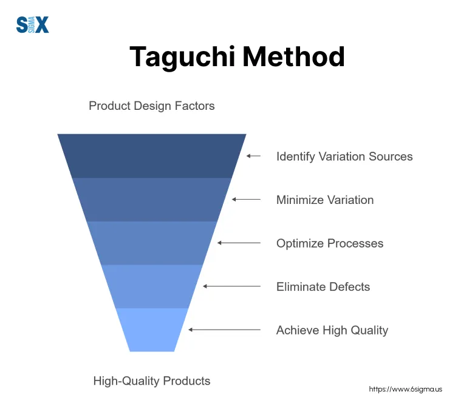

## Table of Contents

## What is the Taguchi Method and why is it important in quality control?

The Taguchi Method is a way to improve the quality of products by making them less sensitive to changes and variations in how they are made. It was created by Dr. Genichi Taguchi, a Japanese engineer. The method uses special experiments to find out which parts of the production process are most important for quality. By focusing on these key parts, companies can make their products better and more consistent, even if there are small changes in the materials or the way things are done.

This method is important in quality control because it helps companies save money and time. Instead of fixing problems after they happen, the Taguchi Method helps prevent problems before they start. This means fewer defects and less waste, which can save a lot of money. It also makes customers happier because they get better products that work well and last longer. Overall, the Taguchi Method helps businesses make high-quality products more efficiently and reliably.

## Who developed the Taguchi Method and when was it introduced?

The Taguchi Method was developed by Dr. Genichi Taguchi, a Japanese engineer. He started working on this method in the 1950s. Dr. Taguchi wanted to find a better way to make products that were high quality and reliable.

The method became well-known in the 1980s when it started being used outside of Japan. It helped many companies around the world improve their products and save money. Dr. Taguchi's ideas changed how people thought about quality control and made a big impact on manufacturing.

## What are the key principles of the Taguchi Method?

The Taguchi Method focuses on making products better by reducing how much they are affected by changes in the production process. One of the main ideas is to use special experiments, called orthogonal arrays, to test different parts of the process at the same time. This helps find out which parts are most important for quality. Instead of testing one thing at a time, which can take a long time, these experiments let you see how different factors work together.

Another key principle is to think about quality in terms of loss to society. Dr. Taguchi believed that any product that doesn't meet the perfect standard causes some kind of loss, like unhappy customers or wasted materials. By trying to make products as close to perfect as possible, companies can reduce these losses. The Taguchi Method encourages companies to focus on making their products work well under all kinds of conditions, not just in a perfect lab setting. This makes the products more reliable and saves money in the long run.

## How does the Taguchi Method differ from traditional quality control methods?

The Taguchi Method is different from traditional quality control methods because it focuses on making products less sensitive to changes in the production process. Traditional methods often check for defects after they happen and then fix them. They might test one thing at a time to see if it affects the product's quality. But the Taguchi Method uses special experiments to test many things at once. This helps find the most important factors that affect quality faster and more efficiently.

Another big difference is how the Taguchi Method thinks about quality. Traditional methods usually just try to make sure a product meets certain standards. If it does, it's considered good enough. But the Taguchi Method sees any difference from the perfect standard as a loss to society. It tries to make products as close to perfect as possible, even if they already meet the standards. This approach can lead to more reliable products and less waste, saving money in the long run.

## What is meant by 'robust design' in the context of the Taguchi Method?

In the Taguchi Method, 'robust design' means making products that work well even when things change during production. It's about making sure the product stays good quality no matter what small changes happen, like different temperatures or slightly different materials. The idea is to make the product strong against these changes, so it always works the way it should.

To do this, the Taguchi Method uses special experiments to find out which parts of the production process are most important for keeping the product's quality high. By focusing on these key parts, companies can make their products more reliable and less likely to have problems. This saves money because there are fewer defects and less waste, and it makes customers happier because they get better products.

## Can you explain the concept of loss function in the Taguchi Method?

The concept of loss function in the Taguchi Method is about how any difference from the perfect standard of a product causes a loss to society. This could be unhappy customers, wasted materials, or extra costs to fix problems. Dr. Taguchi believed that even if a product meets the basic standards, any small difference from perfect can still cause problems. So, the loss function helps companies see the real cost of these small differences and encourages them to make their products as close to perfect as possible.

The loss function is usually shown as a graph that gets bigger as the product gets further away from the perfect standard. It's not just about whether a product passes or fails a test. It's about understanding that every little bit of difference adds up to a bigger loss. By focusing on reducing this loss, companies can make their products better and save money in the long run. This way of thinking helps businesses make smarter choices about how to improve their products and processes.

## What are orthogonal arrays and how are they used in the Taguchi Method?

Orthogonal arrays are special tables used in the Taguchi Method to help run experiments more efficiently. They let you test many different parts of the production process at the same time, instead of testing one thing after another. This saves a lot of time and helps you find out which parts are most important for the quality of the product. Each row in the table represents a different combination of settings for the parts you are testing, and each column represents a different part of the process.

In the Taguchi Method, orthogonal arrays are used to figure out how different parts of the process affect the product's quality. By using these arrays, you can see how the parts work together and which ones have the biggest impact. This helps you focus on making the most important parts better, which can make the whole product more reliable and less likely to have problems. Using orthogonal arrays makes it easier to find the best way to make your product, saving time and money.

## How do you select and design experiments using the Taguchi Method?

In the Taguchi Method, selecting and designing experiments starts with figuring out which parts of the production process might affect the product's quality. These parts are called factors, and each [factor](/wiki/factor-investing) can have different settings, called levels. You list all the factors and levels you want to test. Then, you use a special kind of table called an orthogonal array to plan your experiments. This table helps you test many different combinations of factors and levels at the same time, which saves a lot of time and effort.

Once you have your orthogonal array set up, you run the experiments according to the combinations listed in the table. Each row in the array represents a different experiment, where you change the settings of the factors as instructed. After running all the experiments, you collect data on how well the product performs under each combination. You then analyze this data to see which factors and levels have the biggest impact on quality. This helps you focus on improving the most important parts of the process, making your product more reliable and consistent.

## What are the steps involved in implementing the Taguchi Method in a manufacturing process?

Implementing the Taguchi Method in a manufacturing process starts with identifying the factors that might affect the quality of your product. These factors could be things like temperature, material type, or machine settings. You list these factors and decide on the different levels or settings you want to test for each one. Once you have your list, you choose an orthogonal array, which is a special table that helps you plan your experiments. This table lets you test many different combinations of factors and levels at the same time, which is much faster than testing one thing at a time.

After setting up the orthogonal array, you run the experiments according to the combinations listed in the table. Each row in the array represents a different experiment, where you change the settings of the factors as instructed. You then collect data on how well the product performs under each combination. Once you have all your data, you analyze it to see which factors and levels have the biggest impact on the product's quality. This helps you focus on improving the most important parts of the process. By doing this, you can make your product more reliable and consistent, which saves time and money in the long run.

## How can the Taguchi Method be applied to improve product quality and reduce costs?

The Taguchi Method helps improve product quality and reduce costs by figuring out which parts of the production process are most important. It uses special experiments called orthogonal arrays to test many different parts at the same time. This way, you can see how these parts work together and which ones affect the product's quality the most. By focusing on the key parts, you can make small changes that make a big difference. This means fewer defects and less waste, which saves money because you don't have to fix as many problems after they happen.

Another way the Taguchi Method helps is by thinking about quality in terms of loss to society. It says that any difference from the perfect standard of a product causes some kind of loss, like unhappy customers or wasted materials. By trying to make the product as close to perfect as possible, you can reduce these losses. This approach makes the product more reliable and consistent, even if there are small changes in the production process. In the end, this saves money and makes customers happier because they get better products that work well and last longer.

## What are some real-world examples or case studies where the Taguchi Method has been successfully applied?

One real-world example where the Taguchi Method was successfully applied is in the automotive industry. A car manufacturer used the method to improve the quality of their engine parts. They identified factors like the temperature during casting and the type of alloy used as key variables. By using orthogonal arrays, they tested different combinations of these factors and found the best settings to reduce defects. This led to fewer engine problems, happier customers, and lower costs for the company because they didn't have to fix as many issues after production.

Another example is in the electronics industry, where a company applied the Taguchi Method to improve the reliability of their circuit boards. They focused on factors like soldering temperature and the type of solder used. Through experiments designed with orthogonal arrays, they discovered the optimal conditions that minimized failures. As a result, the company saw a significant reduction in the number of defective boards, which not only saved money on repairs but also improved their reputation for producing high-quality products.

In the pharmaceutical industry, a company used the Taguchi Method to enhance the production of a new drug. They identified key factors such as the mixing time and the temperature during the production process. By running experiments using orthogonal arrays, they were able to pinpoint the best settings to maximize the drug's effectiveness and consistency. This led to a more reliable product that met high standards, ultimately reducing waste and increasing customer satisfaction.

## What are the limitations and criticisms of the Taguchi Method in quality control?

The Taguchi Method is really helpful for making products better and saving money, but it does have some limitations. One big problem is that it can be hard to understand and use. The special experiments called orthogonal arrays need a lot of planning and math. Not everyone knows how to do this, so companies might need to train people or hire experts. This can make it expensive and time-consuming to get started. Also, the Taguchi Method works best when you can test a lot of different things at once. If you don't have enough resources to do this, it might not be the best choice.

Another criticism is that the Taguchi Method focuses a lot on the experiments and numbers, but it might not pay enough attention to other important things like how people work together or how to keep improving over time. Some people say it's too focused on the technical side and doesn't help with the bigger picture of quality control. Also, the idea of loss function, where any difference from perfect causes a loss, can be hard to measure and might not always fit with how companies think about costs and quality. So, while the Taguchi Method can be very useful, it's important to think about these limitations and maybe use it along with other quality control methods.

## What is the Taguchi Method and how can it be understood?

The Taguchi Method approaches quality control by placing significant emphasis on the design phase rather than waiting until the manufacturing process to address defects. This early intervention strategy is fundamental in preventing defects before they occur, thereby saving resources and reducing the total cost of production.

A primary focus of the Taguchi Method is the reduction of variability through robust design processes. By implementing robust designs, engineers can ensure product reliability and performance consistency under a variety of external conditions. This approach is not only efficient but also critical in maintaining a high level of quality control, which is indispensable for industries striving to remain competitive.

Prominent companies such as Toyota and Xerox are testament to the efficacy of the Taguchi Method. By applying its principles, these companies have successfully enhanced product consistency and process control, leading to higher customer satisfaction and operational efficiency. The implementation of these techniques paves the way for significant improvements in product quality and cost-effectiveness.

Central to the Taguchi Method are key components such as the Loss Function and the Signal-to-Noise Ratio. The Loss Function, often represented as $L(y) = k(y - T)^2$, where $y$ is the actual value, $T$ is the target value, and $k$ is a constant, quantifies the cost that deviations from the target impose. This function underscores the economic loss associated with deviation, thus guiding engineers to minimize this variance for optimum performance.

The Signal-to-Noise Ratio (SNR) is another pivotal element. It measures the quality of a product by considering the ratio of the desired signal to the background noise, thereby ensuring quality against variation. The SNR is calculated as:

$$
\text{SNR} = 10 \cdot \log_{10} \left(\frac{\mu^2}{\sigma^2}\right)
$$

where $\mu$ is the mean, and $\sigma^2$ is the variance. This metric helps in assessing and improving the robustness of the design by focusing on maximizing the signal (desired output) while minimizing the noise (undesired variability).

Together, these components help achieve an optimal balance between cost and quality, which is essential in competitive markets where consumer expectations are continually increasing. By focusing on these principles, the Taguchi Method facilitates the development of superior products while optimizing resource allocation and enhancing overall market competitiveness.

## How can the Taguchi Method be applied in Algorithmic Trading?

Algorithmic trading relies on the systematic execution of trade orders through algorithms, leveraging computational power to make quick and informed trading decisions. The integration of the Taguchi Method into [algorithmic trading](/wiki/algorithmic-trading) provides a structured approach to enhancing the reliability and effectiveness of these algorithms. The application of the Taguchi Method in algorithmic trading is predominantly based on using Orthogonal Arrays and evaluating the Signal-to-Noise Ratio, which collectively enhance the robustness and adaptability of trading strategies.

Orthogonal Arrays, a key component of the Taguchi Method, allow traders to design experiments that can efficiently evaluate multiple trading strategies across a range of market conditions. These arrays enable the evaluation of interactions between multiple variables in a trading algorithm, thereby identifying the optimal settings for a given trading strategy. By employing Orthogonal Arrays, traders can explore different configurations without testing every possible combination, significantly reducing computational time and resources.

For instance, consider a scenario where a trader wants to optimize an algorithm across variables such as moving average period, trade entry threshold, and stop-loss limit. An Orthogonal Array can be used to systematically vary these parameters and measure the performance outcomes, helping determine the most effective combination for varying market conditions. This systematic approach enhances the robustness of the algorithm, ensuring it performs well even under conditions not explicitly tested.

Moreover, the Signal-to-Noise Ratio (SNR) plays a crucial role in assessing and improving the reliability of trading algorithms. In trading, 'noise' refers to the random price fluctuations that do not reflect the true market trend. By maximizing the SNR, traders can identify setups that are more likely to yield reliable and profitable trades. The SNR is calculated as follows:

$$
\text{SNR} = \frac{\text{Mean of the Desired Signal}}{\text{Standard Deviation of Noise}}
$$

A higher SNR indicates that the algorithm can better distinguish profitable trading signals from random market noise, leading to more consistent and reliable trading outcomes.

Implementing the Taguchi Method allows traders to fine-tune their strategies, increasing their resistance to sudden market shifts and [volatility](/wiki/volatility-trading-strategies). This optimization process helps in identifying the strategy parameters that maximize returns while minimizing risks and losses.

By applying these principles, traders can yield more consistent trading results and mitigate risks effectively. As such, the Taguchi Method provides a robust framework for enhancing algorithmic trading strategies, promising more predictable performance and reduced susceptibility to market fluctuations. This integration can lead to significantly improved decision-making capabilities and strategic advantages within competitive financial markets.

## References & Further Reading

[1]: Taguchi, G. (1986). "Introduction to Quality Engineering: Designing Quality into Products and Processes". Asian Productivity Organization.

[2]: Phadke, M. S. (1989). ["Quality Engineering Using Robust Design"](https://books.google.com/books/about/Quality_Engineering_Using_Robust_Design.html?id=TZoQAQAAMAAJ) (1st ed.). Prentice Hall.

[3]: Box, G. E. P., & Fung, C. (2013). ["A Note on the Teaching of Quality Improvement Using Designed Experiments."](https://onlinelibrary.wiley.com/doi/book/10.1002/9781118619193) Quality and Reliability Engineering International.

[4]: Roy, R. K. (2010). ["A Primer on the Taguchi Method (2nd Ed.)"](https://books.google.com/books/about/A_Primer_on_the_Taguchi_Method.html?id=OUI54mrYdqIC) Society of Manufacturing Engineers.

[5]: Loss Function and Its Generalizations (1990). Journal of Quality Technology. 

[6]: Box, G. E. P. (1999). ["Statistics as a Catalyst to Learning by Scientific Method"](https://www.tandfonline.com/doi/abs/10.1080/00224065.1999.11979890). Journal of the Royal Statistical Society. 

[7]: Genichi Taguchi: His Evolution, Contributions, and Legacy (2022). Quality Management Journal.