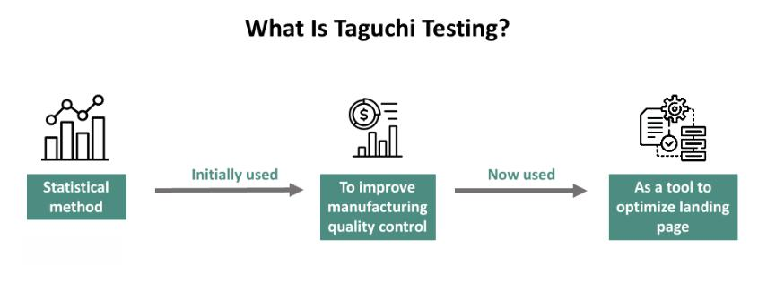

The Taguchi Method is a significant innovation in quality control engineering, with broad applicability in various disciplines, including the burgeoning field of algorithmic trading. Originally conceived by Genichi Taguchi in the 1950s, this method focuses on enhancing design processes rather than solely concentrating on the manufacturing phase. This design-centric approach is instrumental in minimizing variations and improving consistency in both products and processes.

Fundamental to the Taguchi Method are several key concepts: the Loss Function, the Signal-to-Noise Ratio, and Orthogonal Arrays. The Loss Function provides a quantitative measure of the cost related to deviation from target performance. This allows for a precise evaluation of how variability affects product quality and the associated economic losses. The Signal-to-Noise Ratio is another critical concept that allows practitioners to gauge the quality of a system by examining its ability to function well despite inherent variations or 'noise'. Finally, Orthogonal Arrays facilitate efficient experimental design, enabling comprehensive testing across multiple variables and conditions without requiring prohibitively large sample sizes.

In algorithmic trading, these concepts translate into developing trading strategies that are robust and resilient to unpredictable market fluctuations. By employing the Taguchi Method, traders can optimize algorithms to better handle market noise and volatility, effectively reducing risk and enhancing decision-making processes.

Understanding these principles not only empowers engineers to produce more reliable and efficient products but also allows traders to create more effective and stable trading strategies. The Taguchi Method thus stands as a bridge between engineering quality control and strategic trading optimization, providing critical insights that can lead to substantial improvements in both fields.

## Table of Contents

## Understanding the Taguchi Method

The Taguchi Method approaches quality control by placing significant emphasis on the design phase rather than waiting until the manufacturing process to address defects. This early intervention strategy is fundamental in preventing defects before they occur, thereby saving resources and reducing the total cost of production.

A primary focus of the Taguchi Method is the reduction of variability through robust design processes. By implementing robust designs, engineers can ensure product reliability and performance consistency under a variety of external conditions. This approach is not only efficient but also critical in maintaining a high level of quality control, which is indispensable for industries striving to remain competitive.

Prominent companies such as Toyota and Xerox are testament to the efficacy of the Taguchi Method. By applying its principles, these companies have successfully enhanced product consistency and process control, leading to higher customer satisfaction and operational efficiency. The implementation of these techniques paves the way for significant improvements in product quality and cost-effectiveness.

Central to the Taguchi Method are key components such as the Loss Function and the Signal-to-Noise Ratio. The Loss Function, often represented as $L(y) = k(y - T)^2$, where $y$ is the actual value, $T$ is the target value, and $k$ is a constant, quantifies the cost that deviations from the target impose. This function underscores the economic loss associated with deviation, thus guiding engineers to minimize this variance for optimum performance.

The Signal-to-Noise Ratio (SNR) is another pivotal element. It measures the quality of a product by considering the ratio of the desired signal to the background noise, thereby ensuring quality against variation. The SNR is calculated as:

$$
\text{SNR} = 10 \cdot \log_{10} \left(\frac{\mu^2}{\sigma^2}\right)
$$

where $\mu$ is the mean, and $\sigma^2$ is the variance. This metric helps in assessing and improving the robustness of the design by focusing on maximizing the signal (desired output) while minimizing the noise (undesired variability).

Together, these components help achieve an optimal balance between cost and quality, which is essential in competitive markets where consumer expectations are continually increasing. By focusing on these principles, the Taguchi Method facilitates the development of superior products while optimizing resource allocation and enhancing overall market competitiveness.

## Applying the Taguchi Method in Algorithmic Trading

Algorithmic trading relies on the systematic execution of trade orders through algorithms, leveraging computational power to make quick and informed trading decisions. The integration of the Taguchi Method into [algorithmic trading](/wiki/algorithmic-trading) provides a structured approach to enhancing the reliability and effectiveness of these algorithms. The application of the Taguchi Method in algorithmic trading is predominantly based on using Orthogonal Arrays and evaluating the Signal-to-Noise Ratio, which collectively enhance the robustness and adaptability of trading strategies.

Orthogonal Arrays, a key component of the Taguchi Method, allow traders to design experiments that can efficiently evaluate multiple trading strategies across a range of market conditions. These arrays enable the evaluation of interactions between multiple variables in a trading algorithm, thereby identifying the optimal settings for a given trading strategy. By employing Orthogonal Arrays, traders can explore different configurations without testing every possible combination, significantly reducing computational time and resources.

For instance, consider a scenario where a trader wants to optimize an algorithm across variables such as moving average period, trade entry threshold, and stop-loss limit. An Orthogonal Array can be used to systematically vary these parameters and measure the performance outcomes, helping determine the most effective combination for varying market conditions. This systematic approach enhances the robustness of the algorithm, ensuring it performs well even under conditions not explicitly tested.

Moreover, the Signal-to-Noise Ratio (SNR) plays a crucial role in assessing and improving the reliability of trading algorithms. In trading, 'noise' refers to the random price fluctuations that do not reflect the true market trend. By maximizing the SNR, traders can identify setups that are more likely to yield reliable and profitable trades. The SNR is calculated as follows:

$$
\text{SNR} = \frac{\text{Mean of the Desired Signal}}{\text{Standard Deviation of Noise}}
$$

A higher SNR indicates that the algorithm can better distinguish profitable trading signals from random market noise, leading to more consistent and reliable trading outcomes.

Implementing the Taguchi Method allows traders to fine-tune their strategies, increasing their resistance to sudden market shifts and [volatility](/wiki/volatility-trading-strategies). This optimization process helps in identifying the strategy parameters that maximize returns while minimizing risks and losses.

By applying these principles, traders can yield more consistent trading results and mitigate risks effectively. As such, the Taguchi Method provides a robust framework for enhancing algorithmic trading strategies, promising more predictable performance and reduced susceptibility to market fluctuations. This integration can lead to significantly improved decision-making capabilities and strategic advantages within competitive financial markets.

## Historical Context and Development

Genichi Taguchi's methodologies were developed in Japan during the 1950s, a period marked by significant post-war industrial innovation. These methodologies were centered around pioneering approaches to quality control aimed at improving product reliability and consistency. Taguchi's approach was distinct in that it emphasized enhancing the design process to prevent variability and defects rather than focusing solely on the manufacturing process. This shift in focus allowed for more robust and reliable product development, laying the foundation for what would become known as the Taguchi Method.

Taguchi's ideas gained prominence in the West during the 1980s, particularly in the United States. During this time, U.S. industries were facing competitive pressures and were keen to adopt new methodologies that could enhance product quality while controlling costs. Taguchi's methods offered a structured way to address these challenges by using statistical techniques and design of experiments to optimize processes and reduce variability. Specifically, his methods challenged traditional Western practices by advocating for off-line quality control, which focused on optimizing the design stage rather than relying on quality checks post-production.

The successful application of Taguchi's methods by major companies such as Ford and Boeing highlighted their impact and relevance. By incorporating these strategies, these companies improved product quality and reduced costs, gaining a significant competitive edge. For example, Ford used the Taguchi Method to improve the robustness of its manufacturing processes, leading to higher quality vehicles and increased customer satisfaction. Similarly, Boeing applied these principles to its engineering processes to ensure the reliability and safety of its aircraft.

Taguchi's historical influence underscores the transformative potential of his methods, which continue to be relevant in modern engineering and trading applications. His emphasis on designing systems that are resistant to variability rather than merely controlling it post-production has inspired a broader adoption of robust design principles across various industries. The Taguchi Method’s focus on minimizing costs related to variability and quality defects provides a strategic advantage by ensuring products meet high standards despite environmental and operational uncertainties. This historical context demonstrates how the Taguchi Method has become an integral part of quality control systems worldwide, bridging the gap between engineering design and practical manufacturing solutions, and extending its potential into fields like algorithmic trading.

## Criticism and Challenges

Despite its widespread recognition and application, the Taguchi Method has not been without criticism. One major area of concern is the method's complexity, particularly its reliance on advanced statistical concepts. This complexity often necessitates a deep understanding of statistical methods, which may limit its accessibility to practitioners who do not have extensive training in this area. As a result, those without a strong statistical background might find it challenging to effectively implement the Taguchi Method, hindering its broader adoption in diverse fields.

Critics also point to perceived inefficiencies in the design of experiments suggested by Taguchi. Some statisticians argue that the method's reliance on orthogonal arrays, while innovative, may not always yield the most efficient experimental designs. Traditional experimental designs, such as factorial designs, often offer more straightforward analysis and intuitive appeal. The Taguchi Method's focus on robustness can sometimes lead to a more complex setup and interpretation, requiring a balance between robustness and simplicity.

Despite these challenges, the strengths of the Taguchi Method—particularly its ability to minimize variation and enhance robustness—are widely recognized. These qualities have made it an indispensable approach in many industrial applications where product consistency and quality are paramount. Industries such as automotive and electronics have benefited significantly from its application, as these sectors frequently encounter the need for high-reliability products.

To address the criticisms and enhance the method's usability, ongoing efforts in education and training are crucial. By providing practitioners with the necessary statistical background and tools, the method can become more accessible. Advances in software and computational tools also offer promising avenues for simplifying the application of the Taguchi Method, allowing for easier implementation without sacrificing the robustness that makes it valuable. Emphasizing practical training and software solutions can help bridge the gap, making the methodology more user-friendly while retaining its core principles.

## Conclusion

The Taguchi Method remains a significant asset in quality control engineering and shows potential in algorithmic trading applications. Its primary focus on reducing variability and enhancing design robustness results in notable improvements in quality. By prioritizing these elements, the method offers strategic advantages to both engineers and traders.

Despite the complexity of the Taguchi Method, which can be a barrier due to its demand for a deep mathematical and statistical understanding, the advantages it provides, such as cost reduction and risk management, are substantial. These benefits arise from the method's systematic approach to optimizing process design, which reduces defects and improves product consistency, ultimately leading to lower manufacturing costs and enhanced reliability.

Engineers and traders who adopt the Taguchi Method can refine their processes, achieving higher levels of efficiency and effectiveness. In quality control, this means producing consistently high-quality products, while in algorithmic trading, it translates to developing algorithms that perform reliably under varying market conditions.

Looking ahead, there are promising opportunities to integrate the principles of the Taguchi Method with new technologies, such as [artificial intelligence](/wiki/ai-artificial-intelligence) and [machine learning](/wiki/machine-learning). This integration can further advance both quality control and trading strategies, allowing for the development of adaptive systems that maintain robustness in rapidly changing environments. As these fields continue to evolve, the Taguchi Method's emphasis on reliability and cost-effectiveness positions it as a critical tool for future innovation.

## References & Further Reading

[1]: Taguchi, G. (1986). "Introduction to Quality Engineering: Designing Quality into Products and Processes". Asian Productivity Organization.

[2]: Phadke, M. S. (1989). ["Quality Engineering Using Robust Design"](https://books.google.com/books/about/Quality_Engineering_Using_Robust_Design.html?id=TZoQAQAAMAAJ) (1st ed.). Prentice Hall.

[3]: Box, G. E. P., & Fung, C. (2013). ["A Note on the Teaching of Quality Improvement Using Designed Experiments."](https://onlinelibrary.wiley.com/doi/book/10.1002/9781118619193) Quality and Reliability Engineering International.

[4]: Roy, R. K. (2010). ["A Primer on the Taguchi Method (2nd Ed.)"](https://books.google.com/books/about/A_Primer_on_the_Taguchi_Method.html?id=OUI54mrYdqIC) Society of Manufacturing Engineers.

[5]: Loss Function and Its Generalizations (1990). Journal of Quality Technology. 

[6]: Box, G. E. P. (1999). ["Statistics as a Catalyst to Learning by Scientific Method"](https://www.tandfonline.com/doi/abs/10.1080/00224065.1999.11979890). Journal of the Royal Statistical Society. 

[7]: Genichi Taguchi: His Evolution, Contributions, and Legacy (2022). Quality Management Journal.