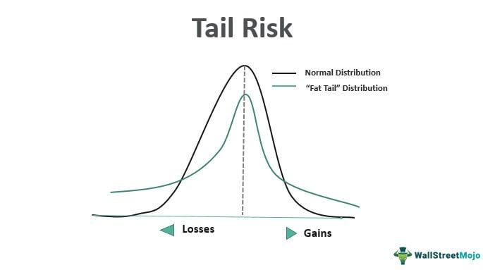

In the volatile world of financial markets, events classified as 'tail events' can induce severe disruptions. These occurrences, characterized by their rarity and unpredictability, have a profound impact on financial systems, often leading to significant financial losses. Such events are known for deviating from the normal distribution of market returns, where the tail end of the distribution represents these extreme, unpredictable occurrences.

Tail hedging in algorithmic trading is employed as a protective strategy to mitigate the risks associated with these infrequent but impactful market events. Algorithmic trading systems, designed to execute trades at rapid speeds and large volumes, are particularly vulnerable to unexpected tail events that can cause abrupt market fluctuations. By integrating tail hedging strategies, traders aim to stabilize their portfolios against unforeseen market downturns.



This article will focus on comprehensively understanding the concept of tail hedging within algorithmic trading. We will systematically explore the methodologies utilized in tail hedging, examine various strategic approaches, and discuss the implications these strategies have within the landscape of algorithmic trading. Tail hedging, while not a panacea for all financial risks, provides traders with a vital tool to manage and potentially mitigate the adverse effects of extreme market movements.

## Table of Contents

## Understanding Tail Risk

Tail risk refers to the possibility of rare and extreme market events occurring more frequently than anticipated by a normal distribution model. Traditional financial models often assume that asset returns follow a Gaussian distribution, characterized by its bell-shaped curve. In such a distribution, extreme events—or "tails"—are expected to occur with very low frequency. However, empirical evidence suggests that real-world financial markets exhibit "fat tails," where these improbable events are more common than predicted.

Examples of tail events include financial crises, such as the 2008 global financial meltdown, geopolitical upheavals like unexpected wars or regime changes, and surprising economic announcements or policy shifts that can trigger market chaos. These events are not only rare but also [carry](/wiki/carry-trading) a disproportionate potential for financial loss.

The significance of recognizing tail risk lies in its potential impact on investment portfolios. Without appropriate hedging mechanisms, portfolios remain vulnerable to catastrophic losses during such events. Traditional risk management strategies, which largely rely on diversification and the assumption of normally distributed returns, often fall short in protecting against these rare, impactful occurrences.

Consider a simple Python simulation to visualize the difference between a normal distribution and a fat-tailed distribution like the Student's t-distribution:

```python
import numpy as np
import matplotlib.pyplot as plt
from scipy.stats import norm, t

# Generate random data for normal and t-distribution
normal_data = np.random.normal(loc=0, scale=1, size=10000)
t_data = np.random.standard_t(df=3, size=10000)  # Fat-tailed distribution

# Plotting
plt.hist(normal_data, bins=100, density=True, alpha=0.5, label='Normal Distribution')
plt.hist(t_data, bins=100, density=True, alpha=0.5, label='T-Distribution (df=3)')
plt.legend()
plt.title('Comparison of Normal and Fat-Tailed Distributions')
plt.xlabel('Value')
plt.ylabel('Density')
plt.show()
```

The resulting plot would clearly illustrate that the t-distribution has fatter tails compared to the normal distribution, confirming the increased probability of extreme events. Recognizing these patterns is crucial in modern finance, urging the need for specialized strategies to hedge against tail risk and protect assets from severe market disruptions.

## Key Figures: Nassim Taleb and Tail Risk

Nassim Nicholas Taleb, a distinguished scholar and former trader, is renowned for his exploration of uncertainty and tail risk in financial markets. His seminal work, "The Black Swan: The Impact of the Highly Improbable," provides a comprehensive analysis of rare and unforeseen events—termed "black swan" events—that can significantly impact markets and society. Taleb argues that these events are often underestimated in their frequency and impact due to flaws in traditional models of risk management, such as those relying on the normal distribution.

Standard risk management approaches typically assume that financial markets follow a Gaussian distribution, where events with extreme deviations are exceedingly rare. However, Taleb criticizes this assumption, highlighting that financial markets often exhibit "fat tails," where extreme occurrences are more common than the standard model predicts. He emphasizes the importance of extreme impact from unexpected events that fall outside the bounds of regular expectations, disputing the reliance on historical data to predict future uncertainties.

Taleb's work underscores the limitations of conventional economic theories and risk assessment methods, which often ignore these rare but high-impact events. His critique is particularly focused on Value at Risk (VaR) models, commonly used in the finance industry to estimate potential losses. These models, according to Taleb, fail to account adequately for the tail risks because they underestimate the probability and severity of rare events.

In recognizing the inadequacy of traditional models, Taleb advocates for strategies that acknowledge and prepare for black swan events. He suggests an approach that enhances robustness against such events, including maintaining sufficient [liquidity](/wiki/liquidity-risk-premium) and adopting a barbell strategy. This strategy involves allocating a substantial portion of a portfolio to extremely safe assets while investing a smaller segment in highly speculative bets that offer the potential for outsized returns. This diversification protects against extreme losses while maintaining the possibility of benefiting from unforeseen market shifts.

The insights provided by Taleb are crucial for both traders and institutions to re-evaluate their approach to risk management, particularly in [algorithmic trading](/wiki/algorithmic-trading), which relies heavily on models and automated systems. His emphasis on the unpredictability and inevitable occurrence of black swan events calls for a reconsideration of how risks are managed, urging the incorporation of flexibility and adaptability in preparing for volatile, disruptive market dynamics.

## Advantages of Tail Hedging in Algo Trading

Tail hedging serves as an essential strategy in algorithmic trading by safeguarding portfolios from substantial losses during unexpected market events. In algorithmic trading, where vast amounts of data are processed at high speeds to make trading decisions without human intervention, the ability to swiftly adapt and protect against sudden market downturns is crucial. 

Incorporating tail hedging strategies enhances risk management by allowing algorithms to automatically adjust positions based on pre-defined criteria related to extreme market conditions. This automation ensures that protective measures are promptly enacted, reducing the potential for oversight or delays that may occur with manual interventions. By integrating tail hedging, trading algorithms can execute hedges as soon as indicators of tail events start to manifest, effectively curbing potential negative impacts on the portfolio.

Furthermore, the stability of trading strategies is bolstered by mitigating large-scale disruptions that can arise during significant market anomalies. Tail hedging provides a buffer that can absorb shocks, thus maintaining the integrity of trading strategies over time. This resilience is particularly important in volatile markets where unexpected events can lead to cascading losses if not properly managed.

Overall, the implementation of tail hedging in algorithmic trading not only enhances protection against severe financial setbacks but also contributes to the robustness and continuity of trading operations amidst unpredictable market dynamics.

## Various Tail Hedging Strategies

Tail hedging involves a range of strategies designed to protect investors from extreme market downturns. These strategies are particularly pertinent in algorithmic trading, where advanced techniques and quick decision-making are essential. Below is an examination of some of the common tail hedging strategies:

### Put Options

Put options are derivative contracts that give the holder the right, but not the obligation, to sell a stock at a predetermined price before the contract expires. This strategy is widely used to protect against significant declines in the asset's value. Buying out-of-the-money (OTM) put options is a typical method for tail hedging. These options provide protection after the market crosses a specific high-[volatility](/wiki/volatility-trading-strategies) threshold, effectively limiting potential losses.

Here is a basic way to calculate the payoff from a put option:

$$
\text{Payoff} = \max(K - S_T, 0)
$$

Where:
- $K$ is the strike price of the put option.
- $S_T$ is the price of the underlying asset at expiration.

### Diversification with Foreign Assets

Investing across different geographic regions can significantly lower a portfolio's risk concentration. Geographic diversification acts as natural tail hedging by spreading exposure across markets that may not be perfectly correlated. For example, political instability in one region may not impact another, thereby reducing the overall risk of substantial losses.

In algorithmic trading, diversification can be implemented using models that automatically adjust the portfolio according to risk metrics and correlations between different geographic assets.

### Holding Cash

Maintaining a cash reserve provides liquidity and flexibility to respond to market stress. The opportunity cost of holding cash can be offset by the security it provides during extreme market movements. Holding cash allows traders to buy undervalued assets quickly when prices plummet, thereby positioning themselves effectively for a market recovery.

### Tail Risk ETFs

Exchange-traded funds (ETFs) tailored for tail risk serve as a more systematic approach to hedging against severe market events. Products like the Cambria Tail Risk [ETF](/wiki/etf-trading-strategies) (TAIL) are specifically designed to mitigate losses during extreme downturns. These ETFs often hold a mix of U.S. Treasury securities and options strategies to capture downside protection without requiring constant management.

For algorithmic trading, these ETFs can be incorporated into models to automatically adjust exposure based on predefined risk thresholds. They act as both a hedge and a diversification tool that can help maintain portfolio stability during volatile periods.

## Trend Following as a Hedge

Trend following is a trading strategy that operates on the premise of capturing sustained price movements or trends. Essentially, it involves acquiring assets that exhibit upward [momentum](/wiki/momentum) and disposing of those experiencing downward momentum. This approach takes advantage of the natural human behaviors and market dynamics that propel asset prices in extended directions before reversing. 

The concept of [trend following](/wiki/trend-following) can serve as an effective hedge against tail risk due to its adaptive nature. During a tail event, such as a financial crisis, markets often display pronounced trends—whether it be a sharp decline in equity markets or a surge in safe-haven assets like gold or government bonds. By aligning with these trends, traders can potentially offset some of the losses incurred in other parts of their portfolios.

A mathematical representation of trend following might involve moving averages, which are often employed to identify trends. For instance, a simple moving average crossover strategy might signal a buy when the short-term moving average (e.g., 50-day) crosses above a long-term moving average (e.g., 200-day). Conversely, a sell order is triggered when the short-term average falls below the long-term average.

In Python, a basic implementation to determine a buy or sell signal could look like this:

```python
import pandas as pd

def calculate_moving_average(data, window):
    return data.rolling(window=window).mean()

def generate_signals(data, short_window=50, long_window=200):
    signals = pd.DataFrame(index=data.index)
    signals['price'] = data['price']
    signals['short_mavg'] = calculate_moving_average(data['price'], short_window)
    signals['long_mavg'] = calculate_moving_average(data['price'], long_window)

    # Generate buy/sell signals
    signals['signal'] = 0
    signals['signal'][short_window:] = np.where(signals['short_mavg'][short_window:] > signals['long_mavg'][short_window:], 1, 0)
    signals['positions'] = signals['signal'].diff()
    return signals

# Example usage
historical_data = pd.DataFrame({'price': [/* historical prices go here */]})
signals = generate_signals(historical_data)
```

The signals DataFrame would contain columns for short and long moving averages, with 'signal' indicating potential entry points (1 for buy, 0 for hold/sell), and 'positions' capturing changes in buy/sell status. The positions column marks transitions that indicate when to adopt or [exit](/wiki/exit-strategy) a position.

The adaptability of trend following strategies in aligning with major market movements during tail events makes them valuable tools for risk management. However, it's essential to remember that while trend following can mitigate some losses during exceptional market behavior, it is not foolproof and should be combined with other risk management strategies for optimal results.

## Challenges Associated with Tail Hedging

Implementing tail hedges comes with inherent costs that can significantly impact overall returns. These costs arise mainly from the premiums paid for derivative instruments like put options, which are commonly used in tail hedging strategies. The expense of maintaining these protective positions can diminish the total profitability of a trading strategy, especially during periods of market stability when such hedges may seem unnecessary.

Investors often face the challenge of balancing the security provided by tail hedges with their associated costs. This balancing act requires an evaluation of the potential benefits of protecting against extreme market downturns against the financial burden imposed by hedging. The costs include not only premiums but also potential opportunity costs, as capital allocated to hedging could otherwise be invested in income-generating assets.

Behavioral biases also play a significant role in the deployment of tail hedges. Investors might exhibit a preference for short-term gains over long-term stability, leading to inconsistent hedge implementation. This bias can result from a tendency to underestimate the probability and severity of tail events, especially during extended periods of market calm. As a result, traders may periodically reduce or eliminate their hedges to improve short-term returns, inadvertently increasing their exposure to tail risk.

Such biases and challenges necessitate disciplined risk management and a thorough understanding of an investor's risk tolerance and financial objectives. For algorithmic traders, incorporating systematic constraints and guidelines can help mitigate behavioral biases, ensuring that tail hedges remain an integral part of risk management practices even when immediate market conditions seem benign.

## Conclusion: The Role of Tail Hedging in Modern Trading

Algorithmic trading platforms gain significant advantages by incorporating tail hedging strategies. These strategies play a crucial role in managing extreme risks associated with unexpected market movements, often referred to as "tail events." Although no approach can offer complete immunity from such risks, tail hedging provides a robust framework for mitigating potential losses, ensuring traders can navigate turbulent market conditions more effectively.

Tail hedging in algorithmic trading involves using automated strategies that quickly respond to market changes, thereby offering protection without requiring continuous human oversight. This automation permits a disciplined adherence to hedging strategies, minimizing emotional biases and knee-jerk reactions commonly triggered by volatile market environments.

To effectively integrate tail hedges, traders need to meticulously evaluate their risk tolerance levels and financial objectives. Factors such as the degree of risk exposure they're willing to accept and their specific financial goals will dictate the choice of hedging instruments and methodologies. For example, options such as out-of-the-money puts, diversifying across non-correlated asset classes, or maintaining a cash reserve are prevalent strategies. Each comes with its own set of potential benefits and costs that need careful consideration.

Ultimately, successful tail hedging requires not only an understanding of the potential risks but also a strategic alignment of hedging tactics with the trader's overarching investment profile. By doing so, algorithmic traders can enhance the resilience of their portfolios, safeguard capital, and optimize returns even amidst the most unpredictable market conditions.

## Frequently Asked Questions (FAQ)

### What differentiates tail risk from regular market volatility?

Tail risk is associated with the probability of rare and extreme events occurring that deviate significantly from the typical or expected market movements. Unlike regular market volatility, which deals with the day-to-day fluctuations within expected ranges, tail risk focuses on "black swan" events—extreme deviations characterized by their low probability but high impact. Traditional models often assume a normal distribution of returns, leading to an underestimation of these rare events. Standard deviation is typically used to measure volatility, but it fails to capture the likelihood of occurrences lying in the tail ends of the distribution.

### How can algo traders effectively implement tail hedging strategies?

Algorithmic traders can effectively implement tail hedging strategies by integrating automated hedging mechanisms that automatically adjust to market conditions. This includes:

1. **Dynamic Allocation**: Using sophisticated algorithms to adjust portfolio compositions based on real-time data to mitigate exposure to potential tail events.

2. **Risk management algorithms**: Incorporating machine learning models to predict potential tail events and dynamically execute hedging strategies like buying put options or diversifying investments.

3. **Backtesting and Simulation**: Deploying historical data to simulate tail events and test the efficacy of proposed hedging strategies to ensure they align with risk management objectives.

Example in Python:
```python
import pandas as pd
import numpy as np

def simulate_tail_hedging(market_data, put_option_data):
    returns = market_data.pct_change().dropna()
    tail_risk_threshold = returns.mean() - 2 * returns.std()  # two standard deviations from the mean
    hedging_signal = returns < tail_risk_threshold

    # Implement hedging by buying put options when tail risk is detected
    market_data['Port_value'] = (1 - hedging_signal) * market_data + hedging_signal * put_option_data
    return market_data['Port_value']

# Example market data and put options data
market_data = pd.Series(np.random.normal(1, 0.02, 100))
put_option_data = pd.Series(np.random.normal(0.95, 0.01, 100))
hedged_portfolio = simulate_tail_hedging(market_data, put_option_data)
```

### What are some drawbacks of using put options for tail hedging?

Using put options as a hedging strategy against tail risk has its drawbacks:

1. **Cost**: The premiums on put options can be expensive, especially for long-dated options which are often required for effective tail hedging. This cost can eat into portfolio returns, reducing overall profitability.

2. **Timing and Liquidity**: Accurately timing the purchase of put options and finding liquid options markets can be a challenge. Poor timing can lead to either insufficient protection or wasted premiums if the tail event does not occur.

3. **Decay of option value**: Known as "theta," or time decay, this is the reduction in an option's value as it approaches expiration. If a tail event doesn't occur quickly enough, the put option might expire worthless.

### Are there cost-effective ways to hedge against tail risks?

Yes, there are more cost-effective methods for hedging against tail risks:

1. **Diversification**: Broad diversification across asset classes, sectors, and geographies can mitigate specific risks while reducing the necessity to purchase expensive insurance-type instruments.

2. **Trend Following Strategies**: Employing trend-following strategies enables capturing prolonged market trends that often occur following major market disturbances, without the cost overhead associated with buying options.

3. **Tail Risk ETFs**: Exchange Traded Funds specifically designed to provide tail risk protection, such as Cambria's Tail Risk ETF, offer investors exposure to hedging strategies without direct involvement in option markets.

By carefully evaluating the costs and benefits of each approach, traders can construct a hedging strategy that balances protection and expense.

## References & Further Reading

[1]: Taleb, N. N. (2007). ["The Black Swan: The Impact of the Highly Improbable."](https://www.nytimes.com/2007/04/22/books/chapters/0422-1st-tale.html) Random House.

[2]: Bouchaud, J.-P., & Potters, M. (2003). ["Theory of Financial Risk and Derivative Pricing: From Statistical Physics to Risk Management."](https://www.cambridge.org/core/books/theory-of-financial-risk-and-derivative-pricing/5BBBA04CE72ED9E5E7C1C028D9A94FCB) Cambridge University Press.

[3]: Bloomberg Finance L.P. ["Cambria Tail Risk ETF (TAIL)."](https://www.bloomberg.com/quote/TAIL:US)

[4]: Harding, D. (2013). ["Adaptive Asset Allocation Policies and Tail Risk."](https://web.stanford.edu/~wfsharpe/aaap/wfsaaap.pdf) AQR Capital Management White Papers. 

[5]: Chan, E. P. (2013). ["Algorithmic Trading: Winning Strategies and Their Rationale."](https://github.com/ftvision/quant_trading_echan_book) Wiley Trading.