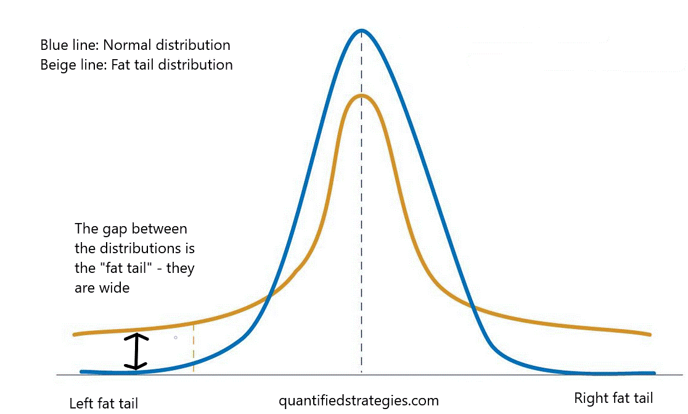

## Table of Contents

## What is tail risk and why is it important to manage?

Tail risk refers to the chance of experiencing rare but extreme events in the financial markets. These events are called "tail events" because they are located on the far ends, or tails, of a probability distribution curve. For example, a big stock market crash or a sudden economic crisis are tail events. They don't happen often, but when they do, they can cause a lot of damage to investments and the economy.

It's important to manage tail risk because these rare events can have a huge impact on your financial plans. If you're not prepared, a tail event can wipe out your savings or cause big losses in your investments. By managing tail risk, you can take steps to protect your money, like diversifying your investments or buying insurance. This way, you can be better prepared for unexpected big changes and keep your financial future more secure.

## What are the basic principles of tail risk hedging?

Tail risk hedging is about taking steps to protect your investments from rare but big events that can cause a lot of damage. The main idea is to find ways to reduce the impact of these extreme events on your money. One way to do this is by using financial tools like options or insurance that can pay off if something really bad happens. For example, you might buy a put option on a stock you own, which gives you the right to sell the stock at a certain price even if the market crashes. This can help limit your losses if the stock price drops a lot.

Another important part of tail risk hedging is diversification. This means spreading your investments across different types of assets, like stocks, bonds, and real estate. By doing this, you're less likely to lose everything if one type of investment gets hit hard by a tail event. For example, if the stock market crashes, your bonds or real estate might not be affected as much, helping to cushion the blow. Diversification and using financial tools together can help you manage tail risk and protect your financial future.

## What are the most common financial instruments used for tail risk hedging?

The most common financial instruments for tail risk hedging are options and insurance products. Options, like put options, are agreements that give you the right to sell an asset at a set price within a certain time. If the market crashes and the price of your asset drops a lot, you can use the put option to sell it at the higher set price, which helps limit your losses. Another option is to buy insurance products, like catastrophe bonds or event-linked bonds, which pay out if a specific bad event happens, like a natural disaster or a big economic crisis. These products can help you get money back when you need it most.

Another tool for tail risk hedging is using derivatives like futures and swaps. Futures contracts let you agree to buy or sell an asset at a future date for a set price. This can help protect against big price swings. Swaps, on the other hand, are agreements to exchange cash flows or other financial instruments. For example, you might use an interest rate swap to change a variable interest rate to a fixed one, which can help if interest rates suddenly go up a lot. These derivatives can be complex but are useful for managing the risk of extreme events.

In addition to these instruments, some investors use structured products, which are investments made up of different financial instruments bundled together. These can be tailored to protect against specific risks. For example, a structured note might combine a bond with an option, giving you regular interest payments but also protection if the market falls. By using these various financial tools, investors can build a safety net around their portfolios, helping to manage the impact of tail risks.

## How does one identify potential tail risk events?

Identifying potential tail risk events involves looking at history and understanding the current situation. You can start by studying past events that caused big changes in the market or economy, like the 2008 financial crisis or the dot-com bubble burst. By understanding what led to these events, you can spot similar warning signs in today's world. For example, if you see a lot of people borrowing money to buy stocks, it might remind you of the conditions before a past market crash.

Another way to identify tail risk events is by keeping an eye on economic indicators and news. Things like high levels of debt, big changes in interest rates, or political instability can signal that a tail event might be coming. It's also important to pay attention to global events, like natural disasters or pandemics, which can have a huge impact on the economy. By staying informed and connecting the dots between different pieces of information, you can better prepare for and manage potential tail risks.

## What are the differences between tail risk and other types of financial risk?

Tail risk is different from other types of financial risk because it focuses on rare but very big events that can cause a lot of damage. Other types of financial risk, like market risk or credit risk, are more common and deal with everyday ups and downs in the market or the chance that someone won't pay back a loan. Tail risk is about the big, unexpected things that can shake up the whole economy, like a huge stock market crash or a global financial crisis. These events are hard to predict and can happen suddenly, making them especially tricky to manage.

Another way tail risk is different is that it's about the extreme ends of what could happen, not the usual range. For example, market risk might be about how much stock prices go up or down on a normal day, but tail risk is about the chance of a big drop that happens only once in a blue moon. Because these tail events are so rare, they're often overlooked, but they can have a much bigger impact than regular market changes. Managing tail risk involves preparing for these big shocks, which is different from the strategies used for more common risks.

## Can you explain the concept of a 'black swan' event in relation to tail risk?

A 'black swan' event is a type of tail risk that is very surprising and has a big impact. These events are called 'black swans' because they are so rare and unexpected, just like people used to think all swans were white until they found black ones. In finance, a black swan event could be something like a huge stock market crash that no one saw coming, or a global crisis that changes everything. These events are hard to predict because they seem to come out of nowhere, but when they happen, they can shake up the whole economy.

Black swan events are important to understand because they remind us that even the most unlikely things can happen. While tail risk includes all rare but big events, black swan events are the most extreme and unexpected kind. They show us that we need to be ready for surprises and have plans in place to protect our money. By thinking about black swan events, we can be better prepared for those big shocks that can change everything.

## What are the costs associated with implementing tail risk hedging strategies?

Implementing tail risk hedging strategies can be expensive. One of the main costs comes from buying financial instruments like options or insurance products. These tools can protect your investments from big drops, but you have to pay for them, and they can be pricey. For example, buying put options to protect against a stock market crash might cost you a lot of money upfront, even if the crash never happens. This means you're paying for protection that you might not need, which can eat into your investment returns.

Another cost is the complexity and time needed to set up these strategies. Tail risk hedging often involves using complicated financial products and requires a good understanding of the market. You might need to hire experts or spend a lot of time learning how to do it right. This can add to the overall cost of managing your investments. Plus, if you're not careful, you might end up with strategies that don't work well together, which can make things even more expensive and confusing.

Despite these costs, many investors think tail risk hedging is worth it because it can help protect their money from big, unexpected losses. It's like buying insurance for your car – you hope you never need it, but it's there just in case. By understanding the costs and benefits, you can decide if tail risk hedging is right for your investment plan.

## How can tail risk hedging strategies be integrated into a broader investment portfolio?

Tail risk hedging strategies can be added to a bigger investment plan by using different financial tools that help protect your money from big, unexpected events. You might buy options, like put options, which give you the right to sell your investments at a set price if the market crashes. This can help limit your losses. Another way is to use insurance products, like catastrophe bonds, that pay out if a specific bad event happens. By including these tools in your investment plan, you're creating a safety net that can catch you if things go really wrong.

To make sure tail risk hedging works well with your other investments, it's important to balance the costs and benefits. These hedging strategies can be expensive, so you need to think about how much protection you want and how much you're willing to pay for it. A good way to do this is by spreading your money across different types of investments, like stocks, bonds, and real estate. This diversification can help cushion the blow if one part of your portfolio gets hit hard by a tail event. By carefully mixing hedging strategies with a diverse investment plan, you can be better prepared for those rare but big shocks that can shake up the market.

## What are some advanced techniques for optimizing tail risk hedges?

One advanced technique for optimizing tail risk hedges is using dynamic hedging. This means you keep changing your hedging strategy based on what's happening in the market. For example, if you see signs that a big drop might be coming, you can buy more put options to protect your investments. On the other hand, if things look stable, you might reduce your hedges to save on costs. Dynamic hedging can be more effective because it lets you adjust to new information and keep your protection up to date.

Another technique is using a mix of different hedging tools, like options, futures, and swaps. By combining these, you can create a more complete safety net that covers different kinds of risks. For example, you might use options to protect against a stock market crash, while using futures to hedge against changes in interest rates. This mix can help you manage tail risk better because it covers more bases. Plus, by carefully choosing which tools to use and when, you can make sure you're getting the most protection for your money.

## How do regulatory environments affect tail risk hedging strategies?

Regulatory environments can have a big impact on tail risk hedging strategies. Different countries have different rules about what kinds of financial tools you can use and how you can use them. For example, some places might not let you buy certain kinds of options or might make it harder to trade them. These rules can make it trickier to set up the right hedges to protect your investments from big, unexpected events. If the rules change, you might have to change your strategy, which can be a hassle and might cost you more money.

Also, regulators might require you to have a certain amount of money set aside when you use hedging tools. This is called margin requirements, and it's meant to make sure you can cover your losses if something goes wrong. But having to keep more money aside can limit how much you can invest in other things. So, you need to keep an eye on the rules and be ready to adjust your tail risk hedging strategy to stay within the law while still protecting your money from those rare but big shocks.

## What are the latest research findings on the effectiveness of tail risk hedging?

Recent research on tail risk hedging shows that these strategies can be helpful but they come with some challenges. Studies have found that using options like put options can protect investments from big drops in the market. For example, during the 2008 financial crisis, investors who had these hedges in place lost less money than those who didn't. However, the cost of these hedges can be high, and if the market doesn't crash, you might end up paying a lot for protection you didn't need. This means that while tail risk hedging can limit losses during bad times, it can also eat into your profits during good times.

Another important finding is that the effectiveness of tail risk hedging depends a lot on how well you can predict rare events. Some research suggests that dynamic hedging, where you adjust your strategy based on what's happening in the market, can work better than a one-size-fits-all approach. But predicting these big shocks is really hard, and even the best models can get it wrong. So, while tail risk hedging can be a useful tool, it's not a perfect solution, and investors need to weigh the costs against the benefits and be ready to change their strategies as the market changes.

## How can one evaluate the performance of tail risk hedging strategies over time?

To evaluate the performance of tail risk hedging strategies over time, you need to look at how well they protect your money during big, unexpected events. One way to do this is by checking how much your investments lose during market crashes. If your hedges are working well, your losses should be smaller compared to if you didn't have any protection. You can also look at the cost of these hedges. If you're paying a lot for them but never use them, they might not be worth it. By comparing the cost to the protection they offer, you can see if they're a good deal.

Another way to evaluate these strategies is by looking at how they affect your overall investment returns. Sometimes, having hedges can mean you make less money when the market is doing well, because you're spending money on protection. You need to balance this with how much they help when things go wrong. Over time, keeping track of your portfolio's performance with and without the hedges can show you if they're helping more than they're hurting. By regularly reviewing these factors, you can decide if your tail risk hedging strategies are working well for you.

## What are Various Tail Hedging Strategies?

Tail hedging involves a range of strategies designed to protect investors from extreme market downturns. These strategies are particularly pertinent in algorithmic trading, where advanced techniques and quick decision-making are essential. Below is an examination of some of the common tail hedging strategies:

### Put Options

Put options are derivative contracts that give the holder the right, but not the obligation, to sell a stock at a predetermined price before the contract expires. This strategy is widely used to protect against significant declines in the asset's value. Buying out-of-the-money (OTM) put options is a typical method for tail hedging. These options provide protection after the market crosses a specific high-[volatility](/wiki/volatility-trading-strategies) threshold, effectively limiting potential losses.

Here is a basic way to calculate the payoff from a put option:

$$
\text{Payoff} = \max(K - S_T, 0)
$$

Where:
- $K$ is the strike price of the put option.
- $S_T$ is the price of the underlying asset at expiration.

### Diversification with Foreign Assets

Investing across different geographic regions can significantly lower a portfolio's risk concentration. Geographic diversification acts as natural tail hedging by spreading exposure across markets that may not be perfectly correlated. For example, political instability in one region may not impact another, thereby reducing the overall risk of substantial losses.

In algorithmic trading, diversification can be implemented using models that automatically adjust the portfolio according to risk metrics and correlations between different geographic assets.

### Holding Cash

Maintaining a cash reserve provides liquidity and flexibility to respond to market stress. The opportunity cost of holding cash can be offset by the security it provides during extreme market movements. Holding cash allows traders to buy undervalued assets quickly when prices plummet, thereby positioning themselves effectively for a market recovery.

### Tail Risk ETFs

Exchange-traded funds (ETFs) tailored for tail risk serve as a more systematic approach to hedging against severe market events. Products like the Cambria Tail Risk [ETF](/wiki/etf-trading-strategies) (TAIL) are specifically designed to mitigate losses during extreme downturns. These ETFs often hold a mix of U.S. Treasury securities and options strategies to capture downside protection without requiring constant management.

For algorithmic trading, these ETFs can be incorporated into models to automatically adjust exposure based on predefined risk thresholds. They act as both a hedge and a diversification tool that can help maintain portfolio stability during volatile periods.

## References & Further Reading

[1]: Taleb, N. N. (2007). ["The Black Swan: The Impact of the Highly Improbable."](https://www.nytimes.com/2007/04/22/books/chapters/0422-1st-tale.html) Random House.

[2]: Bouchaud, J.-P., & Potters, M. (2003). ["Theory of Financial Risk and Derivative Pricing: From Statistical Physics to Risk Management."](https://www.cambridge.org/core/books/theory-of-financial-risk-and-derivative-pricing/5BBBA04CE72ED9E5E7C1C028D9A94FCB) Cambridge University Press.

[3]: Bloomberg Finance L.P. ["Cambria Tail Risk ETF (TAIL)."](https://www.bloomberg.com/quote/TAIL:US)

[4]: Harding, D. (2013). ["Adaptive Asset Allocation Policies and Tail Risk."](https://web.stanford.edu/~wfsharpe/aaap/wfsaaap.pdf) AQR Capital Management White Papers. 

[5]: Chan, E. P. (2013). ["Algorithmic Trading: Winning Strategies and Their Rationale."](https://github.com/ftvision/quant_trading_echan_book) Wiley Trading.