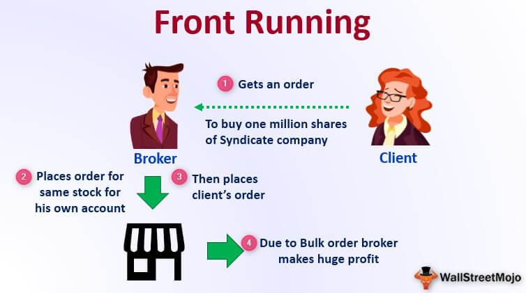

In the ever-evolving world of financial trading, the intersection of social events, tailgating, and algorithmic trading has emerged as a dynamic and captivating domain. As markets grow increasingly complex and interconnected, traders constantly seek innovative strategies that capitalize on new sources of information and technological advancements. Social events, encompassing everything from key corporate announcements to broader economic shifts, play a pivotal role in shaping market behavior. These events introduce volatility and create opportunities for informed traders to exploit inefficiencies and patterns in price movements.

Tailgating, often characterized by brokers or advisors mirroring trades executed on behalf of their clients within personal accounts, adds another unique layer to this landscape. While generally considered unethical, and sometimes risky, it highlights the influence of human behavior and sentiment within the financial ecosystem. The practice can shift market dynamics and impact decision-making in unexpected ways, especially when combined with the relentless pace of trading driven by algorithms.



Algorithmic trading, which leverages advanced computational techniques and data analysis, revolutionizes how trades are conducted by automating decision-making processes based on predefined criteria. Algorithms excel at processing vast amounts of information rapidly, making them ideal for responding to the swift changes precipitated by social events. By integrating social cues into these systems, traders aim to enhance prediction capabilities and execution precision, creating hybrid strategies that are both responsive and proactive.

The synergy between social events, tailgating, and algorithmic trading unlocks unique opportunities for traders. Such strategies necessitate a deep understanding of both market mechanics and the broader social and economic factors that drive them. Advances in technology and data analytics continually reshape the trading landscape, requiring traders to remain agile and informed. This convergence not only enriches trading strategies but also underscores the complex nature of modern financial markets, where understanding human behavior and technological capabilities are equally paramount.

## Table of Contents

## Understanding Tailgating in Trading

Tailgating in trading is a practice where brokers or financial advisors replicate trades made for their clients in their personal accounts. This behavior is often scrutinized due to ethical considerations. Although tailgating is not illegal, it is generally considered unethical because it can lead to conflicts of interest. For instance, a broker might execute a client's trade to benefit the client but then execute a similar trade on a personal account to benefit from subsequent price movements without prioritizing the client's interests.

This practice can influence trading decisions significantly. When brokers engage in tailgating, they might be tempted to prioritize trades that are likely to be beneficial for their accounts over trades that are purely in their clients' best interests. This conflict of interest may result in trades being made based on personal gain rather than objective market analysis, potentially affecting market dynamics.

### Example Scenario

Consider a scenario where a broker notices a large institutional order from a client that is likely to drive up the price of a stock. The broker executes this order for the client and simultaneously buys the same stock in their personal account. As the client’s order causes the stock price to rise, the broker benefits from the increased price on their personal holdings.

While this practice aligns the broker's actions with anticipated market movements, it raises ethical concerns. The broker's dual interest can cloud judgment and impair the integrity of their professional decisions. Such practices are frowned upon because they exploit information asymmetry, benefiting the broker to the potential detriment of the client or other market participants.

### Ethical Implications

Tailgating walks a thin line between maximization of personal gain and the duty of loyalty to clients. Financial institutions often impose strict regulations on brokers to mitigate these risks, mandating full disclosure of personal trades and, in some cases, barring personal trades in certain securities altogether.

Brokers are encouraged to adopt ethical practices by adhering to the principles of transparency and fairness. By leveraging technology and compliance tools, financial institutions can monitor and audit trading activities effectively, ensuring that client interests remain paramount.

Ultimately, while tailgating in trading allows brokers to benefit from potential market movements, the ethical implications necessitate careful consideration and management. Balancing personal interests with professional obligations continues to be a critical challenge in the financial trading industry.

## Social Events and Market Reactions

Social events have a profound impact on financial markets, often triggering price movements that can be both rapid and substantial. Major announcements, such as changes in monetary policy, releases of economic indicators, and unexpected geopolitical developments, can lead to [volatility](/wiki/volatility-trading-strategies) in stock, bond, currency, and commodity markets. Corporate events like earnings reports, mergers, and product launches further contribute to market dynamics.

Event-driven trading strategies are designed to exploit these market inefficiencies. These strategies rely on the rapid assimilation of new information to take advantage of short-term price movements. Traders utilizing event-driven approaches implement models that predict the market's reaction to specific events, allowing them to make informed buy or sell decisions.

The identification of impactful social events involves a multi-faceted approach that includes monitoring news outlets, economic calendars, and other information sources that provide timely updates. One common tool used by traders is a news aggregator, which compiles market-relevant news from multiple sources in real time. These aggregators can be configured to send alerts for specific keywords or topics, ensuring that traders are instantly aware of significant developments.

In addition to aggregators, [machine learning](/wiki/machine-learning) models can play a crucial role in filtering and analyzing vast amounts of unstructured information. Natural Language Processing (NLP) techniques, for example, can assess the sentiment of news articles or social media posts to gauge market sentiment. By quantifying sentiment, these models predict potential market moves, aiding traders in decision-making processes.

To illustrate, suppose a monetary policy announcement from a central bank is highly anticipated by the market. A trader might use historical data to model past market reactions to similar announcements and develop a predictive model. The model could be implemented using Python, as demonstrated below:

```python
import pandas as pd
from sklearn.linear_model import LinearRegression

# Example dataset of past policy announcements and market reactions
data = {
    'interest_rate_change': [0.25, -0.25, 0.00, 0.50, -0.50],
    'market_reaction': [1.5, -1.2, 0.0, 2.3, -2.1]
}

df = pd.DataFrame(data)

# Define independent and dependent variables
X = df[['interest_rate_change']]
y = df['market_reaction']

# Create and fit linear regression model
model = LinearRegression()
model.fit(X, y)

# Predict market reaction for a new interest rate change event
new_interest_rate_change = [[0.75]]  # New policy announcement change
predicted_reaction = model.predict(new_interest_rate_change)[0]
print(f"Predicted Market Reaction: {predicted_reaction:.2f}%")
```

In this scenario, the trader uses a simple linear regression model to predict how the market might react to a 0.75% change in interest rates. While this is a simplified example, sophisticated models can incorporate additional variables, such as economic conditions or geopolitical tensions, to enhance predictive accuracy.

Ultimately, the ability to identify and interpret social events provides traders with a competitive edge in capitalizing on market inefficiencies. By leveraging event-driven strategies, traders can effectively navigate the complexities of market reactions, optimizing their trading outcomes.

## Algorithmic Trading and Event-Driven Strategies

Algorithmic trading involves the use of computer algorithms to automatically make trading decisions, submit orders, and manage portfolios, based on pre-defined sets of rules. These rules can be based on various factors, such as timing, price, quantity, or complex mathematical models. The primary advantage of [algorithmic trading](/wiki/algorithmic-trading) lies in its ability to swiftly process vast amounts of data, enabling traders to react to market conditions more quickly than human traders could.

Event-driven strategies are a subset of algorithmic trading that focus on exploiting price movements triggered by specific corporate or macroeconomic events. These strategies analyze the impact of events on market prices and make trading decisions based on the anticipated direction of these price movements. Key types of event-driven strategies include:

1. **Merger Arbitrage**: This strategy involves taking advantage of price discrepancies occurring during merger announcements. Traders typically buy the stock of the company being acquired and short the stock of the acquiring company. The anticipated profit comes from the spread between the current market prices of these stocks and the deal price. The strategy's success heavily relies on the accurate prediction of the merger's completion and terms.

   Example: Suppose Company A announces plans to acquire Company B for $50 per share. If Company B's stock is currently trading at $48, a merger arbitrageur might buy Company B's stock to profit from the $2 spread if the merger is successful.

2. **Special Situations Investing**: This approach targets price movements associated with extraordinary corporate events such as spin-offs, restructurings, share buybacks, or bankruptcy proceedings. Traders identify opportunities where the market may have mispriced the impact of such events on a company's valuation.

   Example: A company announces a spin-off, separating a division into an independent entity. Traders may see value in either the parent company or the resulting company and invest accordingly.

Algorithmic trading platforms harness data from financial news sources, economic calendars, and other real-time data feeds. This data is then processed using machine learning algorithms and statistical models to predict market reactions. Python, a popular programming language in finance, offers numerous libraries for executing event-driven strategies. Libraries like `pandas` for data manipulation, `numpy` for numerical calculations, and `scikit-learn` for building predictive models are commonly used.

Here's a basic Python example for event-driven trading utilizing a simple moving average strategy:

```python
import pandas as pd

# Load historical stock data
data = pd.read_csv('stock_data.csv', parse_dates=True, index_col='Date')

# Calculate simple moving average
data['SMA_50'] = data['Close'].rolling(window=50).mean()

# Event condition: Buy signal when stock closes above its 50-day SMA
data['Signal'] = 0
data.loc[data['Close'] > data['SMA_50'], 'Signal'] = 1

# Execute trades based on signal
data['Position'] = data['Signal'].diff()

# Print trading signals
print(data[['Close', 'SMA_50', 'Signal', 'Position']].tail())
```

The effectiveness of event-driven algorithmic trading depends on the quality of input data and the robustness of the algorithms. As financial markets become increasingly interconnected, the ability to rapidly and accurately process event information becomes indispensable for traders. Understanding the nuances of both algorithmic and event-driven strategies therefore offers investors a dynamic edge in generating potentially significant returns.

## Examples of Social Tailgating in Algo Trading

Social tailgating in algorithmic trading highlights how traders piggyback on influential social events and sentiments to inform trading decisions. One notable instance occurred during the GameStop (GME) short squeeze in early 2021. The retail investor community on the Reddit forum "r/WallStreetBets" played a pivotal role in this event, generating significant social noise around the heavily shorted GameStop stock. Algorithmic traders who could quickly interpret this social [momentum](/wiki/momentum) adjusted their trading strategies accordingly. They capitalized on the rapid price increases driven by a large influx of buy orders from retail investors, which led to unprecedented short-covering by institutional investors. This event underscored both the potential rewards, as quick adaptability to social sentiment could lead to substantial gains, and the risks, such as extreme volatility and the potential for regulatory scrutiny of manipulative practices.

Another example involved [cryptocurrency](/wiki/cryptocurrency) markets, which are particularly sensitive to social media trends and influencer endorsements. Bitcoin prices have historically reacted to mentions by significant public figures on platforms like Twitter. Algorithmic trading systems that integrate social media sentiment analysis, perhaps using natural language processing (NLP) techniques, can identify real-time shifts in sentiment and adjust their trading positions. This was exemplified on May 2021 when tweets by influential figures led to volatile swings in Bitcoin's value. Algorithms leveraging sentiment scores from social media data could have proactively managed the fluctuating trade positions, thus revealing the dual-edged nature of relying on ephemeral social buzz.

A Python snippet for implementing a basic sentiment analyzer using the `TextBlob` library might look like this:

```python
from textblob import TextBlob

def get_sentiment(text):
    analysis = TextBlob(text)
    return analysis.sentiment.polarity

# Example usage
tweet = "GameStop is going to the moon! 🚀🚀🚀"
sentiment = get_sentiment(tweet)
print(f"Sentiment Value: {sentiment}")
```

This example illustrates the extraction of sentiment values from social media posts, which can be fed into algorithmic trading models to adjust holdings dynamically. However, this approach also poses risks due to the potentially misleading nature of social sentiments which can be swayed by fake news or coordinated social actions, emphasizing the importance of verifying information sources.

Thus, while social tailgating in algo trading can result in profitable outcomes by riding on social waves, traders must be cautious and ensure their algorithms are sophisticated enough to discern genuine trends from noise, thus balancing the line between innovation and ethical responsibility.

## Challenges and Ethics in Tailgating and Algo Trading

Tailgating in financial trading, while not illegal, raises significant ethical challenges and potential conflicts of interest. This practice involves brokers or financial advisors engaging in personal trades that mimic those conducted on behalf of their clients. Although this might not violate regulations, it poses ethical concerns because it may prioritize personal gain over the clients' best interests, potentially leading to a breach of fiduciary duty.

In resolving these ethical dilemmas, financial institutions must adhere to stringent compliance policies that prioritize transparency and fairness in trading activities. Educating employees on the importance of ethical behavior and establishing clear guidelines can mitigate such potential conflicts. Moreover, employing independent audits can ensure that tailgating practices do not undermine the trust between financial advisors and their clients.

Algorithmic trading, on the other hand, contends with challenges related to speed, accuracy, and the unpredictability of real-time events. High-frequency trading algorithms operate at unparalleled speeds, executing numerous trades per second. The main challenges here involve maintaining precision in execution and managing latency issues in data transmission that could lead to costly errors. Algorithms must be rigorously tested under various scenarios to ensure they react appropriately to volatile market conditions.

Additionally, the unpredictable nature of social events introduces a layer of complexity in event-driven algorithmic trading. These algorithms must be sophisticated enough to parse massive volumes of data from diverse sources, such as news articles, social media feeds, and economic reports, which may affect market dynamics. Machine learning models trained on extensive datasets can help improve the accuracy of predictions, adjusting swiftly to real-time information. However, the ethical deployment of these models requires transparency in how data is used and decision-making processes are automated.

Traders navigating these challenges must adopt practices that uphold ethical standards and leverage technological advancements responsibly. Developing robust risk management protocols and maintaining a continuous feedback loop to adapt strategies in real-time are crucial. By fostering an ethical trading environment and utilizing advanced algorithms judiciously, traders can effectively respond to market challenges while maintaining integrity.

## Best Practices and Tools for Event-Driven Algo Trading

Event-driven algorithmic trading requires a well-calibrated blend of technological tools and strategic insights to effectively navigate and capitalize on market movements triggered by significant social and economic events. Best practices in this domain emphasize the integration of advanced data processing tools, real-time information access, and adaptable trading algorithms.

### News Aggregators
News aggregators play a crucial role in identifying potential trading signals derived from social events. Aggregators such as Bloomberg Terminal, Thomson Reuters Eikon, and Google News API collate and analyze news data at high velocities, enabling traders to react swiftly to unfolding events. By using these platforms, traders can filter pertinent data through customizable alerts and analytics dashboards, which can be tailored to focus on relevant sectors or instruments.

### Economic Calendars
Economic calendars are invaluable for organizing and anticipating market reactions to scheduled events, such as central bank meetings, economic indicators, or corporate earnings reports. Platforms like Forex Factory, Investing.com, and Econoday provide detailed timelines and expected data releases, allowing traders to prepare algorithmic strategies in advance. Integrating these calendars with algorithmic trading solutions ensures that the timing of trades aligns with event-driven opportunities.

### Trading Platforms
Using sophisticated trading platforms enhances the execution of event-driven strategies. MetaTrader, NinjaTrader, and [Interactive Brokers](/wiki/interactive-brokers-api) provide comprehensive toolsets for algorithmic trading, supporting automated execution, [backtesting](/wiki/backtesting), and optimization. These platforms often include APIs that allow integration with Python scripts for custom strategy development.

### Python Libraries and Tools
Python is a preferred language for algorithmic trading due to its extensive libraries and ease of use. Key libraries include:

- **Pandas**: Essential for data manipulation and analysis, enabling traders to process time-series data efficiently.
- **NumPy**: Facilitates numerical computations and is particularly useful for developing predictive models.
- **Scikit-learn**: Provides a suite of machine learning algorithms that can be adapted for event-driven trading strategies.
- **Backtrader**: A powerful library for backtesting trading strategies, offering flexibility to accommodate various data inputs and logic.

An example illustrating the use of Python in event-driven algo trading might include a simple script that reacts to news sentiment:

```python
import requests
from textblob import TextBlob
import numpy as np

# Function to get news headlines
def get_headlines():
    url = 'https://newsapi.org/v2/top-headlines'
    params = {
        'country': 'us',
        'apiKey': 'your_api_key'
    }
    response = requests.get(url, params=params)
    news = response.json()
    return [article['title'] for article in news['articles']]

# Function to analyze sentiment
def sentiment_analysis(headlines):
    sentiments = []
    for headline in headlines:
        analysis = TextBlob(headline)
        sentiments.append(analysis.sentiment.polarity)
    return np.mean(sentiments)

# Main trading decision logic
headlines = get_headlines()
sentiment_score = sentiment_analysis(headlines)

if sentiment_score > 0.1:
    print("Initiate Buy Signal")
elif sentiment_score < -0.1:
    print("Initiate Sell Signal")
else:
    print("Hold Position")
```

### Best Practices
Successful event-driven algo trading demands adherence to best practices:

1. **Data Quality and Sources**: Ensure the reliability and relevance of data sources, employing redundancy mechanisms to validate raw data.

2. **Backtesting and Stress Testing**: Rigorously backtest strategies under various market conditions to validate performance metrics and conduct stress tests to gauge strategy robustness during market anomalies.

3. **Real-time Monitoring**: Implement systems for real-time monitoring and adjustment of algorithms to maintain efficacy as market dynamics change.

4. **Risk Management**: Develop comprehensive risk management protocols to mitigate potential losses, incorporating risk-adjusted metrics like Value at Risk (VaR) and setting appropriate stop-loss levels.

5. **Continuous Learning and Adaptation**: Adopt a continuous improvement approach, regularly updating models and strategies based on recent performance data and emerging market trends.

By leveraging these tools and adhering to best practices, traders can optimize their strategies in response to both scheduled and unscheduled economic and social events, potentially gaining a competitive edge in the fast-paced trading environment.

## Conclusion

The synergy between social events, tailgating, and algorithmic trading unlocks unique opportunities for market engagement. This triad represents a powerful approach, enabling traders to harness the informational efficiency and immediacy provided by algorithmic systems alongside the nuanced insights derived from social and market events. The convergence of these elements offers a comprehensive strategy for identifying and capitalizing on transient market inefficiencies.

Traders utilizing these strategies must navigate them with a keen understanding of both the technical and ethical dimensions. Technical proficiency in algorithmic trading requires a firm grasp of programming, data analysis, and the ability to implement real-time strategies—often using sophisticated languages like Python to develop flexible and responsive trading algorithms. 

For example, algorithms can be coded to react to specific keywords in news data feeds or social media platforms, affecting stock prices. Here is a basic Python snippet that might simulate this concept:

```python
import requests

# Sample function to fetch news data from an API
def get_news_data(api_key, keyword):
    url = f"https://newsapi.org/v2/everything?q={keyword}&apiKey={api_key}"
    response = requests.get(url)
    data = response.json()
    return data['articles']

# Example of processing news data for trading decisions
def analyze_news_for_trading(news_data):
    for article in news_data:
        if "acquisition" in article['title']:
            # hypothetical trading decision or update model
            print(f"Consider trading based on article: {article['title']}")

api_key = "YOUR_API_KEY"
keyword = "stock"
news_data = get_news_data(api_key, keyword)
analyze_news_for_trading(news_data)
```

Ethically, traders must ensure their practices adhere to regulatory standards and address concerns such as market manipulation and fairness. Tailgating, although not illegal, presents a moral dilemma, especially when personal gains potentially conflict with client interests. As a result, transparency and accountability emerge as crucial ethical considerations.

As the market continues to evolve, so too must the strategies and best practices that guide successful trading. The financial landscape is dynamic, with rapid advancements in technology and shifting social paradigms inviting continuous adaptation. Traders are encouraged to remain vigilant, continuously educating themselves on emerging trends and technologies, and to critically evaluate their methodologies against evolving regulatory frameworks. In doing so, they can more effectively harness the complex interplay of social cues, individual trading behaviors, and automated systems to optimize market outcomes.

## References & Further Reading

[1]: Bergstra, J., Bardenet, R., Bengio, Y., & Kégl, B. (2011). ["Algorithms for Hyper-Parameter Optimization."](https://dl.acm.org/doi/10.5555/2986459.2986743) Advances in Neural Information Processing Systems 24.

[2]: ["Advances in Financial Machine Learning"](https://www.amazon.com/Advances-Financial-Machine-Learning-Marcos/dp/1119482089) by Marcos Lopez de Prado

[3]: ["Evidence-Based Technical Analysis: Applying the Scientific Method and Statistical Inference to Trading Signals"](https://www.amazon.com/Evidence-Based-Technical-Analysis-Scientific-Statistical/dp/0470008741) by David Aronson

[4]: ["Machine Learning for Algorithmic Trading"](https://github.com/stefan-jansen/machine-learning-for-trading) by Stefan Jansen

[5]: ["Quantitative Trading: How to Build Your Own Algorithmic Trading Business"](https://www.amazon.com/Quantitative-Trading-Build-Algorithmic-Business/dp/1119800064) by Ernest P. Chan