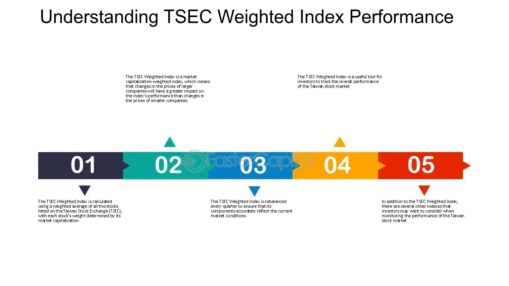

## Table of Contents

## What is the Taiwan Weighted Index?

The Taiwan Weighted Index, also known as the TAIEX, is a stock market index that shows how well the stock market in Taiwan is doing. It includes the stock prices of the biggest and most important companies listed on the Taiwan Stock Exchange. When the TAIEX goes up, it usually means that the overall value of these companies is increasing, and when it goes down, it means their value is decreasing.

People use the TAIEX to get an idea of how the Taiwanese economy is performing. It helps investors decide whether to buy or sell stocks. The index is calculated using a method that gives more weight to companies with higher market values, so big companies have a bigger impact on the index than smaller ones.

## How is the Taiwan Weighted Index calculated?

The Taiwan Weighted Index, or TAIEX, is calculated by taking the stock prices of the biggest and most important companies on the Taiwan Stock Exchange. It uses a method called "market capitalization weighting." This means that companies with a higher total value (market cap) have a bigger effect on the index. For example, if a big company's stock price changes a lot, it will change the TAIEX more than if a small company's stock price changes the same amount.

To calculate the index, they first find the total market value of all the companies included in the TAIEX. Then, they compare this total to a base value set a long time ago. The TAIEX number you see is this comparison, showing how much the total value of these companies has changed since the base was set. This way, the TAIEX gives a good picture of how the overall stock market in Taiwan is doing.

## What are the main components of the Taiwan Weighted Index?

The Taiwan Weighted Index, or TAIEX, includes the stocks of the biggest and most important companies listed on the Taiwan Stock Exchange. These companies come from different industries like technology, finance, and manufacturing. Some of the main companies in the TAIEX are big names like Taiwan Semiconductor Manufacturing Company (TSMC), Hon Hai Precision Industry (Foxconn), and MediaTek. These companies have a big impact on the index because they are very large and important to Taiwan's economy.

The TAIEX is made up of around 700 companies, but not all of them have the same effect on the index. The bigger the company, the more it affects the TAIEX. This is because the index uses a method called market capitalization weighting. So, when the stock prices of big companies like TSMC go up or down, it can change the TAIEX a lot. This makes the TAIEX a good way to see how the overall stock market in Taiwan is doing.

## How does the Taiwan Weighted Index reflect the performance of the Taiwanese economy?

The Taiwan Weighted Index, or TAIEX, is a good way to see how the Taiwanese economy is doing. It includes the stock prices of the biggest and most important companies in Taiwan. When the TAIEX goes up, it usually means that these companies are doing well, and the economy might be growing. If the TAIEX goes down, it can mean that these companies are not doing as well, and the economy might be slowing down.

The TAIEX is important because it gives people a quick look at the health of the economy. Investors use it to decide if they should buy or sell stocks. Since the TAIEX includes companies from different industries like technology, finance, and manufacturing, it shows how these different parts of the economy are doing. This helps everyone understand the overall economic situation in Taiwan.

## What are the historical trends of the Taiwan Weighted Index?

The Taiwan Weighted Index, or TAIEX, has had many ups and downs over the years. It started in 1962, and since then, it has shown how Taiwan's economy has grown and changed. In the early years, the TAIEX was much lower than it is now. It grew a lot in the 1980s and 1990s as Taiwan's economy got stronger, especially in technology and manufacturing. There were big jumps in the TAIEX during good economic times, but it also fell a lot during tough times like the Asian Financial Crisis in 1997.

In more recent years, the TAIEX has continued to show the health of Taiwan's economy. It hit all-time highs in the late 2010s and early 2020s, driven by strong performances from big tech companies like TSMC. However, it also faced challenges, like during the global financial crisis in 2008 and the economic impacts of the COVID-19 pandemic in 2020. Despite these challenges, the TAIEX has generally shown a long-term upward trend, reflecting Taiwan's growth as a major player in the global economy.

## How can investors use the Taiwan Weighted Index to make investment decisions?

Investors can use the Taiwan Weighted Index, or TAIEX, to get a quick idea of how the Taiwanese stock market is doing. By watching the TAIEX, investors can see if the market is going up or down. If the TAIEX is going up, it might be a good time to buy stocks because the market seems to be doing well. On the other hand, if the TAIEX is going down, it might be a good time to sell stocks or wait before buying more.

The TAIEX can also help investors understand which industries in Taiwan are doing well. Since the index includes big companies from different sectors like technology, finance, and manufacturing, a rising TAIEX might mean these industries are growing. Investors can use this information to decide which types of stocks to buy. For example, if technology companies are driving the TAIEX up, it might be a good idea to invest in tech stocks. By keeping an eye on the TAIEX, investors can make smarter choices about when and where to invest their money.

## What are the differences between the Taiwan Weighted Index and other major stock indices?

The Taiwan Weighted Index, or TAIEX, is different from other major stock indices like the S&P 500 or the Nikkei 225 because it focuses on companies listed on the Taiwan Stock Exchange. The TAIEX includes around 700 companies, which is more than the S&P 500's 500 companies but less than the thousands of companies in indices like the Russell 3000. The TAIEX is also unique because it gives more weight to companies with higher market values, just like the S&P 500, but unlike some indices like the Dow Jones Industrial Average, which uses a price-weighted method.

Another difference is that the TAIEX reflects the performance of the Taiwanese economy, which is heavily focused on technology and manufacturing. This is different from indices like the S&P 500, which covers a broader range of industries in the U.S., or the FTSE 100, which is more focused on finance and energy in the U.K. The TAIEX's heavy reliance on tech companies like TSMC means it can be more volatile than some other indices, especially when the global tech sector goes through big changes.

## How does the Taiwan Weighted Index respond to global economic changes?

The Taiwan Weighted Index, or TAIEX, is affected by what happens in the global economy. When big events like financial crises or pandemics happen around the world, the TAIEX can go up or down. For example, during the 2008 global financial crisis, the TAIEX dropped a lot because many companies in Taiwan were hurt by the problems in other countries. Also, when the world economy is doing well, the TAIEX often goes up because Taiwanese companies, especially those in technology, do well when there is more demand for their products.

The TAIEX is also influenced by what happens in other big economies like the U.S. and China. If the U.S. stock market goes up, it can make investors feel more confident, and they might invest more in Taiwan, pushing the TAIEX higher. On the other hand, if there are trade tensions between Taiwan and China, it can hurt Taiwanese companies and cause the TAIEX to go down. This shows how connected Taiwan's economy is to the rest of the world, and how global events can impact the TAIEX.

## What are the key factors that influence the Taiwan Weighted Index?

The Taiwan Weighted Index, or TAIEX, is influenced by many things. One big factor is how well the companies in Taiwan are doing. Since the TAIEX includes the biggest and most important companies, their profits and growth can make the index go up or down. Another factor is the global economy. When the world economy is doing well, it often helps Taiwanese companies, especially those in technology, and this can push the TAIEX higher. But if there are problems in other countries, it can hurt the TAIEX too.

Another important thing that affects the TAIEX is what's happening in other big economies like the U.S. and China. If the U.S. stock market is doing well, it can make investors feel more confident and they might invest more in Taiwan, which can help the TAIEX go up. On the other hand, if there are trade issues between Taiwan and China, it can hurt Taiwanese companies and make the TAIEX go down. This shows how connected Taiwan's economy is to the rest of the world, and how global events can impact the TAIEX.

## How is the Taiwan Weighted Index used in financial derivatives and products?

The Taiwan Weighted Index, or TAIEX, is used in many financial products called derivatives. These are special kinds of investments that get their value from the TAIEX. For example, futures contracts based on the TAIEX let investors bet on where they think the index will go in the future. If someone thinks the TAIEX will go up, they can buy a futures contract and make money if they are right. On the other hand, if they think it will go down, they can sell a futures contract and make money if the TAIEX falls.

Options are another type of derivative that uses the TAIEX. These give investors the right, but not the obligation, to buy or sell the index at a certain price before a certain time. If an investor thinks the TAIEX will go up, they can buy a call option, which lets them buy the index at a set price. If the TAIEX goes up more than that price, they can make money. If they think the TAIEX will go down, they can buy a put option, which lets them sell the index at a set price and make money if it falls below that price. These derivatives help investors manage risk and try to make money based on what they think will happen to the TAIEX.

## What are the future predictions for the Taiwan Weighted Index based on current economic analyses?

Based on current economic analyses, experts think the Taiwan Weighted Index, or TAIEX, will keep growing in the future. This is because Taiwan is a big player in the technology industry, and as more people around the world use tech products, companies like TSMC and Foxconn are expected to do well. The TAIEX has been going up in recent years, and many analysts believe this trend will continue as long as the global economy stays strong. However, they also say that the TAIEX could face some ups and downs because of things like trade tensions with China or changes in the global tech market.

Even though the future looks bright for the TAIEX, there are some risks to think about. One big risk is how the world economy does. If there's a big economic problem somewhere else, it could affect Taiwanese companies and make the TAIEX go down. Another thing to watch is how much the TAIEX depends on just a few big companies. If something bad happens to one of these companies, it could have a big impact on the whole index. So, while many people are hopeful about the TAIEX's future, it's important to keep an eye on these risks and be ready for any changes.

## How do technical analysts interpret movements in the Taiwan Weighted Index?

Technical analysts look at the Taiwan Weighted Index, or TAIEX, to see patterns and trends that can help them predict what will happen next. They use charts and graphs to study how the TAIEX has moved in the past. For example, if the TAIEX has been going up and down in a certain way, technical analysts might think it will keep doing that. They also look at things like moving averages, which are lines on a chart that show the average price of the TAIEX over time. If the TAIEX goes above a moving average, it might mean it will keep going up. If it goes below, it might mean it will keep going down.

Another thing technical analysts do is look at support and resistance levels. Support levels are prices where the TAIEX has stopped going down in the past, and resistance levels are prices where it has stopped going up. If the TAIEX gets close to these levels, technical analysts watch to see if it will bounce back or break through. They also use tools like the Relative Strength Index (RSI) to see if the TAIEX is overbought or oversold. If the RSI is high, it might mean the TAIEX is due for a drop. If it's low, it might mean the TAIEX is due for a rise. By looking at all these things, technical analysts try to make smart guesses about where the TAIEX is headed next.

## How is the TSEC Weighted Index calculated?

The TSEC Weighted Index, serving as a critical indicator of the Taiwan Stock Exchange's performance, is calculated through a comprehensive process grounded in market capitalization. This method is akin to other global stock indices, ensuring a consistent and objective reflection of market dynamics. The calculation involves the following formula:

$$
\text{TSEC Weighted Index} = \frac{\sum (\text{Price of Stock}_i \times \text{Number of Shares of Stock}_i)}{\text{Base Market Capitalization}}
$$

This formula is designed to provide a dynamic representation of the market by weighing each component stock in proportion to its market value. Consequently, larger companies have a more pronounced impact on the index, aligning with their significance in the economy. This ensures the index not only represents the size of its constituent stocks but also correlates strongly with the economic activities in Taiwan.

To maintain the index's accuracy and relevance, rebalancing occurs on a quarterly basis. This involves adjusting the component stocks in response to changes such as price fluctuations, corporate actions, or shifts in market capitalization. Such periodic assessments allow the index to accurately mirror shifts in market trends, ensuring it remains a reliable benchmark for investors. The regular rebalancing process helps in mitigating discrepancies that might arise from market [volatility](/wiki/volatility-trading-strategies), thus preserving the integrity of the index as a reflection of market health.

## References & Further Reading

[1]: ["Taiwan Stock Index Fund Guide"](https://www.justetf.com/en/how-to/invest-in-taiwan.html) - Taiwan Stock Exchange

[2]: ["Taiwan Semiconductor Manufacturing Company (TSMC) Annual Report"](https://investor.tsmc.com/english/annual-reports) - Taiwan Semiconductor Manufacturing Company

[3]: ["Technical Analysis of the Financial Markets: A Comprehensive Guide to Trading Methods and Applications"](https://www.amazon.com/Technical-Analysis-Financial-Markets-Comprehensive/dp/0735200661) by John J. Murphy

[4]: Narang, R. K. (2009). ["Inside the Black Box: A Simple Guide to Quantitative and High Frequency Trading"](https://onlinelibrary.wiley.com/doi/book/10.1002/9781118267738) - Wiley

[5]: ["Algorithmic Trading: Winning Strategies and Their Rationale"](https://www.amazon.com/Algorithmic-Trading-Winning-Strategies-Rationale-ebook/dp/B00CY5HC0U) by Ernest P. Chan

[6]: ["Taiwan: Enhancing Opportunities for the Semiconductor Industry"](https://www.taipeitimes.com/News/biz/archives/2024/11/05/2003826381) - OECD Observer