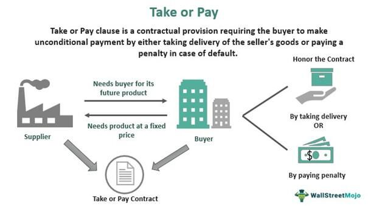

Contractual provisions are fundamental components in the trading and finance sectors, serving as the backbone for securing transactions and mitigating risks. Among these provisions, 'Take or Pay' agreements hold particular significance, especially in industries involving substantial capital investments, such as energy and utilities. These agreements ensure that transactions occur regardless of fluctuations in demand, providing a stable financial environment for both buyers and sellers. In essence, they are designed to secure a guaranteed revenue stream for sellers, while offering buyers a reliable source of supply, albeit with certain contractual obligations.

Algorithmic trading, on the other hand, introduces a transformative layer to financial markets. By using pre-programmed instructions and sophisticated algorithms, it enables the automation of trading processes, improving efficiency and significantly reducing human error. With the capability to analyze vast amounts of data and execute trades at lightning speed, algorithmic trading has become an indispensable tool in equity, forex, and commodities markets.

The intersection of 'Take or Pay' agreements and algorithmic trading represents a unique confluence of traditional contractual mechanisms with modern technological advancements. By leveraging algorithms, market participants can optimize the execution of 'Take or Pay' contracts, ensuring that obligations are met efficiently while minimizing associated risks. The synergy between these two elements presents opportunities for enhanced strategic decision-making and risk management.

This article aims to explore the intricacies and applications of 'Take or Pay' agreements alongside algorithmic trading. As these concepts continue to evolve and impact the financial landscape, understanding their interaction becomes crucial for market participants seeking to harness efficiency and strategic advantages.

## Table of Contents

## Understanding 'Take or Pay' Legal Agreements

'Take or Pay' is a contractual clause commonly used in agreements where a buyer commits to purchase a specified quantity of a product or service from a seller. If the buyer fails to take the agreed quantity, they are still obligated to pay for the minimum specified amount, regardless of whether the goods or services are actually consumed. This provision provides assurance to sellers that they will receive a minimum level of revenue, thereby facilitating planning and investment in their operations.

The mechanics of 'Take or Pay' agreements are structured around binding obligations for the buyer and guarantees for the seller. The buyer must accept the delivery of goods or services up to the agreed quantity or pay the equivalent price. In scenarios where the buyer does not take delivery, the seller is still entitled to revenue based on the 'take' quantity. This setup safeguards the seller against demand fluctuations and optimizes resource allocation, as it minimizes inventory surplus and maximizes production scheduling efficacy.

For buyers, one of the primary benefits of such agreements is securing a stable supply of essential goods or services, often at favorable pricing terms compared to spot market rates. For sellers, 'Take or Pay' clauses provide revenue predictability and risk mitigation, especially in sectors involving significant capital investments and overhead costs. These agreements enable sellers to finance infrastructure development and expand operational capacity with greater financial security.

Industries where 'Take or Pay' agreements are prevalent include those characterized by high capital expenditures and the need for reliable supply chains. The energy sector, for instance, frequently relies on these agreements, especially in natural gas supply contracts, where sellers require long-term commitments to justify the substantial investments in exploration, extraction, and transportation infrastructure. Similarly, utility companies use 'Take or Pay' provisions to maintain consistent demand and supply for energy resources, thus supporting large-scale distribution networks.

In summary, 'Take or Pay' agreements serve as vital instruments in bridging supply-demand gaps by ensuring contractual commitments that enhance stability and efficiency for both buyers and sellers in capital-intensive industries.

## Examples of 'Take or Pay' Agreements in Various Sectors

'Take or Pay' agreements are integral to various industries, providing security and predictability in commercial transactions. Below are examples illustrating how these agreements function across different sectors:

### Energy Sector
In the energy sector, 'Take or Pay' agreements are paramount, particularly in natural gas supply contracts. These contracts stipulate that the buyer must either purchase a minimum quantity of gas or pay a penalty for any shortfall. This arrangement ensures predictable revenue for the supplier while guaranteeing supply availability for the buyer. For instance, utilities companies heavily rely on such contracts to maintain a steady gas supply to meet consumer demand, minimizing the risk associated with fluctuating energy needs. The stability afforded by these agreements also facilitates long-term planning and investment in infrastructure.

### Utilities Sector
In utilities, 'Take or Pay' clauses are commonly employed to ensure consistent demand. These contracts help stabilize prices and secure resource availability, which is crucial given the fluctuating nature of consumer demand for electricity and water. By committing to a fixed [volume](/wiki/volume-trading-strategy) of resources, utilities can manage their operations more effectively and optimize resource allocation. Such agreements often underpin infrastructure investments, as they provide the financial certainty required to justify large-scale capital expenditures.

### Manufacturing Industry
The manufacturing sector often uses 'Take or Pay' agreements to secure long-term raw material supplies. For example, a steel manufacturer might enter into such a contract with an iron ore supplier, committing to purchase a set amount annually. This assures the supplier of a steady demand and revenue stream, enabling them to plan production better. Simultaneously, the manufacturer is shielded from sudden price hikes or supply disruptions, which can be critical in maintaining competitive advantage in the global market.

### Transport and Logistics
In transport and logistics, 'Take or Pay' agreements are utilized in freight rail agreements. Rail operators often use these contracts when negotiating with resource extraction companies, like mining firms, ensuring a minimum usage level of their transport services. This guarantees revenue for the rail company and delivery capacity for the resource company. Such agreements contribute to efficient logistics planning and prevent potential bottlenecks that could disrupt supply chains.

Overall, the application of 'Take or Pay' agreements across these sectors highlights their role in mitigating risk and fostering stable, long-term business relationships. By setting clear expectations and obligations, these contracts help companies navigate the complexities of market [volatility](/wiki/volatility-trading-strategies) and operational challenges.

## Algorithmic Trading in Modern Finance

Algorithmic trading, commonly referred to as algo trading, involves the use of computer programs to execute trades at speeds and frequencies that are impossible for human traders. It employs complex algorithms to make decisions based on predetermined criteria, utilizing mathematical models and vast quantities of data. This type of trading has gained significant prominence in contemporary financial markets due to its ability to optimize trading strategies with high precision and efficiency.

The automation of trading processes through algorithmic strategies eliminates human intervention in routine decision-making. This translates to enhanced efficiency as algorithms can process large datasets, analyze market conditions, and execute orders in a fraction of a second. Algorithmic trading minimizes human error, which is often caused by emotions or fatigue, allowing for more consistent and objective trading decisions. Algorithms are capable of monitoring multiple markets simultaneously, identifying [arbitrage](/wiki/arbitrage) opportunities, and executing trades in milliseconds, which is critical in markets where conditions change rapidly.

Key features of [algorithmic trading](/wiki/algorithmic-trading) systems include speed, accuracy, and the ability to process vast amounts of data. These systems are designed to make trades based on a set of rules, which include timing, price, quantity, or any mathematical model. By leveraging high-speed networks and sophisticated algorithms, traders can capitalize on even the smallest market inefficiencies. Data processing capabilities enable algorithms to consider historical data, real-time market conditions, and predictive analytics to inform trading decisions. The role of [machine learning](/wiki/machine-learning) and [artificial intelligence](/wiki/ai-artificial-intelligence) in these systems is also growing, providing systems with the ability to adapt to new market patterns dynamically.

The rise of algorithmic trading is particularly notable in equity, [forex](/wiki/forex-system), and commodities markets. In equity markets, for example, algo trading is used to split large trades into smaller ones to minimize their market impact, known as order slicing. In forex markets, the continuous and global nature of trading suits the benefits of algorithmic systems, as they can operate 24/7 without the need for human rest periods. Similarly, in commodities markets, traders utilize algorithms to manage large portfolios and execute trades based on complex market data and forecasts.

Thus, algorithmic trading represents a significant evolution in financial markets, optimizing trade execution, reducing costs, and increasing volume, thereby facilitating the growth and efficiency of these markets.

## Intersection of 'Take or Pay' Agreements and Algo Trading

The optimization of 'Take or Pay' contracts through algorithmic trading can significantly enhance their efficacy and economic value. Algorithmic trading, known for its capabilities in swift data processing and execution, can be employed to manage and optimize the risk and performance metrics of 'Take or Pay' contracts.

One major synergy between algorithmic trading and 'Take or Pay' contracts lies in risk management. Algorithmic systems can analyze vast datasets to identify patterns and predict market behaviors that influence the supply and demand dynamics inherent in 'Take or Pay' contracts. For instance, in the energy sector, where such contracts are prevalent, algorithms can assess weather forecasts, geopolitical events, and changes in market demand to optimize purchasing decisions, ensuring that the obligations of the contract are met while minimizing excess supply costs.

Algorithmic strategies, such as mean reversion and [momentum](/wiki/momentum) trading, can be adapted for executing 'Take or Pay' provisions. These strategies allow for optimal timing in purchasing or selling commodities associated with these contracts, ensuring compliance without unnecessary expenditure. The implementation of machine learning models can further refine these strategies by continuously learning from market trends and historical contract performance, improving decision accuracy over time.

Case studies highlight the strategic advantage of integrating algorithmic trading with 'Take or Pay' agreements. Some companies in the energy sector have successfully used algorithms to balance their supply schedules, thus avoiding penalties associated with non-compliance of 'Take or Pay' clauses, while optimizing their operational costs. These organizations utilize sophisticated trading algorithms to decide the volumes of energy to purchase and/or store, taking advantage of fluctuating prices to achieve favorable terms within the constraints of their contracts. 

The financial sector also benefits significantly, as firms employing algorithmic trading to manage 'Take or Pay' agreements can swiftly adjust their trading strategies in response to market movements, ensuring the fulfillment of contractual obligations at minimal cost. Such integration not only improves profitability but also provides these firms with a competitive edge in market adaptability and strategic resource management.

In summary, the intersection of 'Take or Pay' agreements and algorithmic trading not only optimizes contract execution but also enhances strategic planning, operational efficiency, and risk management, making it a valuable tool for companies in various industries facing the complexities of contractual compliance and market volatility.

## Legal Considerations in 'Take or Pay' and Algo Trading

Contracts and trading practices are subject to numerous legal considerations, especially when they involve complex mechanisms like 'Take or Pay' clauses and algorithmic trading. The enforceability and legal intricacies of these elements require close attention from businesses and legal experts.

### Key Legal Aspects and Enforceability of 'Take or Pay' Clauses

'Take or Pay' clauses are structured as contractual provisions obligating buyers to either purchase a minimum quantity of goods or services or make a payment for the unpurchased balance. The enforceability of these clauses typically rests on the precise wording of the contract, adherence to principles of contract law, and relevant jurisdictional mandates. Notably, these clauses must be clear and unequivocal to withstand legal scrutiny during disputes. Rarely, courts may scrutinize such agreements for unfair trade practices, especially if market conditions change dramatically, affecting the parties' ability to fulfill the contract.

### Legal Challenges in Algorithmic Trading

Algorithmic trading introduces unique legal challenges primarily revolving around compliance and regulatory issues. As algorithmic trading systems automate transactions at high speeds, they are subject to regulations that prevent unfair trading practices and ensure market integrity. Key regulatory frameworks, such as the Markets in Financial Instruments Directive II (MiFID II) in the European Union and the Regulation National Market System (Reg NMS) in the United States, govern algorithmic trading activities. Compliance with these regulations entails rigorous testing of algorithms to mitigate risks like market manipulation, flash crashes, and erroneous trades. Furthermore, firms must maintain robust audit trails and real-time monitoring systems, ensuring transparency and accountability in trading operations.

### Importance of Clear Documentation and Negotiation in 'Take or Pay' Agreements

Negotiating and documenting 'Take or Pay' agreements require meticulous attention to legal details. Each clause should explicitly define the obligations and rights of the involved parties to minimize misunderstanding and disputes. Essential elements include the definition of the minimum purchase quantity, payment terms, price adjustments, and conditions under which the obligations may be waived. Clear documentation ensures that both parties have a shared understanding, facilitating smoother dispute resolution processes if necessary.

### Role of Legal Experts

Legal experts play an essential role in navigating the complexities inherent in 'Take or Pay' clauses and algorithmic trading. In the case of 'Take or Pay' agreements, attorneys must ensure that contracts are compliant with prevailing industry laws, provide fair trading conditions, and protect clients from potential breaches. Regarding algorithmic trading, legal practitioners assist in drafting policies that comply with financial regulations and manage risks related to automated trading systems. Their expertise is crucial in interpreting the legal ramifications of technological and market evolutions, ensuring businesses can leverage these developments advantageously while remaining within legal boundaries.

## Conclusion

The conclusion of this exploration into 'Take or Pay' agreements and algorithmic trading underscores their pivotal roles in contemporary finance and trade. 'Take or Pay' agreements are critical for industries with high capital expenditures, such as energy, utilities, and manufacturing. They offer essential guarantees: buyers ensure consistent supply chains while sellers secure a baseline revenue, thus stabilizing operations in environments of economic uncertainty. These contracts, while beneficial, involve intricate legalities that require precise documentation and skilled negotiation to mitigate risks associated with fluctuating demand and supply dynamics.

Meanwhile, algorithmic trading has revolutionized the financial sector by enhancing transaction efficiency, reducing human error, and enabling real-time data analysis. This technology fosters a more dynamic trading environment and offers traders a competitive edge through improved execution speeds and complex strategy implementation. The rise of algorithmic trading in equity, forex, and commodities markets signifies a shift towards more autonomous and data-driven trading practices.

The integration of 'Take or Pay' agreements with algorithmic trading represents a frontier in achieving operational excellence and strategic advantage. By utilizing automated trading algorithms, companies can better manage their contractual agreements, optimize resource allocation, and enhance risk management. This convergence offers promising opportunities, such as automated monitoring of contract fulfillment and dynamic repricing based on real-time market conditions.

Looking forward, the evolution of these frameworks will be shaped by advancements in technology and regulatory landscapes. The need for robust legal frameworks and compliance measures will grow, alongside the sophistication of trading algorithms. As markets become increasingly complex, the harmonization of 'Take or Pay' provisions with cutting-edge trading technologies promises to drive greater efficiencies and open new avenues for innovation in finance. This synergy not only holds potential for enhanced profitability but also paves the way for more resilient and adaptive market mechanisms.

## References & Further Reading

[1]: Bickel, J. E., & Bratvold, R. B. (2008). ["From uncertainty quantification to decision making in the oil and gas industry."](https://journals.sagepub.com/doi/10.1260/014459808787945344) Geostatistics Banff 2008. Springer, Dordrecht.

[2]: Hull, J. C. (2018). ["Options, Futures, and Other Derivatives,"](https://www.semanticscholar.org/paper/Options%2C-Futures%2C-and-Other-Derivatives-Hull/89bdee500c8623864fc9eb7a471546aa713acc44) 10th Edition. Pearson Education.

[3]: Koller, G., & Wackershauser, M. (2010). ["Risk Assessment and Decision Making in Business and Industry."](https://www.taylorfrancis.com/books/mono/10.1201/9781420035056/risk-assessment-decision-making-business-industry-glenn-koller) CRC Press.

[4]: Harris, L. (2003). ["Trading and Exchanges: Market Microstructure for Practitioners."](https://www.amazon.com/Trading-Exchanges-Market-Microstructure-Practitioners/dp/0195144708) Oxford University Press.

[5]: Chu, C. S. J., & Chan, K. C. (2009). ["Algorithmic Trading in Practice."](https://assets.cambridge.org/97811070/91146/frontmatter/9781107091146_frontmatter.pdf) Review of Finance, 13(2), 349–379.