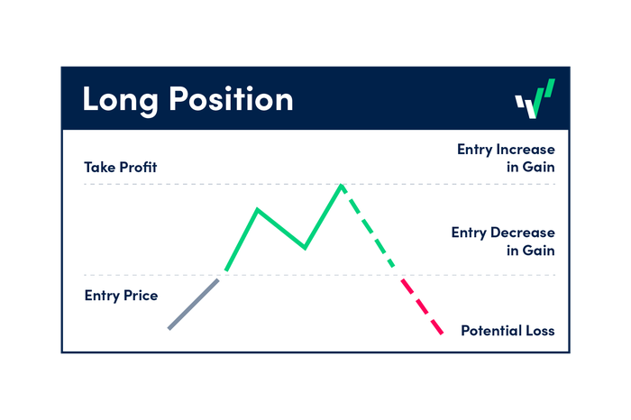

## Table of Contents

## What is a take-profit order in trading?

A take-profit order is a type of order that traders use to automatically close a trade when it reaches a certain profit level. When you set a take-profit order, you tell your trading platform to sell your asset once its price hits the level you've chosen. This helps you lock in profits without having to watch the market all the time.

For example, if you buy a stock at $50 and you think it will go up to $60, you can set a take-profit order at $60. Once the stock price reaches $60, the order will be executed, and you will sell the stock at that price. This way, you don't have to keep an eye on the market constantly, and you can make sure you get the profit you were aiming for.

## How does a take-profit order work?

A take-profit order is a tool traders use to make sure they sell their investment when it reaches a certain price. When you set a take-profit order, you tell your trading platform to automatically sell your asset once it hits the price you've chosen. This helps you lock in your profits without having to watch the market all the time.

For example, let's say you buy a stock for $50 and you think it will go up to $60. You can set a take-profit order at $60. When the stock price reaches $60, your trading platform will sell the stock for you at that price. This way, you don't need to keep checking the market, and you can be sure to get the profit you were aiming for.

## Why should traders use take-profit orders?

Traders should use take-profit orders because they help lock in profits without needing to watch the market all the time. When you set a take-profit order, you choose a price at which you want to sell your asset. Once the price reaches that level, the order is automatically executed, and you get your profit. This is really helpful if you can't keep an eye on the market all day or if you want to make sure you don't miss out on your target profit.

Another reason to use take-profit orders is that they can help you stick to your trading plan. Sometimes, when prices are moving a lot, it's easy to get greedy and wait for even more profit. But this can be risky because the price might go down again. By setting a take-profit order, you can make sure you sell at the price you planned, which helps you manage your trades better and avoid emotional decisions.

## What are the potential benefits of using take-profit orders?

Using take-profit orders can help traders lock in their profits without having to watch the market all the time. When you set a take-profit order, you choose a price at which you want to sell your asset. Once the price reaches that level, the order is automatically executed, and you get your profit. This is really helpful if you can't keep an eye on the market all day or if you want to make sure you don't miss out on your target profit.

Another benefit of using take-profit orders is that they can help you stick to your trading plan. Sometimes, when prices are moving a lot, it's easy to get greedy and wait for even more profit. But this can be risky because the price might go down again. By setting a take-profit order, you can make sure you sell at the price you planned, which helps you manage your trades better and avoid emotional decisions.

## What are the risks associated with take-profit orders?

Using take-profit orders can sometimes mean you miss out on bigger profits. If the price of your asset keeps going up after your take-profit order is triggered, you might feel like you sold too soon. For example, if you set your take-profit at $60 and the price goes up to $70, you might wish you had waited. This can be frustrating, especially if you see others making more money because they held on longer.

Another risk is that the market can be unpredictable. Sometimes, the price might hit your take-profit level but then quickly drop back down. If this happens right after your order is executed, you might end up selling at a less favorable price than if you had waited a bit longer. This can make you feel like you missed out on a better opportunity.

## How do you set a take-profit order?

Setting a take-profit order is easy and can be done right on your trading platform. First, you need to decide at what price you want to sell your asset to make a profit. For example, if you bought a stock at $50 and you want to sell it when it reaches $60, that's your take-profit price. Once you've decided on the price, go to your trading platform, find the option to set a take-profit order, and enter the price you want.

After you enter the price, the trading platform will keep an eye on the market for you. When the price of your asset hits the take-profit level you set, the platform will automatically sell your asset at that price. This way, you don't have to watch the market all the time, and you can make sure you get the profit you were aiming for.

## Can take-profit orders be modified after they are set?

Yes, you can change a take-profit order after you set it. If you go back to your trading platform, you can usually find the order you set and change the price to a new one. This is helpful if you think the market might go higher than you first thought, or if you want to take a smaller profit sooner.

It's good to know that you can change your take-profit order because the market can be unpredictable. If you see that the price is moving differently than you expected, you can adjust your order to match the new situation. Just remember to keep an eye on your orders and make changes if you need to, so you can get the best results from your trades.

## What is the difference between a take-profit order and a stop-loss order?

A take-profit order and a stop-loss order are both tools that traders use to manage their trades, but they work in different ways. A take-profit order is set to automatically sell your asset when it reaches a certain price that you think will give you a profit. For example, if you buy a stock at $50 and set a take-profit order at $60, the order will sell the stock for you when it hits $60, locking in your profit.

On the other hand, a stop-loss order is used to limit your losses. You set a stop-loss order at a price below where you bought the asset. If the price drops to that level, the order will automatically sell your asset to stop you from losing more money. For instance, if you buy a stock at $50 and set a stop-loss at $45, the order will sell the stock if it falls to $45, helping you avoid bigger losses. Both orders help you manage your trades without having to watch the market all the time, but they serve opposite purposes: take-profit orders help you make money, while stop-loss orders help you avoid losing too much.

## How do take-profit orders affect trading strategies?

Take-profit orders can really change how traders plan their moves. When you set a take-profit order, you're telling the market, "Sell my asset when it hits this price." This means you don't have to watch the market all the time. You can set your target profit and let the trading platform do the work for you. This can help you stick to your plan and not get too greedy, waiting for even more profit that might not come.

Using take-profit orders can also make your trading strategy more disciplined. It's easy to get caught up in the moment and make quick decisions based on emotions. But with a take-profit order, you've already decided what profit you want, and the order will make sure you get it. This can help you avoid the risk of the price dropping after you've made a good profit. So, take-profit orders can help you be more consistent and less emotional in your trading.

## What are some common mistakes traders make with take-profit orders?

One common mistake traders make with take-profit orders is setting the profit target too low. They might be too cautious and set a take-profit at a price that's not far enough from their entry point. This can mean they miss out on bigger profits if the market keeps going up. It's important to do some research and think about how much the price might go up before setting your take-profit order.

Another mistake is not adjusting take-profit orders as the market changes. The market can be unpredictable, and sometimes the price might move differently than you expected. If you see that the price is going up faster than you thought, you might want to move your take-profit order higher to get more profit. But if you forget to adjust your order, you could end up selling too soon and missing out on extra gains. It's good to keep an eye on your orders and be ready to change them if the market situation changes.

## How can take-profit orders be optimized for different market conditions?

Take-profit orders can be optimized for different market conditions by understanding the trends and [volatility](/wiki/volatility-trading-strategies) of the market. In a strong bullish market, where prices are consistently going up, you might want to set your take-profit order at a higher price than usual. This is because the chances of the price continuing to rise are good, and you don't want to sell too soon and miss out on bigger profits. On the other hand, in a volatile market where prices can swing a lot, you might want to set your take-profit closer to your entry point to lock in profits quickly before the price drops again.

Another way to optimize take-profit orders is by using technical analysis to set your target price. For example, if you see that a stock often hits resistance at a certain price level, you might set your take-profit just below that level. This can help you sell before the price might start to fall back down. Also, you can adjust your take-profit order as the market changes. If you see the price moving faster than you expected, you can move your take-profit higher to try and get more profit. By keeping an eye on the market and being ready to adjust your orders, you can make the most out of different market conditions.

## What advanced techniques can be used with take-profit orders to enhance trading performance?

One advanced technique for using take-profit orders is called "trailing stop." With a trailing stop, instead of setting a fixed take-profit price, you set a dynamic one that moves with the market. For example, if you set a trailing stop of $5 on a stock you bought at $50, and the price goes up to $60, your take-profit order will move to $55. This way, you can lock in profits as the price goes up, but still give the stock room to keep rising. It's a good way to get the best of both worlds: you can make more money if the price keeps going up, but you also protect your profits if the price starts to fall.

Another technique is to use multiple take-profit orders at different price levels. This is called "scaling out" of a position. For example, if you buy a stock at $50 and think it could go up to $70, you might set three take-profit orders: one at $60, another at $65, and the last at $70. This way, you can sell part of your position at each level, locking in profits along the way. It helps you take some profit early if the price doesn't go as high as you hoped, but also lets you hold on for more gains if the price keeps going up. By using these advanced techniques, you can make your take-profit orders work better for you and improve your overall trading performance.

## References & Further Reading

[1]: "Advances in Financial Machine Learning" by Marcos Lopez de Prado. Available at: [Amazon](https://www.amazon.com/Advances-Financial-Machine-Learning-Marcos/dp/1119482089)

[2]: Jansen, S. (2020). "Machine Learning for Algorithmic Trading" (2nd Edition). Packt Publishing. Available at: [Amazon](https://www.amazon.com/Machine-Learning-Algorithmic-Trading-alternative-ebook/dp/B08D9SP6MB)

[3]: Aronson, D. R. (2006). "Evidence-Based Technical Analysis: Applying the Scientific Method and Statistical Inference to Trading Signals". Wiley. Available at: [Wiley](https://onlinelibrary.wiley.com/doi/book/10.1002/9781118268315)

[4]: Chan, E. P. (2009). "Quantitative Trading: How to Build Your Own Algorithmic Trading Business". Wiley. Available at: [Amazon](https://www.amazon.com/Quantitative-Trading-Build-Algorithmic-Business/dp/1119800064)

[5]: Bergstra, J., Bardenet, R., Bengio, Y., & Kégl, B. (2011). "Algorithms for Hyper-Parameter Optimization". Advances in Neural Information Processing Systems 24. Available at: [NIPS Proceedings](https://dl.acm.org/doi/10.5555/2986459.2986743)