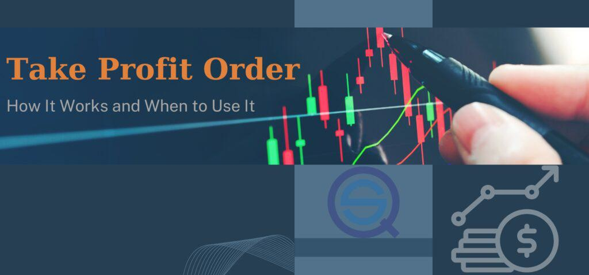

Algorithmic trading, also known as algo trading, has become increasingly significant in financial markets, reshaping the landscape of investment strategies. This method utilizes complex mathematical models and lightning-fast computer programs to execute trades, minimizing human intervention. Its growth is fueled by the ability to analyze extensive datasets at a speed humans cannot match, thereby identifying opportunities and executing trades with precision and efficiency. A consequence of this evolution is the rapid increase in both trade volumes and market liquidity, making the markets more efficient but also more competitive.

Central to many trading strategies is the concept of take-profit orders. A take-profit order is a type of limit order that prescribes a particular price at which a trade should be closed to secure desired profits. When the take-profit price is reached, the order is executed automatically, preventing any further monetary gain from that position, but also protecting against potential reversals in the market. This mechanism is instrumental in investment management, allowing traders to predetermine their exit points, thus safeguarding profits without constant monitoring.



Algo trading and take-profit orders together form a symbiotic relationship integral to modern investment strategy. Algo trading systems harness take-profit orders to optimize trading accuracy and success rates by incorporating predefined rules that execute their strategies with minimal delay. These automated systems reduce emotional trading, which can lead to inefficiencies and errors, a common pitfall in manual trading processes.

As the financial markets become more complex, the integration of algo trading with tools like take-profit orders allows traders to optimize investment strategies by aligning them with specific financial goals. The efficiencies achieved through such integration can be illustrated through the precision and reliability of execution, a critical factor in today's fast-paced trading environment. This sets the stage for further examination of how take-profit orders bolster algo trading efficiency, managing market risk while enhancing profitability—a theme central to the discussion ahead.

## Table of Contents

## Understanding Take-Profit Orders

A take-profit order is a predetermined type of instruction given to a broker to automatically sell a security once it reaches a certain price level, thus securing profits from that trade. This type of order is instrumental in executing a successful trading strategy by allowing traders to set specific profit targets. When the market price hits the target, the order is executed without any manual intervention, ensuring that the trader realizes the profit without having to constantly monitor the market.

Take-profit orders play a crucial role in risk management by guaranteeing that gains are locked in when favorable price movements occur. By determining and setting their profit margins in advance, traders protect themselves from market reversals that could erode potential profits. For example, if a trader purchases a stock at $50 and sets a take-profit order at $55, the trade will automatically close when the stock reaches $55, securing a $5 profit per share.

To differentiate, while take-profit orders focus on securing gains, stop-loss orders are designed to minimize losses. A stop-loss order will trigger a sale once the price of a security falls below a certain point, preventing further losses. Both orders aim to automate the trading process but cater to different outcomes: one for locking in profits and the other for limiting losses.

For illustrative purposes, consider a [forex](/wiki/forex-system) trader who buys EUR/USD at 1.1000 with a take-profit order set at 1.1050. If the currency pair appreciates to 1.1050, the order executes, capturing gains from the positive price movement. Conversely, if the trader did not use a take-profit order and the price subsequently fell, the potential profit might be missed.

The use of take-profit orders offers advantages such as emotional discipline and time efficiency, as traders don't have to make real-time decisions or monitor their trades continually. However, these orders have potential limitations. One significant challenge is setting the profit target too close to the entry point, which might result in frequent executions without substantial gain. On the other hand, setting targets too far away might lead to missed opportunities due to market conditions not reaching those levels.

In summary, take-profit orders are a vital tool in trading, ensuring profits are consistently captured through predefined strategies. While they offer significant benefits in terms of automation and risk management, traders must carefully consider their levels and integrate them properly within broader trading strategies to maximize their effectiveness.

## Algo Trading: A Brief Overview

Algorithmic trading, commonly referred to as algo trading, represents a significant transformation in the financial markets, evolving to replace manual trading with automated processes driven by complex algorithms. This technological advancement has developed over the past few decades, reshaping how trades are executed globally. 

Algo trading utilizes mathematical models and automated systems to execute trades at speeds and frequencies impossible for human traders. At its core, it involves three key components: data input, algorithm analysis, and trade execution. First, data input is crucial as algorithms require vast amounts of historical and real-time market data to function correctly. This data serves as the backbone for algorithms to identify patterns, trends, and anomalies.

Once the data is collected, algorithm analysis takes center stage. This involves applying mathematical models and statistical techniques to process and interpret the data, enabling precise decision-making. Algorithms are designed to identify optimal entry and [exit](/wiki/exit-strategy) points, calculate the potential risks, and execute the strategy with minimal human intervention.

Trade execution is the final component, where the compiled results of the algorithm's analysis are used to place trades. The automated systems ensure that trades are executed promptly with minimal latency, enhancing the effectiveness and efficiency of trading strategies.

Several popular strategies illustrate the application of algo trading. Trend-following strategies, for instance, attempt to capitalize on market trends by analyzing historical data to predict future price movements. This approach aims to buy assets in an upward trend and sell them in a downward trend. Another widely used strategy is statistical [arbitrage](/wiki/arbitrage), which involves making trades based on the statistical mispricing of one or more assets relative to another.

Algo trading offers numerous benefits over traditional trading methods. Speed is a significant advantage, as algorithms can process vast amounts of data and execute complex trades in fractions of a second. Precision is another benefit, as algorithms can pinpoint optimal trading opportunities with greater accuracy than human judgment allows. Furthermore, automated trading systems eliminate emotional biases, which often lead to poor trading decisions. By operating on predefined rules and logic, these systems ensure consistency in execution.

Overall, [algorithmic trading](/wiki/algorithmic-trading) has fundamentally changed the landscape of financial markets, offering more efficient, precise, and reliable trading mechanisms. As technology continues to advance, the sophistication and capabilities of algo trading are expected to expand, offering new opportunities and challenges for market participants.

## Integrating Take-Profit Orders in Algo Trading

Algorithmic trading has transformed the landscape of financial markets by enabling rapid execution of trades based on pre-set criteria, minimizing human error and maximizing efficiency. A critical component of these strategies is the inclusion of take-profit orders, designed to automatically close a position when a specific profit level is reached. This integration enhances both the efficiency and profitability of trading algorithms.

**Synergistic Potential of Take-Profit Orders**

Take-profit orders are utilized within algorithmic trading to solidify the gains made from successful trades. These orders are programmed into the trading algorithms to ensure that positions are closed automatically when the desired price is met. The synergy between algorithmic trading and take-profit orders lies in their ability to reduce psychological biases that can affect trading decisions. By predetermining the exit point, traders can secure profits without the need for constant monitoring or the fear of market reversals erasing gains.

**Predefined Rules for Execution**

Algo traders set predefined rules for take-profit orders through quantitative models that calculate optimal exit points based on historical data and predictive analytics. For example, an algorithm might be programmed using Python to execute a take-profit order once a stock increases by a certain percentage from its entry price:
```python
def execute_take_profit(entry_price, current_price, take_profit_percentage):
    take_profit_price = entry_price * (1 + take_profit_percentage)
    if current_price >= take_profit_price:
        # Execute the sale
        return "Take-profit order executed"
    else:
        return "Hold position"

# Example usage
entry_price = 100
current_price = 110
take_profit_percentage = 0.05

print(execute_take_profit(entry_price, current_price, take_profit_percentage))
```
In this code, the execution is automatic once the conditions are met, showcasing the precision and reliability of algorithmic trading in conjunction with take-profit orders.

**Balancing Opportunity and Risk**

The strategic use of take-profit orders is a balancing act between capturing profit opportunities and managing risks. While they lock in gains, they may also cap further potential profits if the asset continues to rise after the order is executed. Therefore, traders must analyze market conditions and historical [volatility](/wiki/volatility-trading-strategies) to set these levels appropriately. Well-calibrated algorithms can adjust these levels dynamically based on real-time data, offering a balance between securing profits and allowing room for further gains.

**Examples of Algo Trading Strategies**

Various algorithmic trading strategies incorporate take-profit orders, such as trend-following and mean reversion. In trend-following, the algorithm identifies upward trends and enters positions, using take-profit to lock in gains as the asset increases. Conversely, in mean reversion, the algorithm might short a security when it's deemed overbought and use take-profit orders once it returns to its historical average price.

**Impact on Efficiency and Profitability**

Integrating take-profit orders within algorithmic trading frameworks greatly enhances the efficiency and profitability of trades. These orders allow traders to capitalize on predefined profit levels, reducing the need for constant manual market analysis and intervention. The automation ensures a disciplined approach, leading to consistent trading behavior. As algorithms can process massive datasets rapidly, they can also adjust take-profit levels in real-time, optimizing outcomes by responding dynamically to market shifts.

In conclusion, the strategic integration of take-profit orders within algorithmic trading not only secures achieved profits but also contributes to a systematic and efficient trading process that can substantially enhance profitability. As algorithmic trading continues to evolve, such methodologies are likely to become increasingly sophisticated, further amplifying their impact on financial markets.

## Contrasting Take-Profit Orders with Trailing Stop Loss

A trailing stop loss is a type of order used in trading to protect gains by enabling a trade to remain open and continue to profit as long as the market price is moving in a favorable direction. The order sets a stop price at a fixed amount below (or above, in case of a short position) the market price. As the market price moves favorably, the stop price moves accordingly, thus "trailing" the current market price. If the market price changes direction by a specified amount, the trailing stop order is triggered to close the position and secure profit or limit loss.

In contrast, a take-profit order is a preset order that automatically sells or buys securities once the price reaches a predetermined target. Unlike trailing stop loss orders, take-profit orders do not adjust with market fluctuations but remain fixed at the set target level.

### Flexibility and Dynamic Nature

Trailing stop loss orders are inherently more flexible and dynamic than take-profit orders due to their ability to follow and adjust to market price movements. This flexibility allows traders to maximize potential gains as trailing stop losses continue to adjust with positive market trends. In comparison, take-profit orders are static and execute only at the predefined price point, potentially leading to missed opportunities if the market continues moving favorably beyond the take-profit level.

### Beneficial Scenarios for Trailing Stop Loss

Trailing stop loss orders are particularly beneficial in highly volatile markets where price movements can present both opportunities and risks. In such markets, the adaptability of trailing stop losses allows traders to capitalize on upward trends without locking in gains too early. For example, in a bull market where prices continuously rise, a trailing stop can secure gains incrementally as prices increase, unlike a take-profit order that might be executed too early, leaving further potential gains unrealized.

### Strategic Considerations

When deciding between trailing stop loss and take-profit orders, strategic considerations should include market volatility, trend direction, and risk tolerance. Trailing stop losses are advantageous in trending markets where traders anticipate ongoing favorable movement. They offer protection against sudden downturns while allowing room for growth. On the other hand, take-profit orders can be strategically deployed in markets with identified resistance levels where traders aim to lock in profits at specific targets without seeking further gains.

### Guidance on Choosing the Appropriate Order

Selecting between a trailing stop loss and a take-profit order requires an analysis of both market conditions and personal trading objectives. In stable markets with defined price targets, take-profit orders may be more suitable as traders can predict resistance or support levels. However, in markets with higher volatility and uncertainty, trailing stop losses provide a way to capture potential upside movements while protecting from sudden downturns.

Python Example for Trailing Stop Loss:
```python
def trailing_stop_loss(current_price, initial_stop, trail_amount):
    """
    Function to calculate and update trailing stop loss
    current_price: The current market price
    initial_stop: The initial stop loss price
    trail_amount: The amount to trail behind the current price
    """
    trailing_stop = max(initial_stop, current_price - trail_amount)
    return trailing_stop

# Example usage
current_price = 150
initial_stop = 140
trail_amount = 5
new_stop = trailing_stop_loss(current_price, initial_stop, trail_amount)
print(f"Updated trailing stop loss: {new_stop}")
```

In conclusion, both trailing stop loss and take-profit orders have their unique advantages and are useful tools for traders. Their application should be determined by the specific market dynamics and the trader’s strategic goals, allowing for a tailored approach to optimizing trading outcomes.

## Practical Applications and Best Practices

Implementing take-profit orders within algorithmic trading systems requires strategic decision-making and an understanding of market dynamics. Here are some best practices and practical tips for successfully setting take-profit levels:

1. **Define Clear Targets**: Traders should set clear financial goals before initiating trades. This involves understanding the risk-to-reward ratio and determining exit points that maximize profitability while mitigating losses. A typical approach is to use technical analysis to identify resistance levels that can act as potential take-profit points.

2. **Backtesting Strategies**: Prior to deploying take-profit strategies in live markets, backtesting is essential. By applying historical data, traders can quantify the effectiveness of different take-profit levels and tailor strategies to specific market conditions. This can involve calculating the optimal take-profit point that balances profitability and win rate.

    Example in Python:
    ```python
    import pandas as pd

    def backtest_strategy(data, take_profit_level):
        successful_trades = 0
        for index, row in data.iterrows():
            entry_price = row['entry_price']
            exit_price = entry_price * (1 + take_profit_level)
            if row['high'] >= exit_price:
                successful_trades += 1
        return successful_trades / len(data)

    # Assuming 'data' is a DataFrame with historical trade data
    take_profit_levels = [0.01, 0.02, 0.03]
    results = {level: backtest_strategy(data, level) for level in take_profit_levels}
    ```

3. **Avoiding Common Pitfalls**: One common mistake is setting take-profit levels either too tight or too loose. Tight levels may result in premature exits, missing out on potential gains, while overly loose levels increase the chance of the market reversing before profits can be secured.

4. **Leverage Technology**: Modern trading platforms and APIs like MetaTrader, Interactive Brokers, and QuantConnect offer algorithmic trading capabilities that support sophisticated order execution. These tools allow for the integration of complex algorithms that can dynamically adjust take-profit levels based on real-time data.

5. **Successful Case Studies**: Case studies have shown that incorporating take-profit orders in trend-following strategies can lead to enhanced outcomes. For example, in currency trading, setting take-profit orders at historical resistance levels often secures profits efficiently. In another case, using machine learning to dynamically adjust take-profit points based on changing market volatility has demonstrated significant improvements in returns.

6. **Recommendations for Traders**: 
    - Continuously monitor and adjust take-profit parameters based on evolving market conditions and performance analytics.
    - Employ a multi-tier take-profit strategy, where portions of a trade are closed at different profit targets, to optimize gains while maintaining a position in trending markets.
    - Use trailing take-profit orders in volatile markets to lock in profits while allowing room for potential upside.

In conclusion, integrating take-profit orders into algorithmic trading systems is a nuanced process that, when executed correctly, can significantly enhance trading performance. Through strategic planning, [backtesting](/wiki/backtesting), and leveraging advanced trading platforms, traders can effectively employ these orders to achieve desired outcomes.

## Conclusion

The integration of take-profit orders within algorithmic trading frameworks is a critical component for achieving optimal trading outcomes. Take-profit orders, by design, facilitate the automation of profit-taking at predefined price levels, thus providing a structured approach to capturing gains efficiently. In automated trading strategies, this integration reduces emotional decision-making and enhances the systematic execution of trades. Such order automation ensures that traders can focus on refining their strategies using data-driven insights and predefined rules, thereby increasing the effectiveness of their trading systems.

Automated strategies offer distinct advantages, including improved speed and precision in executing trades. By incorporating take-profit orders, traders can align their strategic objectives with specific market conditions, ensuring that profits are secured without constant market monitoring. Moreover, the reliance on automated systems enables traders to apply a consistent methodology, contributing to more predictable trading outcomes over time.

There is ample scope for further exploration and refinement in the integration of take-profit orders with algorithmic trading. Areas such as optimizing the levels at which take-profit orders are set, adapting to shifting market volatility, and integrating adaptive algorithms that can learn from historical data and adjust strategies accordingly, hold promise. Another promising area for investigation is how [machine learning](/wiki/machine-learning) algorithms can dynamically adjust take-profit levels based on real-time market data, further enhancing trading performance.

Looking toward the future, algorithmic trading continues to evolve, driven by advancements in technology and data analysis techniques. As financial markets become more sophisticated, the role of intelligent order types like take-profit orders will become increasingly significant. Traders and developers must remain agile, continuously refining their approaches to leverage the full potential of algorithmic innovations. Engaging with these emerging strategies will be key to maintaining a competitive advantage in an ever-evolving trading landscape.

## References & Further Reading

[1]: "Advances in Financial Machine Learning" by Marcos Lopez de Prado. Available at: [Amazon](https://www.amazon.com/Advances-Financial-Machine-Learning-Marcos/dp/1119482089)

[2]: Jansen, S. (2020). "Machine Learning for Algorithmic Trading" (2nd Edition). Packt Publishing. Available at: [Amazon](https://www.amazon.com/Machine-Learning-Algorithmic-Trading-alternative-ebook/dp/B08D9SP6MB)

[3]: Aronson, D. R. (2006). "Evidence-Based Technical Analysis: Applying the Scientific Method and Statistical Inference to Trading Signals". Wiley. Available at: [Wiley](https://onlinelibrary.wiley.com/doi/book/10.1002/9781118268315)

[4]: Chan, E. P. (2009). "Quantitative Trading: How to Build Your Own Algorithmic Trading Business". Wiley. Available at: [Amazon](https://www.amazon.com/Quantitative-Trading-Build-Algorithmic-Business/dp/1119800064)

[5]: Bergstra, J., Bardenet, R., Bengio, Y., & Kégl, B. (2011). "Algorithms for Hyper-Parameter Optimization". Advances in Neural Information Processing Systems 24. Available at: [NIPS Proceedings](https://dl.acm.org/doi/10.5555/2986459.2986743)