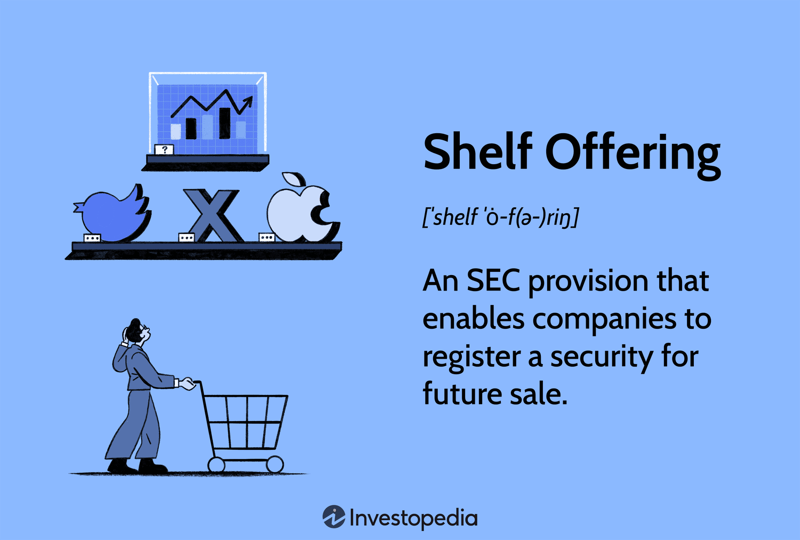

## Table of Contents

## What is a takedown procedure in the context of securities?

A takedown procedure in the context of securities refers to the process by which underwriters in a securities offering distribute the securities to the public. When a company wants to issue new stocks or bonds, it often works with investment banks or underwriters to help sell these securities. The underwriters buy the securities from the company at a discounted price and then sell them to investors at a higher price. The takedown is the difference between the price the underwriters pay to the company and the price at which they sell the securities to the public. This difference is essentially the underwriters' profit.

The takedown procedure is an important part of the underwriting process because it helps determine how much money the underwriters will make from the offering. It also affects the final price that investors pay for the securities. The underwriters need to carefully set the takedown to balance their profit with the attractiveness of the securities to potential investors. If the takedown is too high, the securities might be priced too expensively, making them less appealing to buyers. On the other hand, if the takedown is too low, the underwriters might not make enough profit to justify their efforts.

## What is a shelf offering and how does it differ from a traditional public offering?

A shelf offering is a type of public offering where a company registers securities with the Securities and Exchange Commission (SEC) but does not sell them right away. Instead, the company can sell these securities over time, whenever it needs to raise money. This is like having a shelf full of items that you can take off and use whenever you want. The main advantage of a shelf offering is flexibility. Companies can quickly respond to market conditions or their own financial needs without going through the full registration process each time.

A traditional public offering, on the other hand, involves a company selling all its registered securities at once. This process can take a long time because the company needs to prepare detailed documents and get approval from the SEC before it can sell any securities. Once approved, the company sells all the securities in one go, usually with the help of underwriters. The main difference between a shelf offering and a traditional public offering is the timing and flexibility. A shelf offering allows a company to sell securities over time, while a traditional public offering requires selling all securities at once after a lengthy preparation period.

## How does the takedown process work in a shelf offering?

In a shelf offering, the takedown process is how a company decides to sell the securities it has already registered with the SEC. Instead of selling all the securities at once like in a traditional public offering, the company can choose when and how many securities to sell over time. This is called a takedown because the company is "taking down" securities from the shelf to sell them to the public.

When a company decides to do a takedown, it works with underwriters to set the price for the securities. The underwriters buy the securities from the company at a certain price and then sell them to investors at a higher price. The difference between these two prices is the takedown, which is the profit for the underwriters. This process can happen multiple times as the company takes down more securities from the shelf whenever it needs to raise money.

## What are the key regulatory requirements for initiating a shelf offering?

To start a shelf offering, a company needs to follow certain rules set by the Securities and Exchange Commission (SEC). The main rule is that the company must file a registration statement with the SEC. This statement includes important details about the company and the securities it plans to sell. The SEC reviews this statement to make sure it has all the necessary information. Once the SEC approves the registration, the company can start selling the securities whenever it wants, but it must keep the SEC updated with any new information that could affect investors' decisions.

Another important requirement is that the company must follow specific rules about how it sells the securities. For example, the company needs to make sure that any information it gives to investors is accurate and up-to-date. It also has to follow rules about how it can advertise the securities and who it can sell them to. These rules help protect investors and make sure the market is fair. If the company doesn't follow these rules, it could face penalties from the SEC.

## What are the advantages of using a shelf offering for a company?

A shelf offering gives a company a lot of flexibility. Instead of selling all their securities at once, they can sell them little by little over time. This means they can wait for the right moment to sell, like when the market is doing well or when they need money for a new project. It's like having a savings account where you can take out money whenever you need it, but for securities.

Another big advantage is that it saves time and money. When a company does a traditional public offering, they have to go through a long process to get everything approved by the SEC. With a shelf offering, they do this once and then can sell securities whenever they want without starting the whole process over again. This makes it easier and cheaper for the company to raise money whenever they need it.

## What are the potential risks and drawbacks of shelf offerings?

One risk of shelf offerings is that the market might not be ready for the securities when the company decides to sell them. If the company waits too long to sell, the market conditions might change, and investors might not want to buy the securities at the price the company wants. This can make it hard for the company to raise the money it needs. Also, if the company sells too many securities at once, it might flood the market and cause the price to drop, which is not good for the company or its investors.

Another drawback is that shelf offerings can make it harder for investors to trust the company. Because the company can sell securities at any time, investors might worry that the company is not doing well and needs money quickly. This can make the company's stock price go down. Also, keeping the registration up to date with the SEC can be a lot of work for the company. They have to make sure all the information is correct and up to date, which can be time-consuming and costly.

## How do companies decide on the timing of takedowns in a shelf offering?

Companies decide on the timing of takedowns in a shelf offering by looking at the market and their own needs. They want to sell their securities when the market is doing well, so they can get a good price. They also think about their own financial needs, like if they need money for a new project or to pay off debts. By waiting for the right time, they can make sure they get the best deal for their securities.

Sometimes, companies also look at what other companies are doing. If a lot of companies are selling securities at the same time, it might not be a good time for them to do a takedown because it could make their securities less valuable. They also have to keep an eye on any new information that might affect how investors see their company. By carefully choosing when to do a takedown, companies can make the most out of their shelf offering.

## What role do underwriters play in the takedown process of a shelf offering?

Underwriters help a company decide when and how to sell securities in a shelf offering. They look at the market to find the best time to sell, so the company can get a good price for its securities. The underwriters also help set the price for the securities. They buy the securities from the company at one price and then sell them to investors at a higher price. The difference between these two prices is their profit, which is called the takedown.

When the company decides to do a takedown, the underwriters make sure everything goes smoothly. They handle all the paperwork and make sure the company follows all the rules set by the SEC. They also talk to investors to make sure they understand what they are buying. This helps the company sell its securities quickly and easily whenever it needs to raise money.

## How can a company optimize its shelf registration statement to facilitate smoother takedowns?

A company can optimize its shelf registration statement by making sure it includes all the important information that investors need to know. This means the statement should be clear and easy to understand, with all the details about the company and the securities it plans to sell. By keeping the information up to date and accurate, the company can build trust with investors and make it easier to sell securities whenever it needs to. The company should also make sure the statement follows all the rules set by the SEC, so there are no delays or problems when it wants to do a takedown.

Another way to optimize the shelf registration statement is to plan ahead for different scenarios. The company can include different types of securities in the statement, so it has more options when it decides to do a takedown. This flexibility can help the company respond quickly to changes in the market or its own financial needs. By working closely with underwriters and keeping the registration statement well-organized, the company can make the takedown process smoother and more efficient.

## What are the financial reporting and disclosure obligations during and after a shelf offering?

During a shelf offering, a company has to keep the SEC updated with important information. This means they need to file regular reports that tell investors how the company is doing. These reports include things like how much money the company is making, any big changes in the business, and any risks that might affect the company. The company also has to make sure that any information they give to investors is correct and up to date. If something important changes, like a new CEO or a big lawsuit, the company has to tell the SEC right away.

After a shelf offering, the company still has to keep filing these reports. This helps investors keep track of how the company is doing over time. The company needs to follow all the rules set by the SEC, which means they have to be honest and clear about everything. If they don't follow these rules, they could get in trouble with the SEC. By keeping investors informed, the company can build trust and make it easier to sell securities in the future if they need to.

## How do market conditions influence the strategy for takedowns in a shelf offering?

Market conditions play a big role in deciding when a company should do a takedown in a shelf offering. If the market is doing well and investors are feeling good about buying securities, it's a good time for the company to sell. They can get a higher price for their securities and raise more money. On the other hand, if the market is not doing well, it might be better for the company to wait. Selling securities when the market is down could mean they get a lower price, and it might be harder to find investors who want to buy.

The company also has to think about what else is happening in the market. If a lot of other companies are selling securities at the same time, it might not be a good time for them to do a takedown. Too many securities on the market can make prices go down. The company needs to watch the market closely and pick the right time to sell. By doing this, they can make sure they get the best deal for their securities and raise the money they need.

## What advanced strategies can companies employ to manage multiple takedowns effectively?

Companies can use smart planning to handle multiple takedowns in a shelf offering. They should keep a close eye on the market and pick the best times to sell their securities. This means waiting for when the market is strong and investors are ready to buy. Companies can also work with their underwriters to spread out their takedowns over time. This way, they don't flood the market with too many securities at once, which can keep the price high and make it easier to sell.

Another good strategy is to stay flexible. Companies should be ready to change their plans if the market changes. This might mean selling more securities if the market is doing really well, or holding back if things get tough. Companies can also use different types of securities in their shelf offering. By having options like stocks, bonds, or other kinds of securities, they can choose what to sell based on what investors want at the time. This helps them raise money more effectively and keep investors happy.

## References & Further Reading

[1]: Huang, R.-J., & Stoll, H. R. (1997). ["The Components of the Bid-Ask Spread: A General Approach."](https://www.jstor.org/stable/2962337) The Review of Financial Studies, 10(4), 995-1034.

[2]: ["Shelf Registration and Procedures: A Practical Guide"](https://www.jdlpa.com/blog/how-shelf-registration-works-for-issuers) by Law Insider

[3]: Kissell, R. (2013). ["The Science of Algorithmic Trading and Portfolio Management."](https://www.sciencedirect.com/book/9780124016897/the-science-of-algorithmic-trading-and-portfolio-management) Academic Press.

[4]: Securities and Exchange Commission. ["Shelf Offerings: A Quick Guide to Rule 415."](https://www.investopedia.com/terms/s/shelfoffering.asp)

[5]: Gomber, P., & Gsell, M. (2008). ["Catching up with Technology – The Impact of Regulatory Changes on ECN Trading in the U.S. Equity Markets."](https://www.jstor.org/stable/23297751) Journal of Financial Markets, 11(2), 173-198.