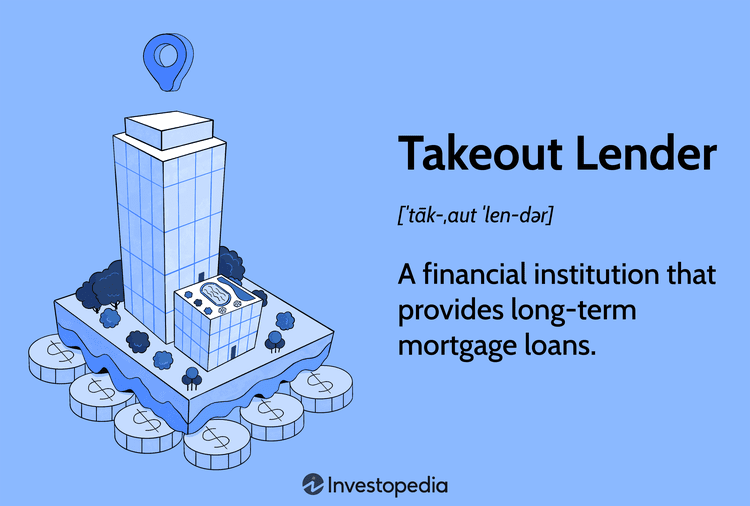

## Table of Contents

## What is a takeout lender?

A takeout lender is a bank or financial institution that provides long-term financing for a project after the initial construction phase is completed. They step in to replace the short-term construction loan, which is usually provided by a different lender. This switch from a construction loan to a permanent loan is called a "takeout."

Takeout lenders are important because they help developers and builders finish their projects without worrying about long-term financing. By promising to provide the permanent loan, takeout lenders give confidence to construction lenders, who might be hesitant to fund a project without knowing if long-term financing will be available. This arrangement helps keep construction projects moving smoothly from start to finish.

## How does a takeout lender differ from a construction lender?

A takeout lender and a construction lender have different roles in a building project. A construction lender gives a short-term loan to help pay for building the project. This loan covers costs like materials and labor while the project is being built. The construction lender wants to make sure the project gets finished on time and within budget.

On the other hand, a takeout lender steps in after the building is done. They provide a long-term loan, called a permanent loan, to replace the short-term construction loan. The takeout lender's job is to finance the project for the long haul, often for many years. This switch from a construction loan to a permanent loan helps the project owner manage their finances better over time.

## What role does a takeout lender play in real estate development?

In real estate development, a takeout lender is important because they provide the long-term money needed after a building is finished. When a developer starts a project, they usually get a short-term loan from a construction lender to pay for building the project. Once the building is done, the takeout lender steps in and gives a permanent loan to replace the short-term one. This helps the developer because they don't have to worry about finding long-term money after the building is complete.

The takeout lender's promise to provide the permanent loan also helps the construction lender feel more confident. Construction lenders might be hesitant to give money for a project if they're not sure if long-term financing will be available. By having a takeout lender ready to step in, the construction lender knows the project will have the money it needs to finish and move forward. This makes the whole process of building and financing a project smoother and less risky for everyone involved.

## What are the typical terms and conditions of a takeout loan?

A takeout loan usually has a long time to pay it back, often 10 to 30 years. The interest rate can be fixed, which means it stays the same the whole time, or it can be adjustable, which means it can go up or down. The loan amount depends on how much the finished building is worth and how much money the developer needs. The takeout lender will want to see that the building is done and meets certain standards before they give the loan.

The takeout lender will also have some rules the developer has to follow. They might need to keep the building in good shape and make sure it's being used the right way. The lender might also want to see regular reports on how the building is doing and how much money it's making. If the developer doesn't follow these rules, the lender could say the loan is due right away or take other actions.

## How does the process of securing a takeout loan work?

Securing a takeout loan starts before the building is even finished. The developer talks to a takeout lender and gets a promise that the lender will give a long-term loan once the building is done. This promise, called a takeout commitment, makes the construction lender feel better about giving a short-term loan to build the project. The takeout lender looks at the building plans, the developer's experience, and how much money they think the finished building will be worth. If everything looks good, they agree to provide the loan later.

Once the building is finished, the developer goes back to the takeout lender to get the long-term loan. The lender checks to make sure the building is done right and meets all the rules they set before. They also look at the building's value again to make sure it's worth enough to cover the loan. If everything checks out, the takeout lender gives the developer the long-term loan. This loan replaces the short-term construction loan, and the developer starts paying it back over many years.

## What are the benefits of using a takeout lender for a project?

Using a takeout lender for a project helps a lot. It gives the developer a promise that they will get long-term money after the building is done. This promise makes the construction lender feel better about giving a short-term loan to build the project. Without a takeout lender, the construction lender might be worried about whether the developer can find long-term money later. So, having a takeout lender makes it easier to start and finish the project.

Another benefit is that the takeout loan is long-term, often for 10 to 30 years. This means the developer doesn't have to worry about finding new money right after the building is done. They can focus on making the building work well and making money from it. The takeout lender also helps by setting rules that keep the building in good shape, which is good for everyone involved in the project.

## What are the risks associated with takeout lending for both the lender and the borrower?

For the takeout lender, one big risk is that the building might not be worth as much as they thought when it's finished. If the value is lower, the loan might be too big, and the lender could lose money if the developer can't pay it back. Another risk is that the developer might not follow the rules set by the lender, like keeping the building in good shape. If the developer breaks these rules, the lender might have to take the building back, which can be a lot of work and cost a lot of money.

For the borrower, the main risk is that they might not be able to get the takeout loan after the building is done. If the takeout lender decides the building isn't good enough or worth enough, the developer could be stuck with a short-term loan they can't pay back. This could mean they have to sell the building quickly or find another way to get long-term money, which can be hard and stressful. Also, if the interest rates go up on an adjustable-rate takeout loan, the developer's payments could get bigger, making it harder to pay back the loan.

## How do takeout lenders assess the viability of a project before committing to a loan?

Before a takeout lender agrees to give a long-term loan, they look at a lot of things to make sure the project will work out. They start by checking the building plans and the developer's experience. They want to know if the developer has done good projects before and if they can finish this one on time and within budget. The lender also looks at how much money they think the finished building will be worth. They might hire someone to check the plans and make sure the building will be worth enough to cover the loan.

The takeout lender also thinks about the market where the building will be. They want to know if people will want to buy or rent the building and if the area is growing. They look at things like how many similar buildings are around and how much they cost. If the market looks good, the lender feels better about giving the loan. They also set rules for the developer to follow, like keeping the building in good shape, to make sure the project stays successful over time.

## Can you explain the relationship between takeout lenders and construction loans?

Takeout lenders and construction loans work together to help build projects. A construction loan is a short-term loan that pays for building a project. It's given by a construction lender who wants to make sure the project gets finished on time and within budget. But the construction lender might be worried about what happens after the building is done. That's where the takeout lender comes in. They promise to give a long-term loan, called a takeout loan, once the building is finished. This promise makes the construction lender feel better about giving the short-term loan because they know long-term money will be there.

When the building is done, the takeout lender steps in and gives the long-term loan. This loan replaces the short-term construction loan, so the developer doesn't have to worry about finding new money right away. The takeout lender looks at the finished building to make sure it's worth enough and meets their rules before giving the loan. This helps the developer focus on making the building work well and making money from it, instead of worrying about where to get long-term money. The takeout lender and construction lender work together to make the whole process smoother and less risky for everyone involved in the project.

## What are some common challenges faced by takeout lenders in the real estate market?

One big challenge for takeout lenders is figuring out how much a building will be worth when it's done. They have to guess the value before the building is even finished, and if they guess wrong, they might give a loan that's too big. If the building ends up being worth less than they thought, the lender could lose money if the developer can't pay back the loan. Another challenge is making sure the developer follows all the rules they set, like keeping the building in good shape. If the developer doesn't follow these rules, the lender might have to take the building back, which can be a lot of work and cost a lot of money.

Another challenge is dealing with changes in the real estate market. If the market goes down after the takeout lender agrees to give the loan, the building might not be worth as much as they thought. This can make it hard for the developer to pay back the loan, and the lender might lose money. Also, if interest rates go up, the payments on an adjustable-rate loan can get bigger, making it harder for the developer to pay back the loan. Takeout lenders have to be ready for these changes and plan carefully to make sure they don't lose money.

## How have regulations and economic conditions affected the takeout lending industry?

Regulations and economic conditions have had a big impact on the takeout lending industry. After the financial crisis in 2008, new rules were made to make sure banks and lenders were safer. These rules made it harder for takeout lenders to give loans because they had to be more careful about how much risk they took. Lenders had to check projects more carefully and make sure they could handle any problems that might come up. This meant fewer loans were given out, and the ones that were given had stricter rules.

Economic conditions also affect takeout lending. When the economy is doing well, more people want to build things, and takeout lenders might give out more loans. But when the economy is not doing well, like during a recession, fewer people want to build, and takeout lenders might be more careful about giving loans. Interest rates also play a big role. If rates are low, it's easier for developers to get loans because the payments are smaller. But if rates go up, it can be harder for developers to pay back the loans, and takeout lenders might give out fewer loans or charge more interest.

## What advanced strategies can takeout lenders use to mitigate risks and maximize returns?

Takeout lenders can use a few smart strategies to lower their risks and make more money. One way is to do a lot of research before they give a loan. They can hire experts to check the building plans and the market where the building will be. This helps them guess the building's value better and make sure it will be worth enough to cover the loan. Another way is to spread out their loans across different types of buildings and different areas. If one project doesn't do well, the lender won't lose all their money because they have other projects that might do better.

Another strategy is to set clear rules for the developer to follow. These rules can include things like keeping the building in good shape and making sure it's being used the right way. If the developer follows these rules, the building is more likely to stay valuable, and the lender is less likely to lose money. Takeout lenders can also use adjustable interest rates on their loans. This means they can charge more interest if the economy changes and rates go up. This helps them make more money and cover any extra risks that come up.

## References & Further Reading

[1]: Geltner, D., Miller, N., Clayton, J., & Eichholtz, P. (2013). ["Commercial Real Estate Analysis and Investments"](https://www.researchgate.net/publication/245702364_Commercial_Real_Estate_Analysis_and_Investments). Cengage Learning.

[2]: Lopez de Prado, M. (2018). ["Advances in Financial Machine Learning"](https://www.amazon.com/Advances-Financial-Machine-Learning-Marcos/dp/1119482089). Wiley.

[3]: Chan, E. P. (2009). ["Quantitative Trading: How to Build Your Own Algorithmic Trading Business"](https://github.com/ftvision/quant_trading_echan_book). Wiley.

[4]: Fabozzi, F. J., Shiller, R., & Tunaru, R. (2012). ["Regime-Switching: Interest Rates and Algorithmic Trading"](https://www.semanticscholar.org/paper/Evolution-of-Real-Estate-Derivatives-and-Their-Fabozzi-Shiller/4dc6e515d60a95947ddb48060295b3fd7e12cbf2). Journal of Financial Transformation.

[5]: Aronson, D. R. (2007). ["Evidence-Based Technical Analysis: Applying the Scientific Method and Statistical Inference to Trading Signals"](https://onlinelibrary.wiley.com/doi/book/10.1002/9781118268315). Wiley.

[6]: Jansen, S. (2020). ["Machine Learning for Algorithmic Trading: Predictive Models to Extract Signals from Market and Alternative Data for Systematic Trading Strategies with Python"](https://github.com/stefan-jansen/machine-learning-for-trading). Packt Publishing.