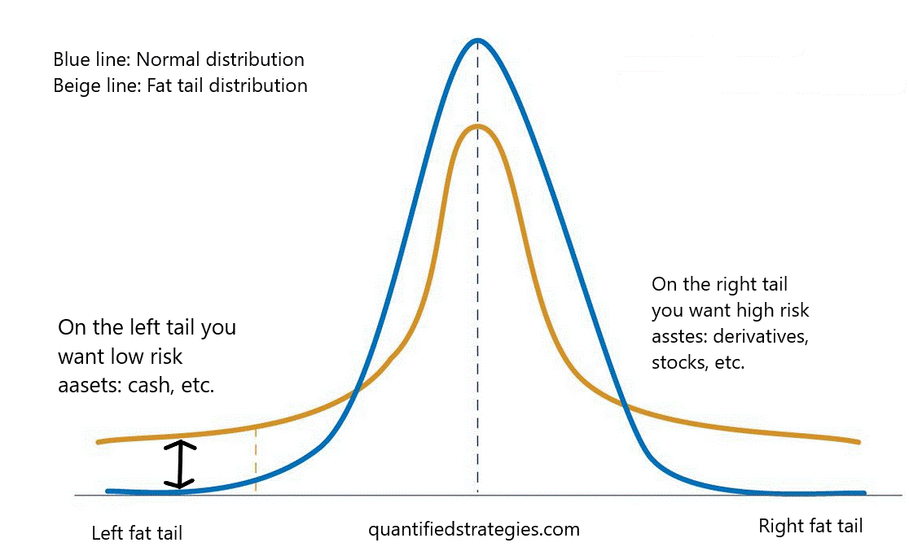

Algorithmic trading has transformed financial markets, relying heavily on mathematical models and vast datasets to make rapid trading decisions. In this landscape, the views of Nassim Nicholas Taleb often elicit both intrigue and skepticism. Taleb, known for his criticism of overreliance on predictive models, argues that these tools are often blind to rare and impactful events, termed "Black Swans." He believes that markets are complex and unpredictable, challenging the belief that past data can always predict future trends.

Taleb’s ideas are not just theoretical musings; they have practical implications for trading strategies, particularly when it comes to risk management and decision-making under uncertainty. This article examines the influence of Taleb's philosophies on the field of algorithmic trading and assesses his contributions to developing robust trading strategies. His approach opposes the conventional trading mindset, stressing the importance of preparing for rare and unpredictable events, which can have substantial impacts on financial markets.

For traders seeking robust strategies, understanding and potentially integrating Taleb’s concepts into algorithmic trading could provide a framework to better manage risk and reward. By evaluating the practicality of his strategies, such as the Barbell Strategy, traders can potentially fortify their systems against unforeseen market anomalies. Through this exploration, we aim to highlight how Taleb’s work continues to provoke debate and inspire new methodologies among algorithmic traders.

## Table of Contents

## Understanding Nassim Nicholas Taleb

Nassim Nicholas Taleb is a prominent figure in the exploration of uncertainty and randomness within financial markets. His seminal work, "The Black Swan: The Impact of the Highly Improbable," published in 2007, introduced the world to the concept of Black Swan events—extremely rare, unexpected events that can have profound consequences. These events, due to their unpredictability, challenge conventional market prediction models, which often rely on the assumption that the future will resemble the past.

Taleb argues that predictive models falter primarily because they are not equipped to accommodate the occurrence of these rare events. Instead, they tend to focus on regular, expected outcomes, creating a false sense of security among investors and market analysts. His perspective critiques the over-reliance on mathematical models that fail to consider the full spectrum of possible outcomes, particularly those that lie at the tails of probability distributions.

Central to Taleb's philosophy is the acceptance and integration of uncertainty and [volatility](/wiki/volatility-trading-strategies) in financial strategies. He advocates for the acknowledgment of our limited ability to predict future events, suggesting that strategies should be robust enough to handle unexpected disruptions. By emphasizing the unpredictability inherent in financial markets, Taleb's ideas encourage a reevaluation of risk management practices.

Taleb's broader philosophical views extend beyond finance, touching upon themes in epistemology and probability. He urges individuals and organizations to adopt a more skeptical approach to knowledge and forecasts, given the inherent limitations in observing and interpreting data. This outlook challenges the traditional belief in the predictability of systems, promoting a mindset prepared for surprise and adaptation.

Understanding Taleb's foundational ideas is essential for applying his principles to trading and risk management. His caution against overconfidence in prediction tools serves as a reminder of the complexities and uncertainties present in global markets, where rare events can redefine the landscape in unexpected ways.

## The Barbell Strategy Explained

The Barbell Strategy is central to Nassim Nicholas Taleb's trading philosophy, reflecting his views on risk management and potential gain optimization. This strategy advocates investing 80-90% of one's assets in low-risk investments, such as government bonds. These investments serve as a protective buffer, offering stability and reducing exposure to market volatility. The primary goal is to preserve capital and maintain [liquidity](/wiki/liquidity-risk-premium) in most market scenarios.

The remaining 10-20% of the portfolio is allocated to high-risk, high-reward assets. These unconventional investments are chosen for their potential to yield significant returns during rare, unpredictable market events, often termed as "black swan" events. Taleb suggests that this dual-focus investment strategy can counter traditional financial models, which tend to underestimate the frequency and impact of such anomalous occurrences. By recognizing that these extreme events are not only possible but inevitable over time, the Barbell Strategy aims to position investors to capitalize on them.

Implementing this strategy effectively requires discernment in selecting both secure and speculative investments. Low-risk components should prioritize stability and liquidity, often in the form of short-term government securities or index funds. For the speculative portion, investors might consider options like venture capital, startups, or technology stocks that could thrive in volatile conditions.

For successful application, a comprehensive understanding of market dynamics and a keen eye for identifying asymmetric payoffs are essential. The Barbell Strategy is not merely about maintaining a 90-10 split but involves ongoing evaluation and adjustment of investment choices as market conditions evolve. This strategic allocation seeks to balance safety with opportunity, ensuring that potential gains from black swan events do not come at the cost of substantial losses in more stable periods.

## Incorporating Taleb's Strategy in Algorithmic Trading

Algorithmic trading can effectively integrate Nassim Nicholas Taleb's principles by focusing on developing models that account for extreme events, a core aspect of his philosophy. The concept of robust trading systems hinges on embracing uncertainty and preparing for rare, impactful events—often referred to as "black swan" occurrences.

A key aspect of applying Taleb's Barbell Strategy to [algorithmic trading](/wiki/algorithmic-trading) involves using algorithms to identify high-risk assets that hold substantial upside potential. In practice, this means programming algorithms to sift through vast datasets to pinpoint assets that have either extreme risk or potential for unexpected high returns. By doing so, traders can allocate a small portion of their investments to these identified opportunities, reserving the majority for safer, low-risk investments, consistent with the Barbell Strategy.

Risk management is another vital component when incorporating Taleb's strategy. Risk management algorithms can be employed to maintain a balance between safety and potential returns. These algorithms could utilize techniques such as Value at Risk (VaR) and Conditional Value at Risk (CVaR) to assess the potential downside of investments, ensuring that even in volatile markets, the core of the portfolio remains secure. The equation for CVaR, which is often more sensitive to the shape of the loss distribution beyond the VaR threshold, can be instrumental:

$$
\text{CVaR}_\alpha = \frac{1}{1-\alpha} \int_\alpha^1 \text{VaR}_\beta \, d\beta
$$

Automation plays a crucial role in enhancing the execution of Taleb’s strategy by enabling rapid responses to market shifts. Automated systems can execute trades, recalibrate the portfolio, and adjust strategies instantly as new data comes to light. This quick adaptation is critical in navigating markets characterized by sudden and significant changes, a hallmark of Taleb's teachings on risk.

Exploratory data analysis (EDA) is indispensable for continually refining the selection of risky assets within an algorithmic framework. Through EDA, traders and data scientists can investigate datasets to unveil patterns, anomalies, and correlations. This process can be greatly facilitated using programming languages like Python. Libraries such as Pandas and Matplotlib can be utilized to visualize and analyze market data, thus improving the decision-making process regarding which high-risk assets to incorporate into a portfolio.

The synthesis of Taleb’s ideas into algorithmic trading not only prepares traders for the unexpected but also provides a resilient framework that can potentially yield substantial rewards despite market volatility.

## Navigating Challenges and Criticisms

One of the primary criticisms of Nassim Nicholas Taleb's approach, particularly the Barbell Strategy, is its perceived impracticality for implementation by all investors. The strategy demands a significant portion of capital to be allocated to low-risk assets, often limiting liquidity for many individual or small-scale investors. As a result, the high-risk, high-reward segment might be too small to generate meaningful returns, particularly for those with limited capital.

Accurately identifying viable high-risk opportunities in volatile markets presents another significant challenge. Markets are inherently unpredictable, and high-risk investments come with elevated chances of loss. The success of the Barbell Strategy relies heavily on the correct identification of asymmetric bets—those with limited downside but substantial upside potential. However, separating genuinely high-reward assets from mere speculative bets requires sophisticated analysis and experience. 

For algorithmic traders, faithfully incorporating Taleb's philosophy necessitates rigorous back-testing of strategies to prevent unforeseen negative consequences. Back-testing involves applying trading strategies to historical data to evaluate their performance, ensuring that the algorithms are robust and can adapt to various market conditions. This process requires access to comprehensive market data, sophisticated analytical tools, and expertise in computational finance.

Critics of Taleb's approach often argue about the feasibility of predicting Black Swan events—rare and unpredictable occurrences with severe consequences. They emphasize that the very nature of these events is that they lie outside the realm of standard predictive models, challenging the capacity of any algorithm to anticipate them accurately. This criticism underscores the importance of a robust algorithm design that considers not only risk and reward but also the unpredictable nature of such events.

Thus, understanding and navigating these challenges is crucial for effectively integrating Taleb's insights into algorithmic trading. Traders who seek to align with Taleb's principles must prioritize risk management, remain vigilant of the limits of predictive analytics, and continually refine their algorithms to adapt to an ever-changing financial landscape.

## Conclusion

Nassim Taleb's contributions to trading strategies have left a lasting impression on the domain of algorithmic trading. His Barbell Strategy stands out for its ability to balance risk and reward amidst unpredictability in financial markets. By allocating a significant portion of a portfolio to low-risk investments while reserving a smaller percentage for high-risk, high-reward assets, the strategy offers a protective yet opportunistic approach in volatile environments. This framework not only appeals to traders looking to safeguard their investments but also to those eager to capitalize on unforeseen market anomalies.

Algorithmic trading systems possess the capability to seamlessly integrate Taleb's principles, thereby enhancing their robustness and adaptability. Through the use of algorithms designed to identify and respond to extreme events, traders can automate the execution of the Barbell Strategy. These algorithms can leverage [machine learning](/wiki/machine-learning) and big data analysis to refine the search for viable high-risk opportunities, thereby aligning with Taleb's emphasis on preparedness for black swan events.

Though challenges in implementing Taleb’s strategy exist, namely the identification of suitable high-risk investments and the inherent unpredictability of rare events, the potential benefits remain significant. Algorithmic traders must be diligent in their design and testing processes to ensure that strategies are both resilient and effective. Properly executed, the Barbell Strategy can serve as a compelling tool for mitigating risk while enabling the pursuit of outsized gains when rare opportunities arise.

Embracing Taleb's insights allows traders to build strategies that not only withstand but also thrive amid market chaos. By preparing for the unexpected, they position themselves to benefit from market anomalies that others may overlook. As such, Taleb's ideas continue to spark discussions on risk management and profitability within the algorithmic trading community, advocating a mindset shift necessary for navigating today's complex financial landscapes.

## References & Further Reading

[1]: Taleb, N. N. (2007). ["The Black Swan: The Impact of the Highly Improbable"](https://www.jstor.org/stable/23045073) Random House.

[2]: Taleb, N. N. (2012). ["Antifragile: Things That Gain from Disorder"](https://www.amazon.com/Antifragile-Things-That-Disorder-Incerto/dp/0812979680) Random House.

[3]: Taleb, N. N. (2010). ["The Bed of Procrustes: Philosophical and Practical Aphorisms"](https://www.amazon.com/Bed-Procrustes-Philosophical-Practical-Aphorisms/dp/0812982401) Random House.

[4]: Lopez de Prado, M. (2018). ["Advances in Financial Machine Learning"](https://books.google.com/books/about/Advances_in_Financial_Machine_Learning.html?id=oU9KDwAAQBAJ) Wiley.

[5]: Aronson, D. (2006). ["Evidence-Based Technical Analysis: Applying the Scientific Method and Statistical Inference to Trading Signals"](https://www.amazon.com/Evidence-Based-Technical-Analysis-Scientific-Statistical/dp/0470008741) Wiley.

[6]: Jansen, S. (2020). ["Machine Learning for Algorithmic Trading, 2nd Edition"](https://github.com/stefan-jansen/machine-learning-for-trading) Packt Publishing.