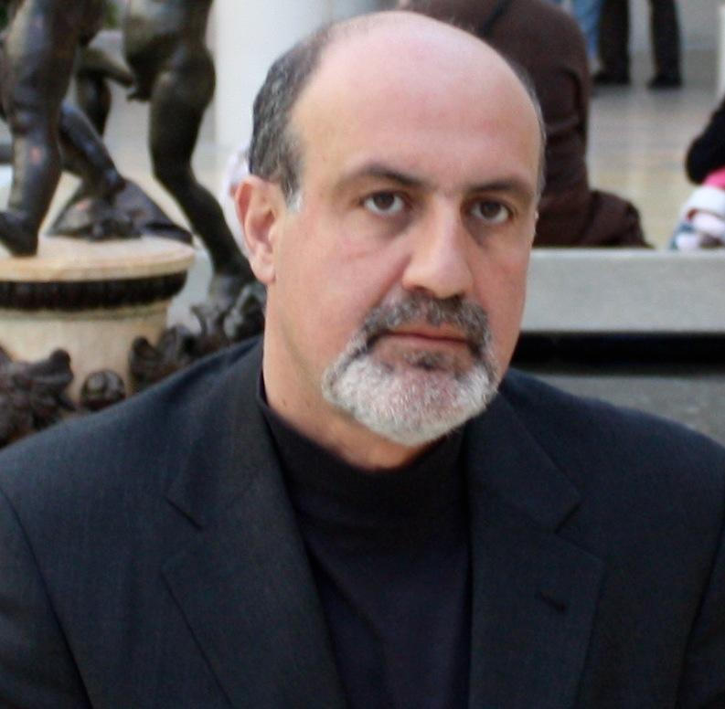

## Table of Contents

## Who is Nassim Taleb?

Nassim Taleb is a thinker and writer who likes to talk about how the world works, especially when things go wrong in big ways. He was born in Lebanon and has worked in many places, like New York and London. He used to work in the finance world, but now he spends his time writing books and teaching at universities. His most famous book is called "The Black Swan," where he explains that some big events, like big crashes in the stock market, are very hard to predict and can change everything.

In his books, Taleb talks about how we should be ready for surprises and not just plan for what we think will happen. He says that small, everyday events can lead to big changes, and we should pay attention to them. He also believes that we should be careful about trusting experts too much because they can be wrong about big events. Taleb's ideas have made a lot of people think differently about risk and how to handle it in their lives and work.

## What are some key books written by Nassim Taleb?

Nassim Taleb has written several important books that many people find interesting. One of his most famous books is "The Black Swan." In this book, Taleb talks about big events that are hard to predict, like a huge stock market crash. He says these events can change the world a lot, and we should be ready for them even if we can't see them coming. Another book he wrote is called "Antifragile." In this one, Taleb explains that some things get stronger when they face problems or changes. He says we should try to be like that, so we can handle surprises better.

Another book by Taleb is "Fooled by Randomness." In this book, he talks about how people often think they understand why things happen, but really, a lot of what happens is just luck or chance. He says we need to be careful about thinking we know more than we do. Taleb also wrote "The Bed of Procrustes," which is a collection of short sayings and thoughts about life. It's different from his other [books](/wiki/algo-trading-books) because it's more about quick ideas to think about. All these books help people understand the world better and think about how to deal with uncertainty and surprises.

## What is the main theme of Nassim Taleb's work?

The main theme of Nassim Taleb's work is about dealing with uncertainty and surprises in life. He talks a lot about how some big events, like a huge stock market crash, are very hard to predict but can change everything. Taleb calls these events "Black Swans." He says we should always be ready for these surprises, even if we can't see them coming. Instead of trying to predict everything, he thinks we should focus on being able to handle whatever comes our way.

Another big idea in Taleb's work is about being "antifragile." This means that some things, or even people, can get stronger when they face problems or changes. Taleb says we should try to be like that. Instead of just trying to avoid bad things, we should learn from them and use them to get better. He also warns us about trusting experts too much because they can be wrong about big events. Taleb's ideas help us think differently about risk and how to handle it in our lives and work.

## What is the concept of 'Black Swan' events according to Taleb?

Nassim Taleb talks about 'Black Swan' events in his book "The Black Swan." He says these are big events that are very hard to predict and can change the world a lot. Before these events happen, people usually think they are not possible or very unlikely. But when they do happen, they have a huge impact. For example, a big stock market crash or a global health crisis like a pandemic can be Black Swan events.

Taleb explains that we should be ready for these surprises even if we can't see them coming. He thinks it's a mistake to focus too much on predicting everything because we can't really know what will happen. Instead, we should focus on being able to handle whatever comes our way. By understanding Black Swan events, we can be better prepared for big changes and surprises in life.

## How does Taleb define 'Antifragility'?

Nassim Taleb talks about 'antifragility' in his book "Antifragile." He says that some things get stronger when they face problems or changes. This is different from things that are just strong or tough. Something that is antifragile doesn't just survive hard times; it actually gets better because of them. Taleb gives examples like our bodies getting stronger with exercise or businesses growing after facing challenges.

Taleb believes that we should try to be antifragile in our lives. Instead of just trying to avoid bad things, we should learn from them and use them to get better. He says that if we can handle surprises and changes well, we can do better in the long run. By being antifragile, we can turn problems into opportunities and grow stronger over time.

## What is Taleb's background and how did it influence his theories?

Nassim Taleb was born in Lebanon and grew up in a time when the country was going through a lot of changes and surprises. He studied in the United States and later worked in the finance world in places like New York and London. His job was to help people make money by trading things like stocks and bonds. But he saw a lot of big events that nobody expected, like big crashes in the stock market. These experiences made him think a lot about how we can't always predict what will happen and how we should be ready for surprises.

Because of what he saw in his job, Taleb started writing books about these ideas. He used his background in finance to explain big concepts like 'Black Swan' events and 'antifragility.' His time in Lebanon and the finance world taught him that small, everyday events can lead to big changes, and we should pay attention to them. He also learned that experts can be wrong about big events, so we shouldn't trust them too much. All of these experiences shaped his ideas about how we should handle uncertainty and surprises in our lives.

## How does Taleb critique traditional economic and risk management models?

Nassim Taleb thinks that traditional economic and risk management models are not very good at predicting big surprises. He says these models try to guess what will happen based on what happened before, but they miss the big events that nobody expects. Taleb calls these big surprises "Black Swan" events. He believes that these models make people think they can predict everything, but really, they can't. This can lead to big problems because people are not ready for the surprises that do happen.

Taleb also says that traditional models focus too much on avoiding risks instead of learning from them. He thinks we should try to be "antifragile," which means getting stronger from facing problems. Traditional models don't think about this. They just try to keep things the same and avoid trouble. But Taleb says this is not the best way to handle the world because surprises will always happen. Instead, we should learn from these surprises and use them to get better.

## What are some practical applications of Taleb's theories in finance and business?

Nassim Taleb's ideas have practical uses in finance and business. In finance, people can use his ideas about Black Swan events to be more careful with their money. Instead of just trying to predict the stock market, they can keep some money in safe places, like savings accounts. This way, if a big surprise happens, like a market crash, they won't lose everything. Taleb also says that instead of just trying to avoid risks, people should learn from them. So, if a business faces a problem, it can use that experience to get better and be ready for the next challenge.

In business, Taleb's idea of being antifragile can help companies grow stronger. When a business faces a tough time, like a new competitor or a change in the market, it can learn from that experience. Instead of just trying to get back to how things were before, the business can change and improve. This way, it becomes stronger and better at handling surprises. Taleb's ideas remind businesses to not just focus on avoiding problems but to use them as chances to get better and grow.

## How has Taleb's work been received in academic and professional circles?

Nassim Taleb's work has made a big impact in both academic and professional circles. Many people in universities and businesses find his ideas about Black Swan events and antifragility very interesting. They like how he talks about the limits of predicting the future and the importance of being ready for surprises. His books, like "The Black Swan" and "Antifragile," have been read by a lot of people in finance and other fields. They use his ideas to think about risk in new ways and to plan for unexpected events.

Some people in academia and the finance world have criticized Taleb's work, though. They say his ideas can be hard to test and prove with numbers. Some think he focuses too much on big surprises and not enough on everyday events. But even with these criticisms, many professionals and academics agree that Taleb's work has changed how they think about risk and uncertainty. His ideas have started important conversations and made people more aware of the need to be ready for the unexpected.

## What are some criticisms of Taleb's theories?

Some people think Nassim Taleb's ideas are hard to prove with numbers. They say it's tough to test if his ideas about Black Swan events and antifragility really work. Critics argue that Taleb focuses too much on big surprises and not enough on everyday events. They also think he can be too harsh on experts and traditional models, saying that these models are not as bad as he makes them out to be.

Others believe that Taleb's writing style can be hard to follow. He sometimes uses a lot of big words and long explanations, which can make it tough for some people to understand his main points. Even with these criticisms, many people still find his ideas useful and interesting. They appreciate how he makes people think differently about risk and surprises, even if they don't agree with everything he says.

## How does Taleb's philosophy extend beyond economics into other areas of life?

Nassim Taleb's ideas are not just about money and business. He thinks his ideas can help in all parts of life. He talks about how we should be ready for surprises in everything we do. For example, in our personal lives, we can use his idea of being antifragile. This means that when we face problems, like losing a job or dealing with a health issue, we can learn from these experiences and become stronger. Instead of just trying to avoid bad things, we should see them as chances to grow and improve.

Taleb also believes that we should not trust experts too much in any area of life. He says that even in fields like medicine or politics, big surprises can happen that nobody expects. So, we should always be ready to change our plans and learn from new events. His ideas remind us to be flexible and open to new experiences. By thinking this way, we can handle the ups and downs of life better and turn challenges into opportunities for growth.

## What are the latest developments or projects Nassim Taleb is involved in?

Nassim Taleb is still very active in sharing his ideas with the world. He often writes on social media and in different publications about his latest thoughts on risk, uncertainty, and how to handle surprises. Taleb has been working on new projects that build on his ideas about antifragility and Black Swan events. He talks a lot about how these ideas can help us in today's world, especially with all the changes and surprises we face.

One of the big things Taleb has been doing is working with other thinkers and writers to explore new ideas. He likes to discuss how his theories can apply to things like technology, health, and even how we live our daily lives. Taleb also keeps teaching and talking at universities and conferences. He wants to help more people understand and use his ideas to be ready for the unexpected and to grow stronger from challenges.

## How can Taleb's Strategy be Incorporated in Algorithmic Trading?

Algorithmic trading can effectively integrate Nassim Nicholas Taleb's principles by focusing on developing models that account for extreme events, a core aspect of his philosophy. The concept of robust trading systems hinges on embracing uncertainty and preparing for rare, impactful events—often referred to as "black swan" occurrences.

A key aspect of applying Taleb's Barbell Strategy to [algorithmic trading](/wiki/algorithmic-trading) involves using algorithms to identify high-risk assets that hold substantial upside potential. In practice, this means programming algorithms to sift through vast datasets to pinpoint assets that have either extreme risk or potential for unexpected high returns. By doing so, traders can allocate a small portion of their investments to these identified opportunities, reserving the majority for safer, low-risk investments, consistent with the Barbell Strategy.

Risk management is another vital component when incorporating Taleb's strategy. Risk management algorithms can be employed to maintain a balance between safety and potential returns. These algorithms could utilize techniques such as Value at Risk (VaR) and Conditional Value at Risk (CVaR) to assess the potential downside of investments, ensuring that even in volatile markets, the core of the portfolio remains secure. The equation for CVaR, which is often more sensitive to the shape of the loss distribution beyond the VaR threshold, can be instrumental:

$$
\text{CVaR}_\alpha = \frac{1}{1-\alpha} \int_\alpha^1 \text{VaR}_\beta \, d\beta
$$

Automation plays a crucial role in enhancing the execution of Taleb’s strategy by enabling rapid responses to market shifts. Automated systems can execute trades, recalibrate the portfolio, and adjust strategies instantly as new data comes to light. This quick adaptation is critical in navigating markets characterized by sudden and significant changes, a hallmark of Taleb's teachings on risk.

Exploratory data analysis (EDA) is indispensable for continually refining the selection of risky assets within an algorithmic framework. Through EDA, traders and data scientists can investigate datasets to unveil patterns, anomalies, and correlations. This process can be greatly facilitated using programming languages like Python. Libraries such as Pandas and Matplotlib can be utilized to visualize and analyze market data, thus improving the decision-making process regarding which high-risk assets to incorporate into a portfolio.

The synthesis of Taleb’s ideas into algorithmic trading not only prepares traders for the unexpected but also provides a resilient framework that can potentially yield substantial rewards despite market [volatility](/wiki/volatility-trading-strategies).

## References & Further Reading

[1]: Taleb, N. N. (2007). ["The Black Swan: The Impact of the Highly Improbable"](https://www.jstor.org/stable/23045073) Random House.

[2]: Taleb, N. N. (2012). ["Antifragile: Things That Gain from Disorder"](https://www.amazon.com/Antifragile-Things-That-Disorder-Incerto/dp/0812979680) Random House.

[3]: Taleb, N. N. (2010). ["The Bed of Procrustes: Philosophical and Practical Aphorisms"](https://www.amazon.com/Bed-Procrustes-Philosophical-Practical-Aphorisms/dp/0812982401) Random House.

[4]: Lopez de Prado, M. (2018). ["Advances in Financial Machine Learning"](https://books.google.com/books/about/Advances_in_Financial_Machine_Learning.html?id=oU9KDwAAQBAJ) Wiley.

[5]: Aronson, D. (2006). ["Evidence-Based Technical Analysis: Applying the Scientific Method and Statistical Inference to Trading Signals"](https://www.amazon.com/Evidence-Based-Technical-Analysis-Scientific-Statistical/dp/0470008741) Wiley.

[6]: Jansen, S. (2020). ["Machine Learning for Algorithmic Trading, 2nd Edition"](https://github.com/stefan-jansen/machine-learning-for-trading) Packt Publishing.