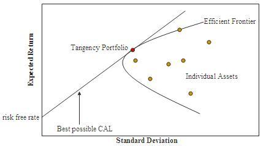

## Table of Contents

## What is a tangent portfolio?

A tangent portfolio, also known as a tangency portfolio, is a special type of investment portfolio that offers the highest possible return for a given level of risk. It is called "tangent" because it touches the edge of the efficient frontier, a curve that shows all the possible combinations of risk and return for a set of investments. By finding this portfolio, investors can maximize their returns without taking on more risk than they are comfortable with.

To find a tangent portfolio, investors often use a risk-free asset, like a government bond, along with a mix of risky assets, like stocks. The idea is to combine these assets in such a way that the portfolio's overall risk is minimized while its return is maximized. This is done by calculating the weights of each asset in the portfolio so that the portfolio's risk and return are optimized. The tangent portfolio is important because it helps investors make smart choices about where to put their money, balancing the trade-off between risk and reward.

## How does the tangent portfolio relate to the efficient frontier?

The tangent portfolio is very special because it touches the efficient frontier at just one point. The efficient frontier is like a line that shows all the best ways to mix different investments to get the most return for the least amount of risk. When you draw a line from a risk-free investment, like a government bond, to the efficient frontier, the point where this line touches the curve is the tangent portfolio. This point is the best mix of investments because it gives you the highest return for the amount of risk you are willing to take.

Think of the efficient frontier as a curve that shows all the possible ways to combine risky investments. The tangent portfolio is the spot on this curve where adding a risk-free asset makes the whole portfolio as good as it can be. It's like finding the perfect balance. By choosing the tangent portfolio, you are [picking](/wiki/asset-class-picking) the best way to mix your investments so that you get the most reward without taking on too much risk.

## What is the significance of the tangent portfolio in modern portfolio theory?

In modern portfolio theory, the tangent portfolio plays a key role in helping investors make smart choices about their investments. This theory is all about finding the best way to mix different investments to get the most return for the least amount of risk. The tangent portfolio is important because it shows the best mix of risky investments and a risk-free asset, like a government bond. By finding this mix, investors can create a portfolio that gives them the highest return without taking on more risk than they want to.

The tangent portfolio is where the line from the risk-free asset touches the efficient frontier, which is a curve showing all the best possible combinations of risk and return. This point is special because it's the perfect balance. It means that if you add a little more of the risk-free asset to your mix of risky investments, you can get a better return for the same amount of risk. This makes the tangent portfolio a powerful tool for investors who want to make the most of their money while keeping their risk under control.

## How is the tangent portfolio calculated?

To find the tangent portfolio, you need to mix a risk-free asset, like a government bond, with a bunch of risky assets, like stocks. You start by figuring out how much of each asset you should put in your portfolio. This means finding the right weights for each asset so that your portfolio has the best balance of risk and return. You do this by using math to calculate the expected return and the risk, which is measured by something called standard deviation, for each asset. Then, you look at how these assets move together, which is called their covariance. By putting all this information together, you can figure out the weights that will make your portfolio touch the efficient frontier at just the right spot.

Once you have the weights for each asset, you can see where your portfolio lands on the efficient frontier. This spot is where a line from the risk-free asset touches the curve of the efficient frontier. This point is special because it shows the best mix of the risk-free asset and the risky assets. It gives you the highest return for the amount of risk you are willing to take. By using these weights, you can create a portfolio that is as good as it can be, balancing the trade-off between risk and reward.

## What are the key components needed to construct a tangent portfolio?

To build a tangent portfolio, you need a few key things. First, you need a risk-free asset, like a government bond, which gives you a safe place to put some of your money. Second, you need a bunch of risky assets, like stocks, which can give you higher returns but also come with more risk. You also need to know the expected return for each of these assets. This is like guessing how much money each asset will make over time. Another important thing is the risk, which we measure with something called standard deviation. This tells you how much the returns of each asset might go up and down.

The next thing you need is to understand how these assets move together, which we call covariance. This helps you see if the assets go up and down at the same time or if they move in opposite ways. With all this information, you can use math to figure out the right weights for each asset in your portfolio. These weights tell you how much of each asset to put in your mix. Once you have the weights, you can see where your portfolio lands on the efficient frontier, which is a curve that shows the best possible combinations of risk and return. The spot where your portfolio touches this curve is the tangent portfolio, and it's the best mix of the risk-free asset and the risky assets to get the highest return for the amount of risk you're willing to take.

## Can you explain the role of the risk-free rate in determining the tangent portfolio?

The risk-free rate is super important when you're trying to find the tangent portfolio. It's like the starting point for your whole investment plan. The risk-free rate is the return you get from an investment that's totally safe, like a government bond. When you're figuring out the best way to mix your investments, you start by drawing a line from this risk-free rate to the efficient frontier. The efficient frontier is a curve that shows all the best ways to mix risky investments to get the most return for the least risk. The point where your line touches this curve is the tangent portfolio, and it's the best mix of the safe and risky investments.

The risk-free rate helps you see how much better your risky investments can do compared to just keeping your money safe. If the risk-free rate is high, it might be harder for your risky investments to beat it, so you might put more money in the safe investment. But if the risk-free rate is low, your risky investments have a better chance to do well, so you might put more money in them. By changing how much you put in the risk-free asset and the risky assets, you can find the perfect balance that gives you the highest return for the risk you're willing to take. That's why the risk-free rate is a big deal when you're trying to find the tangent portfolio.

## How does the tangent portfolio optimize the risk-return tradeoff?

The tangent portfolio helps you find the best way to balance the risk and reward of your investments. It does this by mixing a safe investment, like a government bond, with riskier investments, like stocks. The goal is to find the perfect mix that gives you the highest return without taking on too much risk. This perfect mix is where a line from the safe investment touches the efficient frontier, which is a curve showing all the best ways to combine risky investments. By finding this spot, you can make sure your portfolio is as good as it can be.

When you use the tangent portfolio, you're making smart choices about where to put your money. It shows you how to add a little bit of the safe investment to your mix of risky investments to get the best results. This way, you can get a higher return without adding more risk than you want. The tangent portfolio is like a guide that helps you find the right balance, so you can feel confident that you're making the most of your money while keeping your risk under control.

## What are the practical applications of the tangent portfolio in investment management?

In investment management, the tangent portfolio is a helpful tool for creating a mix of investments that give the best return for the amount of risk you are willing to take. By using the tangent portfolio, investors can figure out how much to put into safe investments, like government bonds, and how much to put into riskier investments, like stocks. This helps them make smart choices about where to put their money. For example, if someone wants to keep their money safe but still wants to grow it a bit, they can use the tangent portfolio to find the right balance. This way, they can feel confident that they are making the most of their money without taking on too much risk.

Another practical use of the tangent portfolio is in building diversified investment portfolios. By finding the tangent portfolio, investors can see how different investments work together to reduce risk and increase returns. This is important because it helps them spread their money across different types of investments, which can protect them from big losses if one investment does poorly. For example, a financial advisor might use the tangent portfolio to help a client build a retirement fund that grows over time while keeping the risk low. This way, the client can enjoy a comfortable retirement without worrying too much about their investments.

## How does the tangent portfolio differ from other portfolio optimization strategies?

The tangent portfolio is different from other portfolio optimization strategies because it focuses on finding the best mix of a risk-free asset and risky assets. It does this by touching the efficient frontier at one point, which is the spot that gives you the highest return for the amount of risk you're willing to take. Other strategies might look at different ways to mix investments, like trying to minimize risk or maximize return without using a risk-free asset. The tangent portfolio is special because it uses the risk-free rate as a starting point and then finds the perfect balance with risky investments.

For example, another common strategy is called the minimum variance portfolio, which aims to reduce risk as much as possible without worrying too much about return. This is different from the tangent portfolio, which always tries to get the best return for the risk you take. Another strategy is the maximum return portfolio, which focuses on getting the highest return no matter the risk. The tangent portfolio, on the other hand, always keeps risk in mind and tries to find the best mix of safe and risky investments. By using the tangent portfolio, investors can feel confident that they're making smart choices about where to put their money, balancing the trade-off between risk and reward in a way that other strategies might not.

## What are the limitations and criticisms of using the tangent portfolio?

One big problem with the tangent portfolio is that it depends a lot on guessing the future. You need to know the expected returns, risks, and how different investments move together. But these things are hard to predict and can change a lot. If your guesses are wrong, your tangent portfolio might not work as well as you hoped. Also, the tangent portfolio assumes you can always buy and sell investments easily without affecting their prices. But in real life, this isn't always true, especially if you're dealing with big amounts of money.

Another criticism is that the tangent portfolio might not be the best choice for everyone. It's based on the idea that all investors care about is getting the highest return for the least risk. But some people might have other things they care about, like not wanting to invest in certain companies for ethical reasons. Also, the tangent portfolio can be hard to use in real life because it needs a lot of math and data. Not everyone has the time or the skills to do all this work, so they might need to hire someone to help them, which can be expensive.

## How can changes in market conditions affect the composition of the tangent portfolio?

Changes in market conditions can really shake up the composition of the tangent portfolio. When things like interest rates, inflation, or how well different investments are doing change, it can mess with the expected returns and risks of the investments in your portfolio. For example, if interest rates go up, the return on safe investments like government bonds might go up too. This could mean you need to put more money into these safe investments to keep your portfolio on the efficient frontier. On the other hand, if the stock market is doing really well, you might want to put more money into stocks to get a higher return, even if it means taking on more risk.

Keeping your tangent portfolio in line with these changes can be a lot of work. You have to keep an eye on the market and update your guesses about how different investments will do. If you don't, your portfolio might not be as good as it could be. It's like trying to hit a moving target. You need to be ready to change the mix of your investments to make sure you're still getting the best return for the risk you're taking. This can be hard to do, especially if you don't have a lot of time or if you're not good with numbers and data.

## What advanced techniques can be used to refine the construction of the tangent portfolio?

To make the tangent portfolio even better, you can use some fancy math and computer tricks. One way is to use something called "Monte Carlo simulations." This is where you run a bunch of pretend scenarios to see how your investments might do in the future. By doing this many times, you can get a better idea of the risks and returns, which helps you find the best mix of investments. Another cool trick is to use "[machine learning](/wiki/machine-learning)" to look at a lot of data and find patterns that might help you predict how investments will do. This can make your guesses about the future more accurate, so your tangent portfolio can be more spot-on.

Another advanced way to refine the tangent portfolio is to use "robust optimization." This method helps you make a portfolio that can handle surprises and changes in the market better. It does this by not relying too much on your guesses about the future, which can be wrong. Instead, it looks at a bunch of different possible futures and tries to find a mix of investments that will do well no matter what happens. This can make your portfolio stronger and more reliable, even when the market is acting crazy. By using these advanced techniques, you can make your tangent portfolio smarter and better at balancing risk and reward.

## What are Advanced Concepts and Techniques?

For seasoned investors, understanding the advanced aspects of tangent portfolios is crucial. This exploration involves analyzing the differences between relaxed and proper tangent portfolios, which can significantly impact portfolio optimization. In a relaxed tangent portfolio, constraints like budget or certain risk parameters are slightly loosened, allowing for a broader range of potential investment opportunities. This can lead to higher returns but at the cost of increased risk. On the other hand, a proper tangent portfolio strictly adheres to the original constraints, ensuring a more stable risk-return balance. Recognizing this deviance is essential for making informed investment decisions, especially when markets are volatile.

Additionally, finding optimal portfolio weights using the Lagrangian method offers a powerful tool for investors. The Lagrangian approach involves setting up a Lagrange function that incorporates the constraints of the optimization problem, such as the total budget or desired level of risk. By solving the corresponding system of equations, investors can derive the optimal weights for the assets in their portfolio. For a given set of assets with expected returns $\mu$, and a covariance matrix $\Sigma$, the Lagrangian function can be constructed as follows:

$$
\mathcal{L}(w, \lambda) = w^T \mu - \frac{\lambda}{2} w^T \Sigma w - \zeta(w^T \mathbf{1} - 1)
$$

where $w$ represents the vector of asset weights, $\lambda$ is the Lagrange multiplier related to the risk aversion of the investor, and $\zeta$ is associated with the budget constraint (ensuring that the sum of weights equals 1). The first-order conditions for this function produce the weights that maximize the Sharpe Ratio or other risk-adjusted measures.

Another critical concept in advanced tangent portfolio management is the strategic use of capital allocation lines (CAL). The CAL helps to visualize the risk-return trade-off of a portfolio by showing the expected return of combinations of a risk-free asset and a risky portfolio. The slope of the CAL, or the Sharpe Ratio, becomes a guiding metric for selecting the optimal portfolio along the efficient frontier. Investors can leverage this tool in tandem with the efficient frontier in modern portfolio theory to enhance portfolio allocation strategies.

By mastering these advanced techniques, such as recognizing the nuances between relaxed and proper tangent portfolios, deriving optimal portfolio weights with methods like the Lagrangian, and strategically employing capital allocation lines, traders can further refine their approach to constructing tangent portfolios. This refined approach allows for a more sophisticated investment strategy that balances risk and return efficiently in dynamic market conditions.

## What are the Frequently Asked Questions (FAQ)?

### How do you calculate a tangent portfolio in algorithmic trading?

Calculating a tangent portfolio involves optimizing the Sharpe ratio, which measures the risk-adjusted return of a portfolio. The Sharpe ratio is given by the formula:

$$
\text{Sharpe Ratio} = \frac{E(R_p) - R_f}{\sigma_p}
$$

where $E(R_p)$ is the expected portfolio return, $R_f$ is the risk-free rate, and $\sigma_p$ is the standard deviation of the portfolio returns. In algorithmic trading, computer algorithms evaluate different asset combinations to maximize this ratio. Python libraries like NumPy and SciPy can be used to perform these calculations efficiently. The following Python code snippet demonstrates the use of scipy.optimize to find the weights of a tangent portfolio:

```python
import numpy as np
from scipy.optimize import minimize

def optimize_tangent_portfolio(returns, risk_free_rate):
    num_assets = returns.shape[1]
    def portfolio_performance(weights, returns, risk_free_rate):
        portfolio_return = np.dot(weights, np.mean(returns, axis=0))
        portfolio_std = np.sqrt(np.dot(weights.T, np.dot(np.cov(returns.T), weights)))
        return -(portfolio_return - risk_free_rate) / portfolio_std

    constraints = ({'type': 'eq', 'fun': lambda x: np.sum(x) - 1})
    bounds = tuple((0, 1) for _ in range(num_assets))
    init_guess = num_assets * [1. / num_assets]

    optimized_result = minimize(portfolio_performance, init_guess, args=(returns, risk_free_rate),
                                method='SLSQP', bounds=bounds, constraints=constraints)

    return optimized_result.x

# Example data
returns_data = np.random.random((100, 5))  # Simulated returns data
optimal_weights = optimize_tangent_portfolio(returns_data, 0.03)
print("Optimal Weights for Tangent Portfolio:", optimal_weights)
```

### What is the primary difference between a tangent and market portfolio in finance?

The primary difference between a tangent portfolio and a market portfolio lies in their composition and objective. A tangent portfolio maximizes the Sharpe ratio by combining risky and risk-free assets, yielding the highest possible risk-adjusted return. It is located at the point of tangency between the capital market line (CML) and the efficient frontier. Conversely, the market portfolio consists of all available risky assets in the market, weighted by their market value, without including risk-free assets. It represents the entire market's risk and return characteristics and lies on the capital market line but not necessarily at the point of highest Sharpe ratio.

### How does algorithmic trading improve tangent portfolio optimization?

Algorithmic trading enhances tangent portfolio optimization by leveraging sophisticated algorithms to process vast amounts of data in real-time, enabling rapid identification of optimal portfolio weights. Algorithms can quickly adjust to new information, rebalance portfolios, and execute trades without human intervention. This allows for continuous realignment to the optimal portfolio as market conditions change. Additionally, machine learning and [artificial intelligence](/wiki/ai-artificial-intelligence) tools can provide insights into complex market patterns, further refining the optimization process.

### Can tangent portfolios adapt to volatile market conditions effectively?

Tangent portfolios can adapt to volatile market conditions through [algorithmic trading](/wiki/algorithmic-trading) strategies that continuously monitor market data and respond rapidly to changes. By employing dynamic rebalancing techniques, algorithms can recalibrate the portfolio's composition, maintaining the highest Sharpe ratio possible. Although no investment strategy can entirely eliminate risk, algorithmic trading can help mitigate potential losses by optimizing portfolios in various market conditions, including times of high [volatility](/wiki/volatility-trading-strategies).

### What future trends should investors be aware of regarding tangent portfolios?

Investors should watch for the increasing integration of machine learning and artificial intelligence into tangent portfolio optimization. These technologies promise more refined forecasts of asset returns and volatilities, leading to improved portfolio performance. Another trend is the growing availability and use of big data, which can enhance the adaptability and precision of trading algorithms. Furthermore, with continuous advancements in computational power, real-time optimization and implementation of tangent portfolios will become more accessible, allowing even small investors to benefit from sophisticated investment strategies. As financial markets evolve, understanding these trends will be crucial for developing robust, forward-looking investment approaches.

## References & Further Reading

[1]: ["Modern Portfolio Theory and Investment Analysis"](https://www.wiley.com/en-us/Modern+Portfolio+Theory+and+Investment+Analysis%2C+9th+Edition-p-9781118469941) by Edwin J. Elton, Martin J. Gruber, Stephen J. Brown, and William N. Goetzmann

[2]: ["Algorithmic Trading: Winning Strategies and Their Rationale"](https://github.com/prabakar2610/TradingBooks/blob/master/Algorithmic%20Trading%20-%20Winning%20Strategies%20and%20Their%20Rationale%202013.pdf) by Ernie Chan

[3]: Markowitz, H. (1952). ["Portfolio Selection"](https://onlinelibrary.wiley.com/doi/abs/10.1111/j.1540-6261.1952.tb01525.x). The Journal of Finance, 7(1), 77-91.

[4]: ["Option Pricing and Investment Strategies"](https://www.investopedia.com/trading/options-strategies/) by Richard J. Rendleman

[5]: ["Financial Modeling"](https://www.investopedia.com/terms/f/financialmodeling.asp) by Simon Benninga

[6]: ["Advances in Financial Machine Learning"](https://www.amazon.com/Advances-Financial-Machine-Learning-Marcos/dp/1119482089) by Marcos Lopez de Prado

[7]: ["Machine Learning for Algorithmic Trading: Predictive models to extract signals from market and alternative data for systematic trading strategies with Python"](https://github.com/stefan-jansen/machine-learning-for-trading) by Stefan Jansen