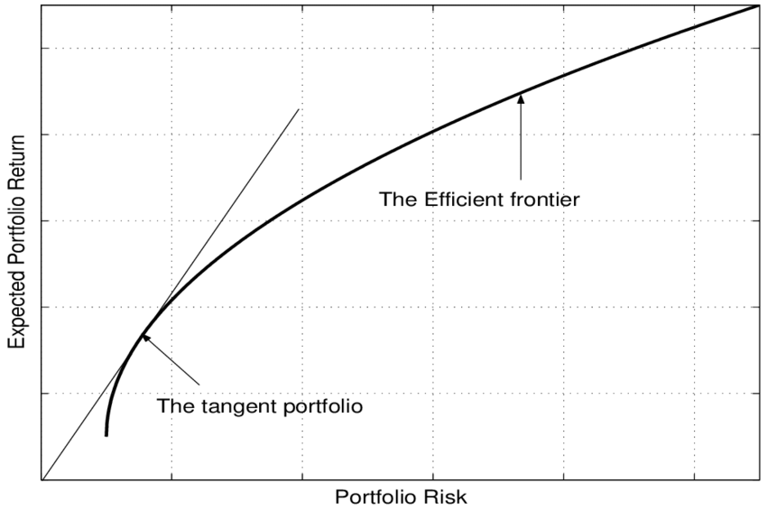

In computational finance, the tangent portfolio is a pivotal concept used to optimize investments by achieving the highest possible return for a given level of risk. This article focuses on the role of tangent portfolios within algorithmic trading, underscoring their importance in maximizing returns while minimizing exposure to risk. As algorithmic trading continues to rise in prominence, mastering the tangent portfolio is increasingly vital for investors seeking to gain a competitive edge in the financial markets.

A tangent portfolio is characterized by its pivotal position on the efficient frontier, a graphical representation of optimal portfolios that offer the highest expected return for a defined level of risk. Specifically, the tangent portfolio possesses the highest Sharpe ratio, an indicator of optimal risk-adjusted returns. This makes it a significant tool for investors who aim to determine the best combination of risk-free assets and risky investments to improve portfolio performance. 



Throughout this article, we will explore various models and strategies related to the tangent portfolio, arming traders and finance enthusiasts with essential insights for practical application. Moreover, a special focus will be placed on demystifying the technical aspects of tangent portfolios, providing clarity on how these techniques can be applied effectively within algorithmic trading. The goal is to equip readers with the necessary knowledge to enhance their investment strategies and navigate the evolving landscape of computational finance.

## Table of Contents

## Understanding the Tangent Portfolio

A tangent portfolio is a key concept within modern portfolio theory, representing the portfolio with the highest Sharpe ratio, which measures risk-adjusted returns. This portfolio is the point where the capital market line, drawn from the risk-free rate, is tangent to the efficient frontier—a curve representing all possible portfolios that offer the highest expected return for a given level of risk.

The Sharpe ratio—defined as \[ \text{Sharpe Ratio} = \frac{E[R_p] - R_f}{\sigma_p} \] where $E[R_p]$ is the expected return of the portfolio, $R_f$ is the risk-free rate, and $\sigma_p$ the standard deviation of the portfolio returns—serves as the key metric for quantifying a portfolio's performance against risk. A higher Sharpe ratio indicates a more favorable risk-return trade-off.

By achieving the optimal Sharpe ratio, the tangent portfolio helps investors determine the best mix of risk-free and risky assets. This involves analyzing various investment combinations to pinpoint the one that offers the optimal trade-off between risk and expected return. In practice, this is often achieved by solving optimization problems to identify the portfolio weights that maximize the Sharpe ratio.

The relevance of tangent portfolios extends to [algorithmic trading](/wiki/algorithmic-trading), where they are utilized for making strategic investment decisions. Algorithmic trading systems can process vast amounts of data to continually adjust portfolio weights, ensuring that the portfolio remains at or near the tangent point on the efficient frontier despite market fluctuations.

Understanding the composition of the tangent portfolio is essential for traders who wish to enhance their portfolio performance. It involves both conceptual knowledge and practical skills in portfolio optimization, risk management, and computational techniques. This amalgamation of theory and practice enables traders to efficiently allocate resources, manage risks, and potentially enhance returns.

## Role of Algorithmic Trading in Tangent Portfolios

Algorithmic trading employs sophisticated computer algorithms to execute trades based on pre-established conditions, which can include strategies centered on tangent portfolios. In the context of tangent portfolios, algorithms offer the significant advantage of real-time optimization by utilizing historical and live market data to analyze and react to financial metrics rapidly.

Optimization in algorithmic trading involves dynamically managing the risk-return profile of a portfolio. A key aspect is the enhancement of efficient portfolio management through the selection of assets that align closely with the tangent portfolio, characterized by the highest Sharpe ratio. Algorithms can rapidly process vast datasets to determine the optimal mix of risk-free and risky assets, adjusting to market movements swiftly. This capability allows traders to maintain a portfolio that consistently strives for optimal risk-adjusted returns.

The effectiveness of algorithmic trading in tangent portfolio management heavily relies on the choice of algorithm. Algorithms designed to compute efficient frontiers, such as those based on quadratic programming, have proven effective in identifying tangent portfolios. By focusing on maximizing the Sharpe ratio, these algorithms facilitate the identification of portfolios that potentially offer the best combination of expected returns relative to risk. This process involves calculating the variance-covariance matrix of returns and determining the portfolio weights that lie on the efficient frontier.

Additionally, algorithmic strategies involve continuous rebalancing of portfolios. Such strategies require algorithms capable of assessing market conditions and making rapid adjustments to portfolio weights. This adaptability is particularly advantageous in volatile market environments, where maintaining the target risk-return profile requires swift recalibrations. The ability to continuously adjust portfolio compositions ensures that they remain aligned with predefined investment goals and market expectations.

For practical application, consider an algorithm coded in Python employing the `cvxopt` library to solve for the tangent portfolio:

```python
import numpy as np
import cvxopt as opt
from cvxopt import blas, solvers

# Turn off progress printing
solvers.options['show_progress'] = False

# Number of assets
n = 4

# Expected returns
returns = np.array([0.12, 0.10, 0.15, 0.09])

# Covariance matrix
C = np.array([[0.0004, 0.0002, 0.0003, 0.0002],
              [0.0002, 0.0003, 0.0002, 0.0001],
              [0.0003, 0.0002, 0.0005, 0.0002],
              [0.0002, 0.0001, 0.0002, 0.0003]])

# Convert inputs to cvxopt matrices
S = opt.matrix(C)
pbar = opt.matrix(returns)

# Constraints Gx ≤ h
G = -opt.matrix(np.eye(n))   # negative n x n identity matrix
h = opt.matrix(0.0, (n ,1))
# A full investment constraint Ax = b
A = opt.matrix(1.0, (1, n))
b = opt.matrix(1.0)

# Calculating the tangent portfolio
print("Solving for the tangent portfolio:")
sol = solvers.qp(S, -pbar, G, h, A, b)
weights = sol['x']
print(weights)
```

This code sets up and solves an optimization problem to determine the weights of the tangent portfolio for four assets, based on their expected returns and a covariance matrix. Such calculations were previously labor-intensive but can now be performed rapidly with algorithmic trading, allowing traders to maintain optimal investment positions even as market conditions evolve.

## Exploring Different Return Models

Return models play a pivotal role in determining the expected returns of tangent portfolios, which are integral to optimizing investment strategies. Two primary models frequently utilized in this context are the agnostic return model and the equal returns model.

The agnostic return model operates on the principle that all securities exhibit equal expected returns. This foundational assumption enables the construction of an equal-weight portfolio, wherein each asset is allocated the same proportion of total capital. This model is advantageous for its simplicity and its assumption removes the bias of estimated returns, making it a useful starting point for theory-driven portfolio analysis. 

Mathematically, if there are $n$ assets in the portfolio, each allocation $w_i$ in an agnostic return model can be expressed as:
$$
w_i = \frac{1}{n}
$$
where $i = 1, 2, \ldots, n$. This uniform allocation helps in forming a baseline portfolio, from which further optimizations can be made. However, it may not always reflect the market reality where asset performances differ.

Conversely, the equal returns model targets assets with similar expected returns to construct a portfolio that minimizes [volatility](/wiki/volatility-trading-strategies). This approach emphasizes risk management by adjusting the portfolio to achieve minimum variance given the expected similarity in returns across selected assets. This model assumes that asset covariances are known and that the objective is to select weights that minimize the variance of the portfolio returns.

For both models, algorithmic trading systems can be leveraged to dynamically adjust portfolios as new data become available, enhancing precision in achieving balanced, efficient portfolios. Using historical data analysis, simulations, and optimization algorithms, traders can apply these models to fine-tune their tangent portfolios to better capture optimized performance metrics under varying market conditions. 

Python, for instance, offers robust libraries like NumPy and Pandas for such tasks, facilitating computation and real-time adjustment. Below is a basic Python snippet demonstrating how one might compute equal weights for an agnostic return model:

```python
import numpy as np

def create_agnostic_portfolio(n_assets):
    return np.ones(n_assets) / n_assets

n = 10  # Assume a portfolio with 10 assets
equal_weight_portfolio = create_agnostic_portfolio(n)
print(equal_weight_portfolio)
```

Such tools enable investors to effectively employ these return models, adjusting them as required to respond to market movements, thereby optimizing their tangent portfolios for superior risk-adjusted returns.

## Advanced Concepts and Techniques

For seasoned investors, understanding the advanced aspects of tangent portfolios is crucial. This exploration involves analyzing the differences between relaxed and proper tangent portfolios, which can significantly impact portfolio optimization. In a relaxed tangent portfolio, constraints like budget or certain risk parameters are slightly loosened, allowing for a broader range of potential investment opportunities. This can lead to higher returns but at the cost of increased risk. On the other hand, a proper tangent portfolio strictly adheres to the original constraints, ensuring a more stable risk-return balance. Recognizing this deviance is essential for making informed investment decisions, especially when markets are volatile.

Additionally, finding optimal portfolio weights using the Lagrangian method offers a powerful tool for investors. The Lagrangian approach involves setting up a Lagrange function that incorporates the constraints of the optimization problem, such as the total budget or desired level of risk. By solving the corresponding system of equations, investors can derive the optimal weights for the assets in their portfolio. For a given set of assets with expected returns $\mu$, and a covariance matrix $\Sigma$, the Lagrangian function can be constructed as follows:

$$
\mathcal{L}(w, \lambda) = w^T \mu - \frac{\lambda}{2} w^T \Sigma w - \zeta(w^T \mathbf{1} - 1)
$$

where $w$ represents the vector of asset weights, $\lambda$ is the Lagrange multiplier related to the risk aversion of the investor, and $\zeta$ is associated with the budget constraint (ensuring that the sum of weights equals 1). The first-order conditions for this function produce the weights that maximize the Sharpe Ratio or other risk-adjusted measures.

Another critical concept in advanced tangent portfolio management is the strategic use of capital allocation lines (CAL). The CAL helps to visualize the risk-return trade-off of a portfolio by showing the expected return of combinations of a risk-free asset and a risky portfolio. The slope of the CAL, or the Sharpe Ratio, becomes a guiding metric for selecting the optimal portfolio along the efficient frontier. Investors can leverage this tool in tandem with the efficient frontier in modern portfolio theory to enhance portfolio allocation strategies.

By mastering these advanced techniques, such as recognizing the nuances between relaxed and proper tangent portfolios, deriving optimal portfolio weights with methods like the Lagrangian, and strategically employing capital allocation lines, traders can further refine their approach to constructing tangent portfolios. This refined approach allows for a more sophisticated investment strategy that balances risk and return efficiently in dynamic market conditions.

## Conclusion and Future Trends

The tangent portfolio remains a cornerstone of strategic trading in computational finance. As the landscape of algorithmic trading continues to evolve, so too will the application and importance of tangent portfolios. This evolution is characterized by the integration of [machine learning](/wiki/machine-learning) techniques, which have the potential to significantly enhance the optimization of portfolio strategies. Machine learning can be applied to historical market data to extract patterns and inform the construction of tangent portfolios with improved risk-return profiles.

One of the key advantages of leveraging machine learning in this context is the ability to process vast amounts of data and uncover subtle market signals that might otherwise go unnoticed. Algorithms trained on these data can provide more accurate predictions of asset behaviors, allowing for more informed decision-making and optimization of tangent portfolios.

To maintain a competitive edge, investors and traders must stay abreast of these technological advancements. As computational power and data availability increase, so will the sophistication of algorithmic trading strategies. Understanding and leveraging tangent portfolios will therefore be essential for developing future-proof investment strategies. By embracing these trends, traders can ensure their strategies remain robust, even in volatile market conditions. This proactive approach will be vital for those seeking to maximize returns while managing risks effectively in an ever-evolving financial landscape.

## Frequently Asked Questions (FAQ)

### How do you calculate a tangent portfolio in algorithmic trading?

Calculating a tangent portfolio involves optimizing the Sharpe ratio, which measures the risk-adjusted return of a portfolio. The Sharpe ratio is given by the formula:

$$
\text{Sharpe Ratio} = \frac{E(R_p) - R_f}{\sigma_p}
$$

where $E(R_p)$ is the expected portfolio return, $R_f$ is the risk-free rate, and $\sigma_p$ is the standard deviation of the portfolio returns. In algorithmic trading, computer algorithms evaluate different asset combinations to maximize this ratio. Python libraries like NumPy and SciPy can be used to perform these calculations efficiently. The following Python code snippet demonstrates the use of scipy.optimize to find the weights of a tangent portfolio:

```python
import numpy as np
from scipy.optimize import minimize

def optimize_tangent_portfolio(returns, risk_free_rate):
    num_assets = returns.shape[1]
    def portfolio_performance(weights, returns, risk_free_rate):
        portfolio_return = np.dot(weights, np.mean(returns, axis=0))
        portfolio_std = np.sqrt(np.dot(weights.T, np.dot(np.cov(returns.T), weights)))
        return -(portfolio_return - risk_free_rate) / portfolio_std

    constraints = ({'type': 'eq', 'fun': lambda x: np.sum(x) - 1})
    bounds = tuple((0, 1) for _ in range(num_assets))
    init_guess = num_assets * [1. / num_assets]

    optimized_result = minimize(portfolio_performance, init_guess, args=(returns, risk_free_rate),
                                method='SLSQP', bounds=bounds, constraints=constraints)

    return optimized_result.x

# Example data
returns_data = np.random.random((100, 5))  # Simulated returns data
optimal_weights = optimize_tangent_portfolio(returns_data, 0.03)
print("Optimal Weights for Tangent Portfolio:", optimal_weights)
```

### What is the primary difference between a tangent and market portfolio in finance?

The primary difference between a tangent portfolio and a market portfolio lies in their composition and objective. A tangent portfolio maximizes the Sharpe ratio by combining risky and risk-free assets, yielding the highest possible risk-adjusted return. It is located at the point of tangency between the capital market line (CML) and the efficient frontier. Conversely, the market portfolio consists of all available risky assets in the market, weighted by their market value, without including risk-free assets. It represents the entire market's risk and return characteristics and lies on the capital market line but not necessarily at the point of highest Sharpe ratio.

### How does algorithmic trading improve tangent portfolio optimization?

Algorithmic trading enhances tangent portfolio optimization by leveraging sophisticated algorithms to process vast amounts of data in real-time, enabling rapid identification of optimal portfolio weights. Algorithms can quickly adjust to new information, rebalance portfolios, and execute trades without human intervention. This allows for continuous realignment to the optimal portfolio as market conditions change. Additionally, machine learning and [artificial intelligence](/wiki/ai-artificial-intelligence) tools can provide insights into complex market patterns, further refining the optimization process.

### Can tangent portfolios adapt to volatile market conditions effectively?

Tangent portfolios can adapt to volatile market conditions through algorithmic trading strategies that continuously monitor market data and respond rapidly to changes. By employing dynamic rebalancing techniques, algorithms can recalibrate the portfolio's composition, maintaining the highest Sharpe ratio possible. Although no investment strategy can entirely eliminate risk, algorithmic trading can help mitigate potential losses by optimizing portfolios in various market conditions, including times of high volatility.

### What future trends should investors be aware of regarding tangent portfolios?

Investors should watch for the increasing integration of machine learning and artificial intelligence into tangent portfolio optimization. These technologies promise more refined forecasts of asset returns and volatilities, leading to improved portfolio performance. Another trend is the growing availability and use of big data, which can enhance the adaptability and precision of trading algorithms. Furthermore, with continuous advancements in computational power, real-time optimization and implementation of tangent portfolios will become more accessible, allowing even small investors to benefit from sophisticated investment strategies. As financial markets evolve, understanding these trends will be crucial for developing robust, forward-looking investment approaches.

## References & Further Reading

[1]: ["Modern Portfolio Theory and Investment Analysis"](https://www.wiley.com/en-us/Modern+Portfolio+Theory+and+Investment+Analysis%2C+9th+Edition-p-9781118469941) by Edwin J. Elton, Martin J. Gruber, Stephen J. Brown, and William N. Goetzmann

[2]: ["Algorithmic Trading: Winning Strategies and Their Rationale"](https://github.com/prabakar2610/TradingBooks/blob/master/Algorithmic%20Trading%20-%20Winning%20Strategies%20and%20Their%20Rationale%202013.pdf) by Ernie Chan

[3]: Markowitz, H. (1952). ["Portfolio Selection"](https://onlinelibrary.wiley.com/doi/abs/10.1111/j.1540-6261.1952.tb01525.x). The Journal of Finance, 7(1), 77-91.

[4]: ["Option Pricing and Investment Strategies"](https://www.investopedia.com/trading/options-strategies/) by Richard J. Rendleman

[5]: ["Financial Modeling"](https://www.investopedia.com/terms/f/financialmodeling.asp) by Simon Benninga

[6]: ["Advances in Financial Machine Learning"](https://www.amazon.com/Advances-Financial-Machine-Learning-Marcos/dp/1119482089) by Marcos Lopez de Prado

[7]: ["Machine Learning for Algorithmic Trading: Predictive models to extract signals from market and alternative data for systematic trading strategies with Python"](https://github.com/stefan-jansen/machine-learning-for-trading) by Stefan Jansen