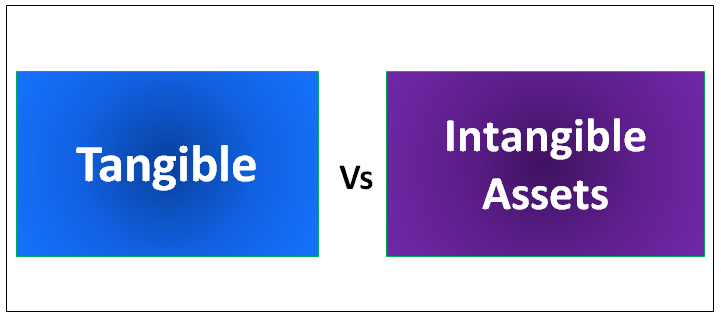

In the evolving landscape of finance, the comprehension of various asset types has become fundamental to making informed investment decisions. Investors and financial professionals strive to optimize their portfolios by having a well-rounded understanding of both tangible and intangible assets. Tangible assets, such as real estate, machinery, and commodities, have a concrete presence and are directly involved in revenue generation. In contrast, intangible assets, like patents, trademarks, and brand equity, while lacking physical form, can significantly enhance a company's competitive position and overall valuation through their potential to generate revenues and create market differentiation.

This article examines these asset classes, comparing their roles, characteristics, and the value they contribute to a company's financial strategies. Concurrently, modern advancements in technology have introduced algorithmic trading, a method that leverages pre-programmed computer algorithms to make trading decisions and execute trades with precision and speed. Algorithmic trading is transforming investment strategies by enhancing the speed of execution, increasing market liquidity, and minimizing emotional biases that can often cloud decision-making processes.



The integration of algorithmic trading with diverse asset types forms a comprehensive strategy for the high-tech trading environment of today. By understanding how technology can be harnessed to analyze and manage both tangible and intangible assets, investors can enhance their portfolio management tactics, leveraging the strengths of each asset type in pursuit of financial performance and competitive advantage. This article aims to provide a detailed exploration of these intersecting themes, offering insights into how to effectively incorporate various asset types into a sophisticated trading strategy using advanced algorithms.

## Table of Contents

## Understanding Tangible Assets

Tangible assets are physical items that possess measurable value and contribute significantly to a company's operational revenue generation. These assets, by their physical nature, can be seen and touched, differentiating them from intangible assets. Examples of tangible assets include real estate, machinery, commodities, inventory, equipment, land, and buildings. Each of these has distinct characteristics and roles in a company's financial structure.

Real estate, for instance, constitutes land and any permanent structures affixed to it, such as buildings. It provides not only a place for operations but also serves as a long-term investment that can appreciate in value over time. Machinery and equipment are essential for production and operational activities, driving efficiency and productivity. Commodities, on the other hand, represent basic goods used in commerce that are interchangeable with other goods of the same type.

Tangible assets are typically recorded on a company's balance sheet, where they are crucial components of the company's total asset base. To reflect their usage and wear over time, these assets are subject to depreciation. Depreciation is the accounting process of allocating the cost of a tangible asset over its useful life. This is commonly calculated using methods such as the straight-line method, where the cost of the asset is evenly spread over its useful life, or the declining balance method, where a higher depreciation expense is recorded in the earlier years of the asset's life.

Incorporating tangible assets into a company's financial strategy is critical, as they directly impact the company's revenue-generating capabilities and overall valuation. Effective management and optimization of these assets can lead to enhanced operational performance and financial stability.

## Intangible Assets Explained

Intangible assets, unlike their tangible counterparts, lack physical form but are pivotal in generating economic benefits for businesses. These assets derive their value from legal rights or economic benefits, making them crucial for sustaining competitive advantage and enhancing market valuation.

Common examples of intangible assets include patents, trademarks, brand equity, and goodwill. Patents grant exclusive rights to inventions, providing protection against unauthorized use and fostering innovation. Trademarks, consisting of recognizable signs, symbols, or expressions, distinguish a company's products or services in the marketplace. Brand equity represents the added value a recognized brand name confers to a product, influencing consumer preference and loyalty. Goodwill emerges during acquisitions, representing the value of a company's reputation, customer relationships, and other non-tangible aspects that contribute to its success.

While tangible assets undergo depreciation due to wear and tear over time, intangible assets are subject to amortization, wherein their cost is systematically allocated over their useful life. Furthermore, intangible assets can face impairment if their fair value falls below their carrying amount on the balance sheet, necessitating write-downs to reflect declined economic potential.

Intangible assets are integral to preserving a company's competitive edge. They can lead to increased revenue through innovative product offerings, stronger brand recognition, and established customer loyalty. As such, businesses invest in these assets to differentiate themselves in the marketplace and bolster long-term profitability and valuation.

## Comparing Tangible and Intangible Assets

The primary distinction between tangible and intangible assets lies in their physical presence. Tangible assets are physical objects that can be seen, touched, and quantified, such as machinery, buildings, and land. These assets hold inherent value and are often directly employed in a company's operational processes. Their valuation is generally more straightforward as it relies on market comparisons, income generation potential, and historical costs. For example, real estate value can be determined through market analysis or appraisal methodologies, making tangible assets easier to quantify and monetize.

In contrast, intangible assets do not possess a physical form yet contribute significantly to a firm’s value by providing competitive advantages and fostering market differentiation. Common intangible assets include intellectual properties like patents and trademarks, brand recognition, and customer relationships. Their value lies in their potential to generate future economic benefits, such as increased sales from a strong brand or cost savings from proprietary technology. However, the valuation of intangible assets can be complex due to their abstract nature. Methods such as discounted cash flow analysis and comparables are often employed to estimate their worth, albeit with less certainty compared to tangible assets.

Both asset types are vital to a company’s asset portfolio, each enhancing investment strategies in unique ways. Tangible assets offer stability and scalability, serving as the backbone of operational capabilities and income generation. They can also be leveraged as collateral for financing or be utilized in expansion plans. Intangible assets, while less tangible, provide strategic benefits by enhancing customer loyalty, brand equity, and innovation potential, which are pivotal for sustaining long-term competitive advantage and driving growth.

Integrating both tangible and intangible assets within an investment strategy allows firms to diversify risk and exploit different value creation avenues. This balanced approach helps firms optimize their capital structure, ensuring a robust asset portfolio that supports sustainable financial performance and strategic objectives.

## The Role of Algorithmic Trading

Algorithmic trading utilizes automated systems programmed with sophisticated algorithms to execute trades based on pre-defined criteria. These algorithms are designed to identify opportunities and make trading decisions at speeds and frequencies that would be impossible for human traders. By processing vast amounts of financial data rapidly, [algorithmic trading](/wiki/algorithmic-trading) enhances market efficiency and accuracy in decision-making.

The foundational principle behind algorithmic trading is to enter and [exit](/wiki/exit-strategy) trades at the optimal time, minimizing human emotional biases that can affect traditional trading. Algorithms can be instructed to follow certain parameters, such as timing, price, quantity, or complex mathematical models, to execute orders. This method of trading is particularly advantageous in volatile markets where speed and precision are crucial.

Algorithmic trading finds extensive application across various financial products, including equities, foreign exchange, futures, and options. For instance, in equities trading, algorithms can analyze multiple market conditions and execute trades based on statistical [arbitrage](/wiki/arbitrage) strategies. In more complex scenarios, algorithmic trading is used for high-frequency trading ([HFT](/wiki/high-frequency-trading-strategies)) where trades are executed within microseconds, capitalizing on small price discrepancies.

By implementing algorithms, traders can explore a range of sophisticated strategies like [trend following](/wiki/trend-following), mean reversion, [market making](/wiki/market-making), and [statistical arbitrage](/wiki/statistical-arbitrage). These strategies utilize financial theories and statistical analysis, translating into executable code that allows traders to back-test models against historical data to evaluate performance potential.

A Python example to illustrate a simple moving average crossover strategy might include:

```python
import pandas as pd
import numpy as np

# Load historical stock data
data = pd.read_csv('stock_data.csv')

# Calculate moving averages
data['SMA_50'] = data['Close'].rolling(window=50).mean()
data['SMA_200'] = data['Close'].rolling(window=200).mean()

# Generate trading signals
data['Signal'] = 0
data['Signal'][50:] = np.where(data['SMA_50'][50:] > data['SMA_200'][50:], 1, 0)

# Determine buy/sell orders
data['Position'] = data['Signal'].diff()

# Display buy/sell orders
print(data[data['Position'] != 0][['Date', 'Close', 'Position']])
```

In this example, trading signals are generated when a short-term 50-day moving average crosses above or below a long-term 200-day moving average, indicating buy or sell signals, respectively. While simple, this illustrates how algorithmic strategies can automate decision-making processes based on data-driven insights.

Overall, algorithmic trading revolutionizes financial markets by allowing for precise and rapid transactions, thereby enhancing [liquidity](/wiki/liquidity-risk-premium) and reducing transaction costs. However, the complexities involved in designing, programming, and maintaining these systems also introduce risks, requiring robust risk management and monitoring frameworks to prevent unwanted outcomes.

## Integrating Algo Trading with Tangible and Intangible Assets

Algorithmic trading has found applications across various asset types, including both tangible and intangible assets, thanks to advancements in data analytics and computational technology. It takes advantage of real-time data processing and sophisticated algorithms to make informed trading decisions, enhancing the efficiency of asset management.

In tangible asset markets, such as real estate, algorithmic trading utilizes large volumes of data to identify patterns and trends that inform buying and selling decisions. These algorithms can analyze historical pricing, market trends, and external economic indicators much faster than traditional methods. For example, by deploying [machine learning](/wiki/machine-learning) algorithms, traders can forecast property price changes and optimize investment portfolios accordingly.

Intangible assets, including patents and brand equity, present their own set of challenges and opportunities for algorithmic trading. Since these assets are non-physical and often more abstract in nature, algorithms aid in estimating their future economic benefits. This is achieved by evaluating patent citation histories, market trends, and brand performance metrics. Such algorithms can be calibrated to assess value, predict future revenue streams, and manage intangible asset transactions more effectively.

#### Example of Python Code for Price Prediction

Utilizing Python, traders can implement models to predict asset prices, including tangible and intangible assets. The following is a simple example of how the `scikit-learn` library can be used to create a linear regression model for price prediction:

```python
from sklearn.model_selection import train_test_split
from sklearn.linear_model import LinearRegression
import numpy as np

# Example data (features and target are hypothetical)
features = np.array([[2.5, 3.0, 3.5], [3.0, 3.5, 4.0], [2.0, 2.5, 3.0]])
prices = np.array([250000, 300000, 200000])

# Splitting the dataset into training and testing sets
X_train, X_test, y_train, y_test = train_test_split(features, prices, test_size=0.2, random_state=42)

# Creating the linear regression model
model = LinearRegression()
model.fit(X_train, y_train)

# Predicting prices
price_predictions = model.predict(X_test)
print(price_predictions)
```

This code demonstrates a simplified way to leverage historical data for predicting future values, a core component of algorithmic trading.

In integrating algorithmic trading with both tangible and intangible assets, it is crucial to deploy advanced computational models capable of processing complex datasets, thereby improving decision-making efficiency. Whether through machine learning models, statistical algorithms, or bespoke trading systems, leveraging these technologies enables more precise and effective asset management and trading strategies.

## Benefits and Risks of Algorithmic Trading

Algorithmic trading has revolutionized the financial markets by offering significant benefits. One of its primary advantages is high-speed execution. Algorithms can execute trades in milliseconds, a timeframe unattainable for human traders, allowing for swift response to market conditions. This speed enhances trading efficiency as algorithms can capitalize on brief market opportunities that would otherwise be missed.

Additionally, algorithmic trading contributes to reduced transaction costs. By automating trading activities, firms can lower the costs associated with manual trading processes, such as human error and slower trade execution. The ability of algorithms to execute large volumes of trades without immediate human intervention further diminishes market impact and spreads, thus minimizing transaction expenses.

Furthermore, algorithmic trading improves market liquidity. As these systems can rapidly enter and exit trades, they provide continuous liquidity to the markets, facilitating easier buy and sell transactions for all participants. This liquidity is crucial in maintaining orderly markets, reducing [volatility](/wiki/volatility-trading-strategies), and ensuring fair trading prices.

Despite its advantages, algorithmic trading presents several risks that must be managed carefully. Technical failures can pose significant threats, as they may lead to unintended trades or market disruptions. For instance, a software bug or an outage in data feeds could result in substantial financial losses or erroneous transactions. Financial institutions deploying algorithmic trading need robust technological infrastructures to minimize these risks.

Moreover, algorithmic trading has the potential to increase market volatility. The rapid execution and large [volume](/wiki/volume-trading-strategy) of trades can exacerbate market fluctuations, especially if similar algorithms react to the same market signals. This "herding" behavior may lead to sudden price changes, contributing to market instability.

To mitigate these risks, effective risk management strategies and regulatory frameworks are essential. Firms must employ comprehensive testing protocols and real-time monitoring systems to detect and address potential issues promptly. Regulators, on their part, are tasked with establishing guidelines to ensure fair and stable market conditions, including circuit breakers and strict compliance requirements for algorithmic trading practices.

In conclusion, while algorithmic trading offers substantial benefits, including faster execution, cost efficiency, and enhanced liquidity, its inherent risks necessitate diligent oversight and proactive management practices.

## Conclusion

Both tangible and intangible assets hold crucial positions in crafting comprehensive financial strategies, owing to their distinct yet complementary advantages. Tangible assets, with their physical and measurable presence, contribute to revenue generation in clear, direct ways. They provide stability and security, often serving as collateral in financial dealings. Intangible assets, although lacking physical form, are invaluable for their potential to enhance a company's competitive position. They offer market differentiation, driven by innovations, brand strength, and intellectual property, which in turn, can substantially increase a firm's market valuation.

Integrating these asset types into algorithmic trading frameworks revolutionizes the traditional approach to asset management. Algorithmic trading utilizes advanced computational algorithms to analyze vast datasets with speed and precision. Through this, it harmonizes the management of tangible and intangible assets, allowing for real-time decision-making and optimized trade execution. This integration empowers traders and investors to conduct transactions more efficiently, reducing latency and minimizing emotional biases that can adversely affect market activities.

For stakeholders, gaining proficiency in these dynamics is vital for optimizing financial performance. A nuanced understanding of how tangible and intangible assets contribute to an organization's value, combined with the strategic application of algorithmic trading, equips stakeholders to capitalize on market opportunities effectively. By embracing these technologies and asset strategies, stakeholders can navigate the complexities of modern financial markets, positioning themselves for sustained success in a highly competitive environment.

## References & Further Reading

[1]: Bergstra, J., Bardenet, R., Bengio, Y., & Kégl, B. (2011). ["Algorithms for Hyper-Parameter Optimization."](https://papers.nips.cc/paper/4443-algorithms-for-hyper-parameter-optimization) Advances in Neural Information Processing Systems 24.

[2]: ["Advances in Financial Machine Learning"](https://www.amazon.com/Advances-Financial-Machine-Learning-Marcos/dp/1119482089) by Marcos Lopez de Prado

[3]: ["Evidence-Based Technical Analysis: Applying the Scientific Method and Statistical Inference to Trading Signals"](https://www.amazon.com/Evidence-Based-Technical-Analysis-Scientific-Statistical/dp/0470008741) by David Aronson

[4]: ["Machine Learning for Algorithmic Trading"](https://github.com/stefan-jansen/machine-learning-for-trading) by Stefan Jansen

[5]: ["Quantitative Trading: How to Build Your Own Algorithmic Trading Business"](https://www.amazon.com/Quantitative-Trading-Build-Algorithmic-Business/dp/1119800064) by Ernest P. Chan