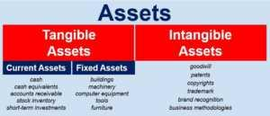

In the rapidly evolving world of finance, comprehension of diverse asset types and trading strategies has become crucial for informed decision-making. This article explores the complex and interconnected domains of financial assets, tangible assets, and algorithmic trading within modern investment strategies.

Financial assets, including stocks, bonds, derivatives, and mutual funds, are essentially instruments deriving value from a contractual claim. These assets are fundamental in investment portfolios due to their potential for growth and diversification. Tangible assets, in contrast, are physical items like real estate, machinery, and commodities, which hold intrinsic value. These are pivotal for businesses, contributing to operational revenue generation. Evaluating the distinctions and synergies between tangible and financial assets forms a fundamental part of this exploration.



Advanced trading approaches have emerged alongside these asset categories, with algorithmic trading, or 'algo trading,' at the forefront. This sophisticated strategy utilizes technology to execute trades at optimal times and prices, fundamentally transforming how trading is conducted. By harnessing pre-programmed algorithms, traders can efficiently perform complex statistical analyses and eliminate emotional bias.

By understanding the interaction and roles of financial and tangible assets, alongside the integration of algorithmic trading strategies, this article aims to provide readers with a comprehensive understanding of how these components shape the financial markets.

## Table of Contents

## Understanding Financial Assets

Financial assets are a fundamental component of modern financial markets, encompassing a diverse array of investment instruments. These assets derive their value from a contractual claim, such as ownership rights or future cash flow entitlements. Key examples include stocks, bonds, derivatives, and mutual funds.

Stocks represent ownership stakes in corporations, providing shareholders with potential dividends and capital appreciation. Bonds, on the other hand, are debt securities issued by entities ranging from governments to corporations, promising periodic interest payments and the return of principal at maturity. Derivatives like options and futures are financial contracts whose values depend on the price movements of underlying assets. Mutual funds pool resources from multiple investors to invest in a diversified portfolio of stocks, bonds, or other securities.

Owning financial assets typically signifies possessing an ownership or creditor relationship, entitling the holder to potential future cash flows. This characteristic distinguishes financial assets from tangible assets, which have intrinsic value derived from their physical form and utility.

The appeal of financial assets lies in their [liquidity](/wiki/liquidity-risk-premium) and tradability. Liquidity refers to the ease with which an asset can be converted into cash without significantly affecting its market price. Financial markets provide a platform for buying and selling these assets, facilitating efficient price discovery and trading. Investors are drawn to financial assets due to their potential for growth and diversification. By allocating investments across various financial instruments, investors can mitigate risk and enhance the potential for returns.

In summary, financial assets play a crucial role in investment portfolios, offering opportunities for capital growth, income generation, and diversification. Their intrinsic value, coupled with the liquidity and flexibility provided by financial markets, makes them a preferred choice for investors seeking to build a balanced and resilient financial strategy.

## The Role of Tangible Assets

Tangible assets are physical items with inherent value, and they can be classified as either current or fixed. They embody real-world objects that hold utility and can be traded or utilized as part of a business's operations to drive revenue. Current tangible assets, such as inventory, are expected to be converted into cash or consumed within a business's operational cycle, whereas fixed tangible assets, like real estate and machinery, are long-term resources utilized over multiple operational cycles.

Examples of tangible assets include real estate properties, machinery, vehicles, and commodities such as gold or oil. These assets are pivotal for businesses, providing essential infrastructure and operational capability. Real estate, for instance, not only serves as a physical location for operations but can also appreciate in value over time, contributing to a company's asset base. Machinery and vehicles are indispensable in manufacturing and logistics sectors, facilitating production and distribution processes.

Tangible assets are distinct from financial assets in that they are subject to physical depreciation over time. This depreciation represents the decline in an asset's value due to wear and tear, obsolescence, or other factors. It is typically accounted for in financial statements through depreciation schedules, which allocate the cost of the asset over its useful lifespan. The depreciation of tangible assets impacts a company’s balance sheet, as it reduces the book value of the asset and affects net income through depreciation expense. For example, the straight-line depreciation method is a common approach where assets are depreciated equally over their useful life. The formula for straight-line depreciation is:

$$
\text{Annual Depreciation} = \frac{\text{Cost of Asset} - \text{Residual Value}}{\text{Useful Life}}
$$

Maintaining tangible assets involves periodic repairs and updates to ensure their continued value contribution and operational efficacy. This maintenance can increase costs but is essential for deriving maximum utility from these assets and extending their lifespan.

Overall, tangible assets play a crucial role in a company's operational infrastructure and asset portfolio. Their management requires a strategic approach to optimize their value and integrate them effectively into business operations.

## Algorithmic Trading Explained

Algorithmic trading, commonly referred to as 'algo trading,' is a sophisticated method of executing trades using pre-programmed algorithms that determine the optimal timing, price, and quantity for trading financial instruments. This approach leverages computational power to analyze market data, assisting traders in making informed decisions at speeds unattainable by humans alone.

One of the primary advantages of [algorithmic trading](/wiki/algorithmic-trading) is its capacity to eliminate emotional bias, which can significantly impact trading outcomes. By adhering to predetermined rules and criteria, algorithmic systems can execute trades consistently, without the influence of human emotion such as fear or greed. Furthermore, algorithmic trading facilitates high-speed execution, capitalizing on market opportunities as they arise and minimizing slippage.

Complex statistical models form the backbone of many algo trading strategies, allowing systems to process vast datasets and identify patterns or anomalies that may not be immediately apparent through manual analysis. Some of the most widely employed strategies in algorithmic trading include:

1. **Trend Following**: This strategy involves algorithms identifying and capitalizing on long-term market trends. By analyzing historical price data, algorithms can predict future movements and execute trades that align with these trends.

2. **Mean Reversion**: Based on the assumption that asset prices will often return to historical averages, mean reversion strategies exploit short-term overreactions in the market. Algorithms monitor price levels and execute trades when prices significantly deviate from the mean, anticipating a reversion.

3. **Statistical Arbitrage**: This strategy leverages statistical and econometric techniques to exploit price inefficiencies between correlated or related financial instruments. Algorithms detect discrepancies and execute trades to profit from eventual price convergence.

Algorithmic trading is increasingly becoming the preferred method for hedge funds, institutional investors, and high-frequency traders. The speed and precision offered by algorithmic systems make them well-suited for managing large volumes of trades without human error. Additionally, the ability to backtest strategies using historical data provides traders with a robust framework to assess potential success and refine their approaches before deploying them in live markets.

The rise of algorithmic trading has dramatically transformed the landscape of financial markets, driving innovation and increasing efficiency. As technology continues to evolve, the capabilities and applications of algorithmic trading are expected to expand further, offering new possibilities and challenges in the field of investment.

## Intersecting Strategies: Algo Trading with Tangible Assets

While algorithmic trading is traditionally associated with financial markets, particularly equities and derivatives, there is a burgeoning interest in applying these techniques to tangible assets like real estate and commodities. This shift is driven by technological advancements that facilitate the automation of investment decisions. In real estate, algorithms analyze vast datasets, including historical prices, vacancy rates, and even socio-economic trends, to predict optimal buying and selling moments. The commodities market benefits similarly, with algorithms evaluating data such as weather patterns, geopolitical events, and supply chain logistics to make informed trading decisions. 

However, leveraging algorithmic trading for tangible assets presents distinct challenges. One major hurdle is accurately valuing these assets, which can be inherently subjective due to factors like unique physical characteristics and location-specific qualities in real estate, or fluctuating supply and demand dynamics in commodities. Further complicating matters is the need to incorporate diverse data types into algorithmic models, ranging from quantitative measures to qualitative assessments, which may require advanced natural language processing techniques and [machine learning](/wiki/machine-learning) algorithms to interpret text-based data sources like news reports or social media.

The convergence of machine learning and big data analytics is pivotal in addressing these challenges. Machine learning models can discover patterns and correlations in complex datasets, improving the predictive accuracy of algorithmic trading systems. For example, regression models can be used to estimate the future price movement of real estate properties based on historical trends. Additionally, unsupervised learning methods, like clustering, can segment market data into different groups, helping investors identify emerging trends and make profitable trades.

Python, with its robust libraries such as Scikit-learn for machine learning, Pandas for data manipulation, and Matplotlib for data visualization, is often employed to implement these algorithmic strategies. An example script could resemble:

```python
import pandas as pd
from sklearn.linear_model import LinearRegression
import numpy as np
import matplotlib.pyplot as plt

# Sample data
data = pd.DataFrame({
    'historical_price': [100, 150, 200, 250, 300],
    'vacancy_rate': [5, 4, 6, 3, 7],
    'future_price': [110, 160, 210, 260, 310]
})

# Features and target setup
X = data[['historical_price', 'vacancy_rate']]
y = data['future_price']

# Linear Regression Model
model = LinearRegression()
model.fit(X, y)

# Predict future prices
predicted_prices = model.predict(X)

# Plot predictions
plt.plot(np.arange(len(y)), y, label='Actual Prices')
plt.plot(np.arange(len(predicted_prices)), predicted_prices, label='Predicted Prices', linestyle='--')
plt.xlabel('Time Period')
plt.ylabel('Price')
plt.title('Real Estate Price Prediction')
plt.legend()
plt.show()
```

Such integration of algorithmic trading with tangible assets signifies a new era in asset management, promising increased precision and adaptability in investment strategies. Despite the complexities, the potential rewards make it a compelling area for continued exploration and application in the financial industry.

## Benefits and Risks of Algorithmic Trading

Algorithmic trading has revolutionized the way financial markets operate by automating trading processes to achieve greater efficiency and reduced costs. Key advantages of this sophisticated trading technique include high efficiency, which is achieved through the ability to process vast amounts of data and execute trades seamlessly at any time, without the constraints of human limitations. This automation significantly reduces transaction costs as it minimizes human intervention and leverages the algorithms' ability to quickly identify and execute the best available opportunities in the market, thereby optimizing trading strategies.

Additionally, improved market liquidity is another major benefit of algorithmic trading. By executing numerous small trades throughout the market, algorithmic trading enhances liquidity, which facilitates easier entry and [exit](/wiki/exit-strategy) points for traders and reduces bid-ask spreads. This increased liquidity helps stabilize the markets, creating a more efficient and fair trading environment for all participants.

Despite these benefits, algorithmic trading carries certain risks. One significant concern is the potential for technical failures. The reliance on complex algorithms and electronic systems means that any malfunctions or errors can lead to substantial financial losses. Moreover, over-reliance on historical data can pose another risk, as algorithms that are heavily based on past market behaviors might not accurately predict future movements, particularly in unprecedented situations or market changes.

Market disruption is another critical risk associated with algorithmic trading. Given the capability of these systems to execute large volumes of trades in a very short time, any malfunction or unexpected behavior in algorithms can cause significant [volatility](/wiki/volatility-trading-strategies), sometimes resulting in market flash crashes.

Regulatory frameworks are continuously adapting to mitigate these risks. Authorities aim to ensure market stability and transparency by setting regulations that promote fair trading practices and require algorithmic traders to have sufficient risk management systems in place. These regulations are crucial in protecting the integrity of the financial markets and preventing systemic disruptions. 

In summary, while algorithmic trading offers substantial benefits in terms of efficiency and reduced costs, it is imperative for traders and regulatory bodies to remain vigilant in managing the inherent risks to preserve the health and stability of the financial markets.

## Conclusion

Financial and tangible assets serve as fundamental components within the investment landscape, each providing unique advantages and challenges. Financial assets, like stocks and bonds, offer liquidity and potential for growth, while tangible assets, such as real estate and machinery, provide stability and intrinsic value. These differing characteristics underscore their respective roles in diversification and risk management strategies.

Algorithmic trading has emerged as a transformative force in the execution of financial transactions. By utilizing advanced algorithms, traders can make decisions rapidly, eliminating emotional bias and increasing efficiency. This technological approach necessitates a high level of expertise and stringent risk management practices to mitigate potential issues, such as technical failures and excessive market volatility.

With changing market conditions, there is a growing interest in integrating tangible asset management with algorithmic strategies. This integration could lead to innovative approaches in automating buying and selling decisions, particularly within markets for real estate and commodities. Such developments may leverage machine learning and big data analytics to accurately assess asset values and optimize trading decisions.

Investors and traders should remain proactive, educating themselves on new developments to navigate this evolving landscape effectively. Continual learning and adaptation to technological advancements and market shifts are crucial for maintaining robust portfolio management. As algorithmic models become more sophisticated and the integration of various asset types intensifies, these strategies could unlock unprecedented opportunities for growth and risk mitigation.

## References & Further Reading

[1]: Aldridge, I. (2013). ["High-Frequency Trading: A Practical Guide to Algorithmic Strategies and Trading Systems,"](https://www.wiley.com/en-us/High+Frequency+Trading%3A+A+Practical+Guide+to+Algorithmic+Strategies+and+Trading+Systems-p-9780470579770) 2nd Edition. Wiley Finance.

[2]: Engle, R., & Russell, J. R. (2010). ["Analysis of High-Frequency Data,"](http://www.olsendata.com/data_products/client_papers/papers/200412-EngleRussell-AnalHFFinData.pdf) Review of Economic Studies.

[3]: Papageorgiou, G., & Haas, R. (2015). ["Machine Learning in Asset Management,"](https://www.sciencedirect.com/science/article/pii/S2405844024149031) Springer.

[4]: Narang, R. K. (2009). ["Inside the Black Box: The Simple Truth About Quantitative Trading,"](https://www.amazon.com/Inside-Black-Box-Quantitative-Trading/dp/0470432063) Wiley.

[5]: D'Argens, C., & Schönborn, F. (2017). ["Financial Asset Pricing Theory,"](https://academic.oup.com/book/36432) Springer.