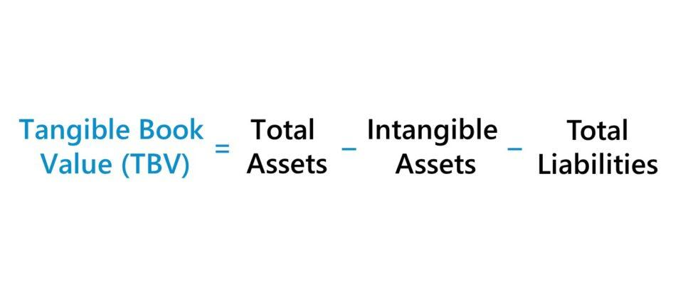

## Table of Contents

## What is Tangible Book Value Per Share?

Tangible Book Value Per Share is a financial measure that shows what each share of a company would be worth if the company were to liquidate its assets and pay off all its liabilities. It's calculated by taking the total tangible assets of a company, which are the physical and financial assets minus any intangible assets like patents or goodwill, and then subtracting all liabilities. This number is then divided by the total number of outstanding shares.

This measure is useful for investors who want to know the "hard" value of a company, meaning the value based on things they can touch or easily sell. It helps investors see if a stock is priced fairly by comparing the tangible book value per share to the current market price of the stock. If the market price is lower than the tangible book value per share, it might mean the stock is undervalued, which could be a good buying opportunity.

## How is Tangible Book Value Per Share calculated?

To find the Tangible Book Value Per Share, you start with the total assets of a company. But you only count the tangible assets, like buildings, machines, and money in the bank. You don't include intangible things like brand names or patents. Then, you subtract all the company's liabilities, which are the debts and other obligations the company owes. This gives you the total tangible book value of the company.

Next, you divide this total tangible book value by the number of shares the company has issued. This tells you how much of the tangible assets each share represents if the company were to sell everything and pay off all its debts. It's a way for investors to see if the stock is a good deal by comparing this number to the price they would pay for a share on the market.

## Why is Tangible Book Value Per Share important for investors?

Tangible Book Value Per Share is important for investors because it tells them what each share of a company is really worth if you only count the things you can touch or sell easily. This number helps investors figure out if a stock is priced too high or too low. If the market price of the stock is less than the Tangible Book Value Per Share, it might mean the stock is a good deal because you're paying less than what the company's hard assets are worth.

Investors use this measure to make smart choices about buying or selling stocks. It gives them a clearer picture of a company's value without the fluff of things like brand value or patents, which can be hard to sell or might not be worth as much as the company says. By comparing the Tangible Book Value Per Share to the stock's market price, investors can spot opportunities to buy undervalued stocks or avoid overpaying for a stock that looks more expensive than it should be based on its tangible assets.

## How does Tangible Book Value Per Share differ from Book Value Per Share?

Tangible Book Value Per Share and Book Value Per Share both help investors see what a company's shares are worth, but they count different things. Book Value Per Share looks at all of a company's assets, including things you can't touch like patents or brand names, and then subtracts all the company's debts. This gives you a total value that includes everything the company owns.

On the other hand, Tangible Book Value Per Share only counts the things you can touch or easily sell, like buildings or cash. It leaves out the intangible stuff. So, after subtracting the company's debts, you get a number that shows what the company's hard assets are worth per share. This can be more useful if you want to know the real, solid value of a company without the fluff of intangible assets.

## Can you provide an example of how to calculate Tangible Book Value Per Share?

Let's say a company has total assets worth $10 million. Out of these, $2 million are intangible assets like patents and brand value. The company also has liabilities of $4 million. To find the tangible book value, we first subtract the intangible assets from the total assets, which gives us $10 million - $2 million = $8 million in tangible assets. Then, we subtract the liabilities from this number, so $8 million - $4 million = $4 million. This $4 million is the total tangible book value of the company.

Now, if this company has 1 million shares outstanding, we can find the Tangible Book Value Per Share by dividing the total tangible book value by the number of shares. So, $4 million divided by 1 million shares equals $4 per share. This means that if the company were to sell all its tangible assets and pay off all its debts, each share would be worth $4 based on the tangible assets alone.

## What does a high Tangible Book Value Per Share indicate about a company?

A high Tangible Book Value Per Share usually means a company has a lot of solid assets like buildings or cash compared to how many shares it has. This can make the company look strong and valuable because it has a lot of things it can sell if it needs to. Investors might see a high Tangible Book Value Per Share as a good sign because it shows the company has a strong base of real, touchable assets.

However, just because a company has a high Tangible Book Value Per Share doesn't always mean it's a good investment. You also need to look at other things like how much money the company is making and if it's growing. A high Tangible Book Value Per Share can be a good thing, but it's just one piece of the puzzle when deciding if a company is a smart choice for investing.

## How can Tangible Book Value Per Share be used to assess a company's financial health?

Tangible Book Value Per Share helps investors understand how much a company's hard assets are worth per share. It's like figuring out how much money you'd get for each share if the company sold all its buildings, machines, and cash, and then paid off all its debts. A high Tangible Book Value Per Share can show that a company has a lot of solid, valuable stuff, which might mean it's in good financial shape. If the market price of the stock is lower than this value, it could be a sign that the stock is a good deal.

But, you can't just look at Tangible Book Value Per Share alone to judge a company's financial health. You need to think about other things too, like if the company is making money and if it's growing. Sometimes, a company might have a high Tangible Book Value Per Share but still have problems, like not making enough profit or having a lot of debt. So, while Tangible Book Value Per Share gives you a useful snapshot of a company's tangible assets, it's just one part of a bigger picture when deciding if a company is financially healthy.

## What are the limitations of using Tangible Book Value Per Share as a valuation metric?

Tangible Book Value Per Share is a helpful way to see what a company's hard assets are worth per share. But it has some limits. It doesn't tell you about the company's future growth or how much money it's making right now. A company might have a lot of buildings and machines, but if it's not making money or growing, those assets might not be as valuable as they seem. Also, this measure doesn't count things like patents or brand names, which can be really important for some companies. If a company's value comes from these intangible things, Tangible Book Value Per Share won't give you a full picture.

Another problem is that Tangible Book Value Per Share can be hard to use for companies in industries where the value comes from things you can't touch. For example, tech companies often have a lot of value in their software or brand, which this measure ignores. Also, the value of tangible assets can change over time. A building might be worth less if the area it's in goes downhill, or it might be worth more if the area improves. So, while Tangible Book Value Per Share can be a useful tool, it's important to use it along with other ways to value a company to get a complete view of its worth.

## How does Tangible Book Value Per Share relate to other financial ratios?

Tangible Book Value Per Share is one way to look at a company's value, but it's not the only way. It's like a piece of a puzzle that fits with other pieces like the Price-to-Earnings (P/E) ratio, which tells you how much you're paying for the company's earnings, and the Debt-to-Equity ratio, which shows how much the company is borrowing compared to what the owners have put in. These ratios help you see different sides of the company's financial health. Tangible Book Value Per Share focuses on the hard assets, while the P/E ratio looks at profits and the Debt-to-Equity ratio looks at how the company is financed.

When you use Tangible Book Value Per Share along with these other ratios, you get a fuller picture of the company's value and health. For example, if a company has a high Tangible Book Value Per Share but also a high Debt-to-Equity ratio, it might mean the company is borrowing a lot to keep up its assets. Or if the P/E ratio is high, it might mean investors are expecting a lot of future growth, even if the tangible assets don't seem that valuable right now. So, while Tangible Book Value Per Share gives you a snapshot of the company's hard assets, it's best used with other ratios to understand the whole story.

## What industries typically have higher Tangible Book Value Per Share?

Industries like real estate and manufacturing usually have higher Tangible Book Value Per Share. Real estate companies own a lot of buildings and land, which are things you can touch and sell easily. Manufacturing companies have a lot of machines and factories, which are also tangible assets. These kinds of businesses have a lot of stuff that they can sell if they need to, so their Tangible Book Value Per Share is often higher than companies in other industries.

On the other hand, industries like technology and services often have lower Tangible Book Value Per Share. Tech companies might have a lot of value in things like software or patents, but these are intangible assets that don't count towards Tangible Book Value Per Share. Service companies might not own a lot of buildings or machines, so their tangible assets are lower, making their Tangible Book Value Per Share smaller. This difference shows why it's important to think about what kind of business a company is in when looking at its Tangible Book Value Per Share.

## How has the relevance of Tangible Book Value Per Share changed over time?

The importance of Tangible Book Value Per Share has changed over time because the world of business has changed. In the past, a lot of companies were all about making things or owning land and buildings. These are the kinds of things that Tangible Book Value Per Share measures well. Back then, if you wanted to know if a company was worth investing in, looking at its Tangible Book Value Per Share was a good way to see if it had enough solid stuff to back up its value.

But now, more and more companies make money from things you can't touch, like software or ideas. Think about tech companies or businesses that mostly sell services. Their value comes from things like patents or brand names, which don't show up in Tangible Book Value Per Share. So, while this measure is still useful for certain industries, it's not as important for understanding the value of all companies today. Investors have to look at other things too, to get a full picture of a company's worth.

## What advanced techniques can be used to refine the analysis of Tangible Book Value Per Share?

To get a better understanding of a company's Tangible Book Value Per Share, you can use a few advanced tricks. One way is to adjust the tangible assets for their current market value instead of just using the numbers from the company's [books](/wiki/algo-trading-books). Sometimes, the value of things like buildings or machines can change over time, and these changes might not show up in the company's financial statements. By figuring out what these assets are really worth now, you can get a more accurate Tangible Book Value Per Share.

Another trick is to look at trends over time. Instead of just looking at the Tangible Book Value Per Share for one year, you can see how it has changed over several years. This can tell you if the company is getting better or worse at building up its hard assets. You can also compare the company's Tangible Book Value Per Share to other companies in the same industry to see if it's doing better or worse than its competitors. By using these advanced techniques, you can make smarter decisions about investing in a company based on its tangible assets.

## What is Tangible Book Value Per Share (TBVPS)?

Tangible Book Value Per Share (TBVPS) is a financial metric used to assess a company's per-share value based solely on its tangible assets, excluding any intangible assets. Its primary distinction from the more general Book Value Per Share (BVPS) lies in the exclusion of intangible assets from the calculation. BVPS considers the total book value of a company's assets minus its liabilities, divided by the number of outstanding shares. TBVPS refines this by specifically focusing on tangible assets, which are physical and measurable, such as cash, inventory, equipment, and real estate.

Intangible assets, such as goodwill, patents, and trademarks, do not have a physical presence and can present valuation challenges due to their subjective nature and potential for overvaluation. By excluding these from TBVPS calculations, investors gain a more conservative measure of company value, grounded in assets that can be liquidated more realistically. This approach is particularly beneficial in evaluating a company's liquidation value, as tangible assets are typically easier to appraise and convert into cash.

The formula for calculating TBVPS is:

$$
\text{TBVPS} = \frac{\text{Total Equity} - \text{Preferred Stock} - \text{Intangible Assets}}{\text{Total Shares Outstanding}}
$$

Here, Total Equity refers to the residual interest in the assets of the enterprise after deducting liabilities. Preferred Stock is subtracted because, unlike common stock, it has priority claims in distribution scenarios. Excluding Intangible Assets ensures that the calculation focuses solely on the more objectively valued tangible assets. Total Shares Outstanding are the total number of a company’s shares of stock that are currently owned by all its shareholders.

By focusing on tangible assets and excluding intangibles, TBVPS provides a grounded, less speculative evaluation of a company's per-share value, thus appealing to conservative investors and analysts who prioritize asset stability and liquidation potential over speculative growth prospects.

## What are the components of TBVPS calculation?

Tangible Book Value Per Share (TBVPS) is an important financial metric that helps to evaluate a company's financial health by focusing only on the tangible assets. The calculation of TBVPS involves several key components: total equity, preferred stock, and intangibles, all of which are adjusted against the outstanding shares. 

### Total Equity

Total equity, also referred to as shareholders' equity, represents the net value of a company and is calculated as the difference between total assets and total liabilities. It includes common equity, retained earnings, and any minority interest. For TBVPS, more emphasis is placed on the tangible equity, excluding intangibles for a more conservative valuation.

### Preferred Stock

Preferred stock is a class of ownership in a company that has a higher claim on its assets and earnings than common stock. It often includes features like fixed dividends. In the TBVPS calculation, the value of preferred stock is subtracted from total equity. This is because preferred shareholders have a preferential claim on the company's assets, effectively reducing the tangible book value available to common shareholders.

### Intangibles

Intangible assets are non-physical assets that include intellectual property, goodwill, patents, trademarks, and brand value. These are excluded from TBVPS calculations because they are not easily liquidated and their valuation can be subjective. By excluding intangibles, TBVPS provides a more tangible or "real" measure of the company's assets.

### Examples of Tangible Assets

Tangible assets included in TBVPS calculations encompass physical assets that are easily quantifiable and liquidatable. Common examples include:

- Cash and cash equivalents
- Property, Plant, and Equipment (PPE)
- Inventory
- Receivables

These assets are considered tangible because they have intrinsic value that can be realized relatively straightforwardly compared to intangible assets.

### Calculating Total Shares Outstanding

The process of determining total shares outstanding involves accounting for all shares that have been issued by the company and are currently held by all shareholders, including institutional investors and company insiders. This figure is crucial as it serves as the denominator in the TBVPS calculation formula:

$$
\text{TBVPS} = \frac{\text{Total Equity} - \text{Preferred Stock} - \text{Intangibles}}{\text{Total Shares Outstanding}}
$$

In Python, the basic calculation might look like this:

```python
def calculate_tbvps(total_equity, preferred_stock, intangibles, total_shares_outstanding):
    tangible_equity = total_equity - preferred_stock - intangibles
    tbvps = tangible_equity / total_shares_outstanding
    return tbvps
```

This formula shows how tangible assets are the focus, giving investors a clearer picture of the true asset value per share, excluding less reliable intangible assets.

## How do TBVPS compare to other financial metrics?

Tangible Book Value Per Share (TBVPS) and Book Value Per Share (BVPS) are both vital financial metrics used to evaluate a company's worth, but they differ fundamentally in their approach to accounting for assets. BVPS is computed by dividing a company's book value by the number of outstanding shares, where book value includes both tangible and intangible assets. The formula for BVPS is:

$$

\text{BVPS} = \frac{\text{Total Equity} - \text{Preferred Equity}}{\text{Weighted Average Shares Outstanding}}
$$

In contrast, TBVPS excludes intangible assets such as goodwill and patents from the calculation, offering a more conservative view of a company's value. The TBVPS formula is:

$$

\text{TBVPS} = \frac{\text{Total Equity} - \text{Preferred Equity} - \text{Intangible Assets}}{\text{Weighted Average Shares Outstanding}}
$$

The key difference remains in the treatment of intangible assets, making TBVPS particularly useful in situations where tangible assets constitute a higher proportion of total assets or in industries where the value of intangibles is uncertain.

In deciding when to use TBVPS versus other valuation metrics, it is critical to consider the specific context of the evaluation. TBVPS is preferred when assessing companies where tangible asset valuation provides a clearer picture of potential liquidation value. This can be particularly insightful in industries such as manufacturing or shipping, where the resale value of physical assets may exceed the stated book value.

Conversely, BVPS might be more appropriate for technology or media companies, where intangible assets such as intellectual property or brand value significantly contribute to the company's potential growth and market position. In these cases, the comprehensive nature of BVPS provides a more inclusive metric, aligning closer with market valuations.

To illustrate the difference, consider a manufacturing firm with significant plant and equipment but minimal brand recognition and patents. Using TBVPS gives investors a realistic view of what could be recovered if the company were liquidated, as it focuses on tangible asset values. In contrast, for a software company with substantial intellectual property and low tangible assets, the BVPS would present a valuation more aligned with how these companies generate value through innovation and exclusive technologies. Here, the exclusion of intangibles in TBVPS might significantly undervalue the company's true worth.

Thus, TBVPS is particularly valuable for conservative investors seeking a measure that prioritizes physical asset values, while BVPS provides broader insight, crucial in industries where intangibles account for major growth and competitive advantage.

## References & Further Reading

[1]: Damodaran, A. (2012). ["Investment Valuation: Tools and Techniques for Determining the Value of Any Asset."](https://books.google.com/books/about/Investment_Valuation.html?id=5SRHAAAAQBAJ) John Wiley & Sons.

[2]: Graham, B. (2006). ["The Intelligent Investor: The Definitive Book on Value Investing."](https://www.amazon.com/Intelligent-Investor-Definitive-Investing-Essentials/dp/0060555661) Harper Business.

[3]: Greenblatt, J. (2010). ["The Little Book That Still Beats the Market."](https://archive.org/details/littlebookthatst0000gree) John Wiley & Sons.

[4]: Penman, S. (2013). ["Financial Statement Analysis and Security Valuation."](https://www.mheducation.com/highered/product/financial-statement-analysis-security-valuation-penman/M9780078025310.html) McGraw-Hill Education.

[5]: Montier, J. (2009). ["Value Investing: Tools and Techniques for Intelligent Investment."](https://www.wiley.com/en-us/Value+Investing%3A+Tools+and+Techniques+for+Intelligent+Investment-p-9780470683590) Wiley Finance.