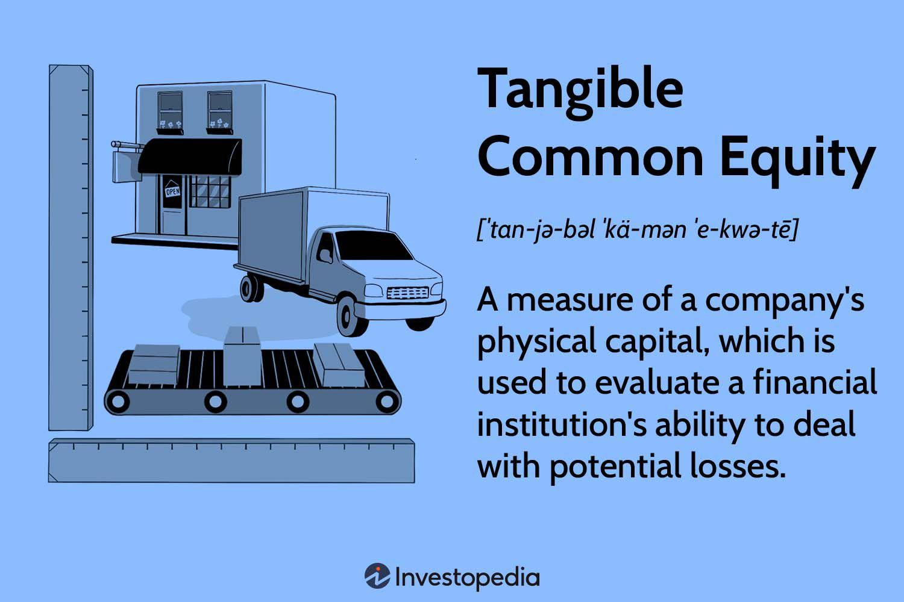

## Table of Contents

## What is Tangible Common Equity (TCE)?

Tangible Common Equity (TCE) is a measure used to assess the strength of a bank or financial institution. It represents the amount of equity left after subtracting all intangible assets and preferred equity from the total equity. Intangible assets can include things like goodwill, patents, and trademarks, which don't have a physical form. Preferred equity refers to stock that has a higher claim on assets and earnings than common stock.

TCE is important because it gives a clearer picture of a bank's financial health by focusing on what's truly tangible and readily available to cover losses. Investors and analysts often use TCE to compare the financial stability of different banks. A higher TCE means the bank has more tangible assets to fall back on, which can be reassuring in times of financial stress.

## How is Tangible Common Equity calculated?

Tangible Common Equity (TCE) is calculated by starting with the total equity of a bank. Total equity is what the bank's owners have invested plus any profits that have been kept in the bank. From this total equity, you subtract two things: intangible assets and preferred equity. Intangible assets are things you can't touch, like goodwill or trademarks. Preferred equity is a type of stock that gets paid before common stock if the bank is sold or goes bankrupt.

Once you subtract these two things from the total equity, what you have left is the Tangible Common Equity. This number shows how much real, tangible value the bank has that common shareholders can claim. It's a useful measure because it helps people see how strong and stable a bank really is, without counting things that can't be easily sold or used to pay off debts.

## Why is Tangible Common Equity important for a bank's financial health?

Tangible Common Equity is important for a bank's financial health because it shows how much real value the bank has that can be used to cover losses. It's like looking at the bank's safety net. If a bank has a lot of tangible common equity, it means they have more solid assets to rely on if things go wrong. This makes the bank stronger and more able to handle tough times, which is good for everyone who has money in the bank.

People who invest in banks, like shareholders, care a lot about tangible common equity. They want to know that the bank they invest in is strong and safe. By looking at the tangible common equity, investors can see past the fancy stuff like goodwill or trademarks and focus on what really matters - the hard assets that can be sold or used if needed. This helps them decide if the bank is a good place to put their money.

## How does TCE differ from other equity measures like Total Equity?

Tangible Common Equity (TCE) is different from Total Equity because TCE only counts the real, touchable stuff a bank owns. Total Equity includes everything, even things you can't touch like goodwill or trademarks. These are called intangible assets. TCE takes away these intangible assets and also subtracts preferred equity, which is a special kind of stock that gets paid before common stock. So, TCE is like the leftover money that common shareholders can claim if the bank sells everything it owns.

The main reason TCE is different and important is that it gives a clearer picture of how strong a bank really is. Total Equity might make a bank look good because it counts everything, but TCE focuses on what's solid and can be used to pay off debts if things go wrong. This makes TCE a better measure for understanding a bank's true financial health and how well it can handle tough times.

## What are the components that make up Tangible Common Equity?

Tangible Common Equity (TCE) is made up of what's left after taking some things away from the total equity of a bank. Total equity is all the money that the bank's owners have put in, plus any profits the bank has kept. But to get TCE, you need to subtract intangible assets and preferred equity from this total equity. Intangible assets are things you can't touch, like goodwill or trademarks. Preferred equity is a special kind of stock that gets paid before common stock if the bank is sold or goes bankrupt.

The reason we do this is to see how much real, solid value the bank has. TCE is important because it shows what the bank can actually use to cover losses. It's like looking at the bank's safety net. If a bank has a lot of tangible common equity, it means they have more hard assets to fall back on if things go wrong. This makes the bank stronger and more able to handle tough times, which is good for everyone who has money in the bank.

## Can you explain the role of intangible assets in the context of TCE?

Intangible assets are things a bank owns that you can't touch or see, like goodwill, trademarks, or patents. These are different from tangible assets, which are physical things like buildings or cash. When we talk about Tangible Common Equity (TCE), we take away these intangible assets from the total equity of the bank. This is because TCE is all about the real, solid stuff that the bank can use if it needs to cover losses.

Intangible assets don't help much if the bank runs into trouble because you can't sell them quickly or use them to pay off debts. That's why TCE is important - it shows how much hard value the bank has that common shareholders can claim. By subtracting intangible assets, TCE gives a clearer picture of the bank's strength and its ability to handle tough times, making it a better measure for investors and analysts who want to know how safe their money is.

## How does TCE impact a bank's ability to absorb losses?

Tangible Common Equity (TCE) is like a bank's safety net. It shows how much real, solid money the bank has to cover losses if things go wrong. TCE is what's left after taking away things you can't touch, like goodwill or trademarks, and special stocks called preferred equity. When a bank has a lot of TCE, it means they have more hard assets to fall back on. This makes the bank stronger and better able to handle tough times without going broke.

If a bank has high TCE, it can absorb losses better because it has more real money to use. This is important for everyone who has money in the bank because it means their money is safer. Investors and people who study banks like to look at TCE because it shows the true strength of the bank, not just the fancy stuff that can't be sold quickly. So, a bank with high TCE is seen as more stable and trustworthy.

## What are the regulatory requirements related to Tangible Common Equity?

Regulatory requirements for Tangible Common Equity (TCE) are set by financial authorities to make sure banks are strong and safe. These rules are there to help banks keep enough real money to handle tough times. Different countries have different rules, but many regulators look at TCE as part of a bigger picture of a bank's health. They want to see that banks have enough TCE to cover losses and keep running smoothly, even if the economy gets bad.

In the United States, for example, the Federal Reserve and other agencies use TCE as part of their stress tests. These tests check if banks can handle big financial problems. If a bank's TCE is too low, it might need to get more money or sell some assets to meet the rules. This helps keep the whole banking system stable and protects people's money.

## How do investors use TCE to assess the risk of a bank?

Investors use Tangible Common Equity (TCE) to figure out how risky it is to put their money into a bank. TCE is like the real, solid money a bank has after taking away things you can't touch, like goodwill or trademarks, and special stocks called preferred equity. When a bank has a lot of TCE, it means they have more hard assets to fall back on if things go wrong. This makes the bank seem safer to investors because there's more real money to cover losses.

By looking at TCE, investors can see past the fancy stuff and focus on what really matters - the bank's true strength. If a bank's TCE is low, it might be riskier because it doesn't have as much real money to handle tough times. Investors want to know this because they want their money to be safe. So, a high TCE can make a bank look more stable and trustworthy, helping investors decide if it's a good place to invest their money.

## What trends have been observed in TCE ratios over the past decade?

Over the past decade, the Tangible Common Equity (TCE) ratios for banks have shown some interesting changes. After the big financial crisis around 2008, banks started working hard to get more TCE. This was because regulators and investors wanted to make sure banks had enough real money to handle tough times. So, many banks sold off some of their businesses or got rid of things they couldn't touch, like goodwill. This helped them boost their TCE ratios, making them look stronger and safer.

In recent years, the trend has been a bit different. As the economy got better, some banks started to grow again by buying other companies or investing in new areas. This can sometimes lower their TCE ratios because it adds back some of those things you can't touch. But overall, TCE ratios have stayed pretty stable because banks are still careful to keep enough real money to cover losses. Investors keep a close eye on these ratios to make sure the banks they invest in are still strong and safe.

## How does TCE influence a bank's capital structure and funding strategy?

Tangible Common Equity (TCE) plays a big role in how a bank sets up its capital structure and plans its funding. TCE is the real, solid money a bank has after taking away things you can't touch, like goodwill, and special stocks called preferred equity. When a bank has a lot of TCE, it means they have more hard assets to fall back on if things go wrong. This makes the bank look safer and stronger to investors and regulators. Because of this, banks with high TCE might not need to borrow as much money or sell new stocks to raise funds. They can use their own TCE to grow or handle tough times, which is good for their capital structure.

On the other hand, if a bank's TCE is low, it might need to change its funding strategy. A low TCE means the bank doesn't have as much real money to cover losses, so it might be seen as riskier. To fix this, the bank might need to sell off some businesses or get rid of intangible assets to boost its TCE. Or, it might need to borrow more money or sell new stocks to raise more capital. This can make the bank's capital structure more complicated and might cost more in the long run. So, keeping a healthy TCE is important for a bank's overall funding strategy and how it manages its money.

## What are the limitations and criticisms of using TCE as a financial metric?

Tangible Common Equity (TCE) is a useful way to see how strong a bank is, but it has some problems. One big issue is that TCE doesn't count things like goodwill or trademarks, which can be important for a bank's value. These intangible assets might not be easy to sell quickly, but they still help the bank make money. So, if a bank has a lot of these, its TCE might look lower than it should be. Also, TCE can change a lot if a bank buys or sells businesses, which can make it hard to compare different banks or see how a bank is doing over time.

Another criticism is that TCE focuses too much on what's left after taking away intangible assets and preferred equity. This can make a bank seem weaker than it really is. Some people think that other measures, like total equity or different ratios, might give a better picture of a bank's overall health. Also, TCE doesn't tell you everything about a bank's risks or how well it's run. So, while TCE is helpful, it's not perfect, and investors and regulators need to look at other things too to get the full story.

## What is Tangible Common Equity (TCE)?

Tangible Common Equity (TCE) is a financial metric designed to provide a clear view of a company's physical capital by excluding intangible assets and preferred equity from the evaluation. Unlike other capital measures, TCE focuses solely on the elements of equity that are readily available and tangible, offering a conservative assessment of a company's capacity to absorb potential financial losses. This makes it particularly relevant for financial institutions where the distinction between tangible and intangible assets is critical.

The primary purpose of TCE is to assess a company's ability to endure financial adversities by focusing on the most liquid and readily available forms of capital. Intangible assets such as goodwill, patents, and trademarks, although valuable, do not offer immediate liquidity and are more challenging to convert into cash in times of stress. Similarly, preferred equity represents ownership claims that are subordinate to debt but rank above common equity in the event of liquidation, thus affecting the common equity holders' potential returns and risk profile.

Financial institutions, especially those with a significant amount of preferred stock, frequently use TCE to compare their capital structures against peers. By stripping out intangible assets and preferred stock, analysts can gain a clearer understanding of the equity that is genuinely at risk for common shareholders, providing insights into a financial institution's true net worth.

Calculating TCE involves subtracting intangible assets, such as goodwill and patents, and preferred equity from the company's total equity. The formula for TCE is typically expressed as:

$$
\text{TCE} = \text{Total Shareholder's Equity} - \text{Intangible Assets} - \text{Preferred Equity}
$$

This metric offers a straightforward yet reliable approach to understanding a company's financial resilience and serves as a critical tool for investors and financial analysts seeking a conservative gauge of financial health. In summary, TCE provides a snapshot of the equity capital truly available to absorb losses, setting aside assets that do not offer immediate [liquidity](/wiki/liquidity-risk-premium).

## How is Tangible Common Equity Calculated?

Calculating Tangible Common Equity (TCE) is essential for assessing a company's financial robustness, particularly in financial institutions. The process begins by determining the company's book value, which is the total value of the company’s assets as recorded on the balance sheet. From this book value, both intangible assets and preferred equity must be subtracted to derive the TCE.

Mathematically, the formula to calculate TCE is:

$$
\text{TCE} = \text{Book Value} - \text{Intangible Assets} - \text{Preferred Equity}
$$

Intangible assets typically include non-physical assets such as goodwill, trademarks, and patents. These are deducted because they cannot be utilized to absorb financial losses or provide liquidity in distress scenarios. Preferred equity is also excluded as it has a higher claim on assets than common equity, which potentially limits its utility in loss absorption.

An extension of this calculation is the TCE ratio, which evaluates a company's capital adequacy. The TCE ratio is calculated by dividing the Tangible Common Equity by the company's tangible assets:

$$
\text{TCE Ratio} = \frac{\text{TCE}}{\text{Tangible Assets}}
$$

Tangible assets are calculated by subtracting intangible assets from total assets. The TCE ratio serves as an indicator of a company’s financial stability and is particularly useful for evaluating the solvency of banks. It provides insights into how much tangible equity is available to cover potential losses, thus helping in determining the capital adequacy and stability of the institution. This ratio is valuable for analysts and investors when assessing the risk profile of banks, especially during periods of financial uncertainty.

## What is an Example of Tangible Common Equity?

For instance, consider XYZ Bank, which has a book value of $300 billion. This value includes both tangible and intangible assets. Among these, $50 billion is accounted for as goodwill, representing intangible assets that cannot be readily converted into cash in the event of financial difficulty. Additionally, the bank holds $20 billion in preferred stock, which constitutes a financial obligation primarily benefiting preferred shareholders over common equity holders.

To calculate the Tangible Common Equity (TCE) of XYZ Bank, one would subtract both the intangible assets and the preferred stock from the total book value. The formula is as follows:

$$
\text{TCE} = \text{Book Value} - \text{Intangible Assets} - \text{Preferred Equity}
$$

Applying this formula to XYZ Bank:

$$
\text{TCE} = 300 \, \text{billion} - 50 \, \text{billion} - 20 \, \text{billion} = 230 \, \text{billion}
$$

This computation shows that the tangible common equity of XYZ Bank is $230 billion. The TCE figure reflects the bank's actual physical capital that could potentially be used to cover losses, providing a more realistic view of its financial stability. By focusing on tangible assets, this metric presents a clearer picture of the resources available to counterbalance liabilities, thereby offering insight into the bank's resilience in adverse economic scenarios.

## References & Further Reading

[1]: ["Advances in Financial Machine Learning"](https://www.amazon.com/Advances-Financial-Machine-Learning-Marcos/dp/1119482089) by Marcos Lopez de Prado

[2]: ["Evidence-Based Technical Analysis: Applying the Scientific Method and Statistical Inference to Trading Signals"](https://www.amazon.com/Evidence-Based-Technical-Analysis-Scientific-Statistical/dp/0470008741) by David Aronson

[3]: ["Machine Learning for Algorithmic Trading"](https://github.com/stefan-jansen/machine-learning-for-trading) by Stefan Jansen

[4]: ["Quantitative Trading: How to Build Your Own Algorithmic Trading Business"](https://www.amazon.com/Quantitative-Trading-Build-Algorithmic-Business/dp/1119800064) by Ernest P. Chan

[5]: Penman, S. H. (2007). ["Financial Statement Analysis and Security Valuation,"](https://archive.org/details/financialstateme0000penm) McGraw-Hill Education.

[6]: Basel Committee on Banking Supervision. (2011). ["Basel III: A global regulatory framework for more resilient banks and banking systems."](https://www.bis.org/publ/bcbs189.htm) Bank for International Settlements.

[7]: Tarullo, D. K. (2014). ["Rethinking the Aims of Prudential Regulation"](https://www.bis.org/review/r140509d.pdf) in the framework of post-crisis financial reform.