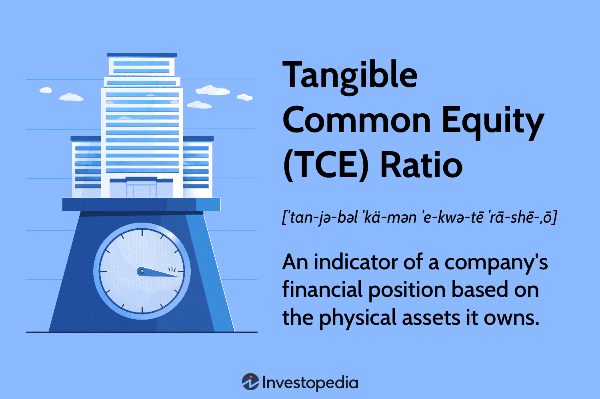

In equity finance, understanding the metrics that gauge a company's financial health is crucial. Among these metrics, Tangible Common Equity (TCE) stands out as a vital indicator of a company's ability to absorb losses, thereby offering a clear picture of its financial resilience. TCE plays a significant role in evaluating a company's physical capital by eliminating intangible assets and preferred equity from the analysis. This makes it particularly relevant in assessing the stability and solvency of financial institutions, such as banks, which often hold a considerable amount of intangible assets and preferred stock.

In equity finance, TCE serves as a conservative measure of a company's capacity to withstand financial shocks and cover potential losses. This is especially important during periods of economic uncertainty, where investors and analysts prioritize robust indicators of financial health. TCE becomes a critical component in the toolkit of equity finance professionals, providing insights that can influence investment strategies and risk assessment.



The relevance of TCE extends to the fast-paced domain of algorithmic trading. Here, TCE is leveraged as a critical input for models that evaluate the risk levels of financial institutions. Algorithms employ TCE to make informed trading decisions, ensuring that capital is allocated efficiently and potentially identifying undervalued stocks with strong financial resilience. Understanding the nuances of TCE can significantly benefit those involved in equity finance and algorithmic trading, highlighting the metric's importance in making well-grounded financial decisions. This article explores the definition, calculation, and significance of TCE, focusing on its impact in equity finance and algorithmic trading to provide a comprehensive overview of its value.

## Table of Contents

## What Is Tangible Common Equity (TCE)?

Tangible Common Equity (TCE) is a financial metric designed to provide a clear view of a company's physical capital by excluding intangible assets and preferred equity from the evaluation. Unlike other capital measures, TCE focuses solely on the elements of equity that are readily available and tangible, offering a conservative assessment of a company's capacity to absorb potential financial losses. This makes it particularly relevant for financial institutions where the distinction between tangible and intangible assets is critical.

The primary purpose of TCE is to assess a company's ability to endure financial adversities by focusing on the most liquid and readily available forms of capital. Intangible assets such as goodwill, patents, and trademarks, although valuable, do not offer immediate liquidity and are more challenging to convert into cash in times of stress. Similarly, preferred equity represents ownership claims that are subordinate to debt but rank above common equity in the event of liquidation, thus affecting the common equity holders' potential returns and risk profile.

Financial institutions, especially those with a significant amount of preferred stock, frequently use TCE to compare their capital structures against peers. By stripping out intangible assets and preferred stock, analysts can gain a clearer understanding of the equity that is genuinely at risk for common shareholders, providing insights into a financial institution's true net worth.

Calculating TCE involves subtracting intangible assets, such as goodwill and patents, and preferred equity from the company's total equity. The formula for TCE is typically expressed as:

$$
\text{TCE} = \text{Total Shareholder's Equity} - \text{Intangible Assets} - \text{Preferred Equity}
$$

This metric offers a straightforward yet reliable approach to understanding a company's financial resilience and serves as a critical tool for investors and financial analysts seeking a conservative gauge of financial health. In summary, TCE provides a snapshot of the equity capital truly available to absorb losses, setting aside assets that do not offer immediate [liquidity](/wiki/liquidity-risk-premium).

## Calculation of Tangible Common Equity

Calculating Tangible Common Equity (TCE) is essential for assessing a company's financial robustness, particularly in financial institutions. The process begins by determining the company's book value, which is the total value of the company’s assets as recorded on the balance sheet. From this book value, both intangible assets and preferred equity must be subtracted to derive the TCE.

Mathematically, the formula to calculate TCE is:

$$
\text{TCE} = \text{Book Value} - \text{Intangible Assets} - \text{Preferred Equity}
$$

Intangible assets typically include non-physical assets such as goodwill, trademarks, and patents. These are deducted because they cannot be utilized to absorb financial losses or provide liquidity in distress scenarios. Preferred equity is also excluded as it has a higher claim on assets than common equity, which potentially limits its utility in loss absorption.

An extension of this calculation is the TCE ratio, which evaluates a company's capital adequacy. The TCE ratio is calculated by dividing the Tangible Common Equity by the company's tangible assets:

$$
\text{TCE Ratio} = \frac{\text{TCE}}{\text{Tangible Assets}}
$$

Tangible assets are calculated by subtracting intangible assets from total assets. The TCE ratio serves as an indicator of a company’s financial stability and is particularly useful for evaluating the solvency of banks. It provides insights into how much tangible equity is available to cover potential losses, thus helping in determining the capital adequacy and stability of the institution. This ratio is valuable for analysts and investors when assessing the risk profile of banks, especially during periods of financial uncertainty.

## Importance of TCE in Equity Finance

Tangible Common Equity (TCE) serves as a critical metric for investors and analysts in evaluating the financial stability of banks and other financial firms. This metric offers a conservative measure of a company's ability to cover potential losses and endure financial shocks. TCE is derived from the company's equity by excluding intangible assets and preferred equity, thus providing a clearer picture of the firm's physical capital.

During economic downturns, TCE becomes particularly significant. The financial crisis of 2008 underscored the importance of concrete measures of financial health, as many institutions faced solvency issues due to inadequate capital buffers. Investors relied heavily on TCE to assess the robustness of banks' financial positions. Unlike metrics that include intangible assets, which may not be readily convertible to cash, TCE focuses on tangible equity, ensuring a more realistic assessment of what an institution can use to offset losses.

The preference for TCE during unstable economic conditions stems from its straightforwardness in depicting how much capital a company truly has at its disposal. By stripping away intangibles, TCE illuminates the hard assets available to absorb potential losses, thereby enabling better risk assessment and comparison across firms. Additionally, legislative and regulatory shifts post-crisis have highlighted the importance of maintaining adequate TCE levels, thereby reinforcing this metric's role in strategic decision-making and risk management within the financial sector. 

Ultimately, TCE empowers investors with a robust analytical tool, facilitating informed decisions and prudent investment strategies, particularly in times of economic uncertainty.

## TCE and Algorithmic Trading

Tangible Common Equity (TCE) plays a pivotal role in [algorithmic trading](/wiki/algorithmic-trading) by acting as a critical input for models that evaluate the risk levels of financial institutions. Algorithms in trading platforms employ TCE as a metric to make informed decisions regarding the allocation of capital, thereby enhancing the efficiency of trading strategies. The utilization of TCE helps in identifying potentially undervalued stocks that exhibit strong financial resilience, often leading to better investment outcomes.

Algorithmic trading models analyze TCE as part of a broader set of financial health indicators. This metric allows algorithms to assess a company's ability to absorb financial shocks, a [factor](/wiki/factor-investing) crucial for risk assessment. The robust evaluation of TCE ensures that trading decisions align with the goal of minimizing exposure to poorly capitalized firms, which might struggle under economic pressure.

The integration of TCE into algorithmic systems is straightforward and can be illustrated with a simple Python example:

```python
def calculate_tce(book_value, intangible_assets, preferred_equity):
    """
    Calculate Tangible Common Equity (TCE).

    Parameters:
    book_value (float): Total book value of the company.
    intangible_assets (float): Total intangible assets of the company.
    preferred_equity (float): Total preferred equity of the company.

    Returns:
    float: Tangible Common Equity (TCE).
    """
    return book_value - intangible_assets - preferred_equity

# Example Usage
book_value = 300e9  # $300 billion
goodwill = 50e9     # $50 billion
preferred_stock = 20e9 # $20 billion

tce = calculate_tce(book_value, goodwill, preferred_stock)
print(f"The Tangible Common Equity (TCE) is: ${tce / 1e9} billion")
```

This practical example demonstrates the TCE calculation process in a simplified form, which can be incorporated into larger algorithmic trading systems. Understanding these calculations ensures algorithms can effectively evaluate the physical capital necessary to endure financial adversities.

TCE metrics refine the algorithms' capacity to target investments in financially stable companies, thus optimizing portfolio performance during uncertain market conditions. By focusing on TCE, algorithms gain insight into the core financial strength of institutions, permitting traders to develop strategies that are both informed and resilient to market turbulence.

## Example of Tangible Common Equity

For instance, consider XYZ Bank, which has a book value of $300 billion. This value includes both tangible and intangible assets. Among these, $50 billion is accounted for as goodwill, representing intangible assets that cannot be readily converted into cash in the event of financial difficulty. Additionally, the bank holds $20 billion in preferred stock, which constitutes a financial obligation primarily benefiting preferred shareholders over common equity holders.

To calculate the Tangible Common Equity (TCE) of XYZ Bank, one would subtract both the intangible assets and the preferred stock from the total book value. The formula is as follows:

$$
\text{TCE} = \text{Book Value} - \text{Intangible Assets} - \text{Preferred Equity}
$$

Applying this formula to XYZ Bank:

$$
\text{TCE} = 300 \, \text{billion} - 50 \, \text{billion} - 20 \, \text{billion} = 230 \, \text{billion}
$$

This computation shows that the tangible common equity of XYZ Bank is $230 billion. The TCE figure reflects the bank's actual physical capital that could potentially be used to cover losses, providing a more realistic view of its financial stability. By focusing on tangible assets, this metric presents a clearer picture of the resources available to counterbalance liabilities, thereby offering insight into the bank's resilience in adverse economic scenarios.

## Special Considerations

While Tangible Common Equity (TCE) offers valuable insights into a company's financial robustness, it is not mandated by Generally Accepted Accounting Principles (GAAP) or banking regulations, which may lead to it being occasionally overlooked in favor of more standardized metrics. This lack of mandatory status means that TCE might not consistently appear in financial reports, potentially limiting its visibility to investors and analysts unless specifically calculated.

An important aspect of calculating TCE is the treatment of intangible assets. Intangible assets such as goodwill are typically subtracted from a company's book value to ascertain its tangible equity. However, there are exceptions, particularly when it comes to patents. If a patent holds a significant liquidation value, it may be excluded from the intangible assets deducted in a TCE calculation. The potential liquidation value of patents can enhance a company's tangible assets, impacting the assessment of its financial stability.

In addition to TCE, metrics such as Tier 1 capital are crucial in evaluating the financial health of companies, especially financial institutions. Tier 1 capital, which includes core capital elements such as common stock and disclosed reserves, is critical for measuring a bank's financial strength from a regulatory perspective. Together, TCE and Tier 1 capital provide a comprehensive view of a company's capitalization, accounting for both tangible and regulatory financial aspects.

Overall, while TCE is not a regulatory requirement, its calculation can offer insightful nuances into an organization's financial condition. By understanding and incorporating TCE alongside other financial metrics, stakeholders can gain a nuanced perspective of a company's capability to absorb financial shocks and endure economic fluctuations.

## Conclusion

Tangible Common Equity (TCE) remains a critical instrument for assessing the financial robustness and stability of companies engaged in equity finance. Investors and algorithmic trading systems frequently incorporate TCE as a key parameter in their evaluative processes. By focusing on TCE, investors gain a more conservative and realistic view of a company's ability to weather financial adversity, as TCE excludes intangibles and non-common equity items that might otherwise skew assessments of financial soundness. Algorithmic trading systems also benefit from the rigorous financial insights that TCE provides, allowing them to identify investment opportunities characterized by strong fundamental stability and lower risk profiles.

Although TCE is not a mandated metric under Generally Accepted Accounting Principles (GAAP) or stringent regulatory frameworks, it offers distinct advantages. Understanding and utilizing TCE as part of a broader toolkit enables investment professionals to pivot quickly in dynamic financial environments, thus securing a strategic edge. In an era where financial resilience is of paramount concern, leveraging TCE can significantly enhance decision-making processes and optimize capital allocation in market operations.

## References & Further Reading

[1]: ["Advances in Financial Machine Learning"](https://www.amazon.com/Advances-Financial-Machine-Learning-Marcos/dp/1119482089) by Marcos Lopez de Prado

[2]: ["Evidence-Based Technical Analysis: Applying the Scientific Method and Statistical Inference to Trading Signals"](https://www.amazon.com/Evidence-Based-Technical-Analysis-Scientific-Statistical/dp/0470008741) by David Aronson

[3]: ["Machine Learning for Algorithmic Trading"](https://github.com/stefan-jansen/machine-learning-for-trading) by Stefan Jansen

[4]: ["Quantitative Trading: How to Build Your Own Algorithmic Trading Business"](https://www.amazon.com/Quantitative-Trading-Build-Algorithmic-Business/dp/1119800064) by Ernest P. Chan

[5]: Penman, S. H. (2007). ["Financial Statement Analysis and Security Valuation,"](https://archive.org/details/financialstateme0000penm) McGraw-Hill Education.

[6]: Basel Committee on Banking Supervision. (2011). ["Basel III: A global regulatory framework for more resilient banks and banking systems."](https://www.bis.org/publ/bcbs189.htm) Bank for International Settlements.

[7]: Tarullo, D. K. (2014). ["Rethinking the Aims of Prudential Regulation"](https://www.bis.org/review/r140509d.pdf) in the framework of post-crisis financial reform.