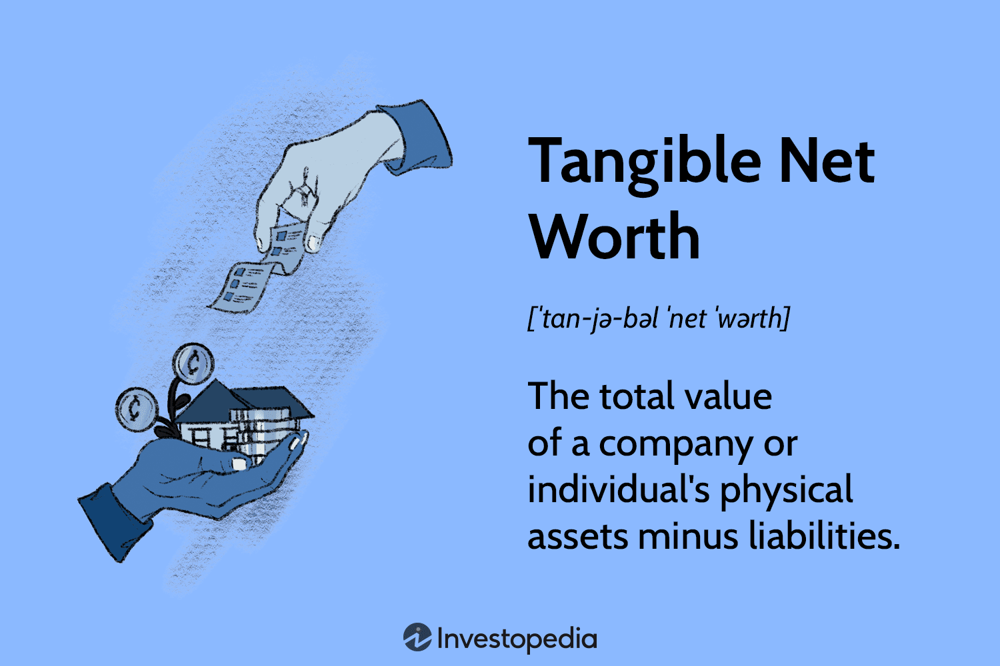

## Table of Contents

## What is Tangible Net Worth?

Tangible Net Worth is the total value of a person's or company's assets minus their liabilities and intangible assets. Assets are things you own that have value, like money, property, or investments. Liabilities are debts or obligations, like loans or bills you need to pay. Intangible assets are things that have value but you can't touch, like patents or trademarks.

Calculating Tangible Net Worth helps you understand the real, physical value of what you own after paying off all your debts. It's useful for businesses to show how financially healthy they are without counting things like brand value or intellectual property. For individuals, it can help in planning finances or when applying for loans, as it shows lenders a clear picture of your financial standing.

## How is Tangible Net Worth calculated?

To calculate Tangible Net Worth, start by adding up all your assets. Assets are things you own that have value, like cash, bank accounts, investments, and property. Once you have the total value of your assets, subtract your liabilities. Liabilities are what you owe, like loans, credit card debt, or any other bills you need to pay. This gives you your Net Worth.

Next, you need to take away the value of your intangible assets from your Net Worth. Intangible assets are things you can't touch but still have value, like patents, trademarks, or goodwill. Subtracting these from your Net Worth gives you your Tangible Net Worth. This number shows the real, physical value of what you own after paying off all your debts and not counting things like brand value or intellectual property.

## Why is Tangible Net Worth important for individuals?

Tangible Net Worth is important for individuals because it shows how much they are really worth in terms of things they can touch and use. It tells you the value of your money, house, car, and other stuff after you pay off all your debts. This helps you see if you are doing well financially or if you need to save more or spend less. Knowing your Tangible Net Worth can help you make smart choices about money, like whether you can afford to buy a new car or if you should wait.

It's also important when you want to borrow money, like getting a loan for a house or starting a business. Banks and lenders look at your Tangible Net Worth to decide if you can pay back the loan. If your Tangible Net Worth is high, it shows you have enough valuable things to cover your debts, making you a safer bet for the lender. So, understanding and keeping track of your Tangible Net Worth can help you plan your finances better and improve your chances of getting loans when you need them.

## How does Tangible Net Worth differ from Net Worth?

Tangible Net Worth and Net Worth are similar but different. Net Worth is all the stuff you own, like money, house, and car, minus all the money you owe, like loans and bills. It's a big picture of your money situation, including things you can't touch, like the value of your ideas or brand.

Tangible Net Worth is more specific. It's like Net Worth, but you take away the value of things you can't touch. So, it's just the value of the stuff you own that you can see and use, after you pay off all your debts. This helps you see how much real, physical stuff you have that you could sell or use if you needed money.

## Can you provide an example of calculating Tangible Net Worth for a business?

Let's say there's a small bakery called "Sweet Treats." They want to figure out their Tangible Net Worth. First, they add up all their assets: they have $10,000 in the bank, their baking equipment is worth $5,000, and their store is valued at $50,000. So, their total assets are $65,000. Next, they subtract their liabilities: they owe $20,000 on a loan and $5,000 in other bills. So, their liabilities are $25,000. Subtracting liabilities from assets gives them a Net Worth of $40,000.

Now, to find their Tangible Net Worth, they need to subtract the value of any intangible assets. Sweet Treats has a trademark worth $5,000. So, they subtract this from their Net Worth: $40,000 - $5,000 = $35,000. This $35,000 is their Tangible Net Worth. It shows the real, physical value of what they own after paying off all their debts and not counting things like their trademark.

## What are common assets included in Tangible Net Worth?

Common assets included in Tangible Net Worth are things you can see and touch. These include money in the bank, which is cash you have saved up. It also includes property, like a house or land that you own. Another type of asset is personal items, like a car, furniture, or jewelry that have value. Businesses might also include things like their equipment, inventory, or machinery that they use to make or sell their products.

For a business, tangible assets could also include their store or office building if they own it. They might count the value of their vehicles if they use them for work, like delivery trucks or company cars. All these things add up to the total value of tangible assets, which helps figure out the Tangible Net Worth after subtracting what they owe.

## What liabilities are typically subtracted when determining Tangible Net Worth?

When figuring out Tangible Net Worth, you need to subtract liabilities, which are all the money you owe. This includes loans, like a mortgage for your house or a car loan. It also covers credit card debt, which is money you've spent on your credit cards that you haven't paid back yet. Any bills you owe, like utility bills or medical bills, are also part of your liabilities.

For businesses, liabilities can also include money they owe to suppliers, called accounts payable. If a business has taken out a business loan or has a line of credit they're using, those are liabilities too. Even things like unpaid taxes or wages owed to employees count as liabilities that need to be subtracted when calculating Tangible Net Worth.

## How can an individual or business improve their Tangible Net Worth?

Improving Tangible Net Worth means increasing what you own and decreasing what you owe. For individuals, this can start with saving more money. Putting money into a savings account or investing in things like stocks or real estate can help grow your assets. Another way is to pay off debts faster. By paying more than the minimum on loans or credit cards, you can reduce your liabilities. Selling things you don't need, like old furniture or a second car, can also add to your tangible assets.

For businesses, improving Tangible Net Worth involves similar steps. They can focus on increasing profits by selling more products or services, which adds to their cash reserves. Cutting costs can also help, as it frees up more money to pay down debts or invest in new equipment. Businesses might also sell off unused assets, like old machinery or extra property, to boost their tangible assets. By managing their finances wisely, both individuals and businesses can see their Tangible Net Worth grow over time.

## What role does Tangible Net Worth play in financial planning?

Tangible Net Worth is a big part of financial planning because it shows you the real value of what you own after paying off your debts. It helps you see if you're doing well financially or if you need to make changes. For example, if your Tangible Net Worth is low, it might mean you need to save more money or pay off your debts faster. This can guide you in setting goals, like saving for a house or paying off credit cards, so you can improve your financial health.

For businesses, Tangible Net Worth is important for planning growth and managing money. It tells them how much real stuff they have that they can use or sell if they need money. A high Tangible Net Worth can help a business get loans to expand or invest in new equipment. By keeping an eye on their Tangible Net Worth, businesses can make smart decisions about spending, saving, and investing to keep their finances strong and grow over time.

## How do lenders use Tangible Net Worth when assessing loan applications?

Lenders use Tangible Net Worth to see if someone can pay back a loan. When you ask for a loan, like for a house or a business, the bank wants to know if you have enough stuff that you can sell or use to cover the loan if you can't pay it back. They look at your Tangible Net Worth to see how much real, physical stuff you own after paying off all your debts. If your Tangible Net Worth is high, it tells the lender that you have a lot of valuable things, which makes you a safer bet for them.

If your Tangible Net Worth is low, it might be harder to get a loan. Lenders might think you don't have enough to cover the loan if something goes wrong. So, they might say no to your loan or ask for a bigger down payment or higher interest rates. Knowing your Tangible Net Worth helps you understand what lenders see and can help you plan better before you apply for a loan.

## What are the limitations of using Tangible Net Worth as a financial metric?

Tangible Net Worth has some limits when you use it to check how well someone is doing with money. It only looks at stuff you can touch and use, like money, houses, and cars. But it misses out on things you can't touch, like the value of a business's brand or special ideas they own, called intangible assets. These things can be really important for a business and can make it worth more money. So, if you only look at Tangible Net Worth, you might not see the full picture of how much something is really worth.

Another problem is that Tangible Net Worth doesn't tell you about other important money stuff, like how much money you make each month or how good you are at managing money. Someone might have a high Tangible Net Worth but still have trouble paying bills if they don't have enough money coming in. Also, the value of things like houses can go up and down, so Tangible Net Worth can change a lot over time. This makes it hard to use it alone to plan for the future or make big money decisions.

## How does Tangible Net Worth impact the valuation of a company during mergers and acquisitions?

When companies are thinking about merging or one company wants to buy another, they look at the Tangible Net Worth to see how much the company is really worth. Tangible Net Worth shows the value of all the physical stuff the company owns, like buildings, machines, and money in the bank, after they pay off all their debts. If a company has a high Tangible Net Worth, it means they have a lot of valuable things that can be sold or used, which makes the company more attractive to buy. Buyers like to see a high Tangible Net Worth because it gives them something solid to rely on if they need to get money back from their investment.

But, Tangible Net Worth is just one part of the story. It doesn't show the value of things like the company's brand or special ideas they own, which can be very important and add a lot of value. So, while a high Tangible Net Worth can make a company look good, buyers also look at other things like how much money the company makes, how good their customers are, and how well they can keep making money in the future. All these things together help decide how much a company is worth during a merger or acquisition, not just the Tangible Net Worth alone.

## What is the Formula and Calculation of Tangible Net Worth?

The tangible net worth of a company or individual is a metric that provides insight into the financial foundation by focusing on physical, liquidatable assets. The calculation of tangible net worth can be represented by the formula:

$$
\text{Tangible Net Worth} = \text{Total Assets} - \text{Liabilities} - \text{Intangible Assets}
$$

Understanding the three components of the formula is crucial for an accurate calculation.

**1. Total Assets:** These include all resources owned by an entity that have economic value. Total assets can be found on the balance sheet and typically encompass cash, inventory, property, equipment, and investments. For example, consider a company with $500,000 in cash, $200,000 in inventory, and $300,000 in property and equipment. The total assets would be $500,000 + $200,000 + $300,000 = $1,000,000.

**2. Liabilities:** These represent the debts and obligations of the company or individual. They can range from loans and mortgages to accounts payable and any other financial responsibilities that must be settled. For instance, if the same company has a mortgage of $150,000 and accounts payable of $50,000, total liabilities would be calculated as $150,000 + $50,000 = $200,000.

**3. Intangible Assets:** These are non-physical assets such as patents, trademarks, goodwill, and intellectual property. These assets, while valuable, do not contribute to the tangible net worth as they cannot be readily liquidated into cash. Assuming the company possesses patents valued at $100,000, the value of intangible assets would be $100,000.

**Calculation Example:**

Using these figures, the tangible net worth of the company is calculated as follows:

$$
\text{Tangible Net Worth} = \$1,000,000 - \$200,000 - \$100,000 = \$700,000
$$

This tangible net worth figure of $700,000 offers a concrete view of the company’s financial status, free from the influence of non-physical assets.

**Finding Tangible Net Worth on a Balance Sheet:**

Tangible net worth is not explicitly listed on the balance sheet but can be derived from the information provided therein. The balance sheet contains detailed listings of total assets, liabilities, and occasionally, the total intangible assets. By applying the formula, stakeholders can calculate the tangible net worth, providing insight into the company's financial solidity.

**Real-World Applications:**

In practice, tangible net worth is used by investors and analysts to assess a company's baseline value, devoid of less secure intangible assets. It is particularly useful when evaluating the asset quality of companies in capital-intensive industries, such as manufacturing, where physical assets are a significant part of the company’s operations and value.

## What is the Role of Tangible Net Worth in Financial Decision Making?

Tangible net worth plays a crucial role in financial decision-making, particularly for lenders evaluating the creditworthiness of potential borrowers. Lenders frequently assess tangible net worth as it provides a conservative estimate of a company's value by focusing strictly on physical assets, excluding intangibles like patents or goodwill. The formula for tangible net worth is:

$$
\text{Tangible Net Worth} = \text{Total Assets} - \text{Liabilities} - \text{Intangible Assets}
$$

This metric helps lenders determine the likelihood of a company's ability to meet its financial obligations, especially in times of distress. A company with a high tangible net worth is perceived as more stable and financially sound, presenting a lower risk to lenders.

Beyond lending, tangible net worth is significant in mergers and acquisitions (M&A). During these transactions, tangible net worth offers a clear picture of a company's tangible asset base, often serving as a benchmark for valuation. Buyers and investors use this metric to ensure that they are not overpaying for intangible-heavy companies, thus securing a comprehensive and realistic understanding of the asset quality involved.

Furthermore, tangible net worth is an essential component in business valuations. For organizations undergoing evaluation for potential deals, investments, or strategic decisions, tangible net worth provides a distinct measure of asset backing. This clarity is vital not only for making informed decisions but also for aligning financial strategies with realistic asset assessments.

In summary, tangible net worth underpins key financial decisions by offering a reliable view of a company's tangible asset value, influencing lending practices, M&A strategies, and business valuations. Its application ensures that financial dealings align closely with the actual asset base, promoting transparency and reducing financial risk.

## References & Further Reading

[1]: ["Advances in Financial Machine Learning"](https://www.amazon.com/Advances-Financial-Machine-Learning-Marcos/dp/1119482089) by Marcos Lopez de Prado

[2]: ["Quantitative Trading: How to Build Your Own Algorithmic Trading Business"](https://books.google.com/books/about/Quantitative_Trading.html?id=j70yEAAAQBAJ) by Ernest P. Chan

[3]: ["Valuation: Measuring and Managing the Value of Companies"](https://books.google.com/books/about/Valuation.html?id=fGXjDwAAQBAJ) by McKinsey & Company Inc.

[4]: Damodaran, A. (2012). ["Investment Valuation: Tools and Techniques for Determining the Value of Any Asset."](https://books.google.com/books/about/Investment_Valuation.html?id=5SRHAAAAQBAJ) John Wiley & Sons.

[5]: ["Principles of Corporate Finance"](https://www.mheducation.com/highered/product/principles-corporate-finance-brealey-myers/M9781264080946.html) by Richard A. Brealey, Stewart C. Myers, and Franklin Allen