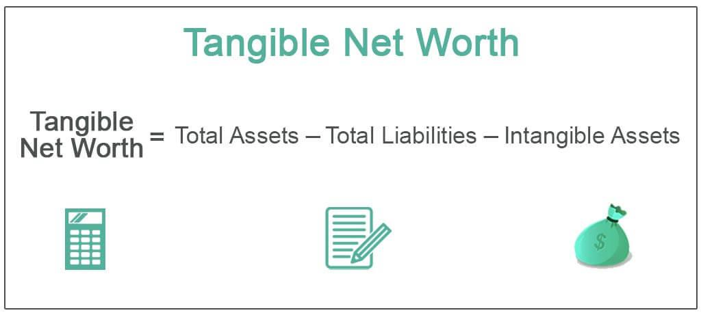

In the intricate world of finance, understanding different metrics is crucial for making informed decisions. Tangible net worth, balance sheet analysis, and algorithmic trading are key components that shape the financial landscape. These metrics offer a comprehensive framework for evaluating a company's financial health and operational efficiency, providing insights integral to investment strategies and financial planning.

Tangible net worth represents a key measure of financial solidity, focusing on an entity's physical assets while excluding intangible elements. This metric is vital for assessing the viability and risk associated with businesses, particularly during financial evaluations, loans, mergers, and acquisitions. By understanding tangible net worth, stakeholders can grasp an organization’s capacity to withstand economic pressures.



Balance sheet analysis complements tangible net worth by offering a detailed view of a company's financial stance at any given time. This approach helps investors assess asset quality and solvency, contributing to more nuanced financial evaluations. By examining balance sheets, stakeholders can identify potential financial pitfalls or opportunities.

Algorithmic trading has revolutionized the application of financial formulas in real-time. This automated trading strategy leverages mathematical models to execute trades with precision and speed, often incorporating metrics like tangible net worth to refine trading decisions. As algorithmic trading becomes more prevalent, its integration with fundamental financial metrics creates pathways for enhanced market performance and risk management.

This article explores these concepts—tangible net worth, balance sheet analysis, and algorithmic trading—providing essential insights for investors, analysts, and business owners alike. Understanding these elements offers a strategic advantage in navigating the complexities of modern finance, ultimately enabling more informed and effective decision-making.

## Table of Contents

## What is Tangible Net Worth?

Tangible net worth represents the value of a company or individual's physical assets, such as property, plant, and equipment, minus its liabilities and intangible assets like goodwill, patents, and trademarks. This metric is key for understanding financial stability, as it concentrates on assets that can be easily appraised and, if necessary, liquidated to meet financial obligations. The concept is crucial for assessing the financial health of a business because it provides a more grounded evaluation of a company's worth by excluding intangible elements that may not contribute directly to [liquidity](/wiki/liquidity-risk-premium).

The tangible net worth metric is particularly useful in the context of financial analysis and decision-making across various industries. For manufacturing companies, where physical assets form a significant portion of value, tangible net worth is a reliable indicator of the company's asset-backed strength. In contrast, for technology and service-oriented firms, where intangible assets like intellectual property play a larger role, tangible net worth may portray a more conservative financial picture. Nonetheless, it remains an essential tool since it emphasizes the value of tangible assets that can be sold off or leveraged in times of financial distress.

Investors and creditors closely monitor tangible net worth as it provides insights into a company's capacity to withstand financial difficulties. A strong tangible net worth suggests that a company has substantial asset-based backing, which increases its ability to secure financing or investments during economic downturns. It is particularly significant in industries with high capital expenditures, where understanding the asset base is crucial for evaluating future growth potential and return on investment.

Financial analysts often assess tangible net worth as part of a broader evaluation to gain a comprehensive understanding of a company's financial standing. Its implications extend to investment strategies, where tangible net worth acts as a safeguard against overvaluation due to inflated intangible assets. Consequently, equity investors often prioritize tangible net worth when scrutinizing balance sheets to ensure a conservative valuation approach, providing a clearer picture of what portion of the company's value is backed by real, appraisable assets.

In summary, tangible net worth is a pivotal measure of financial stability and health, highlighting a company's real asset-based value. Its significance varies across industries but universally aids in providing a conservative outlook on asset quality, serving as a critical tool for investors and analysts in informed decision-making.

## Formula and Calculation of Tangible Net Worth

The tangible net worth of a company or individual is a metric that provides insight into the financial foundation by focusing on physical, liquidatable assets. The calculation of tangible net worth can be represented by the formula:

$$
\text{Tangible Net Worth} = \text{Total Assets} - \text{Liabilities} - \text{Intangible Assets}
$$

Understanding the three components of the formula is crucial for an accurate calculation.

**1. Total Assets:** These include all resources owned by an entity that have economic value. Total assets can be found on the balance sheet and typically encompass cash, inventory, property, equipment, and investments. For example, consider a company with $500,000 in cash, $200,000 in inventory, and $300,000 in property and equipment. The total assets would be $500,000 + $200,000 + $300,000 = $1,000,000.

**2. Liabilities:** These represent the debts and obligations of the company or individual. They can range from loans and mortgages to accounts payable and any other financial responsibilities that must be settled. For instance, if the same company has a mortgage of $150,000 and accounts payable of $50,000, total liabilities would be calculated as $150,000 + $50,000 = $200,000.

**3. Intangible Assets:** These are non-physical assets such as patents, trademarks, goodwill, and intellectual property. These assets, while valuable, do not contribute to the tangible net worth as they cannot be readily liquidated into cash. Assuming the company possesses patents valued at $100,000, the value of intangible assets would be $100,000.

**Calculation Example:**

Using these figures, the tangible net worth of the company is calculated as follows:

$$
\text{Tangible Net Worth} = \$1,000,000 - \$200,000 - \$100,000 = \$700,000
$$

This tangible net worth figure of $700,000 offers a concrete view of the company’s financial status, free from the influence of non-physical assets.

**Finding Tangible Net Worth on a Balance Sheet:**

Tangible net worth is not explicitly listed on the balance sheet but can be derived from the information provided therein. The balance sheet contains detailed listings of total assets, liabilities, and occasionally, the total intangible assets. By applying the formula, stakeholders can calculate the tangible net worth, providing insight into the company's financial solidity.

**Real-World Applications:**

In practice, tangible net worth is used by investors and analysts to assess a company's baseline value, devoid of less secure intangible assets. It is particularly useful when evaluating the asset quality of companies in capital-intensive industries, such as manufacturing, where physical assets are a significant part of the company’s operations and value.

## Understanding Tangible Net Worth in Balance Sheet Analysis

Tangible net worth is an essential component in balance sheet analysis, providing a more conservative measure of a company's intrinsic value by excluding intangible assets such as patents, trademarks, and goodwill. These intangible assets, although valuable, can sometimes be difficult to appraise accurately and may fluctuate significantly in value during periods of market [volatility](/wiki/volatility-trading-strategies). Thus, tangible net worth offers a clearer picture of a company's baseline financial position by focusing on its physical, liquidatable assets.

In balance sheet analysis, tangible net worth assists analysts in assessing the financial solidity of a company. By examining the formula for tangible net worth—Total Assets minus Liabilities and Intangible Assets—analysts can determine a company's net book value that represents real, tangible resources. This conservative valuation helps in understanding the stability and quality of the company's asset base.

The solvency of a company, or its ability to meet long-term obligations, is closely tied to tangible net worth. A company with high tangible net worth relative to its liabilities is generally perceived as financially sound, as it suggests that the company possesses ample tangible assets to cover its debts in case of liquidation. This measure is particularly crucial for lenders and investors who seek to mitigate risks associated with financial distress.

Analysts use tangible net worth to evaluate a company's asset quality by comparing the tangible net worth across different reporting periods or against industry benchmarks. A steady increase in tangible net worth may indicate prudent management practices and sound financial health, while a decline could signal potential issues in asset utilization or increasing liabilities.

Ultimately, the analysis of tangible net worth provides analysts with critical insights into a company's financial underpinnings. By focusing on tangible assets and excluding more volatile intangible components, it equips stakeholders with the information needed to make sound financial assessments and decisions.

## The Role of Tangible Net Worth in Financial Decision Making

Tangible net worth plays a crucial role in financial decision-making, particularly for lenders evaluating the creditworthiness of potential borrowers. Lenders frequently assess tangible net worth as it provides a conservative estimate of a company's value by focusing strictly on physical assets, excluding intangibles like patents or goodwill. The formula for tangible net worth is:

$$
\text{Tangible Net Worth} = \text{Total Assets} - \text{Liabilities} - \text{Intangible Assets}
$$

This metric helps lenders determine the likelihood of a company's ability to meet its financial obligations, especially in times of distress. A company with a high tangible net worth is perceived as more stable and financially sound, presenting a lower risk to lenders.

Beyond lending, tangible net worth is significant in mergers and acquisitions (M&A). During these transactions, tangible net worth offers a clear picture of a company's tangible asset base, often serving as a benchmark for valuation. Buyers and investors use this metric to ensure that they are not overpaying for intangible-heavy companies, thus securing a comprehensive and realistic understanding of the asset quality involved.

Furthermore, tangible net worth is an essential component in business valuations. For organizations undergoing evaluation for potential deals, investments, or strategic decisions, tangible net worth provides a distinct measure of asset backing. This clarity is vital not only for making informed decisions but also for aligning financial strategies with realistic asset assessments.

In summary, tangible net worth underpins key financial decisions by offering a reliable view of a company's tangible asset value, influencing lending practices, M&A strategies, and business valuations. Its application ensures that financial dealings align closely with the actual asset base, promoting transparency and reducing financial risk.

## Algorithmic Trading and Financial Formulas

Algorithmic trading, which involves the use of computer programs to execute trading strategies at high speed and frequency, has notably influenced the application of financial formulas in real time. Tangible net worth, traditionally a static measure of a company's physical asset value, can be dynamically integrated into [algorithmic trading](/wiki/algorithmic-trading) systems to refine investment strategies.

Algorithmic trading systems utilize mathematical models to identify and exploit market inefficiencies. By incorporating tangible net worth into these models, traders can gain a deeper understanding of a company's intrinsic value. This integration can be particularly useful in value-based strategies, where the difference between market price and calculated value is exploited.

Here is a simple Python code snippet demonstrating how tangible net worth might be factored into a trading algorithm:

```python
def calculate_tangible_net_worth(total_assets, liabilities, intangible_assets):
    return total_assets - liabilities - intangible_assets

def trading_strategy(market_price, tangible_net_worth):
    if market_price < tangible_net_worth:
        return "Buy"
    elif market_price > tangible_net_worth:
        return "Sell"
    else:
        return "Hold"

# Example values
total_assets = 1000000
liabilities = 600000
intangible_assets = 100000
market_price = 350000

tangible_net_worth = calculate_tangible_net_worth(total_assets, liabilities, intangible_assets)
trade_decision = trading_strategy(market_price, tangible_net_worth)

print(f"Tangible Net Worth: {tangible_net_worth}")
print(f"Trade Decision: {trade_decision}")
```

This basic algorithm assesses whether the market price is above or below the tangible net worth, dictating buy, sell, or hold actions accordingly. It exemplifies the use of robust financial calculations to inform real-time decisions.

Further, algorithmic trading benefits from the historical data available for tangible net worth, enabling the [backtesting](/wiki/backtesting) of strategies that incorporate this metric. By analyzing past performance, traders can adjust algorithms for better future prediction, enhancing decision-making processes.

However, integrating tangible net worth with algorithmic trading requires consideration of factors such as data accuracy, latency, and the dynamic nature of financial markets. As tangible net worth typically updates quarterly with financial statements, it is crucial to [factor](/wiki/factor-investing) in the lag between reporting periods. Despite these challenges, the convergence of traditional valuation methods with modern trading technology represents a significant advancement in financial analytics, offering new levels of strategic precision.

## Limitations of Using Tangible Net Worth

Tangible net worth serves as a fundamental metric for assessing a company's financial health by emphasizing physical assets and excluding intangibles. However, this focus imposes several limitations, particularly in industries where intangible assets constitute a significant portion of a company's value.

Firstly, companies in sectors such as technology, pharmaceuticals, and media often possess substantial intangible assets in the form of intellectual property, patents, trademarks, and goodwill. Tangible net worth disregards these non-physical assets, potentially leading to an undervaluation of a firm's actual financial strength. For example, a tech company like Google, which thrives on intangible assets such as its search algorithms and brand reputation, may appear less financially robust when evaluated solely based on tangible net worth.

Secondly, industry differences significantly impact the reliability of tangible net worth as a measure of financial health. In industries where tangible assets are predominant, such as manufacturing or real estate, tangible net worth provides a meaningful perspective of a company's stability. Conversely, in industries where the creation and leveraging of intangible assets drive growth, this metric may not accurately reflect a company's potential for generating future income.

Market conditions can further complicate the utility of tangible net worth. In volatile or rapidly changing markets, the value of tangible assets can fluctuate, affecting the accurate assessment of tangible net worth. Additionally, during economic downturns, companies might struggle to liquidate physical assets at their book value, thus overstating their financial resilience.

In conclusion, while tangible net worth remains a vital tool for financial analysis, it is crucial for investors and analysts to complement this metric with an evaluation of intangible assets and consider industry-specific contexts and current market conditions for a comprehensive assessment of a company's financial health.

## Conclusion

Tangible net worth is a vital metric for understanding financial health, providing a clear view of a company's stability by focusing on physical assets, excluding intangibles. This metric offers a concrete assessment that complements other financial indicators, providing a more comprehensive understanding of the company’s standing. Recognizing the role of intangible assets is equally important, as modern businesses often derive substantial value from intellectual property, goodwill, and brand reputation. By integrating both tangible and intangible analyses, stakeholders can obtain a fuller picture of the financial health and potential of a business.

In the rapidly evolving landscape of finance, the integration of tangible net worth with algorithmic trading offers significant opportunities. Algorithms can analyze real-time data, including tangible net worth calculations, to inform trading strategies and decisions. These advancements enable investors and analysts to leverage tangible metrics in conjunction with sophisticated trading algorithms, optimizing performance and decision-making processes in dynamic markets. 

Overall, a balanced use of tangible net worth, alongside intangible asset valuation and algorithmic trading, provides a robust framework for making informed financial decisions. This comprehensive view not only enhances the accuracy of financial health assessments but also equips investors and analysts with the tools necessary to navigate the complexities of modern finance effectively.

## References & Further Reading

[1]: ["Advances in Financial Machine Learning"](https://www.amazon.com/Advances-Financial-Machine-Learning-Marcos/dp/1119482089) by Marcos Lopez de Prado

[2]: ["Quantitative Trading: How to Build Your Own Algorithmic Trading Business"](https://books.google.com/books/about/Quantitative_Trading.html?id=j70yEAAAQBAJ) by Ernest P. Chan

[3]: ["Valuation: Measuring and Managing the Value of Companies"](https://books.google.com/books/about/Valuation.html?id=fGXjDwAAQBAJ) by McKinsey & Company Inc.

[4]: Damodaran, A. (2012). ["Investment Valuation: Tools and Techniques for Determining the Value of Any Asset."](https://books.google.com/books/about/Investment_Valuation.html?id=5SRHAAAAQBAJ) John Wiley & Sons.

[5]: ["Principles of Corporate Finance"](https://www.mheducation.com/highered/product/principles-corporate-finance-brealey-myers/M9781264080946.html) by Richard A. Brealey, Stewart C. Myers, and Franklin Allen