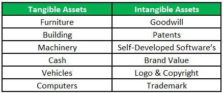

Algorithmic trading, often abbreviated as algo trading, has significantly transformed the landscape of financial markets by automating and optimizing trading decisions and executions through sophisticated computer algorithms. This advancement has led to increased trading volumes, improved market liquidity, and enhanced price efficiency. However, the complexities of algorithmic trading also introduce a variety of costs that must be understood and managed to ensure sustainable profitability.

In analyzing these costs, it is crucial to differentiate between tangible and intangible costs associated with algorithmic trading. Tangible costs are those that can be easily quantified, such as the expenses related to technology infrastructure, data management, and the employment of skilled personnel to operate and maintain trading systems. Additional tangible costs include trading fees, transaction costs, and other direct financial outlays encountered during trading activities.

Conversely, intangible costs, while less quantifiable, can substantially impact the success and sustainability of algorithmic trading operations. These may include reputational risks, the potential for algorithmic errors, and the erosion of trust from clients or stakeholders. Intangible costs can also involve psychological factors, such as the morale and stress levels of traders, often exacerbated by system failures or unexpected market events.

This article aims to explore the differences between tangible and intangible costs in algorithmic trading, examining how these factors affect overall cost comparison. By understanding these distinctions, traders and financial entities can devise strategies to optimize these costs, ultimately enhancing their profitability. Strategies for managing both tangible and intangible costs effectively will be discussed, highlighting the need for a balanced approach that considers both cost types in developing sustainable trading strategies.

## Table of Contents

## Understanding Tangible Costs in Algo Trading

Tangible costs in algorithmic trading are those which can be easily quantified and tracked within financial records. They form a significant part of the operational expenses and can greatly influence the profitability of trading activities. Key components of tangible costs include technology infrastructure, data management, personnel, trading fees, and transaction costs.

Technology infrastructure constitutes a major portion of tangible costs. Algorithmic trading relies heavily on cutting-edge technology to execute trades efficiently and accurately. This infrastructure includes high-performance computing systems, servers, and networking equipment. Additionally, costs arise from purchasing or leasing software applications that facilitate trading activities. Continuous technological upgrades are necessary to stay competitive, leading to ongoing expenditure.

Data management is another critical component. To develop and run trading algorithms effectively, enormous volumes of historical and real-time data are required. Procuring this data involves subscription fees for data feeds, costs associated with data storage, and expenditures on data processing tools. Quality data management practices ensure the integrity, accuracy, and availability of data, which in turn impacts trading decisions and profitability.

Personnel costs, including salaries and benefits for highly skilled professionals, are also tangible. Algorithmic trading operations require data scientists, quantitative analysts, and IT specialists to develop, implement, and maintain trading algorithms. The complexity of these systems necessitates a capable workforce, adding to personnel expenses.

Trading fees and transaction costs represent additional tangible expenses. These include brokerage fees, exchange fees, and commissions for trade execution. Transaction costs are often calculated as a percentage of the trade [volume](/wiki/volume-trading-strategy), making it essential to minimize these costs to enhance profit margins.

Furthermore, other out-of-pocket expenses, such as regulatory compliance costs and costs for external audit services, form part of the tangible costs. Maintaining compliance with regulatory standards is crucial and often involves legal and consulting fees.

Effective management of tangible costs is pivotal for ensuring profitability in [algorithmic trading](/wiki/algorithmic-trading) operations. Regular financial analysis and monitoring can help in identifying areas where costs can be minimized without compromising the efficiency of the trading system. By strategically managing these expenses, firms can maintain a competitive edge in the dynamic landscape of algorithmic trading.

## Exploring Intangible Costs in Algo Trading

Intangible costs, although less visible than tangible costs, can exert a profound influence on trading operations. These costs encompass a variety of factors that do not have a direct monetary value but still significantly affect the overall performance and sustainability of algorithmic trading.

One of the primary intangible costs in algorithmic trading is reputational risk. This involves the possibility of damage to a trading entity's reputation due to errors in trading algorithms or unethical trading practices. Reputational damage can lead to loss of clients, decreased market share, and diminished trust from stakeholders and partners. Such consequences, although not immediately quantifiable, can result in substantial long-term financial losses.

Algorithmic errors present another type of intangible cost. While some errors may be detected and corrected before causing harm, others can result in significant financial losses and regulatory scrutiny. Errors may arise from flawed models, incorrect data inputs, or unforeseen market conditions. The potential for errors necessitates the need for robust testing and validation processes to minimize their occurrence and impact.

The failure of trading systems can also introduce psychological factors into the trading environment. Trader morale and stress levels are often affected by the reliability of the trading systems they operate. System failures can lead to frustration and anxiety, reducing productivity and increasing turnover rates among skilled personnel. Maintaining a stable and reliable trading system can thus mitigate these psychological costs, contributing to a more positive work environment.

Quantifying intangible costs poses a challenge due to their inherently elusive nature. Nonetheless, they must be considered to achieve a comprehensive understanding of algorithmic trading expenses. Creative metrics and methodologies, such as stakeholder surveys and feedback mechanisms, can help approximate these costs. Additionally, integrating qualitative assessments with quantitative data can provide a broader perspective on the impacts of intangible costs on profitability and trading efficacy.

Recognizing and addressing intangible costs are vital steps in developing a robust algorithmic trading strategy. By understanding these costs, organizations can implement measures to mitigate their impact, thereby fostering a sustainable and ethical trading environment.

## Cost Comparison: Tangible vs. Intangible Costs

Comparing tangible and intangible costs is essential for achieving a comprehensive understanding of expenses in algorithmic trading. Tangible costs are the more visible components, easily quantified and frequently presented as line items in financial statements. They include direct expenses like infrastructure, transaction fees, and maintenance costs associated with the trading systems. These costs provide a concrete aspect of financial planning, simplifying the budgeting process and facilitating tracks on returns on investments.

On the other hand, intangible costs, while not immediately visible in financial reports, significantly influence the overall impact of trading strategies. These costs encompass reputational risks, trader morale, algorithm failure impacts, and stakeholder trust. Quantifying intangible costs poses a unique challenge due to their less tangible nature. Creative strategies, such as client and stakeholder feedback surveys, are employed to gauge reputation and trust impact. Other methods include using historical error data to estimate the potential costs associated with algorithmic failures.

A balanced approach to managing both tangible and intangible costs is integral to a sustainable trading strategy. By allocating resources efficiently to manage tangible costs, such as optimizing technology and personnel expenses, firms can minimize operational overheads. At the same time, actively managing intangible aspects like reputation through transparent communication and stakeholder engagement can mitigate risks that might otherwise lead to long-term financial consequences.

In conclusion, for algorithmic trading to thrive, incorporating both tangible and intangible cost assessments into trading strategies is critical. This integrated perspective facilitates wiser investment decisions, fostering a resilient and profitable trading operation.

## Strategies for Managing Tangible and Intangible Costs

Implementing robust risk management practices is essential for minimizing intangible costs associated with algorithmic trading failures. Effective risk management can help identify potential issues and address them proactively. This includes employing stress testing and scenario analysis to assess how trading algorithms might perform under various market conditions. By identifying vulnerabilities, traders can adjust strategies to avert potential losses or reputational damage. Additionally, frequent audits of algorithms can preemptively catch errors and prevent costly failures.

Regular cost analysis and monitoring are crucial for identifying areas where tangible expenses can be reduced. Establishing a routine review process allows traders to track expenses related to technology infrastructure, data management, and personnel. By analyzing these costs regularly, businesses can spot inefficiencies and make informed decisions to cut unnecessary expenses. For instance, adopting cost-effective data storage solutions or optimizing hardware utilization can lead to substantial savings over time.

Investing in technological updates is a strategic approach to managing tangible costs by reducing obsolescence. Technological advancements can enhance algorithmic efficiency and lower operational expenses. Updating hardware and software ensures that systems run smoothly and reduce the likelihood of costly breakdowns. Employing the latest advancements in [machine learning](/wiki/machine-learning) algorithms and data management tools can significantly enhance performance and cut down on long-term operational costs.

Enhancing transparency and communication with stakeholders is vital in addressing intangible costs related to trust and reputation. Clear communication regarding algorithmic strategies and risk management procedures can build stakeholder confidence. Implementing regular updates and feedback loops with stakeholders ensures that potential concerns are addressed promptly, which can safeguard against reputational harm. This approach not only improves stakeholder relations but can also provide valuable insights into further optimizing trading strategies. By maintaining an open dialogue, firms can reduce the risk of losing stakeholder trust due to algorithmic errors or systemic failures. 

These strategies holistically tackle both tangible and intangible costs, creating a balanced approach that optimizes resource allocation and promotes sustainable profitability in algorithmic trading.

## Conclusion

Understanding and efficiently managing both tangible and intangible costs is essential for the success of algorithmic trading. Effective management of these costs allows traders to optimize their operations and enhance profitability. Tangible costs, such as infrastructure and personnel expenses, are straightforward to identify and quantify. In contrast, intangible costs, including reputational risks and psychological impacts, require more nuanced assessment techniques.

To successfully address these costs, traders should implement targeted strategies. These strategies might involve regular analysis of expenses, investment in technological upgrades, and improved stakeholder communication to mitigate both tangible and intangible costs. For instance, upgrading trading infrastructure can lead to lower maintenance costs and changes in reputation feedback metrics could be used to measure intangible impacts effectively.

The future of algorithmic trading will increasingly rely on integrating these cost insights into broader trading strategies. By doing so, traders can better position themselves to adapt to the evolving financial environment and capitalize on market opportunities. The challenge is to balance both types of costs to ensure a sustainable and profitable trading framework.

## References & Further Reading

[1]: Bergstra, J., Bardenet, R., Bengio, Y., & Kégl, B. (2011). ["Algorithms for Hyper-Parameter Optimization."](https://dl.acm.org/doi/10.5555/2986459.2986743) Advances in Neural Information Processing Systems 24.

[2]: ["Advances in Financial Machine Learning"](https://www.amazon.com/Advances-Financial-Machine-Learning-Marcos/dp/1119482089) by Marcos Lopez de Prado

[3]: ["Evidence-Based Technical Analysis: Applying the Scientific Method and Statistical Inference to Trading Signals"](https://www.amazon.com/Evidence-Based-Technical-Analysis-Scientific-Statistical/dp/0470008741) by David Aronson

[4]: ["Machine Learning for Algorithmic Trading"](https://github.com/stefan-jansen/machine-learning-for-trading) by Stefan Jansen

[5]: ["Quantitative Trading: How to Build Your Own Algorithmic Trading Business"](https://www.amazon.com/Quantitative-Trading-Build-Algorithmic-Business/dp/1119800064) by Ernest P. Chan