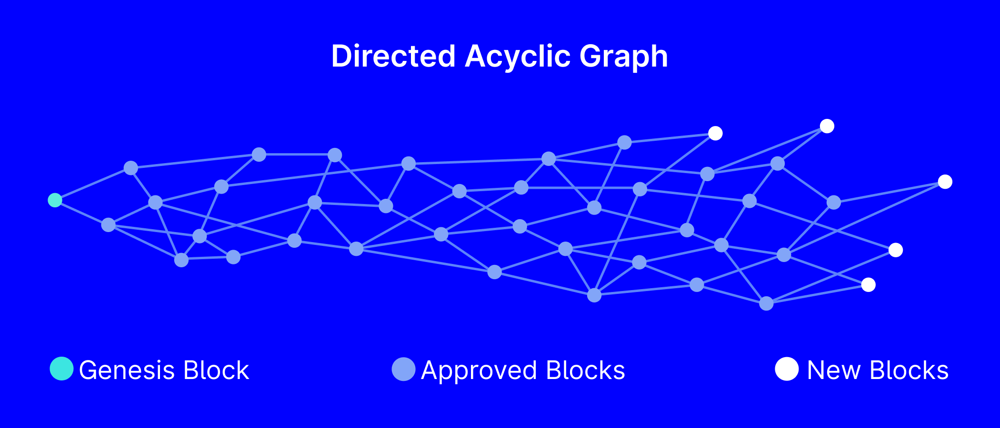

## Table of Contents

## What is Tangle and how does it relate to IOTA?

Tangle is a special kind of technology that IOTA uses instead of a regular blockchain. Think of a blockchain like a chain of blocks where each block holds information. Tangle, on the other hand, is more like a web or a network. In Tangle, every new piece of information, or transaction, is connected to two other pieces of information. This makes it faster and can handle more transactions at the same time compared to a traditional blockchain.

IOTA uses Tangle to make it easier and cheaper to send and receive small amounts of money, especially for things like Internet of Things (IoT) devices. Because Tangle doesn't have miners like a blockchain, it doesn't charge fees for transactions. This is really helpful for tiny payments between machines or devices. So, Tangle is a big part of what makes IOTA work well for these kinds of uses.

## What are the main differences between Tangle and traditional blockchain?

Tangle and traditional blockchain work differently in how they handle transactions and data. In a traditional blockchain, transactions are grouped into blocks, and each block is added to the chain one after the other. Miners compete to add these blocks and get rewarded, which can slow things down and add fees. Tangle, on the other hand, doesn't use blocks or miners. Instead, every new transaction must approve two previous transactions. This creates a web-like structure where transactions can be processed faster and without fees.

Another big difference is how they scale. Traditional blockchains can get slow when a lot of people want to use them at the same time because they have to wait for blocks to be added. Tangle actually gets faster as more people use it because more transactions mean more approvals happening at the same time. This makes Tangle really good for things like the Internet of Things, where lots of small devices might need to send and receive tiny payments quickly and cheaply.

## How does the consensus mechanism work in Tangle?

In Tangle, the consensus mechanism works differently than in traditional blockchains. Instead of miners adding blocks, every new transaction in Tangle has to approve two previous transactions. When you want to add a new transaction, your device picks two past transactions and checks them to make sure they're valid. Once it approves them, your new transaction gets added to the Tangle. This process keeps the network going and helps make sure all the transactions are correct.

Over time, as more and more transactions approve the same past transactions, the network agrees on which transactions are valid. This is called reaching consensus. If a transaction is approved by many other transactions, it becomes more and more certain that it's correct. This way, Tangle can keep growing and stay secure without needing miners or big fees. It's like a big web where everyone helps check each other's work.

## What is the purpose of IOTA and how does it use Tangle?

IOTA is a type of digital money that's made to work well with the Internet of Things (IoT). The main goal of IOTA is to let small devices, like sensors or smart home gadgets, send and receive tiny payments easily and without any fees. This is really important because IoT devices often need to handle small transactions, and regular money systems can be too slow and expensive for this.

IOTA uses a special technology called Tangle to make this happen. Tangle is different from the usual blockchain because it doesn't use blocks or miners. Instead, every new transaction in Tangle has to approve two older transactions. This makes the network faster and more efficient as more people use it. Because Tangle doesn't need miners, there are no fees for transactions, which is perfect for the tiny payments that IoT devices need to make.

## Can you explain the concept of 'tips' in Tangle?

In Tangle, 'tips' are the newest transactions that haven't been approved by any other transactions yet. Imagine Tangle like a growing web where each new transaction adds to the web. The tips are like the loose ends of the web, the parts where new transactions can connect. When someone wants to add a new transaction, they pick two of these tips to approve. This helps the Tangle grow and keeps everything moving forward.

As more transactions get added, the tips keep changing. Once a tip gets approved by a new transaction, it's no longer a tip. It becomes part of the main web of the Tangle. This process helps the network agree on which transactions are valid and keeps the whole system working smoothly. So, tips are really important because they're where the action happens in Tangle.

## How does Tangle achieve scalability and what are its limitations?

Tangle achieves scalability by getting faster as more people use it. In a traditional blockchain, adding more users can make things slower because they all have to wait for new blocks to be added. But in Tangle, every new transaction helps approve other transactions. So, the more transactions there are, the more approvals happen at the same time. This means Tangle can handle a lot more transactions quickly, making it good for things like the Internet of Things where lots of devices need to send tiny payments.

However, Tangle also has some limitations. One big challenge is that it needs a lot of users to work well. If there aren't enough people using Tangle, it can be slow and might have trouble reaching consensus on which transactions are valid. Another issue is that Tangle is still new and not as widely used as traditional blockchains, so it might take time for it to be fully trusted and accepted by everyone. But as more people start using it, these problems should get better.

## What role do nodes play in the Tangle network?

Nodes are like the helpers in the Tangle network. They are computers or devices that keep a copy of the Tangle and help make sure everything works smoothly. When someone wants to add a new transaction, they send it to a node. The node then checks if the transaction is okay and adds it to the Tangle. Nodes also help other devices find the newest transactions, called tips, so they can approve them and add their own transactions.

Nodes are important because they keep the Tangle running and growing. They talk to each other to share information and make sure everyone agrees on which transactions are valid. This helps the Tangle reach consensus, which means everyone trusts that the transactions are correct. Without nodes, the Tangle wouldn't be able to work properly, and transactions wouldn't be able to be added or approved.

## How is security maintained in the Tangle network?

Security in the Tangle network is maintained through a system where every new transaction has to approve two older transactions. This means that as more transactions happen, the network gets more secure. If someone tries to add a bad or fake transaction, it's hard for it to be approved by lots of other transactions. The more approvals a transaction gets, the harder it is to change or remove it, making the whole network safer.

Another way Tangle stays secure is by using nodes. These are like the guards of the network. They check every new transaction to make sure it's okay before adding it to the Tangle. If a lot of nodes agree that a transaction is good, it's more likely to be trusted by everyone. This helps keep bad transactions out and makes sure the network stays honest and secure.

## What are the potential applications of IOTA and Tangle in IoT?

IOTA and Tangle can be really useful for the Internet of Things (IoT). Imagine a world where lots of small devices like sensors, smart home gadgets, or even cars need to send and receive tiny payments. IOTA makes this easy because it doesn't charge any fees for transactions. This is perfect for IoT because these devices often need to handle small amounts of money, and regular money systems are too slow and expensive for that.

Another cool thing about IOTA and Tangle is that they can handle a lot of transactions at the same time. As more devices join the network, it actually gets faster. This is great for IoT because there could be millions of devices all trying to send payments at once. With IOTA and Tangle, they can all do it quickly and without any problems. This could help with things like smart cities, where traffic lights, parking meters, and other devices need to talk to each other and exchange small payments.

## How does the IOTA Foundation contribute to the development of Tangle?

The IOTA Foundation is a group of people who work to make IOTA and Tangle better. They do this by coming up with new ideas and building new tools that help Tangle work well. They also work with other companies and groups to find new ways to use Tangle in the real world. This helps make sure that Tangle keeps growing and can be used for lots of different things.

One important thing the IOTA Foundation does is research. They study how Tangle works and try to fix any problems they find. They also teach other people about Tangle and how to use it. By doing all this work, the IOTA Foundation helps make Tangle a strong and safe way for people and machines to send and receive money.

## What are the current challenges and future prospects for Tangle and IOTA?

Right now, Tangle and IOTA face some challenges. One big problem is that they need a lot of people to use them to work well. If not enough people are using Tangle, it can be slow and might have trouble agreeing on which transactions are good. Another issue is that Tangle is still new and not as many people use it compared to older blockchain systems. This can make some people worried about trusting it with their money. But the IOTA Foundation is working hard to fix these problems and make Tangle better.

In the future, Tangle and IOTA have a lot of exciting possibilities. They could be really important for the Internet of Things, where lots of small devices need to send tiny payments quickly and without fees. As more people start using Tangle, it should get faster and more secure. The IOTA Foundation is also doing a lot of research and working with other companies to find new ways to use Tangle. This means that Tangle could become a big part of how we use money and technology in the future.

## How does the implementation of quantum resistance in Tangle work?

Quantum resistance in Tangle is all about making sure the system stays safe even if super-powerful quantum computers come along. These computers could break the codes that keep regular computer systems safe. IOTA uses a special kind of math called "Winternitz one-time signature" to make Tangle quantum-resistant. This math is really hard for quantum computers to crack, so it helps keep the transactions in Tangle secure.

The IOTA Foundation is always working on making Tangle even safer. They keep an eye on new technology and update Tangle to stay ahead of any threats. This means that as quantum computers get better, Tangle can keep up and stay a safe place for people and machines to send and receive money.

## How does Tangle differ from Blockchain?

Traditional blockchains, which form the backbone of many popular cryptocurrencies like Bitcoin and Ethereum, depend on a linear sequence of blocks to validate and record transactions. This sequential process, while secure and well-established, can lead to inefficiencies such as bottlenecks and increased transaction fees, particularly when network demand is high. These issues arise because each block in the chain must process every pending transaction, creating a scenario where transactions compete for space within each block.

In contrast, IOTA's Tangle utilizes a Directed Acyclic Graph (DAG) architecture that departs from the linear structure of blockchains. This framework allows for multiple transactions to be confirmed concurrently, significantly enhancing the network's speed and scalability. Unlike blockchains where miners validate transactions, in the Tangle, each transaction validates two previous transactions. This method inherently promotes decentralization because as more transactions are added, the network undergoes a self-reinforcing cycle where increased activity leads to greater security and reduced confirmation times.

The Tangle's decentralized nature eliminates the concept of miners and associated transaction fees, which are typically used to compensate miners in traditional blockchain systems. With every transaction requiring the validation of two prior transactions, this process forms a web of interconnected activities that form an extremely resilient and efficient network.

Mathematically, the efficiency of the Tangle can be described in terms of its ability to process transactions as a function of network activity. A simplified representation can be illustrated as:

$$
\text{Time per transaction} = \frac{\text{Total Time}}{\text{Number of Transactions}}
$$

In a traditional blockchain, the total time is fixed per block, but in a Tangle, this time decreases as the number of transactions increases, assuming that nodes are increasingly able to confirm transactions due to heightened network activity and cumulative validations.

To demonstrate, consider the Python code that illustrates the relative efficiency of transactions in a Tangle compared to a Blockchain:

```python
def blockchain_throughput(block_time, tx_per_block):
    return 1 / (block_time / tx_per_block)

def tangle_throughput(total_time, tx_count):
    return 1 / (total_time / tx_count)

block_time = 600  # assuming 10 minutes per block
tx_per_block = 2000

total_time_tangle = 600  # assuming same time frame for comparison
tx_count = 6000  # more transactions due to higher throughput

block_throughput = blockchain_throughput(block_time, tx_per_block)
tangle_throughput_result = tangle_throughput(total_time_tangle, tx_count)

print(f"Blockchain transactions per second: {block_throughput}")
print(f"Tangle transactions per second: {tangle_throughput_result}")
```

The results from this simulation would reveal how Tangle potentially surpasses traditional blockchains in transaction processing efficiency, especially as network activity escalates. Hence, the Tangle's architecture not only mitigates the bottlenecks associated with traditional blockchains but also fosters a more distributed and cost-effective transaction ecosystem.

## References & Further Reading

[1]: Popov, S. (2018). ["The Tangle."](https://www.semanticscholar.org/paper/The-Tangle-Popov/43586b34b054b48891d478407d4e7435702653e0) IOTA Foundation.

[2]: ["IOTA: Next Generation Distributed Ledger Technology"](https://iota-news.com/about-iota/) by Andreas M. Antonopoulos

[3]: J. Benítez-Andrades, Á. de Paz, C. A. M. Lima, F. J. P. de la Torre. (2020). ["Internet of Things (IoT) and Tangle Technology: A Bibliometric Assessment."](https://arxiv.org/pdf/2402.02188.pdf) Mathematics Journal.

[4]: Braband, D. & Janze, C. (2019). ["Algorithmic Trading Strategies - Conceptualization and Portfolio Capital Constraint Approaches."](https://www.researchgate.net/publication/378548435_Algorithmic_Trading_and_AI_A_Review_of_Strategies_and_Market_Impact) In: Ellis, A., Brigid, A. (eds) FinTech, BigTech and Banks.

[5]: Pongnumkul, S., Siripanpornchana, C., & Thajchayapong, S. (2017). ["Performance Analysis of Private Blockchain Platforms in Varying Workloads."](https://www.researchgate.net/profile/Suporn-Pongnumkul-2/publication/319889164_Performance_Analysis_of_Private_Blockchain_Platforms_in_Varying_Workloads/links/5c0e28c94585157ac1b6c73c/Performance-Analysis-of-Private-Blockchain-Platforms-in-Varying-Workloads.pdf) 26th International Conference on Computer Communication and Networks (ICCCN).