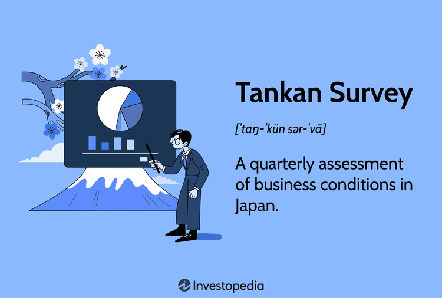

## Table of Contents

## What is the Tankan Survey?

The Tankan Survey is a report that comes out every three months from the Bank of Japan. It asks businesses in Japan about their current situation and what they think will happen in the future. This helps people understand how the Japanese economy is doing. The survey covers many different industries and looks at things like business conditions, sales, and prices.

The results of the Tankan Survey are important because they help the Bank of Japan make decisions about money and interest rates. If the survey shows that businesses are doing well, the Bank might decide to keep things the same. But if businesses are struggling, the Bank might change its policies to help the economy. Many people, like investors and economists, pay close attention to the Tankan Survey to get a good picture of Japan's economic health.

## Who conducts the Tankan Survey?

The Tankan Survey is conducted by the Bank of Japan. They send out the survey every three months to businesses all over Japan. The survey asks companies about how they are doing right now and what they expect in the future. It covers many different types of businesses, from big to small, and from different industries like manufacturing and services.

The results of the Tankan Survey are very important. They help the Bank of Japan understand the health of the economy. This information is used to make decisions about things like interest rates and money supply. Many people, including investors and economists, look at the Tankan Survey to get a good idea of how Japan's economy is doing and where it might be headed.

## How often is the Tankan Survey released?

The Tankan Survey comes out every three months. That means it is released four times a year. This regular schedule helps people keep track of how the Japanese economy is doing over time.

The Bank of Japan sends the survey to businesses all over Japan. They ask about how things are going now and what companies think will happen in the future. This information is very useful because it helps the Bank of Japan make decisions about money and interest rates.

## What types of businesses are covered in the Tankan Survey?

The Tankan Survey covers a wide range of businesses in Japan. It includes both big and small companies from many different industries. Some of the main industries covered are manufacturing, construction, and services. This helps give a complete picture of how the whole economy is doing.

The survey also looks at different sizes of businesses. It includes large companies with many employees, as well as smaller ones that might only have a few workers. By including all these different types of businesses, the Tankan Survey can show what is happening in different parts of the economy. This information is very important for understanding the overall health of Japan's economy.

## What are the main components of the Tankan Survey?

The Tankan Survey has several main parts that help people understand how businesses in Japan are doing. One important part is the Business Conditions Diffusion Index (DI). This index shows whether companies think things are getting better or worse. It looks at things like sales and profits. Another part is the survey on future expectations, which asks businesses what they think will happen in the next few months. This helps predict how the economy might change.

The survey also asks about other important things like employment, prices, and investments. For example, businesses report on how many workers they have and if they plan to hire more. They also talk about what prices they are charging and if they expect those prices to go up or down. Investment plans are another key part, where companies share if they plan to spend money on new projects or equipment. All these parts together give a full picture of the Japanese economy.

## How is the Diffusion Index (DI) calculated in the Tankan Survey?

The Diffusion Index (DI) in the Tankan Survey is a way to see if businesses think things are getting better or worse. To calculate it, the Bank of Japan asks companies if their business conditions are "favorable," "not so favorable," or "unfavorable." They then take the percentage of companies that say things are "favorable" and subtract the percentage of companies that say things are "unfavorable." The result is the DI. If the DI is positive, it means more companies think things are good than bad. If it's negative, more companies think things are bad than good.

This simple calculation helps show the overall mood of businesses in Japan. A high positive DI means businesses are feeling very good about the economy. A low or negative DI means they are worried. The DI is calculated for different industries and sizes of companies, so it gives a detailed look at how different parts of the economy are doing. This helps the Bank of Japan and others understand the health of the economy and make decisions based on that information.

## What is the significance of the Tankan Survey for economic analysis?

The Tankan Survey is very important for understanding how the Japanese economy is doing. It comes out every three months and asks businesses about their current situation and what they expect in the future. This information helps people see if businesses are doing well or struggling. The survey covers many different types of businesses, from big to small, and from industries like manufacturing to services. By looking at all these different parts, the Tankan Survey gives a full picture of the economy.

Economists, investors, and the Bank of Japan use the Tankan Survey to make important decisions. For example, if the survey shows that businesses are doing well, the Bank of Japan might decide to keep interest rates the same. But if businesses are having a hard time, the Bank might change its policies to help the economy grow. The survey's Diffusion Index (DI) is especially useful because it shows if more businesses think things are good or bad. This helps everyone understand the overall mood of the economy and plan for the future.

## How does the Tankan Survey influence monetary policy decisions?

The Tankan Survey helps the Bank of Japan decide what to do with money and interest rates. They look at the survey every three months to see how businesses are doing. If the survey shows that businesses are doing well and feeling good about the future, the Bank might keep things the same. They might think the economy is strong and doesn't need help. But if the survey shows that businesses are struggling, the Bank might change its policies. They could lower interest rates to make it easier for businesses to borrow money and spend more, which can help the economy grow.

The survey's Diffusion Index (DI) is really important for these decisions. The DI tells the Bank if more businesses think things are good or bad. If the DI is high and positive, it means businesses are happy and the economy is doing well. This might make the Bank decide to keep interest rates the same. But if the DI is low or negative, it means businesses are worried. The Bank might then decide to do something to help, like changing interest rates or other money policies. This way, the Tankan Survey helps the Bank of Japan keep the economy healthy.

## Can the Tankan Survey predict economic trends, and if so, how accurately?

The Tankan Survey can help predict economic trends by asking businesses about their current situation and what they expect in the future. When businesses say they are doing well and expect to keep doing well, it often means the economy will stay strong. On the other hand, if businesses say they are struggling and expect things to get worse, it might mean the economy will have a hard time. The survey's Diffusion Index (DI) is especially useful for this. If the DI is high and positive, it suggests the economy will keep growing. If it's low or negative, it might mean the economy will slow down.

However, the Tankan Survey is not always perfect at predicting the future. Sometimes, unexpected things happen that can change the economy quickly. For example, a natural disaster or a big change in global markets can make the survey's predictions less accurate. Also, businesses might not always guess the future correctly. They might be too hopeful or too worried. So, while the Tankan Survey is a good tool for understanding and predicting economic trends, it's best to use it along with other information to get a full picture of what might happen next.

## What are the limitations and criticisms of the Tankan Survey?

The Tankan Survey, while useful, has some limitations. One big problem is that it relies on what businesses think will happen in the future. But businesses can be wrong sometimes. They might be too hopeful or too worried, which can make the survey's predictions less accurate. Also, the survey comes out every three months, which means it might not catch quick changes in the economy. If something big happens right after the survey is done, like a natural disaster or a big change in global markets, the survey won't show it until the next time.

Another criticism is that the Tankan Survey might not cover all parts of the economy equally well. It mostly asks big companies and might not hear as much from small businesses. This can make the survey's results a bit one-sided. Also, the survey focuses a lot on manufacturing and services but might not pay as much attention to other important areas like agriculture or technology. So, while the Tankan Survey is a good tool for understanding the economy, it's important to use it along with other information to get a complete picture.

## How does the Tankan Survey compare to similar surveys in other countries?

The Tankan Survey is like other business surveys around the world, but it has some special things about it. In the United States, there is the Business Outlook Survey from the Federal Reserve Bank of Philadelphia. It asks businesses about things like sales, jobs, and prices, similar to the Tankan Survey. But the American survey comes out every month, not every three months like the Tankan. In Europe, the European Commission does the Business and Consumer Survey. This one asks businesses and people about how they feel about the economy. It covers many countries in Europe and comes out every month too. So, while the Tankan Survey and these other surveys ask similar questions, they come out at different times and cover different areas.

The Tankan Survey is unique because it focuses a lot on Japan's big companies and industries like manufacturing. Other surveys might not focus as much on these areas. For example, the Ifo Business Climate Survey in Germany asks businesses about their current situation and what they expect in the future, but it covers a wide range of business sizes and industries. The Tankan Survey also uses a special way to calculate its Diffusion Index (DI), which is different from how other surveys might do it. So, while the Tankan Survey helps understand Japan's economy, other surveys help understand the economies of their own countries in their own ways.

## What advanced statistical methods can be applied to analyze Tankan Survey data more deeply?

To get a deeper look at the Tankan Survey data, you can use something called time series analysis. This method helps you see how the economy changes over time. You can use it to find patterns and trends in the data. For example, you might see that the Diffusion Index goes up and down in a certain way every year. By understanding these patterns, you can make better guesses about what might happen next in the economy. Another useful method is regression analysis, which helps you see how different parts of the survey, like sales or employment, affect each other. This can show you which parts of the economy are most important for understanding the big picture.

Another advanced method is cluster analysis, which groups businesses into different categories based on how they answer the survey. This can help you see if certain types of businesses, like small ones or those in manufacturing, are doing better or worse than others. You might find that big companies and small companies have very different views on the economy. Using cluster analysis can make the survey results easier to understand and use. These advanced methods can give you a more detailed and accurate picture of what the Tankan Survey is telling you about Japan's economy.

## What is the Tankan Survey and how can it be understood?

The Tankan Survey is a pivotal economic indicator designed to assess business conditions in Japan. Conducted quarterly by the Bank of Japan, the survey evaluates a wide array of economic sectors, with particular attention to manufacturing, which is a cornerstone of Japanese economic strength.

The methodology underpinning the Tankan Survey revolves around a diffusion index to measure sentiment among businesses. Respondents are asked to provide their outlook on current and future business conditions. The responses are quantified to produce an index, where a positive score signifies favorable conditions and a negative score indicates adverse conditions. Mathematically, the diffusion index is calculated as:

$$
\text{Diffusion Index} = \% \text{Positive Responses} - \% \text{Negative Responses}
$$

The Tankan Survey's structured approach categorizes results into various sectors, such as large manufacturing, small manufacturing, as well as non-manufacturing segments. Manufacturing is given particular emphasis due to its critical role in Japan's economic framework, contributing significantly to GDP, employment, and export revenues. A robust manufacturing sector often signals broader economic health and can impact global trade dynamics given Japan’s role in international supply chains.

The results of the survey are closely monitored by policymakers, investors, and businesses. For policymakers, particularly those at the Bank of Japan, the survey offers insights crucial for designing monetary policy. Investors often use the Tankan Survey to guide investment decisions, particularly regarding the stock market and foreign exchange due to the sensitivity of these markets to business sentiment and economic outlook.

## References & Further Reading

[1]: ["The Tankan Survey: Understanding Business Sentiment in Japan"](https://www.japantimes.co.jp/business/2024/12/13/economy/boj-tankan-survey/) - Bank of Japan

[2]: Bergstra, J., Bardenet, R., Bengio, Y., & Kégl, B. (2011). ["Algorithms for Hyper-Parameter Optimization."](https://dl.acm.org/doi/10.5555/2986459.2986743) Advances in Neural Information Processing Systems 24.

[3]: ["Advances in Financial Machine Learning"](https://www.amazon.com/Advances-Financial-Machine-Learning-Marcos/dp/1119482089) by Marcos Lopez de Prado

[4]: ["The Handbook of Algorithmic Trading: A User's Guide"](https://books.google.com/books/about/Algorithmic_Trading.html?id=doGXzQEACAAJ) by Jeffrey Bacidore

[5]: ["Artificial Intelligence for Trading"](https://www.geeksforgeeks.org/ai-tools-for-stock-trading/) - Udacity Course

[6]: ["Machine Learning for Algorithmic Trading"](https://github.com/stefan-jansen/machine-learning-for-trading) by Stefan Jansen