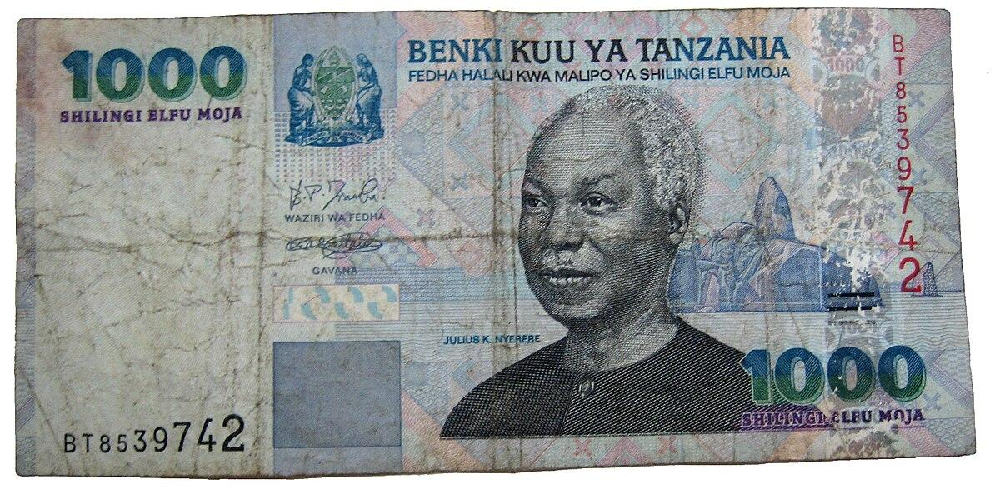

## Table of Contents

## What is the Tanzanian Shilling?

The Tanzanian Shilling is the official currency of Tanzania, a country in East Africa. It is used every day by people in Tanzania to buy things like food, clothes, and other goods. The symbol for the Tanzanian Shilling is TSh or TZS. One Tanzanian Shilling is made up of 100 cents, but cents are not used much anymore.

The Tanzanian Shilling started being used in 1966, after Tanzania became its own country. Before that, Tanzania used different currencies. The Bank of Tanzania is in charge of the Tanzanian Shilling. They make sure there is enough money and that it stays valuable. You can find Tanzanian Shilling coins and banknotes, with different pictures and designs on them that show important parts of Tanzanian culture and history.

## When was the Tanzanian Shilling introduced?

The Tanzanian Shilling was introduced in 1966. This happened after Tanzania became its own country and needed its own money. Before 1966, Tanzania used different currencies from when it was part of other countries or colonies.

The Bank of Tanzania is the one that looks after the Tanzanian Shilling. They make sure there is enough money for people to use and that it stays valuable. You can find Tanzanian Shilling in coins and banknotes, with different pictures on them that show important things about Tanzania's culture and history.

## What is the symbol and ISO code for the Tanzanian Shilling?

The symbol for the Tanzanian Shilling is TSh or sometimes just Sh. This symbol is used every day by people in Tanzania when they talk about money or prices.

The ISO code for the Tanzanian Shilling is TZS. This code is used around the world to talk about the Tanzanian Shilling in a way that everyone understands. It helps when people from different countries need to know about Tanzanian money.

## How is the Tanzanian Shilling abbreviated?

The Tanzanian Shilling is abbreviated as TSh or just Sh. This is how people in Tanzania write it down when they talk about money or prices. It's a short way to show that they are talking about Tanzanian Shillings.

The ISO code for the Tanzanian Shilling is TZS. This code is used all over the world to talk about the Tanzanian Shilling in a way that everyone can understand. It helps when people from different countries need to know about Tanzanian money.

## What are the denominations of Tanzanian Shilling banknotes and coins?

Tanzanian Shilling banknotes come in different amounts. You can find banknotes worth 500, 1000, 2000, 5000, and 10,000 Tanzanian Shillings. Each banknote has different pictures on it that show important things about Tanzania, like its animals, people, and history.

Tanzanian Shilling coins also come in different amounts. You can find coins worth 50, 100, 200, and 500 Tanzanian Shillings. These coins are used every day by people in Tanzania to buy things. The coins also have different designs on them that show parts of Tanzanian culture and history.

## What was the currency used in Tanzania before the Shilling?

Before the Tanzanian Shilling was introduced in 1966, Tanzania used different currencies. When Tanzania was part of the British colony called Tanganyika, it used the East African Shilling. This was the money used in many East African countries that were under British rule.

After Tanganyika became independent in 1961, it still used the East African Shilling until 1966. Then, when Tanganyika joined with Zanzibar to form Tanzania, they decided to create their own money, which became the Tanzanian Shilling.

## How has the value of the Tanzanian Shilling changed over time?

The value of the Tanzanian Shilling has changed a lot since it was first used in 1966. When it started, the Tanzanian Shilling was worth more than it is now. Over the years, the value of the Shilling has gone down compared to other currencies like the US Dollar or the Euro. This means that you need more Tanzanian Shillings to buy things from other countries. The Bank of Tanzania tries to keep the value of the Shilling stable, but many things can affect it, like the price of things Tanzania buys and sells, how much money people want to use, and what is happening in the world economy.

In the past few years, the Tanzanian Shilling has stayed pretty steady compared to some other African currencies. This is good for people in Tanzania because it means the prices of things they buy from other countries do not change too much. But, the Shilling is still worth less than it used to be. For example, in the 1970s, you could buy more with one Tanzanian Shilling than you can now. The government and the Bank of Tanzania keep working to make sure the Shilling stays useful for people in Tanzania, but it is hard to keep its value the same over a long time.

## What are the factors that influence the exchange rate of the Tanzanian Shilling?

The exchange rate of the Tanzanian Shilling is affected by many things. One big thing is how much Tanzania buys and sells with other countries. If Tanzania sells more things like coffee or minerals to other countries, the Shilling can become stronger because other countries need to use their money to buy Tanzanian goods. But if Tanzania needs to buy a lot of things from other countries, like machines or medicine, and it does not sell enough of its own goods, the Shilling can become weaker because Tanzania needs to use more Shillings to get foreign money.

Another thing that influences the exchange rate is how much people trust the Tanzanian economy. If people think Tanzania's economy is doing well, they might want to invest money there, which can make the Shilling stronger. But if there are problems, like high inflation or political issues, people might not want to keep their money in Tanzania, and this can make the Shilling weaker. The Bank of Tanzania also plays a role by trying to control how much money is in the country and setting interest rates, which can affect how much people want to use or save Shillings.

## How does the Bank of Tanzania manage the Shilling?

The Bank of Tanzania works hard to take care of the Tanzanian Shilling. They do this by making sure there is the right amount of money in the country. If there is too much money, prices can go up a lot, which is called inflation. The Bank of Tanzania tries to stop this by controlling how much money banks can lend out. They also set interest rates, which is the cost of borrowing money. If the [interest rate](/wiki/interest-rate-trading-strategies) is high, people might save more money instead of spending it, which can help keep the Shilling strong.

Another way the Bank of Tanzania manages the Shilling is by buying and selling foreign money. This is called foreign exchange intervention. If the Shilling is getting too weak, the Bank might use its foreign money to buy Shillings, which can make the Shilling stronger. They also keep an eye on how much Tanzania buys and sells with other countries. If Tanzania is selling a lot of things like coffee or minerals, it can bring in more foreign money, which helps the Shilling. The Bank of Tanzania works every day to make sure the Shilling stays useful for people in Tanzania.

## What are the economic impacts of the Tanzanian Shilling's fluctuations?

When the value of the Tanzanian Shilling goes up and down, it can affect the economy in many ways. If the Shilling gets weaker, it means that things Tanzania buys from other countries, like machines or medicine, become more expensive. This can make life harder for people in Tanzania because they need to use more Shillings to buy the same things. It can also make it harder for businesses in Tanzania to grow because they have to spend more money on things they need from other countries. On the other hand, a weaker Shilling can help Tanzania sell more of its own things, like coffee or minerals, to other countries because they become cheaper for people in other countries to buy.

If the Shilling gets stronger, it can make things from other countries cheaper for people in Tanzania. This can be good because it means people can buy more with their Shillings. But it can also make it harder for Tanzania to sell its own things to other countries because they become more expensive for people in other countries to buy. This can hurt businesses in Tanzania that rely on selling things to other countries. The Bank of Tanzania tries to keep the Shilling stable so that these ups and downs do not cause too many problems for the economy, but it is a hard job because many things can affect the value of the Shilling.

## How does the Tanzanian Shilling compare to other East African currencies?

The Tanzanian Shilling is one of the currencies used in East Africa, along with others like the Kenyan Shilling, Ugandan Shilling, and Rwandan Franc. Compared to these currencies, the Tanzanian Shilling is often seen as less strong. For example, the Kenyan Shilling is usually worth more than the Tanzanian Shilling. This means that if you have one Kenyan Shilling, you can get more Tanzanian Shillings in exchange. The Ugandan Shilling is also worth more than the Tanzanian Shilling, but the difference is not as big as with the Kenyan Shilling. The Rwandan Franc is different because it is not a Shilling, but it is also usually worth more than the Tanzanian Shilling.

These differences in value can affect how people in these countries buy and sell things with each other. If the Tanzanian Shilling is weaker, it can be good for Tanzania because it makes their things, like coffee or minerals, cheaper for people in Kenya, Uganda, or Rwanda to buy. But it can also make things from those countries more expensive for people in Tanzania. The governments and central banks in these countries work hard to keep their currencies stable so that these changes do not cause too many problems for their people and businesses.

## What are the future prospects for the Tanzanian Shilling in the regional and global economy?

The future of the Tanzanian Shilling depends on many things, like how well Tanzania's economy grows and how it trades with other countries. If Tanzania can sell more of its things, like coffee or minerals, to other countries, the Shilling might get stronger. Also, if more people want to invest money in Tanzania because they think the economy is doing well, that can help the Shilling too. The government and the Bank of Tanzania will keep trying to make sure the Shilling stays useful for people in Tanzania by controlling how much money is in the country and setting interest rates.

In the East African region, the Tanzanian Shilling might stay less strong than currencies like the Kenyan Shilling or the Ugandan Shilling. But if Tanzania works well with its neighbors, like through the East African Community, it could help the Shilling. On a global level, big things like changes in the world economy or the price of oil can affect the Shilling. The Bank of Tanzania will need to keep watching these things and working hard to keep the Shilling stable so that people in Tanzania can buy and sell things easily, both at home and around the world.

## References & Further Reading

[1]: Mwase, N. (2010). ["Currency Crises: Historical and Political Influences on the Tanzanian Shilling."](https://www.sciencedirect.com/science/article/pii/S1062940815000868) International Monetary Fund Working Papers.

[2]: Markose, S. M. (2012). ["Systemic Stability in Financial Networks: A Graph Theoretic Perspective."](https://www.essex.ac.uk/people/marko29603/sheri-markose) Journal of Financial Market Infrastructures.

[3]: Chege, N., & Muga, R. (2020). ["Algorithmic Trading and the Financial Markets of East Africa."](https://www.researchgate.net/publication/378548435_Algorithmic_Trading_and_AI_A_Review_of_Strategies_and_Market_Impact) Africa Research Institute.

[4]: ["The Impact of Exchange Rate Fluctuations on Economic Growth in Tanzania."](https://www.academia.edu/114980489/Effect_of_Trade_Openness_and_Real_Exchange_Rate_on_Economic_Growth_in_Tanzania) Applied Economics Letters, Volume 26, Issue 14.

[5]: Aldridge, I. (2013). ["High-Frequency Trading: A Practical Guide to Algorithmic Strategies and Trading Systems."](https://www.amazon.com/High-Frequency-Trading-Practical-Algorithmic-Strategies/dp/1118343506) Wiley Finance Series.