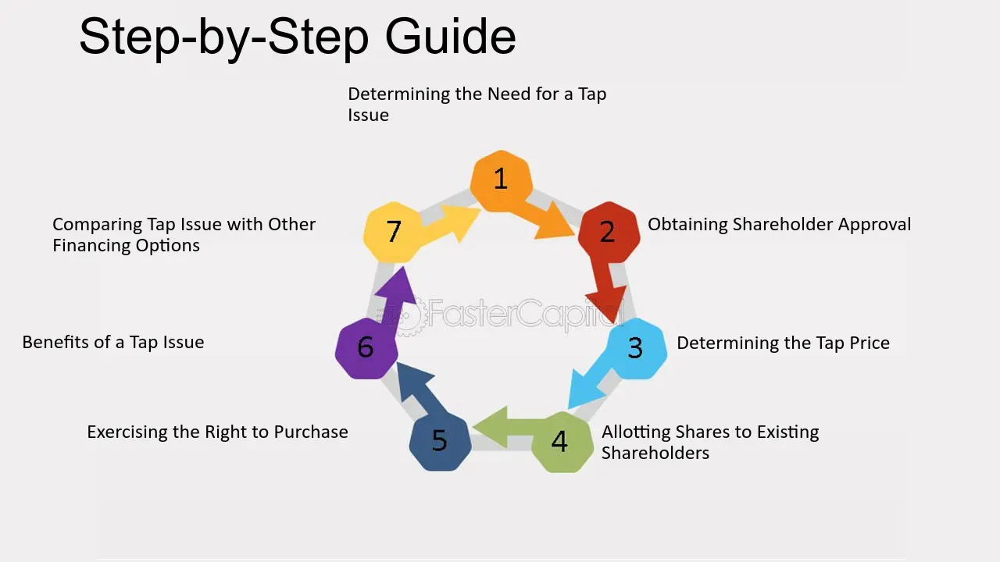

## Table of Contents

## What is a tap issue in finance?

A tap issue in finance is when a company or government decides to sell more bonds or stocks from an earlier issue. They do this without changing the original terms of the issue. It's like adding more of the same thing to what was already sold before. This is often done when there's still demand for the security, and it helps the issuer raise more money without going through the whole process of creating a new issue.

Tap issues are common because they are a quick and easy way for issuers to get more funds. They don't have to spend time and money on new marketing or legal work. For investors, tap issues can be good because they get to buy more of a security they already like, usually at the same price or close to it. This can be a win-win situation for both the issuer and the investor.

## How does a tap issue differ from a new bond issue?

A tap issue is when a company or government sells more of the same bonds or stocks that they sold before. They do this without making any changes to the original terms. It's like going back to the same well for more water. This is different from a new bond issue, where a company or government creates and sells a completely new type of bond. With a new issue, they might change the interest rate, the time until the bond matures, or other details.

Tap issues are easier and quicker for the issuer because they don't need to start from scratch. They don't have to spend time and money on new marketing or legal work. It's a simple way to raise more money if people still want to buy the bonds. On the other hand, a new bond issue takes more time and effort. The issuer has to set up everything from the beginning, which can be costly. But it gives them a chance to offer something different to investors, which might attract new buyers or meet different financial needs.

## What are the advantages of using a tap issue for a company?

Using a tap issue can be really helpful for a company. It's a fast and easy way to get more money. When a company does a tap issue, it sells more of the same bonds or stocks it sold before. This means they don't have to start from scratch with new marketing or legal work. It saves them time and money because they can just offer more of what people already want to buy.

Another big advantage is that tap issues keep things simple. The company doesn't have to change the terms of the bonds or stocks, so it's easy for investors to understand what they're buying. This can make investors happy because they get to buy more of something they already trust, usually at a similar price. It's a win-win situation because the company gets more money, and the investors get more of what they like.

## Can you explain the process of executing a tap issue?

When a company wants to do a tap issue, they start by looking at the bonds or stocks they sold before. They see if people still want to buy more of them. If there's still demand, the company decides to sell more of the same bonds or stocks without changing anything about them. They don't need to create new marketing materials or go through a long legal process. They just tell their investors that more of the same is available for sale.

Once the company decides to go ahead, they work with their bank or financial advisor to make sure everything is ready. They set a date for when the tap issue will happen and let investors know. On that date, the company starts selling the additional bonds or stocks. Because it's a tap issue, everything happens quickly and smoothly. Investors can buy more of what they already know and like, and the company gets the extra money it needs without a lot of extra work.

## What are the potential risks associated with tap issues for investors?

One risk for investors in tap issues is that they might not get a good price. When a company does a tap issue, they usually offer the new bonds or stocks at a price close to what they sold them for before. But if the market has changed since the first issue, the price might not be as good as it could be for new investments. Investors might end up paying more than they should for something that's not as valuable anymore.

Another risk is that tap issues can make it harder to sell the bonds or stocks later. When a company keeps selling more of the same thing, it can make the market for those bonds or stocks bigger. A bigger market can sometimes mean it's harder to sell them quickly if you need to. If too many people want to sell at the same time, the price might go down, and investors could lose money.

## How do tap issues affect the existing bondholders?

When a company does a tap issue, it can affect the existing bondholders in a few ways. One way is that it might change the value of their bonds. If the company sells more bonds at a lower price than before, the value of the bonds the existing bondholders have might go down. This happens because new buyers are getting the same bonds for less money, which can make the older bonds seem less valuable.

Another way tap issues can affect existing bondholders is by changing how easy it is to sell their bonds. If a company keeps selling more of the same bonds, there might be more bonds out there than people want to buy. This can make it harder for existing bondholders to sell their bonds if they need to. They might have to wait longer or sell them for less money than they hoped.

## In what market conditions are tap issues most commonly used?

Tap issues are often used when the market is doing well and people still want to buy the same bonds or stocks. If a company sees that their earlier bonds or stocks are still popular, they might do a tap issue to sell more of them. This is a good time because investors are happy with what they bought before and want to buy more at a similar price.

Sometimes, tap issues are also used when the market is not so good, but the company really needs more money. If the company can't wait to start a new bond issue, they might do a tap issue to quickly raise funds. This can be helpful because it's faster and easier than creating a whole new bond issue, even if the market conditions are not perfect.

## What regulatory considerations must be taken into account when issuing a tap issue?

When a company decides to do a tap issue, they need to think about the rules that govern the sale of bonds or stocks. These rules can be different depending on the country or the type of security they are selling. In many places, the company has to tell the financial authorities about the tap issue before they start selling more bonds or stocks. They might need to file some paperwork to show that the new sale is just more of the same thing they sold before, without changing any important details.

Another thing to consider is how the tap issue might affect the information they share with investors. Even though a tap issue is selling more of the same, the company might still need to update their disclosures to make sure everything is clear and up-to-date. This is important because investors need to know if anything has changed since the first sale. The company also has to make sure they are following any rules about how they talk to investors and how they sell the new bonds or stocks.

## How do tap issues impact the yield and pricing of the bonds?

When a company does a tap issue, it can change the yield and pricing of the bonds. If the company sells more bonds at a lower price than before, the yield on the new bonds might go up. This is because the yield is like the [interest rate](/wiki/interest-rate-trading-strategies) you get on the bond, and if you pay less for the bond, the interest rate seems higher. But this can make the older bonds less valuable because new buyers are getting the same bonds for less money. So, the price of the existing bonds might go down to match the new, lower price.

On the other hand, if the market is doing well and people still want to buy the bonds, the company might sell the new bonds at a similar price to before. In this case, the yield on the new bonds would stay about the same, and the price of the existing bonds might not change much. But if the company keeps selling more bonds, there might be more bonds out there than people want to buy. This can make the price of all the bonds go down a little because there are more of them to go around.

## Can you provide examples of successful tap issues in recent years?

One example of a successful tap issue in recent years is when the UK government did a tap issue in 2020. They sold more of their existing bonds to raise money quickly during the COVID-19 crisis. People still wanted to buy these bonds because they trusted the UK government and liked the terms of the bonds. This helped the government get the money they needed without having to create a whole new bond issue, which would have taken more time and effort.

Another example is when Apple did a tap issue in 2021. They sold more of their bonds that were already popular with investors. Apple needed money for new projects and saw that people still wanted to buy their bonds. By doing a tap issue, Apple was able to raise more money quickly and easily. Investors were happy because they got to buy more of the bonds they already liked, and Apple got the funds they needed without a lot of extra work.

## How do tap issues fit into a broader corporate finance strategy?

Tap issues can be a smart part of a company's overall plan for managing money. When a company needs more cash quickly, they can use a tap issue to sell more of the same bonds or stocks they sold before. This is faster and easier than starting a whole new bond issue, which can take a lot of time and money. By using tap issues, a company can get the money they need without having to wait, which is really helpful if they have big projects or expenses coming up.

Another way tap issues fit into a company's finance strategy is by keeping things simple for investors. When a company does a tap issue, they're selling more of something that investors already know and trust. This can make investors happy because they get to buy more of what they like, usually at a similar price. It's a win-win situation because the company gets the money they need, and the investors feel good about their choices. This can help the company build a strong relationship with their investors over time.

## What advanced financial models are used to assess the impact of a tap issue on a company's capital structure?

When a company thinks about doing a tap issue, they often use advanced financial models to see how it might change their capital structure. One model they might use is the Weighted Average Cost of Capital (WACC) model. This model helps them figure out the cost of all the money they use to run their business, including both debt and equity. By doing a tap issue, the company might change the mix of debt and equity, which can make the WACC go up or down. If the tap issue adds more debt, it might lower the WACC because debt is usually cheaper than equity. But if it makes the company's debt too high, it might make the WACC go up because the risk of borrowing more money goes up.

Another model they might use is the Modigliani-Miller Theorem. This model helps them understand how changes in the way they finance their business can affect its value. The theorem says that, in a perfect world, the way a company finances itself doesn't matter. But in the real world, things like taxes, bankruptcy costs, and how investors see risk can make a difference. A tap issue can change these things, so the company uses this model to see how it might affect their value. By using these models, the company can make smart choices about when and how to do a tap issue to keep their capital structure healthy and help their business grow.

## What is the understanding of Finance Securities and Capital Markets?

Finance securities are fundamental instruments that encapsulate monetary value and facilitate trade in financial markets. These tangible or intangible assets include stocks, bonds, options, and derivatives, among others. The primary characteristic that defines a financial security is its ability to be traded, providing both liquidity and potential for return on investment for the holders. The valuation of these securities depends on a multitude of factors such as issuer creditworthiness, market dynamics, and macroeconomic indicators.

Capital markets represent the arenas where these securities are traded, serving a pivotal role by channeling savings and investments between those who provide capital—such as retail and institutional investors—and those in need of capital, including corporations and governments. These markets can be segmented into two main types: primary and secondary markets. In primary markets, new securities are issued and sold directly to investors, typically in the form of Initial Public Offerings (IPOs). Conversely, secondary markets facilitate the buying and selling of existing securities, with stock exchanges like the New York Stock Exchange (NYSE) and NASDAQ being quintessential examples.

The structure of capital markets is intricate, encompassing various entities and mechanisms that ensure efficient operation. Key participants include investment banks, brokers, dealers, and regulators that together maintain market stability and fairness. Moreover, technological advancements have introduced sophisticated electronic trading platforms, increasing market accessibility and efficiency.

Capital markets are indisputably critical to the financial ecosystem, providing vital [liquidity](/wiki/liquidity-risk-premium) and avenues for corporate funding. For corporations, these markets offer mechanisms to raise capital for expansion and innovation by issuing new securities. For investors, they present opportunities to earn returns through dividends or capital gains, thereby fostering broader economic growth. The effective functioning of capital markets reflects on economic health, as robust markets are often indicators of economic prosperity and resilience.

In economic terms, the relevance of capital markets can be expressed through the Capital Asset Pricing Model (CAPM), which defines the relationship between systematic risk and expected return for assets, particularly stocks. The formula is:

$$
E(R_i) = R_f + \beta_i(E(R_m) - R_f)
$$

where:
- $E(R_i)$ is the expected return of the investment.
- $R_f$ is the risk-free rate.
- $\beta_i$ is the beta of the investment, a measure of how much risk the investment will add to a diversified portfolio.
- $E(R_m)$ is the expected return of the market.

This equation outlines how investors anticipate returns based on inherent risks relative to the entire market, underscoring the importance of capital markets in determining asset prices and risk assessments.

In conclusion, finance securities and capital markets are quintessential components of modern financial systems, fostering a conducive environment for economic growth by effectively linking investors with capital seekers. Understanding their workings aids financial professionals and investors in making informed decisions, which is crucial for sustaining the vitality of global markets.

## References & Further Reading

[1]: Bergstra, J., Bardenet, R., Bengio, Y., & Kégl, B. (2011). ["Algorithms for Hyper-Parameter Optimization."](https://dl.acm.org/doi/10.5555/2986459.2986743) Advances in Neural Information Processing Systems 24.

[2]: ["Advances in Financial Machine Learning"](https://www.amazon.com/Advances-Financial-Machine-Learning-Marcos/dp/1119482089) by Marcos Lopez de Prado

[3]: ["Evidence-Based Technical Analysis: Applying the Scientific Method and Statistical Inference to Trading Signals"](https://www.amazon.com/Evidence-Based-Technical-Analysis-Scientific-Statistical/dp/0470008741) by David Aronson

[4]: ["Machine Learning for Algorithmic Trading"](https://github.com/stefan-jansen/machine-learning-for-trading) by Stefan Jansen

[5]: ["Quantitative Trading: How to Build Your Own Algorithmic Trading Business"](https://www.amazon.com/Quantitative-Trading-Build-Algorithmic-Business/dp/1119800064) by Ernest P. Chan