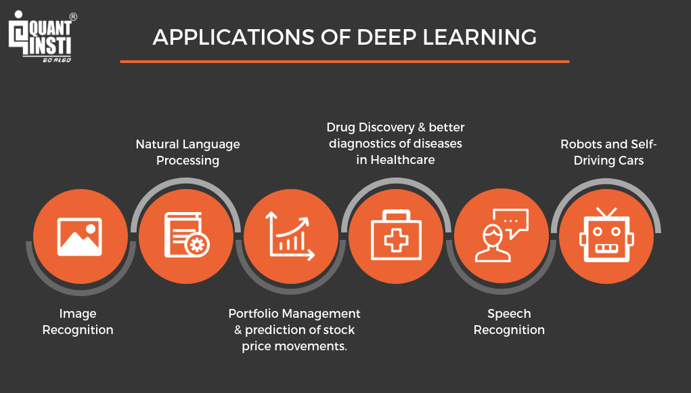

In the fast-paced world of trading, understanding market dynamics is crucial for success. Market dynamics encompass the intricate movements and behaviors of market participants, which are often driven by a complex interplay of economic indicators, investor sentiment, and technological advancements. Mastering these elements is vital for traders seeking to gain a competitive edge.

This article explores the intersection of trading techniques, tape reading, market analysis, and algorithmic trading. Each component plays a significant role in how traders navigate financial markets. Tape reading, once reliant on physical ticker tapes, has evolved into sophisticated digital methodologies that offer real-time insights into market behavior. Market analysis combines fundamental and technical aspects to provide a holistic view of market conditions, allowing traders to make informed decisions.



As technology evolves, traders have developed sophisticated methods to interpret market signals and execute trades efficiently. Algorithmic trading, in particular, leverages computer algorithms to automate trade execution, enabling rapid response to market changes and large-scale data processing. This has transformed the trading landscape, shifting the focus from human intuition to data-driven strategies.

We will explore the history and modern practices of tape reading, how it informs market analysis, and the role of algorithmic trading in today's markets. Understanding these components not only enhances trading precision but also equips traders with the tools needed to navigate increasingly complex market environments. By integrating traditional techniques with innovative technologies, traders can optimize their strategies, improve risk management, and achieve long-term success.

## Table of Contents

## What is Tape Reading?

Tape reading is an analytical technique that has its origins in the early days of stock trading when traders would interpret the stream of information printed on ticker tapes. These tapes provided a chronological sequence of stock prices and volumes, allowing traders to gain insights into market activities. This method, despite being supplanted by more advanced technologies in the 1960s, still holds conceptual value today.

The essence of tape reading lies in its ability to reveal market sentiment and price dynamics through real-time trade data. Moreover, while the physical ticker tape may no longer be relevant, the principles of this technique have evolved. Today, traders conduct similar analyses using digital platforms that present data through electronic order books and time and sales data. These modern tools enable traders to access detailed information about the orders being executed, including the price, size, and timing of trades.

In the current electronic trading landscape, tape reading involves scrutinizing the order flow and examining the interplay between buying and selling pressures. Traders observe patterns and anomalies within this data to infer potential market direction and sentiment. For example, a series of large buy orders might indicate strong bullish sentiment, while frequent large sell orders could suggest growing bearishness.

The transition to electronic data has not diminished the importance of understanding market sentiment. Instead, it has enhanced the tools available for such analysis. Traders can access Level I and Level II market data, which offer insights into the [order book](/wiki/order-book-trading-strategies), including bid and ask prices, along with the cumulative [volume](/wiki/volume-trading-strategy) of buy and sell orders. Time and sales data provide a detailed view of each executed trade, further allowing traders to track [momentum](/wiki/momentum) and gauge the intensity of market movements.

In summary, tape reading remains a crucial technique, now adapted to suit the digital age, allowing traders to interpret real-time market data for better predictions of price movements. This evolution from ticker tapes to electronic systems illustrates how foundational principles endure, even as technology advances in the trading world.

## Modern Tape Reading Techniques

Contemporary tape reading has evolved significantly with the advent of electronic trading platforms and advanced market data systems. Unlike the historical practice of reading ticker tapes, modern tape reading involves the analysis of electronic order [books](/wiki/algo-trading-books) and the use of Level II market data, offering traders detailed insights into market dynamics.

Level II market data provides a deeper view of the order book, displaying bid and ask prices as well as the depth of market participants at various price levels. Traders leverage this information to observe patterns in order flow which can indicate potential market movements. Large buy or sell orders, also known as block trades, can signal supply and demand imbalances, offering clues about the market's direction.

Key to modern tape reading is the understanding of bid-ask spreads, order sizes, and trade velocities. The bid-ask spread, the difference between the highest price a buyer is willing to pay and the lowest price a seller is willing to accept, reflects the [liquidity](/wiki/liquidity-risk-premium) and [volatility](/wiki/volatility-trading-strategies) of a security. Narrow spreads typically indicate high liquidity and lower volatility, whereas wide spreads suggest the opposite.

Order size is another critical component, as it provides cues about the intentions of market participants. Large orders might suggest the presence of institutional investors, who often possess market-moving power. Additionally, trade velocity, or the speed at which trades are executed, helps assess the urgency or aggressiveness behind market orders. High trade velocity may correlate with increased volatility or potential breakouts.

By integrating these elements, traders can identify support and resistance levels, which are price points that historically limit buying or selling within a security's price chart. Support levels are where a stock often stops falling and bounces back, while resistance levels are where it stops rising and may drop back. Recognizing these levels using tape reading techniques allows traders to anticipate potential price breakouts, enabling them to make more informed trading decisions.

Through this analysis, traders aim to predict short-term price movements, ideally positioning themselves in the market ahead of such movements. Modern tape reading, therefore, serves as a valuable component of a trader's toolkit, complementing broader market analysis techniques.

## The Role of Market Analysis

Market analysis is a critical discipline for traders aiming to decipher broader economic trends and gauge market sentiment. It comprises two principal methodologies: [fundamental analysis](/wiki/fundamental-analysis) and technical analysis, both of which provide valuable insights into the functioning of financial markets.

Fundamental analysis focuses on evaluating the intrinsic value of a stock by examining various economic indicators, company earnings, interest rates, and overall economic conditions. This approach seeks to determine whether a stock is overvalued or undervalued relative to its true worth. Key metrics often scrutinized include earnings per share (EPS), price-to-earnings (P/E) ratios, and debt-to-equity ratios. For instance, strong earnings growth alongside a reasonable P/E ratio may signal a potentially lucrative investment. Moreover, macroeconomic indicators such as GDP growth rates, unemployment figures, and inflation rates are crucial in assessing an economy's overall health, which in turn can influence market trends.

In contrast, technical analysis evaluates historical price data and trading volumes to forecast future price movements. This method operates on the premise that historical price patterns and market behavior can indicate future trends. Technical analysts utilize various tools and chart patterns, such as moving averages, trend lines, and relative strength index (RSI), to analyze price actions. For example, a crossover of moving averages can serve as an indicator of a potential trend reversal, providing traders with actionable insights. Technical analysis is particularly beneficial for short-term trading strategies, where quick decision-making is essential.

Integrating tape reading into market analysis further enriches a trader's perspective by offering real-time insights into market dynamics. Tape reading involves observing the flow of buy and sell orders to assess market sentiment and potential price shifts. By combining the granular, real-time data from tape reading with broader market analysis, traders can achieve enhanced precision in their trades. This synergy allows traders to validate their fundamental insights with current market sentiment and align their technical strategies with prevailing market conditions.

The convergence of fundamental analysis, technical analysis, and tape reading offers a well-rounded approach to market analysis. Such a comprehensive methodology enables traders to navigate the complexities of the stock market with increased confidence and accuracy, ultimately aiming for superior financial outcomes.

## Algorithmic Trading and Its Integration

Algorithmic trading employs computer programs to execute trades automatically based on pre-established strategies and market data. This approach enhances trading efficiency by leveraging speed and precision, processing vast amounts of data at a pace unattainable by human traders. The integration of tape reading techniques into algorithmic programs allows these systems to respond to real-time market conditions with increased efficacy. This dynamic interaction enables traders to formulate more sophisticated strategies while optimizing risk management processes.

Tape reading, originally a manual method of interpreting stock price and volume data from ticker tapes, has been adapted to modern electronic markets. When embedded into algorithmic systems, tape reading empowers algorithms to act on live data feeds that capture supply and demand dynamics. By refining execution based on real-time observations from electronic order books and transaction histories, algorithms can make instantaneous decisions, such as adjusting order placements or altering trading strategies based on detected patterns or anomalies. 

Algorithmic systems are particularly effective in identifying and exploiting short-term market inefficiencies. For instance, if a series of large buy orders are detected, algorithms can interpret this as a potential upward price movement and act accordingly by entering trades in anticipation of a market trend. The ability to execute trades with minimal delay is crucial as even microsecond changes in market conditions can translate into significant financial outcomes. 

The integration also extends to advanced risk management capabilities. Algorithms can use tape reading data to dynamically assess the risk exposure of different strategies, adjusting not just the execution but also the overall positioning in response to market conditions. This capability helps in maintaining a balance between optimizing for performance and managing risk.

Code example:

```python
def strategy_execution(order_book, trade_data):
    """Execute trading strategy based on live order book and trade data."""
    market_signal = analyze_tape_reading(order_book, trade_data)
    if market_signal == 'buy':
        execute_order('buy')
    elif market_signal == 'sell':
        execute_order('sell')
    else:
        pass # Hold or wait for further signals

def analyze_tape_reading(order_book, trade_data):
    """Analyze the tape reading from order book and trade data."""
    if large_buy_orders_detected(order_book):
        return 'buy'
    elif large_sell_orders_detected(order_book):
        return 'sell'
    else:
        return 'hold'

def execute_order(action):
    """Execute a trading order."""
    # Implementation details for executing an order
    print(f"Executing {action} order")
```

To conclude, the integration of tape reading into [algorithmic trading](/wiki/algorithmic-trading) constitutes a potent synergy that enhances trading strategies and risk management. As markets continue to evolve, maintaining proficiency in incorporating real-time data analytics within algorithms will remain a crucial aspect of successful trading methodologies. This integration not only advances the technical capabilities of trading systems but also addresses the need for adaptive and responsive approaches to market fluctuations.

## Developing Trading Strategies Using Tape Reading

Developing effective trading strategies using tape reading involves analyzing patterns in trade data to discern market trends. These strategies are predominantly short-term, capitalizing on small price fluctuations to secure quick profits. The cornerstone of successful tape reading strategies lies in identifying patterns within the order flow and assessing real-time trade data.

Traders often focus on patterns that reveal significant buying or selling pressure, which can signal impending price changes. For example, a sudden surge in buy orders at a particular price level may suggest a potential price increase, enabling traders to position themselves advantageously. Conversely, a series of large sell orders may indicate a downward trend, prompting traders to consider short-selling.

Combining tape reading with technical analysis can provide enhanced confirmation for trade setups. Technical analysis involves examining historical price data, including chart patterns and technical indicators, to predict future price movements. When tape reading signals align with technical analysis indicators, traders gain increased confidence in their trade decisions. For instance, if tape reading reveals strong buying interest and technical analysis indicates a bullish pattern, the likelihood of a successful trade may increase.

For more advanced traders, integrating algorithm-driven strategies can automate tape reading insights, facilitating consistent and efficient trade execution. This automation involves using algorithms that process real-time market data to identify patterns and execute trades based on predefined criteria. Python, with its robust libraries like NumPy and pandas, is often employed to develop such trading algorithms. Below is a simple example of a Python script that uses a hypothetical tape reading strategy to trigger trades:

```python
import pandas as pd
import numpy as np

# Simulated real-time trade data
data = pd.DataFrame({
    'price': [100, 101, 102, 101, 100],
    'volume': [10, 15, 12, 18, 15]
})

# Define a function to detect a buy signal based on hypothetical conditions
def detect_buy_signal(price, volume):
    # Simplistic condition for a buy signal
    return volume > 10 and price > 101

# Execute trades based on detected signals
for index, row in data.iterrows():
    if detect_buy_signal(row['price'], row['volume']):
        print(f"Buy executed at {row['price']}")

```

In developing these strategies, traders should also account for market volatility and risk management. Adjusting strategy parameters or incorporating stop-loss orders can mitigate potential losses. As trading environments become increasingly complex, continuous learning and adaptation are crucial, allowing traders to refine their strategies in response to evolving market conditions. By embracing both traditional tape reading and modern analytical techniques, traders can enhance their decision-making process and sustain competitive advantages in the market.

## Conclusion

The fusion of traditional tape reading with modern market analysis and algorithmic trading represents a powerful approach to trading. By leveraging the deep-rooted principles of observing and interpreting market behavior from tape reading, combined with the strategic insights from market analysis and the cutting-edge technology of algorithmic trading, traders can achieve a nuanced understanding of market dynamics. Mastery in these techniques can provide traders with a competitive edge in today's fast-paced trading environments. As markets continue to change rapidly, it is essential for traders to stay informed about the latest trends and remain adaptable to new developments. This adaptability can be achieved by continually learning and integrating new technologies and methodologies into their trading strategies, ensuring they remain ahead of the curve. Traders are encouraged to evolve continuously by adopting an iterative learning process, experimenting with strategies based on historical data, and refining their approaches in response to market feedback. By doing so, they can enhance their ability to navigate market complexities and capitalize on opportunities as they arise.

## References & Further Reading

[1]: Bergstra, J., Bardenet, R., Bengio, Y., & Kégl, B. (2011). ["Algorithms for Hyper-Parameter Optimization."](https://dl.acm.org/doi/10.5555/2986459.2986743) Advances in Neural Information Processing Systems 24.

[2]: ["Advances in Financial Machine Learning"](https://www.amazon.com/Advances-Financial-Machine-Learning-Marcos/dp/1119482089) by Marcos Lopez de Prado

[3]: ["Evidence-Based Technical Analysis: Applying the Scientific Method and Statistical Inference to Trading Signals"](https://www.amazon.com/Evidence-Based-Technical-Analysis-Scientific-Statistical/dp/0470008741) by David Aronson

[4]: ["Machine Learning for Algorithmic Trading"](https://github.com/stefan-jansen/machine-learning-for-trading) by Stefan Jansen

[5]: ["Quantitative Trading: How to Build Your Own Algorithmic Trading Business"](https://www.amazon.com/Quantitative-Trading-Build-Algorithmic-Business/dp/1119800064) by Ernest P. Chan