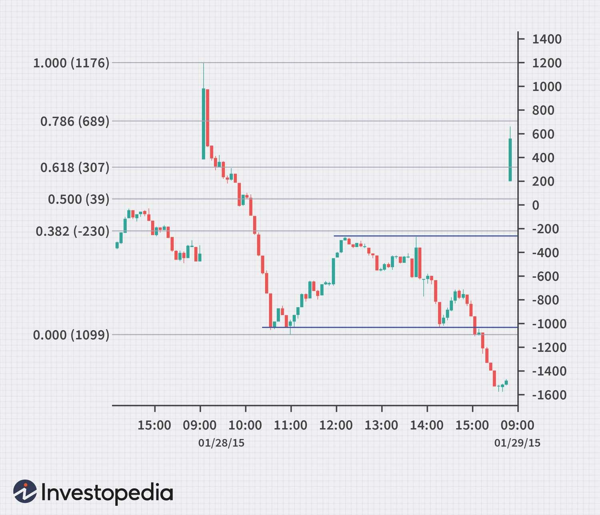

## Table of Contents

## What is tape reading and its origins?

Tape reading is a method used by traders to analyze the price and volume data of stocks as they are traded. It involves watching the "tape," which is a real-time feed of stock transactions, to make quick decisions about buying or selling stocks. Traders look for patterns and trends in the data to predict future price movements. This technique requires a lot of focus and quick thinking, as the information on the tape changes rapidly.

The origins of tape reading go back to the late 19th and early 20th centuries, when stock prices were printed on a paper tape by a machine called a stock ticker. This machine was invented by Thomas Edison in 1869, and it allowed traders to see stock prices as they were happening. Before the stock ticker, traders had to wait for newspapers to get the latest stock prices, which could take hours or even days. The ability to see prices in real time revolutionized trading and led to the development of tape reading as a popular trading strategy.

## How was tape reading used in the early stock markets?

In the early stock markets, tape reading was a key tool for traders. They used machines called stock tickers, invented by Thomas Edison, to get real-time stock prices printed on a paper tape. Traders would sit and watch this tape closely, looking for patterns in the numbers. They wanted to see when prices were going up or down and how many shares were being traded. This helped them decide when to buy or sell stocks quickly.

Tape reading was important because it gave traders an edge. Before the stock ticker, they had to wait for newspapers to see stock prices, which could take a long time. With the tape, they could see changes as they happened. This made trading faster and more exciting. Traders who were good at reading the tape could make money by spotting trends before others did. It was like a game of watching and reacting quickly to the numbers on the tape.

## What tools were historically used for tape reading?

In the old days, the main tool for tape reading was the stock ticker. This machine was invented by Thomas Edison in 1869. It printed stock prices on a long strip of paper called a tape. Traders would sit and watch this tape roll out, looking at the numbers to see how stock prices were changing. The tape showed the price of each stock and how many shares were being traded. This helped traders make quick decisions about buying or selling stocks.

Besides the stock ticker, traders used simple tools like pencils and paper to keep track of what they saw on the tape. They would write down important numbers and patterns they noticed. Some traders also used chalkboards to jot down quick notes or draw charts. These tools helped them remember and analyze the information from the tape. Over time, as technology improved, electronic displays started to replace the paper tape, but the basic idea of watching and reacting to real-time stock data stayed the same.

## Who were some famous tape readers in history?

One famous tape reader was Jesse Livermore. He was a big name in the early 1900s. Livermore was known for making a lot of money by watching the stock ticker and making quick trades. He wrote a book called "Reminiscences of a Stock Operator," which is still popular today. In the book, he shares his experiences and tips about tape reading. People still read it to learn about trading.

Another well-known tape reader was Richard Wyckoff. He started trading in the early 1900s too. Wyckoff believed that by studying the tape, you could understand what big investors were doing. He created a method called the Wyckoff Method, which is still used by traders today. Wyckoff also wrote [books](/wiki/algo-trading-books) and started a magazine to teach others about his trading techniques. His work helped many people learn how to read the tape and make better trading decisions.

## How has technology changed tape reading practices?

Technology has changed tape reading a lot. In the old days, traders used a machine called a stock ticker to see stock prices on a paper tape. They had to sit and watch the tape roll out, looking at the numbers to make quick decisions. Now, computers and the internet have made things easier. Traders can see stock prices on screens in real time. They don't need to watch a paper tape anymore. This makes it faster and easier to see what's happening with stocks.

New tools like trading software and apps have also changed how traders read the tape. These tools can show lots of information at once, like charts and graphs, which help traders see patterns and trends more clearly. They can also set up alerts to tell them when certain things happen with stocks. This means traders can watch more stocks at the same time and make better decisions. Even though the basic idea of watching stock prices in real time is the same, technology has made tape reading much more advanced and efficient.

## What are the basic principles of modern tape reading?

Modern tape reading is all about watching stock prices and trading volumes in real time on a computer screen. Traders look at how prices are moving and how many shares are being bought and sold. They try to spot patterns and trends that can help them decide when to buy or sell stocks. This is similar to what traders did in the old days with the paper tape, but now it's much faster and easier with computers.

The key to modern tape reading is being able to react quickly to what you see on the screen. Traders use special software that shows them lots of information at once, like charts and graphs. This helps them see what's happening with stocks more clearly. They also set up alerts to tell them when certain things happen, so they can watch more stocks at the same time. Even though technology has changed a lot, the basic idea of watching and reacting to stock prices in real time is still the same.

## How can tape reading be applied to today's electronic trading platforms?

Tape reading can be used on today's electronic trading platforms by watching the stock prices and trading volumes on a computer screen. Traders look at how the prices are changing and how many shares are being traded. They use special software that shows them charts and graphs to help them see patterns and trends. This helps them decide when to buy or sell stocks quickly. The software also lets them set up alerts, so they know when certain things happen with the stocks they are watching. This way, they can keep an eye on more stocks at the same time.

Even though the tools have changed from the old paper tape to electronic screens, the basic idea of tape reading is the same. Traders still need to be quick and good at spotting patterns in the data. They use the information on the screen to make smart decisions about trading. With today's technology, tape reading is faster and easier, but it still takes practice and skill to do it well.

## What are the key indicators to watch in modern tape reading?

In modern tape reading, the main things to watch are the price and the [volume](/wiki/volume-trading-strategy) of stocks. Price shows how much a stock is worth at any moment. Traders look at how the price is moving up or down to see if it's a good time to buy or sell. Volume tells you how many shares of a stock are being traded. If a lot of shares are being traded, it means the stock is popular and there's a lot of interest in it. This can help traders understand if the price movement is strong or just a small change.

Another important thing to watch is the bid and ask prices. The bid price is what people are willing to pay for a stock, and the ask price is what people are asking to sell it for. The difference between these two prices is called the spread. A small spread means the stock is easy to trade, while a big spread can mean it's harder to buy or sell quickly. Traders also look at the time and sales data, which shows every trade that happens. This helps them see the exact price and volume of each trade, giving them a clear picture of what's happening with the stock.

## How does tape reading integrate with other forms of technical analysis?

Tape reading works well with other types of technical analysis because it gives traders real-time information about stock prices and trading volumes. When traders use tape reading, they can see what's happening with stocks right now. This helps them make quick decisions. They can then use other technical analysis tools, like charts and indicators, to look at longer-term trends and patterns. For example, a trader might see a big jump in volume on the tape and then check a chart to see if it matches a [breakout](/wiki/breakout-trading) pattern. By combining tape reading with other tools, traders get a fuller picture of what's going on in the market.

Other forms of technical analysis, like moving averages and relative strength index (RSI), can help traders understand if the price movements they see on the tape are strong or weak. For instance, if the tape shows a stock's price going up and the RSI is also high, it might mean the stock is overbought and could go down soon. Traders can use this information to decide if they should buy or sell. By using tape reading along with other technical analysis methods, traders can make better and more informed trading decisions.

## What are the common pitfalls and challenges faced by tape readers today?

One big challenge for tape readers today is the speed of the market. Everything happens so fast on electronic trading platforms. It can be hard to keep up with all the numbers and make quick decisions. Sometimes, traders might see a pattern on the tape, but by the time they act, the market has already moved on. This can lead to missed chances or bad trades. Also, there's so much information coming in all the time that it can be overwhelming. Traders need to stay focused and not get distracted by all the data.

Another pitfall is the risk of false signals. The tape can show a lot of ups and downs, but not all of them mean something important. Traders might think they see a trend, but it could just be random noise. This can lead to making trades based on wrong information. It's also hard to tell the difference between real market moves and ones caused by big traders or algorithms. Tape readers need to be careful and use other tools to check what they see on the tape. It takes a lot of practice and experience to get good at it.

## How can one develop a successful tape reading strategy?

To develop a successful tape reading strategy, you need to start by learning how to read the tape well. This means watching the stock prices and trading volumes on your computer screen and understanding what they mean. You should practice a lot to get good at spotting patterns and trends quickly. It's also important to use other tools like charts and graphs to help you see what's happening with the stocks. By combining tape reading with other technical analysis methods, you can get a better idea of when to buy or sell.

Another key part of a successful tape reading strategy is managing your risks. The market can move very fast, and it's easy to make mistakes if you're not careful. You should set clear rules for yourself about when to enter and [exit](/wiki/exit-strategy) trades. It's also a good idea to use stop-loss orders to limit your losses if the market goes against you. Keep learning and adapting your strategy as you gain more experience. Remember, tape reading takes time and practice, but with patience and the right approach, you can improve your trading skills.

## What advanced techniques can expert tape readers use to gain an edge in the market?

Expert tape readers can use advanced techniques like order flow analysis to gain an edge in the market. Order flow analysis means watching the buy and sell orders closely to see what big traders are doing. By looking at the size and timing of these orders, expert tape readers can guess if a stock's price is going to go up or down. They can also use this information to spot when big traders are trying to move the market in a certain direction. This helps them make better trading decisions and stay ahead of other traders.

Another advanced technique is using Level II quotes. Level II quotes show more details about the buy and sell orders, like the different price levels and the number of shares at each level. Expert tape readers can use this information to see where the support and resistance levels are for a stock. They can also see if there's a lot of buying or selling pressure at certain prices. By understanding these details, they can predict how the stock's price might move next and make smarter trades. These advanced techniques take a lot of practice, but they can help expert tape readers do better in the fast-moving market.

## References & Further Reading

[1]: Bergstra, J., Bardenet, R., Bengio, Y., & Kégl, B. (2011). ["Algorithms for Hyper-Parameter Optimization."](https://dl.acm.org/doi/10.5555/2986459.2986743) Advances in Neural Information Processing Systems 24.

[2]: ["Advances in Financial Machine Learning"](https://www.amazon.com/Advances-Financial-Machine-Learning-Marcos/dp/1119482089) by Marcos Lopez de Prado

[3]: ["Evidence-Based Technical Analysis: Applying the Scientific Method and Statistical Inference to Trading Signals"](https://www.amazon.com/Evidence-Based-Technical-Analysis-Scientific-Statistical/dp/0470008741) by David Aronson

[4]: ["Machine Learning for Algorithmic Trading"](https://github.com/stefan-jansen/machine-learning-for-trading) by Stefan Jansen

[5]: ["Quantitative Trading: How to Build Your Own Algorithmic Trading Business"](https://www.amazon.com/Quantitative-Trading-Build-Algorithmic-Business/dp/1119800064) by Ernest P. Chan