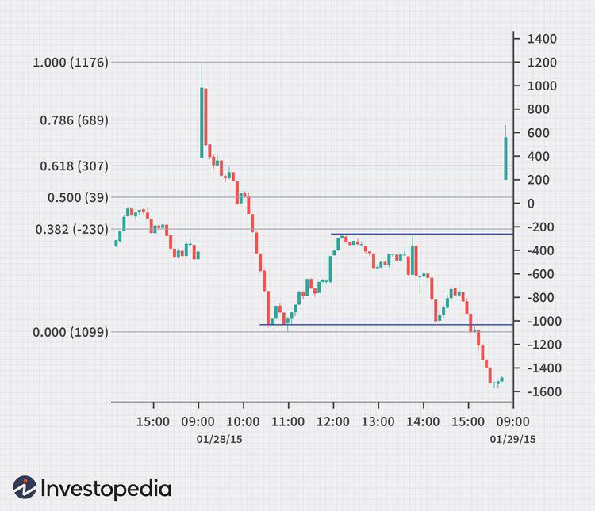

The world of trading is in perpetual advancement, continuously shaped by technological innovations and evolving strategies. For traders aiming to achieve success in this dynamic market environment, staying informed and adaptable is essential. Traditionally, trading relied heavily on manual techniques and human intuition; however, with the advent of digital technology, tools like tape reading and algorithmic trading have become indispensable.

Tape reading, an age-old technique, involves the analysis and interpretation of real-time trade data. Initially utilized with ticker tapes to discern market trends, this method focuses on intraday price movements, volumes, and trade patterns, enabling traders to gauge market sentiment and identify potential market movers. Its fundamental principles, though rooted in the past, continue to be vital in current market strategies.



On the other hand, algorithmic trading has revolutionized the trading landscape by employing complex algorithms and high-speed computations to automatically execute trades based on predetermined conditions. This approach not only enhances the speed and efficiency of trading operations but also adds a layer of analytical precision that often surpasses human capability. By leveraging algorithms, traders can swiftly analyze large sets of data to spot trends and capitalize on market inefficiencies.

This article explores the intersection of these two critical tools within trading strategies, offering insights into their historical development and contemporary application. The integration of tape reading with algorithmic trading represents a convergence of traditional techniques and modern technology, resulting in a robust trading strategy that balances human intuition with machine precision.

As the market's complexity escalates, understanding the synergies between tape reading and algorithmic trading becomes integral. This article aims to elucidate these concepts, providing traders with the knowledge needed to navigate today's multifaceted financial markets skillfully.

## Table of Contents

## What is Tape Reading?

Tape reading, often referred to as Level 2 data analysis, is a technique that involves the interpretation of real-time trade data to discern market movements and trends. Historically, traders relied on physical ticker tapes, which were continuous paper strips that recorded every transaction in the stock market. These tapes allowed traders to observe changes in prices, trading volumes, and other critical market information, enabling them to make informed trading decisions.

The essence of tape reading lies in understanding intraday price movements by meticulously analyzing trade volumes and patterns. By examining the flow of trades tick-by-tick, traders can gain insights into market sentiment, identifying whether a market is bullish or bearish at any given moment. This information helps in pinpointing potential market movers—stocks or assets that show significant movement and thereby offer trading opportunities. 

What makes tape reading crucial is its ability to provide an unfiltered view of the market, reflecting the dynamics of supply and demand. For instance, when a stock is under buying pressure, its price and [volume](/wiki/volume-trading-strategy) patterns on the tape can signal an upward trend, whereas selling pressure can indicate a downward trend.

Despite the technological advancements over the years, the core principles of tape reading have remained fundamental and relevant. Modern traders, equipped with electronic platforms, still utilize these principles, albeit in a more sophisticated manner. They often use market depth tools, which display bid and ask prices along with available volumes, offering a visual representation akin to the ticker tape's role in the past. 

By recognizing patterns such as large trades, repeated buying or selling at certain price levels, or sudden spikes in volume, traders can infer potential continuations or reversals in price. The persistence and skill in tape reading allow for a deeper understanding of market psychology and help in making precise entry and [exit](/wiki/exit-strategy) decisions, an advantage that remains significant in today's fast-paced trading environments.

In conclusion, even as technology becomes more advanced, the foundational skills of tape reading continue to serve traders, proving itself as an indispensable technique for those seeking to comprehend the market's real-time rhythm and intricacies.

## Strategies for Effective Tape Reading

Tape reading, a technique steeped in trading history, involves deciphering the complex portrayal of market data to gain insights into intraday price movements. For traders aiming to refine their tape reading skills, a plethora of strategies can be employed.

One foundational aspect is understanding market depth, which involves analyzing bid-ask spreads and identifying large orders. Market depth shows the quantity of buy and sell orders at various prices, offering a snapshot of the market's [liquidity](/wiki/liquidity-risk-premium) and sentiment. A narrow bid-ask spread often indicates high liquidity and low [volatility](/wiki/volatility-trading-strategies), whereas a wide spread might suggest the opposite. Recognizing large orders, often referred to as block trades, can signal potential market movers and indicate significant institutional activity.

Another strategy is recognizing patterns such as price absorption and order imbalances. Price absorption occurs when a security maintains its price despite a large volume of trades, suggesting a resistance to price movement which could eventually lead to significant shifts. Order imbalances, where there is a disparity between buy and sell orders, can indicate upcoming price adjustments as the market seeks equilibrium.

Pre-market preparation is pivotal for anticipating market openings and potential gaps. By analyzing overnight market news and trading in international markets, traders can gauge sentiment and volatility for the day's opening bell. Market openings can often see price gaps, where a security opens at a significantly different price than its previous close, driven by overnight information.

Employing first-hour tells through relative strength and advance/decline indicators is another effective strategy. The first trading hour is often characterized by the highest volume and volatility, making it critical to observe. Relative strength indicators (RSI) help traders assess if a security is overbought or oversold, potentially predicting reversals. Concurrently, advance/decline indicators, which measure the ratio of advancing stocks to declining ones, provide a broader market perspective.

Finally, interlinking tape reading with technical analysis enhances the ability to validate trends and reversals. Technical analysis tools, such as moving averages and Bollinger Bands, offer statistical measures that, when used in conjunction with real-time data from tape reading, can provide confirmation of emerging trends or impending reversals.

By mastering these strategies, traders can enhance their ability to interpret the tape, thus making more informed trading decisions. As the market continues to evolve, ongoing learning and adaptation remain essential.

## Algorithmic Trading's Role in Modern Markets

Algorithmic trading, often referred to as algo trading, represents a sophisticated market approach where computer algorithms are employed to execute trades based on pre-determined rules and criteria. The primary objective of these algorithms is to autonomously navigate the financial markets with precision, ensuring trades are executed at optimal times to capitalize on market conditions.

This method has revolutionized market operations by significantly increasing not only the speed but also the complexity of trading activities. The ability to process and analyze vast amounts of market data in milliseconds allows [algorithmic trading](/wiki/algorithmic-trading) systems to identify trends and inefficiencies much faster than human traders. For instance, a trading algorithm can quickly evaluate moving averages, relative strength indices, or Fibonacci retracement levels to make decisions—tasks that would be inherently slower for humans due to cognitive limitations.

Algorithmic trading enhances traditional tape reading by providing a real-time analysis of Level 2 data. Through rapid data processing, algorithms can identify patterns, such as sudden volume spikes or abnormal order flows, suggesting market sentiment shifts or impending price movements. This not only aids in executing high-frequency trades but also supports more strategic, longer-term trading decisions by providing continuous market insights.

By integrating algorithmic approaches with traditional trading techniques, traders develop robust strategies that leverage the strengths of both methods. For example, while algorithms are adept at spotting micro-trends and executing high-speed transactions, human traders excel in strategic decision-making, managing broader market conditions, and interpreting qualitative data that algorithms may not process effectively. Python, a preferred programming language in finance, allows traders to create complex trading algorithms easily. A simple moving average crossover strategy could be implemented in Python as follows:

```python
import pandas as pd
import numpy as np

# Assuming 'df' is a DataFrame with historical price data
short_window = 40
long_window = 100

# Calculate moving averages
df['Short_MA'] = df['Close'].rolling(window=short_window, min_periods=1).mean()
df['Long_MA'] = df['Close'].rolling(window=long_window, min_periods=1).mean()

# Generate trading signals: Buy when short moving average > long moving average
df['Signal'] = 0
df['Signal'][short_window:] = np.where(df['Short_MA'][short_window:] > df['Long_MA'][short_window:], 1, 0)

# Calculate the position
df['Position'] = df['Signal'].diff()

# Output the first few rows of the DataFrame
print(df.head())
```

Despite its advantages, algorithmic trading introduces specific challenges and risks. The high reliance on automated processes means these systems can fail to adapt to sudden market changes, such as unexpected geopolitical events or flash crashes, where human intuition and experience may offer better judgment. Moreover, the complexity of these algorithms can lead to unintended consequences if not carefully designed and monitored.

In summary, the role of algorithmic trading in modern markets is multifaceted, offering speed, data-processing capability, and strategic integration with human trading practices. It holds the potential to optimize trading outcomes while demanding rigorous oversight and a comprehensive understanding of both technology and market dynamics.

## Integrating Tape Reading and Algo Trading

Integrating tape reading with algorithmic trading merges traditional market analysis with advanced computational techniques, allowing for sharper precision in determining entry and exit points in trades. The synergy between human insight gained from tape reading and the efficiency of algorithms creates a formidable strategy for navigating modern financial markets.

Algo trading automates routine data analysis, relieving traders from the time-intensive task of manually interpreting vast amounts of market data. By doing so, human traders can dedicate more focus to strategic decision-making, thus optimizing their use of time and expertise. For instance, an automated system can continuously scan for specific trade patterns or volume anomalies, presenting traders with opportunities that align with the broader strategic goals. 

Rapid response times are crucial in high-frequency trading environments, where prices and trade opportunities can change in milliseconds. Traditional methods of trading may struggle to keep pace with such swift market dynamics, often missing out on potential gains. In contrast, algorithms have the capability to execute trades rapidly, reacting to real-time data with speed beyond human capacity. This ensures that traders do not miss opportunities, as algorithms can respond instantaneously to pre-defined triggers.

Successful integration demands a solid understanding of both tape reading and algorithmic strategies. Traders must be adept at interpreting the market depth and order flows from a tape reading perspective, while also being familiar with the scripting and parameters essential to designing efficient trading algorithms. These skills, when combined, help in configuring algorithms that are not only responsive but also contextually aware of the market environment.

Practical experience and simulation are vital for mastering the combination of these methodologies. Traders can use [backtesting](/wiki/backtesting) frameworks in Python, for example, to simulate strategies and optimize them based on historical data. By adjusting parameters and refining algorithms in a controlled environment, traders can improve their approach before executing trades in live markets.

```python
import backtrader as bt

class TapeReadingAlgo(bt.Strategy):
    def __init__(self):
        self.order = None

    def next(self):
        # Basic logic to demonstrate integration
        if self.data.volume[-1] > self.data.volume[-2]:
            self.order = self.buy()
        elif self.data.volume[-1] < self.data.volume[-2]:
            self.order = self.sell()

# Create a Cerebro engine to run the strategy
cerebro = bt.Cerebro()
cerebro.addstrategy(TapeReadingAlgo)

# Add data, e.g., historical trade data
data = bt.feeds.YahooFinanceData(dataname='AAPL', fromdate=datetime(2020,1,1), todate=datetime(2020,12,31))
cerebro.adddata(data)

# Run backtest
cerebro.run()
```
This integration, when mastered, can lead to a robust trading strategy that leverages the best of human judgment and machine accuracy, adapted continuously through practice and technological enhancement.

## Case Studies and Real-world Examples

Tape reading has historically provided valuable insights into market trends and shifts. In the early 20th century, traders like Jesse Livermore effectively used tape reading to predict market movements, capitalizing on patterns in ticker tape data to make informed trading decisions. Livermore's ability to discern market sentiment through tape analysis led to significant profits, showcasing tape reading's potential for predicting market shifts.

As trading evolved, the integration of tape reading with algorithmic trading created a powerhouse for market analysis. One notable case is that of Jim Simons and the Renaissance Technologies [hedge fund](/wiki/hedge-fund-trading-strategies). Simons combined traditional tape reading insights with sophisticated algorithms to automate the identification of trading opportunities. By leveraging historical price patterns and real-time data, the firm achieved remarkable success, consistently outperforming the market. This case exemplifies how blending tape reading with modern algorithms can enhance trading effectiveness.

External events, such as economic announcements or geopolitical crises, can significantly impact tape reading's effectiveness. For example, during the 2008 financial crisis, the volatility and rapid market changes challenged traders relying on traditional tape reading. The unpredictability necessitated an adaptation in strategy, underscoring the importance of incorporating algorithmic tools capable of processing vast datasets rapidly to identify shifts.

Lessons from notable trading events highlight the importance of real-time data analysis. The Flash Crash of 2010, where rapid algorithmic trading led to a significant market plunge within minutes, demonstrated the necessity of integrating robust tape reading mechanisms and real-time data monitoring to mitigate the effects of such events. Traders learned the value of algorithms capable of detecting anomalies and stopping trades quickly to prevent extensive losses.

Looking ahead, the future of trading strategies lies in further integration of technological advancements with classical methods. As [artificial intelligence](/wiki/ai-artificial-intelligence) and [machine learning](/wiki/machine-learning) evolve, they offer unprecedented opportunities to refine algorithms for even greater accuracy in predicting market movements. The continuous adaptation of these technologies promises a future where traders can harness complex data strands more effectively, streamlining decision-making processes and optimizing market strategies. However, the human element remains irreplaceable, as intuition and experience are pivotal in interpreting data and making strategic decisions. Balancing human insight with technological precision will be crucial for traders aiming to navigate the increasingly complex landscape of global financial markets.

## Conclusion

Tape reading remains a critical skill for traders aiming to understand market dynamics in real-time. By analyzing live order flow and market depth, traders can gain insights into price movements and sentiment shifts that are not visible through end-of-day data. Although the technique has evolved from its early days of physical ticker tape, the fundamental principles of tape reading continue to hold substantial relevance.

Algorithmic trading has emerged as a powerful tool that enhances the tape reading process by automating the analysis of large volumes of market data. Algorithms can quickly identify patterns and trends that human traders might miss, thus providing a competitive edge. This automation allows for the rapid execution of trades based on predefined criteria, further optimizing the decision-making process. 

The integration of tape reading with algorithmic trading offers the best of both worlds. This combination allows for precise entry and exit points by leveraging the speed and data processing capabilities of machines while still benefiting from human intuition and strategic oversight. Traders who successfully combine these approaches can execute strategies that require both detailed analysis and quick response times.

Continuous learning and adaptation are essential as financial markets and technologies continuously evolve. The integration of new tools with traditional methods necessitates a commitment to ongoing education and skill development. Traders must remain agile, updating their strategies to account for technological advancements and market changes.

Success in trading requires a balanced approach, blending traditional skills like tape reading with modern techniques such as algorithmic trading. By navigating the complexities of financial markets with a hybrid strategy, traders can enhance their ability to identify opportunities and mitigate risks effectively. This balance is key to thriving in an increasingly fast-paced and data-driven trading environment.

## References & Further Reading

[1]: Bergstra, J., Bardenet, R., Bengio, Y., & Kégl, B. (2011). ["Algorithms for Hyper-Parameter Optimization."](https://dl.acm.org/doi/10.5555/2986459.2986743) Advances in Neural Information Processing Systems 24.

[2]: ["Advances in Financial Machine Learning"](https://www.amazon.com/Advances-Financial-Machine-Learning-Marcos/dp/1119482089) by Marcos Lopez de Prado

[3]: ["Evidence-Based Technical Analysis: Applying the Scientific Method and Statistical Inference to Trading Signals"](https://www.amazon.com/Evidence-Based-Technical-Analysis-Scientific-Statistical/dp/0470008741) by David Aronson

[4]: ["Machine Learning for Algorithmic Trading"](https://github.com/stefan-jansen/machine-learning-for-trading) by Stefan Jansen

[5]: ["Quantitative Trading: How to Build Your Own Algorithmic Trading Business"](https://www.amazon.com/Quantitative-Trading-Build-Algorithmic-Business/dp/1119800064) by Ernest P. Chan