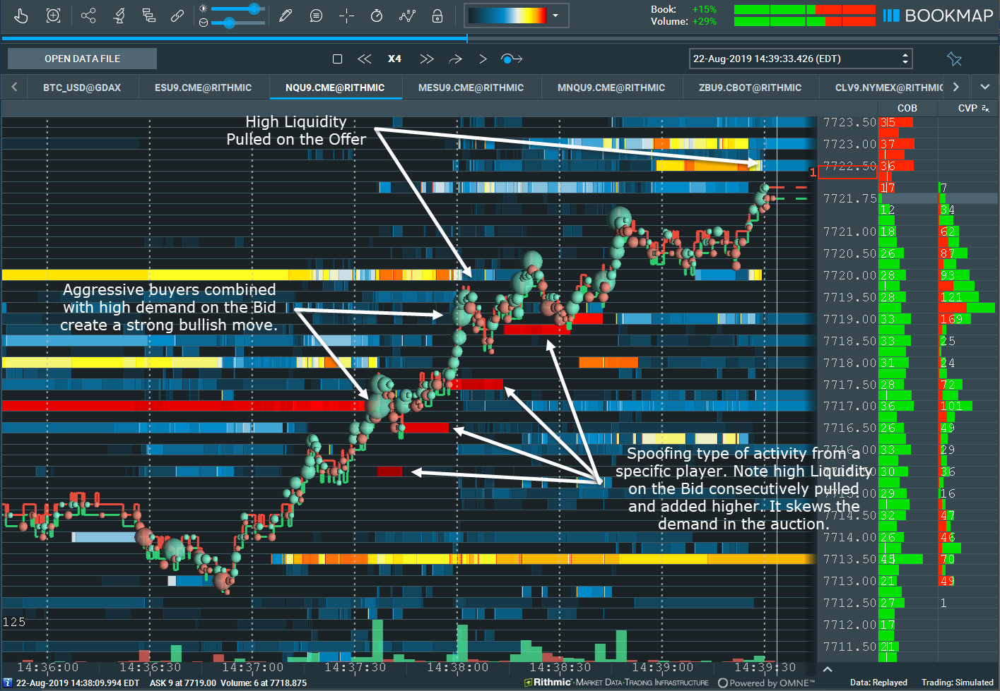

## Table of Contents

## What is tape reading in trading?

Tape reading in trading is a method where traders watch the real-time data of stock prices and volumes to make quick trading decisions. It's like trying to read the story of the market by looking at the numbers and movements as they happen. Traders who use this method pay close attention to the price changes and the number of shares being traded to spot trends or patterns that might not be obvious from just looking at charts or reports.

This technique became popular a long time ago when traders would literally read the ticker tape, a paper strip that showed stock prices and volumes. Today, with computers and fast internet, tape reading is done on screens, but the idea is the same. Traders look for signs like big jumps in volume or sudden price changes to guess where the market might be heading next. It's a skill that takes a lot of practice and a good understanding of how markets work.

## How does tape reading differ from other trading strategies?

Tape reading is different from other trading strategies because it focuses on watching the market in real-time. Instead of using charts or waiting for reports, tape readers look at the price and volume of stocks as they change second by second. This means they try to make quick decisions based on what they see happening right now, rather than what has happened in the past or what might happen in the future. It's like trying to catch the market's mood by watching it closely.

Other trading strategies might use different tools or focus on different things. For example, some traders use technical analysis, where they look at charts and patterns to predict where prices might go. Others might use [fundamental analysis](/wiki/fundamental-analysis), where they study a company's financial health and news to decide if its stock is a good buy. Tape reading is more about reacting to the market's immediate movements, so it requires a lot of focus and quick thinking, unlike strategies that might take more time to plan and execute.

## What are the key components of the tape that traders focus on?

When traders use tape reading, they mainly look at two things: the price and the [volume](/wiki/volume-trading-strategy) of stocks. The price tells them how much the stock is worth at that moment, and it can go up or down quickly. Traders watch for big jumps or drops in price because these can show that something important is happening with the stock. If the price suddenly changes a lot, it might mean that many people are buying or selling the stock, and that can be a sign of what might happen next.

The other thing traders focus on is the volume, which is the number of shares being traded. High volume means a lot of shares are being bought and sold, and this can show how strong the interest in the stock is. If the volume goes up a lot, it might mean that more people are interested in the stock, and that can push the price up or down. By watching both the price and the volume together, traders try to understand the market's mood and make quick decisions about buying or selling stocks.

## Can you explain the basic principles of tape reading for beginners?

Tape reading is a way of trading where you watch the price and the number of shares being traded in real-time. It's like trying to understand what the market is thinking by looking at what's happening right now. When you see the price of a stock go up or down quickly, it might mean that a lot of people are buying or selling it. If you also see a lot of shares being traded at the same time, it can tell you that the change in price is important and might keep going in that direction.

To start with tape reading, you need to keep your eyes on the screen and watch for big changes. If the price of a stock jumps up and a lot of shares are being traded, it might be a good time to buy because other people seem to think the price will keep going up. On the other hand, if the price drops a lot and the volume is high, it might be a sign to sell because the price could keep falling. The key is to be quick and make decisions based on what you see happening right now, not what you think might happen later.

## What tools and software are essential for effective tape reading?

To do tape reading well, you need a good trading platform that shows you the price and volume of stocks in real-time. This platform should be fast and reliable so you can see what's happening in the market without any delay. Some popular platforms that traders use are Thinkorswim by TD Ameritrade, [Interactive Brokers](/wiki/interactive-brokers-api)' Trader Workstation, and Bloomberg Terminal. These platforms give you all the information you need to watch the market closely and make quick decisions.

Besides a trading platform, having a fast internet connection is really important. If your internet is slow, you might miss important changes in the market. Also, some traders use special software that helps them see the data in different ways, like Level II quotes which show you more details about who is buying and selling. This can help you understand the market better and make better trading choices.

## How can a beginner start practicing tape reading?

To start practicing tape reading, a beginner should first get a good trading platform that shows real-time price and volume data. Platforms like Thinkorswim or Interactive Brokers are popular choices because they provide the information you need to watch the market closely. Make sure you have a fast internet connection so you don't miss any important changes in the market. It's also helpful to use a demo account where you can practice trading without risking real money. This way, you can get used to watching the market and making quick decisions without worrying about losing money.

Once you have the right tools, start by watching the price and volume of a few stocks. Look for big jumps or drops in the price and see if they happen when a lot of shares are being traded. This can help you understand when the market is really interested in a stock. Try to practice every day, even if it's just for a little while, so you can get better at spotting patterns and making decisions quickly. Remember, tape reading is about reacting to what's happening right now, so the more you practice, the better you'll get at it.

## What are common mistakes to avoid when using the tape reading strategy?

One common mistake beginners make with tape reading is trying to watch too many stocks at once. It's hard to keep track of everything when you're new, so it's better to start with just a few stocks. This way, you can focus on understanding the price and volume changes without getting overwhelmed. Another mistake is not paying attention to the overall market trends. Even if a stock looks good on the tape, if the whole market is going down, it might not be the best time to buy.

Another mistake is reacting too quickly without understanding the context. Sometimes, a big jump in price and volume might look like a good sign, but it could be because of news or events that you don't know about. It's important to do a little research and understand why the stock is moving before making a decision. Also, beginners often forget to use a demo account to practice. Jumping straight into real trading without practice can lead to big losses, so it's better to get comfortable with tape reading in a safe environment first.

## How do experienced traders interpret volume and price action in tape reading?

Experienced traders look at volume and price action together to understand what's happening in the market. When they see a big jump in the price of a stock and a lot of shares being traded at the same time, they think it's a strong sign that the price might keep going up. They believe that high volume shows that many people are interested in the stock, and that can push the price higher. On the other hand, if the price drops a lot and the volume is high, they might think it's a sign that the price could keep falling because a lot of people are selling.

These traders also pay attention to the speed of the price changes. If the price moves quickly, it can mean that something important is happening, like news or a big event. They use this information to make quick decisions about buying or selling. Experienced traders know that it's not just about the numbers, but also about understanding the story behind the numbers. They look for patterns and try to guess what other traders might do next based on what they see happening right now.

## What advanced techniques can be used to enhance tape reading effectiveness?

To make tape reading better, experienced traders use a technique called Level II quotes. This shows them more details about who is buying and selling a stock. It's like looking at the market from a closer angle. By seeing who the big buyers and sellers are, traders can guess if the price will go up or down. They also look at the [order book](/wiki/order-book-trading-strategies), which tells them about the orders waiting to be filled. This can help them understand if there's a lot of interest in the stock at certain prices, which can give them an idea of where the price might go next.

Another technique is using time and sales data, which shows every trade that happens in real time. Traders watch this to see if big trades are happening at certain prices. If they see a lot of big trades at a higher price, it might mean the stock is about to go up. They also use this to spot trends or patterns that might not be obvious from just looking at the price and volume. By combining all these techniques, experienced traders can get a better picture of what's happening in the market and make smarter trading decisions.

## How does tape reading integrate with other technical analysis methods?

Tape reading can work well with other technical analysis methods by helping traders get a fuller picture of the market. For example, while tape reading focuses on real-time price and volume changes, technical analysis often looks at charts and patterns over time. By using tape reading, traders can see what's happening right now and then use technical analysis to understand how these changes fit into bigger trends. If the tape shows a big jump in price and volume, a trader might look at the charts to see if this fits with a pattern like a [breakout](/wiki/breakout-trading) or a reversal. This can help them decide if the move is likely to continue or if it's just a short-term spike.

Another way tape reading can be combined with technical analysis is by using indicators like moving averages or the Relative Strength Index (RSI). These tools can help traders confirm what they see on the tape. For instance, if the tape shows a stock's price going up with high volume, a trader might check if the stock is above its moving average or if the RSI is showing it's not overbought. This can give them more confidence in their decision to buy or sell. By blending the immediate insights from tape reading with the broader context provided by technical analysis, traders can make more informed and potentially more successful trades.

## Can you discuss case studies or examples where tape reading led to successful trades?

One example of successful tape reading happened with a trader named Linda. She was watching a stock called XYZ Corp. One day, she saw the price of XYZ jump up quickly, and at the same time, the volume of shares being traded was very high. Linda knew from her tape reading practice that this could mean the stock was about to go up even more. She quickly bought some shares of XYZ. A few hours later, the stock kept going up, and Linda sold her shares for a nice profit. By paying close attention to the price and volume changes, Linda was able to make a good trade.

Another case involved a trader named Mike who was watching a stock called ABC Inc. He noticed that the price of ABC was slowly going down, but suddenly, the price dropped a lot and the volume spiked. Mike thought this might mean the stock was about to keep falling. He decided to sell his shares of ABC right away. Later that day, the stock kept going down, and Mike was happy he sold when he did. By using tape reading, Mike was able to avoid losing more money and even made a small profit from selling at the right time.

## What are the psychological aspects and discipline required for mastering tape reading?

Mastering tape reading takes a lot of mental strength and discipline. You need to stay calm and focused, even when the market is moving fast. It's easy to get excited or scared when you see big changes in price and volume, but good tape readers keep their emotions in check. They know that making quick decisions based on what they see right now is important, but they also need to think clearly and not let their feelings take over. This means practicing a lot and getting used to watching the market without getting too excited or worried.

Discipline is also key in tape reading. You have to stick to your plan and not chase every little change you see on the screen. It's tempting to buy or sell just because the price is moving, but experienced traders know that they need to wait for the right signs. They set rules for themselves, like only trading when the volume is high enough or the price moves a certain amount. By following these rules and not letting their emotions control them, they can make better trades and improve their skills over time.

## References & Further Reading

[1]: Bergstra, J., Bardenet, R., Bengio, Y., & Kégl, B. (2011). ["Algorithms for Hyper-Parameter Optimization."](https://papers.nips.cc/paper/4443-algorithms-for-hyper-parameter-optimization) Advances in Neural Information Processing Systems 24.

[2]: ["Advances in Financial Machine Learning"](https://www.amazon.com/Advances-Financial-Machine-Learning-Marcos/dp/1119482089) by Marcos Lopez de Prado

[3]: ["Evidence-Based Technical Analysis: Applying the Scientific Method and Statistical Inference to Trading Signals"](https://www.amazon.com/Evidence-Based-Technical-Analysis-Scientific-Statistical/dp/0470008741) by David Aronson

[4]: ["Machine Learning for Algorithmic Trading"](https://github.com/stefan-jansen/machine-learning-for-trading) by Stefan Jansen

[5]: ["Quantitative Trading: How to Build Your Own Algorithmic Trading Business"](https://books.google.com/books/about/Quantitative_Trading.html?id=j70yEAAAQBAJ) by Ernest P. Chan