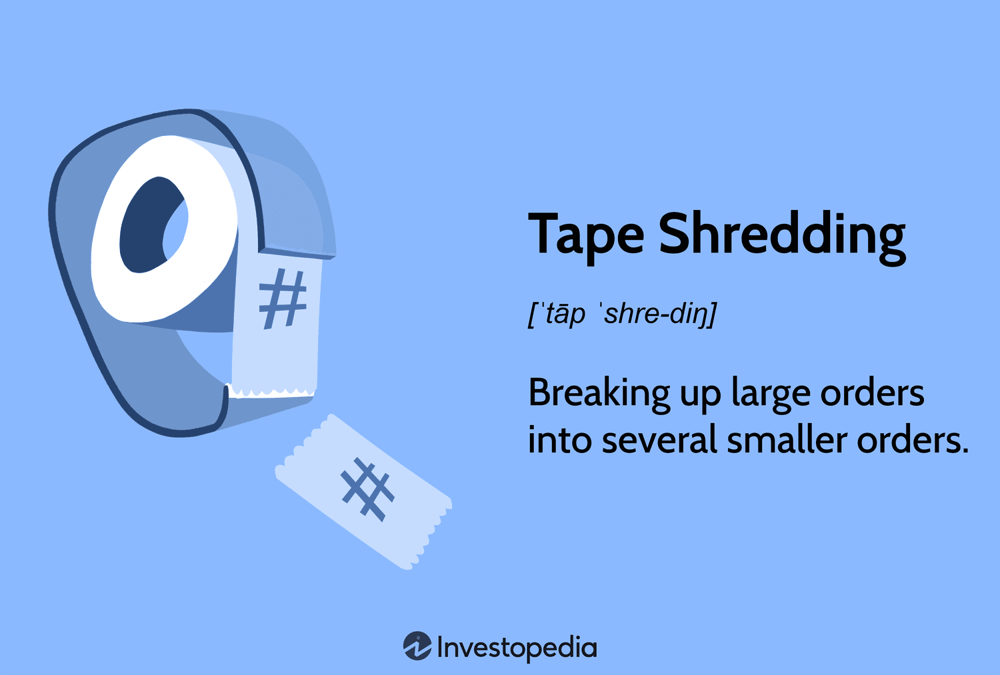

In the modern digital and business landscapes, the significance of data privacy and security has escalated to unprecedented levels. As organizations increasingly rely on digital technologies and data-driven processes, the need to protect sensitive information has become paramount. This protection is not only a legal and ethical obligation but also a critical factor in maintaining operational efficiency and competitive advantage.

Confidentiality is a cornerstone of data privacy, ensuring that sensitive information is accessible only to those who have the appropriate authorization. In sectors such as finance and healthcare, confidentiality is legally mandated, with regulations like the General Data Protection Regulation (GDPR) and the Health Insurance Portability and Accountability Act (HIPAA) enforcing stringent rules on how data must be protected and managed. Breaches of confidentiality can lead to severe legal penalties and reputational damage, as well as financial losses.



Document destruction plays a crucial role in maintaining data privacy, particularly when it comes to disposing of sensitive information that is no longer needed. Traditional methods, such as tape shredding, provide secure disposal of physical documents, while advanced digital destruction technologies ensure that electronic data is permanently erased and cannot be recovered. These processes are governed by industry standards and compliance requirements that dictate how information must be destroyed to prevent unauthorized access.

Algorithmic trading, or algo trading, is a domain where confidentiality intersects with sophisticated data usage and protection. This form of trading relies on vast amounts of data to execute trades at high speeds, presenting unique confidentiality challenges. Trading firms must protect their proprietary algorithms and strategies while ensuring data integrity. This balancing act is crucial in preventing security breaches that could lead to unfair market advantages or financial fraud.

The interconnectedness of these elements—confidentiality, document destruction, and algo trading—underscores their critical role in the business world. Organizations must adopt comprehensive strategies that integrate these concepts to protect sensitive data, comply with regulatory requirements, and optimize their operations. This article invites readers to explore the complexities of confidentiality and document management, offering insights into effective solutions for safeguarding valuable information in today’s dynamic environment.

## Table of Contents

## Understanding Confidentiality

Confidentiality refers to the principle of keeping sensitive information secure and ensuring that access is restricted only to authorized individuals or systems. This concept is vital across various industries, particularly finance and sectors driven by data, as these environments handle vast amounts of private information that must be protected to maintain trust and operational integrity.

In finance, confidentiality is paramount due to the sensitive nature of financial transactions, client data, and proprietary trading information. Financial institutions handle personal and financial data that, if compromised, can lead to significant financial loss and damage to reputation. Similarly, data-driven sectors, such as healthcare and technology, deal with personal and sometimes sensitive consumer data, making confidentiality indispensable for compliance and trust.

Legal and regulatory requirements have been established to safeguard personal data and enforce confidentiality across different sectors. The General Data Protection Regulation (GDPR) in the European Union mandates strict guidelines on data handling and protection, requiring organizations to ensure the confidentiality and security of personal data. Similarly, in the United States, the Health Insurance Portability and Accountability Act (HIPAA) sets standards for protecting sensitive patient information in healthcare. These regulations emphasize the need for organizations to implement robust data protection measures and ensure that individuals' privacy rights are upheld.

Data breaches pose significant risks to confidentiality. A breach occurs when unauthorized individuals gain access to confidential data, leading to potential financial losses, legal penalties, and reputational damage. High-profile incidents involving data breaches highlight the critical need for organizations to maintain vigilant security measures. The impact of failing to protect confidential information can extend beyond immediate financial loss to long-term damage to consumer trust.

Strategies for ensuring confidentiality often involve utilizing advanced encryption techniques and implementing stringent access controls. Encryption transforms readable data into a scrambled format, which can only be deciphered with the correct decryption key, thus protecting the data even if it is intercepted. Access controls, such as multi-[factor](/wiki/factor-investing) authentication and role-based access, limit access to sensitive information, ensuring that only authorized individuals can view or manipulate the data. 

Implementing these strategies requires a comprehensive understanding of the data lifecycle and potential vulnerabilities within an organization's systems. Companies frequently adopt a multi-layered approach to confidentiality, integrating both technological solutions and employee training to create a culture of security awareness. By doing so, organizations can mitigate the risks of data breaches and uphold the integrity of their operations, protecting both their interests and those of their clients or customers.

## The Role of Tape Shredding in Document Destruction

Tape shredding is a vital aspect of secure document disposal, particularly for organizations that handle large volumes of sensitive physical records. In the context of document destruction, tape shredding refers to the process of mechanically cutting magnetic tapes or similar media into small, unreadable pieces, thereby preventing unauthorized access to the information contained within.

Various methods exist for document destruction, each with its benefits and limitations. Techniques such as incineration, pulverization, and chemical treatment are commonly employed, but tape shredding offers unique advantages. First, tape shredding physically obliterates the media, ensuring that data recovery is virtually impossible. Unlike methods that rely on altering data storage formats or deleting electronic files, shredding provides a tangible level of security suitable for physical records. This physicality is crucial for organizations that must comply with stringent data protection regulations.

Industry standards and compliance requirements often mandate specific procedures for document destruction, acknowledging the importance of protecting sensitive information. Regulations such as the General Data Protection Regulation (GDPR) and the Health Insurance Portability and Accountability Act (HIPAA) necessitate effective measures to guard against data breaches. Tape shredding is an effective compliance strategy because it aligns with regulatory expectations for the irreversible destruction of identifiable personal and sensitive data.

Tape shredding becomes particularly critical in specific scenarios where the confidentiality of data is paramount. Organizations dealing with financial records, legal documents, or proprietary research must ensure that obsolete or redundant tapes do not pose security risks. For example, financial institutions might use tape shredding to securely dispose of archived customer transaction records, ensuring that personal financial information is not recoverable by unauthorized parties. Similarly, legal firms may opt for tape shredding to destroy documents containing confidential client information, safeguarding professional integrity and client trust.

Tape shredding, by providing a robust method for physical document destruction, complements digital data protection strategies, reinforcing comprehensive confidentiality measures. Its role is indispensable in maintaining the security and privacy of sensitive information, ensuring compliance with legal frameworks, and protecting organizational interests against potential data breaches.

## Digital Document Destruction: Strategies and Technologies

In the digital landscape, the destruction of electronic documents presents unique challenges that differ from those associated with physical document destruction. Ensuring that digital information is permanently deleted requires specialized techniques to guarantee that sensitive data cannot be recovered or reconstructed by unauthorized individuals. 

One of the primary challenges in digital document destruction is the residual data problem, where deleted files may still exist in some form on storage devices due to the way most file systems handle deletion. A simple file deletion typically removes the pointer to the file, marking the space as available for new data, but does not erase the actual data from the disk. As a result, robust methods are necessary to ensure complete destruction.

### Technologies for Digital Document Destruction

Several technologies have been developed to address the challenges of securely destroying digital documents. 

1. **Digital Shredding Software**: These software solutions overwrite the physical location of files multiple times with random data, effectively eradicating the original content. Tools like Eraser, BleachBit, and Shred are designed to implement such secure deletion processes, making data recovery virtually impossible. The Gutmann method is a popular scheme used by these tools, involving 35 overwrite passes with specific patterns to obscure the original data.

2. **Secure Delete Utilities**: Command-line tools such as 'sdelete' (on Windows) or the 'shred' command (on Unix-based systems) offer alternatives for secure deletion by employing similar methods of overwriting data. 

```python
# Example of using the 'shred' command in a Unix-based system
import os

def secure_delete(file_path):
    os.system(f"shred -u -z -n 3 {file_path}")

# Usage: Replace 'example.txt' with the path to your file
secure_delete('example.txt')
```

This Python script demonstrates invoking the 'shred' command to securely delete a file by overwriting it three times and removing it.

### Importance of Data Lifecycle Management

An integral part of digital document destruction is effective data lifecycle management. Organizations must have a comprehensive understanding of the entire lifecycle of their data—from creation, active use, archival, and ultimately to destruction. Implementing policies for data lifecycle management ensures that data is destroyed systematically and timely once it is no longer needed, reducing the risk of accidental data exposure.

### Guidelines for Thorough Digital Document Destruction

To ensure comprehensive digital document destruction, organizations should consider the following guidelines:

- **Identify and Classify Data**: Understand what data exists, where it is stored, and its importance to the business. Classification helps prioritize the destruction of sensitive information.

- **Implement Regular Audits**: Conduct audits to ensure compliance with data destruction policies and make adjustments as necessary to address new threats or changes in technology.

- **Leverage Automation**: Utilize automation tools to enforce data destruction processes and schedules. These tools can automatically detect files that need destruction based on predefined criteria.

- **Employee Training**: Educate employees on the importance of data destruction and train them on the correct usage of digital shredding tools and software.

- **Compliance with Regulatory Standards**: Ensure that digital document destruction practices comply with legal and regulatory requirements, which may stipulate specific destruction methods or timelines.

By addressing these challenges with the appropriate technologies, strategies, and policies, organizations can mitigate the risks associated with digital data retention and protect sensitive information from unauthorized access.

## Algo Trading and Confidentiality: A Double-Edged Sword

Algorithmic trading, or algo trading, is the practice of using computer programs and systems to execute a large number of trades in financial markets at speeds and frequencies that would be impossible for human traders. This method of trading relies heavily on intricate algorithms and vast amounts of market data to make trading decisions, identifying profitable opportunities based on pre-defined instructions or [machine learning](/wiki/machine-learning) models.

The reliance on data in algo trading presents significant confidentiality risks. Algorithms are proprietary assets, often representing years of research and development. The data these systems use, including price feeds, order [books](/wiki/algo-trading-books), and historical data, are also sensitive. Breaches can lead to financial loss, unauthorized trade duplication, and damage to reputation. 

One of the primary methods trading firms use to ensure data integrity and confidentiality is robust access controls. Implementing access controls helps ensure that only authorized personnel can access sensitive trading data and algorithms. Encryption plays a crucial role as well, safeguarding data both in transit and at rest using encryption protocols like AES (Advanced Encryption Standard). Furthermore, firms employ secure coding practices to minimize vulnerabilities within trading systems.

Another crucial aspect is continuous monitoring. By utilizing anomaly detection tools and log management, firms can proactively identify and respond to potential security threats. Regular security audits and penetration testing are also essential in identifying weaknesses and ensuring systems are fortified against attacks.

Striking a balance between using data effectively and protecting sensitive trading strategies is vital. Firms achieve this by deploying sandbox environments where algorithms can be tested safely without exposing actual trading data. Additionally, adopting a zero-trust architecture ensures that all users, whether internal or external, are consistently verified and monitored.

In conclusion, while [algorithmic trading](/wiki/algorithmic-trading) presents substantial benefits by leveraging vast datasets for market insight and execution efficiency, it necessitates stringent confidentiality measures to protect sensitive information and maintain competitive advantage. Trading firms must adopt comprehensive data protection strategies to navigate this double-edged sword responsibly.

## Integrating Confidentiality Practices across Business Functions

In today's digital and business environments, implementing confidentiality best practices across organizational functions is pivotal to maintaining data integrity and security. Businesses can achieve this by developing a comprehensive data protection strategy that integrates both physical and digital document destruction processes. This involves leveraging technologies and adhering to methodologies that safeguard sensitive information from unauthorized access or breaches.

Physical document destruction, such as tape shredding, is fundamental for disposing of hardcopy records securely. Incorporating these practices ensures that obsolete documents do not become vulnerabilities. On the digital front, employing advanced data erasure software capable of secure data deletion can prevent data leakage. Techniques like digital shredding or utilizing secure delete utilities help in making deleted files irretrievable.

Successful implementations of these practices can be observed in various industry case studies. For example, a financial services firm may employ encrypted digital shredding for electronic documents while simultaneously implementing tape shredding for confidential paper records. This dual approach not only ensures compliance with regulatory standards such as GDPR and HIPAA but also strengthens the firm's overall data confidentiality.

To enhance their confidentiality measures, businesses can adopt several actionable strategies:

1. **Assess and Identify Vulnerabilities**: Regularly conduct audits to identify weaknesses in current data management and destruction processes.

2. **Implement Multi-level Security Protocols**: Adopt encryption for both data in transit and at rest. Introduce access control mechanisms that limit data usage to authorized personnel only.

3. **Educate Employees**: Train staff on confidentiality policies and the importance of secure data handling. Awareness can greatly reduce the likelihood of accidental breaches.

4. **Automate Destruction Processes**: Use software solutions that automatically manage the lifecycle of digital data, ensuring timely and secure disposal of obsolete information.

5. **Regularly Update and Patch Systems**: Ensure all software and systems are up-to-date to protect against vulnerabilities and new threats.

6. **Integrate Confidentiality into Corporate Culture**: Encourage a culture where confidentiality is prioritized in all business operations, emphasized by active support from leadership.

By embedding these practices into their operations, businesses are better positioned to protect sensitive information, thereby safeguarding their reputation and ensuring compliance with legal obligations. As technology continues to advance, maintaining robust confidentiality protocols will become ever more crucial in facing emerging security challenges.

## Conclusion

Confidentiality and document destruction are essential components in protecting business interests, particularly in an era characterized by vast data generation and utilization. Safeguarding sensitive information is fundamental not only to maintain competitive advantage but also to comply with legal and regulatory requirements. The interplay between confidentiality and document destruction methods such as tape shredding and complex digital strategies highlights the multifaceted approach necessary to secure data.

Confidentiality serves as the foundation for maintaining trust and integrity in business transactions, especially when dealing with personal data and corporate secrets. Tape shredding is a critical process for physically destroying documents to prevent unauthorized access to sensitive information, ensuring compliance with standards like ISO/IEC 21964 which governs secure shredding practices. In the world of digital information, businesses must adopt software and technologies that facilitate secure data deletion and manage the data lifecycle effectively.

Algorithmic trading exemplifies the double-edged nature of data reliance and confidentiality. While it leverages large datasets for strategic advantage, it also presents significant risks if data is inadequately protected. Implementing robust confidentiality measures ensures that proprietary trading strategies and data integrity are safeguarded, enabling firms to operate effectively while minimizing risks.

Businesses are urged to adopt proactive measures for securing data and information. This includes integrating confidentiality protocols and document destruction practices into their operational strategies. Employing comprehensive data protection strategies that incorporate both physical and digital elements is crucial for minimizing the threat of data breaches and maintaining regulatory compliance.

Looking to the future, the evolution of technology promises both challenges and opportunities for confidentiality and document destruction. Advancements in quantum computing, for example, may disrupt current encryption techniques, necessitating innovations in data security solutions. Concurrently, developments in [artificial intelligence](/wiki/ai-artificial-intelligence) and machine learning are likely to enhance the precision and efficiency of data management practices, offering new tools to secure sensitive information while enabling operational efficiencies. Consequently, businesses must remain vigilant and adaptive, consistently reviewing and integrating emerging technologies into their confidentiality frameworks to stay ahead of potential threats.

## References & Further Reading

[1]: Schneier, B. (2015). ["Data and Goliath: The Hidden Battles to Collect Your Data and Control Your World."](https://ciberativismoeguerra.files.wordpress.com/2017/09/bruce-schneier-data-and-goliath_-2015.pdf) W. W. Norton & Company.

[2]: Lopez de Prado, M. (2018). ["Advances in Financial Machine Learning."](https://www.amazon.com/Advances-Financial-Machine-Learning-Marcos/dp/1119482089) Wiley.

[3]: Aronson, D. R. (2006). ["Evidence-Based Technical Analysis: Applying the Scientific Method and Statistical Inference to Trading Signals."](https://www.amazon.com/Evidence-Based-Technical-Analysis-Scientific-Statistical/dp/0470008741) Wiley.

[4]: Jansen, S. (2020). ["Machine Learning for Algorithmic Trading: Predictive models to extract signals from market and alternative data for systematic trading strategies with Python."](https://github.com/stefan-jansen/machine-learning-for-trading) Packt Publishing.

[5]: Chan, E. (2009). ["Quantitative Trading: How to Build Your Own Algorithmic Trading Business."](https://github.com/ftvision/quant_trading_echan_book) Wiley.

[6]: Tessaro, S. (2011). ["Foundations of Modern Cryptography."](https://scholar.google.com/citations?user=xd_8IiIAAAAJ&hl=en) Springer.

[7]: NIST Special Publication 800-88, Revision 1. (2014). ["Guidelines for Media Sanitization."](https://csrc.nist.gov/pubs/sp/800/88/r1/final) National Institute of Standards and Technology.

[8]: GDPR.eu. ["General Data Protection Regulation (GDPR)."](https://gdpr-info.eu/)

[9]: U.S. Department of Health & Human Services. ["Health Insurance Portability and Accountability Act (HIPAA)."](https://www.hhs.gov/hipaa/for-professionals/privacy/laws-regulations/index.html)