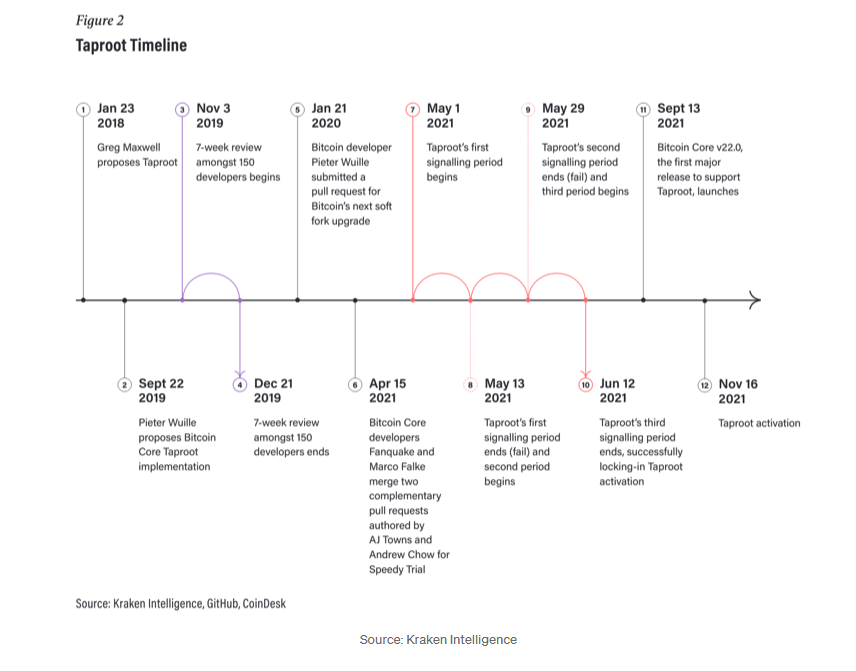

## Table of Contents

## What is the Taproot upgrade in Bitcoin?

The Taproot upgrade is a big change to the Bitcoin system that makes it better in a few ways. It was added to Bitcoin in November 2021. One of the main things Taproot does is make transactions more private and efficient. Before Taproot, some special transactions, like those used in smart contracts, looked different from regular transactions. This made it easier for people to see what was happening. With Taproot, these special transactions look the same as regular ones, so it's harder for others to tell them apart.

Another important part of Taproot is that it makes the Bitcoin network faster and cheaper to use. It does this by making the data in transactions smaller. Smaller data means less work for the computers that run Bitcoin, so transactions can happen more quickly and with lower fees. This is good for everyone who uses Bitcoin, especially if they want to use it for things like smart contracts or other complex transactions. Overall, Taproot makes Bitcoin more private, faster, and cheaper, which helps it work better for more people.

## When was the Taproot upgrade implemented?

The Taproot upgrade was implemented in Bitcoin on November 14, 2021. This was a big change that made Bitcoin better in many ways.

One of the main things Taproot did was make transactions more private and efficient. Before Taproot, some special transactions looked different from regular ones, which made it easier for people to see what was happening. With Taproot, these special transactions look the same as regular ones, so it's harder for others to tell them apart. This makes Bitcoin more private.

Taproot also made the Bitcoin network faster and cheaper to use. It did this by making the data in transactions smaller. Smaller data means less work for the computers that run Bitcoin, so transactions can happen more quickly and with lower fees. This is good for everyone who uses Bitcoin, especially if they want to use it for things like smart contracts or other complex transactions.

## What are the main benefits of the Taproot upgrade?

The Taproot upgrade makes Bitcoin transactions more private. Before Taproot, special transactions, like those used in smart contracts, looked different from regular ones. This made it easy for people to see what was happening. With Taproot, these special transactions now look the same as regular ones. This means it's harder for others to tell them apart, making Bitcoin more private for everyone.

Taproot also makes the Bitcoin network faster and cheaper to use. It does this by making the data in transactions smaller. When the data is smaller, the computers that run Bitcoin have less work to do. This means transactions can happen more quickly and with lower fees. This is good for everyone who uses Bitcoin, especially if they want to use it for complex things like smart contracts.

## How does Taproot improve privacy in Bitcoin transactions?

Taproot makes Bitcoin transactions more private by making all transactions look the same. Before Taproot, special transactions, like those used in smart contracts, looked different from regular ones. This made it easy for people to see what was happening. With Taproot, these special transactions now look the same as regular ones. This means it's harder for others to tell them apart, making Bitcoin more private for everyone.

This change helps protect the privacy of people who use Bitcoin for things like smart contracts. When all transactions look the same, it's harder for others to know if a transaction is for a simple payment or for something more complex. This means people can use Bitcoin for different things without worrying about others knowing their business.

## What is Schnorr signatures and how does it relate to Taproot?

Schnorr signatures are a way to sign things in a simpler and more private way. They make it easier to combine many signatures into one, which makes transactions smaller and faster. This is really helpful because it makes the Bitcoin network work better. Before Schnorr signatures, each signature in a transaction had to be checked separately, which took more time and made transactions bigger.

Schnorr signatures are a big part of the Taproot upgrade. They help make Taproot work better by making transactions more private and efficient. With Schnorr signatures, special transactions, like those used in smart contracts, can be hidden so they look just like regular transactions. This means it's harder for others to know what kind of transaction is happening, which makes Bitcoin more private for everyone.

## How does Taproot enhance the efficiency of complex transactions?

Taproot makes complex transactions, like those used in smart contracts, more efficient by making them smaller and faster. Before Taproot, these special transactions needed a lot of data because each part of the transaction had to be checked separately. This made the transactions bigger and slower. With Taproot, these complex transactions can be combined into one simple transaction, which means less data is needed. Less data means the computers that run Bitcoin have less work to do, so transactions can happen more quickly and with lower fees.

Another way Taproot helps is by using Schnorr signatures. These signatures make it easy to combine many signatures into one, which makes transactions even smaller and faster. Before Schnorr signatures, each signature had to be checked on its own, which took more time. Now, with Schnorr signatures, the whole process is simpler and quicker. This makes it easier for people to use Bitcoin for complex things like smart contracts without worrying about high fees or slow transaction times.

## What are the technical requirements for implementing Taproot?

To use Taproot, you need to update the Bitcoin software to a version that supports it. This means making sure your Bitcoin node, which is like a computer that helps run the Bitcoin network, has the latest software. You also need to make sure that the people you are sending and receiving Bitcoin with are using the same updated software. This is important because Taproot needs everyone to agree on the new rules for it to work properly.

Another thing you need for Taproot is to understand how to use the new features it brings. This includes learning about Schnorr signatures and how to set up and use smart contracts with Taproot. You might need to learn some new commands and ways to write transactions. It's also a good idea to use tools and software that support Taproot, like wallets and other programs that can help you use these new features easily.

## How does Taproot affect the scalability of the Bitcoin network?

Taproot helps make the Bitcoin network more scalable by making transactions smaller and faster. Before Taproot, complex transactions like smart contracts needed a lot of data. This made the transactions bigger and slower, which could slow down the whole network. With Taproot, these complex transactions can be combined into one simple transaction, which uses less data. When transactions use less data, the computers that run Bitcoin have less work to do. This means more transactions can happen quickly, making the network more scalable.

Another way Taproot helps with scalability is by using Schnorr signatures. These signatures let many signatures be combined into one, which makes transactions even smaller and faster. Before Schnorr signatures, each signature had to be checked separately, which took more time and made transactions bigger. Now, with Schnorr signatures, the whole process is simpler and quicker. This means the Bitcoin network can handle more transactions at once, which makes it more scalable for everyone who uses it.

## What changes does Taproot bring to the Bitcoin scripting language?

Taproot changes the Bitcoin scripting language by making it easier to use and more private. Before Taproot, the scripting language had to show all the steps of a complex transaction, like a smart contract, which made the transaction bigger and slower. With Taproot, these complex transactions can be hidden inside a regular transaction. This means the transaction looks simple on the outside but can still do complex things. This makes the scripting language more flexible and easier to use for different kinds of transactions.

Another big change Taproot brings to the scripting language is the use of Schnorr signatures. These signatures let many signatures be combined into one, which makes transactions smaller and faster. Before Schnorr signatures, each signature had to be checked separately, which took more time and made transactions bigger. Now, with Schnorr signatures, the scripting language can handle complex transactions more efficiently. This makes it easier for people to use Bitcoin for things like smart contracts without worrying about high fees or slow transaction times.

## How was the Taproot upgrade activated on the Bitcoin network?

The Taproot upgrade was activated on the Bitcoin network using a process called "Speedy Trial". This method was chosen to make the upgrade happen quickly and smoothly. With Speedy Trial, miners, who are the people that help process transactions on Bitcoin, had to show they supported Taproot by including a special signal in their work. If enough miners signaled their support within a certain time, the upgrade would go ahead. In the end, enough miners did signal their support, so Taproot was activated on November 14, 2021.

The idea behind Speedy Trial was to make sure that the upgrade happened only if most people in the Bitcoin community agreed with it. This way, the network could stay strong and everyone could trust the changes. By using Speedy Trial, the Bitcoin community made sure that Taproot was a change that everyone wanted and that it would make Bitcoin better for everyone who uses it.

## What are the potential future developments enabled by Taproot?

Taproot opens up new possibilities for Bitcoin. One big thing it could help with is making smart contracts easier to use. Smart contracts are like digital agreements that can do things automatically when certain conditions are met. With Taproot, these smart contracts can be hidden inside regular transactions, making them more private and easier to use. This could mean more people start using Bitcoin for things like loans or other financial agreements without worrying about others knowing their business.

Another future development could be better privacy tools. Taproot makes all transactions look the same, which makes it harder for others to see what's happening. This could lead to new ways to keep transactions private, like using special techniques to mix transactions together so they can't be traced back to the people who made them. This would make Bitcoin even more private and useful for people who want to keep their financial information safe.

## What are the criticisms or concerns about the Taproot upgrade?

Some people worry that Taproot might make it easier for criminals to hide what they're doing on the Bitcoin network. Since Taproot makes all transactions look the same, it could be harder for law enforcement to track illegal activities. This means that while Taproot makes Bitcoin more private for everyone, it might also make it easier for bad people to do bad things without getting caught.

Another concern is that not everyone understands Taproot well. Some people think it's too complicated and might cause problems if something goes wrong. They worry that if there's a mistake in how Taproot works, it could affect the whole Bitcoin network. This is why it's important for everyone to learn about Taproot and make sure it's used in the right way.

## What are the Technical Mechanisms of Signature Aggregation?

Taproot employs Schnorr signatures as a replacement for the Elliptic Curve Digital Signature Algorithm (ECDSA), which was previously used in Bitcoin. Schnorr signatures offer a more secure and efficient means of handling digital signatures due to their simplicity and robustness. The key advantage of Schnorr signatures lies in their linearity property, which allows the aggregation of multiple signatures and public keys into a single entity. This aggregation reduces the size of the data that needs to be transmitted and verified, thus enabling more efficient use of blockchain space and improving transaction throughput.

Mathematically, the linearity of Schnorr signatures means that for a given set of signatures $s_1, s_2, \ldots, s_n$ corresponding to messages $m_1, m_2, \ldots, m_n$ and public keys $P_1, P_2, \ldots, P_n$, a single aggregated signature $S$ can be produced. This is computed by summing up the individual signatures:

$$
S = s_1 + s_2 + \ldots + s_n
$$

Similarly, the corresponding aggregated public key $P$ can be formed as:

$$
P = P_1 + P_2 + \ldots + P_n
$$

With this property, Schnorr signatures enable a more simplified and compact form of verification, where the verification process for the aggregated signature is conducted only once, rather than individually for each signature. This not only decreases the computational load on the network but also enhances Bitcoin's ability to handle an increased [volume](/wiki/volume-trading-strategy) of transactions efficiently.

The efficiency gains from Schnorr signature aggregation are of particular significance for [algorithmic trading](/wiki/algorithmic-trading). Algorithmic trading strategies rely on rapid transaction processing and confirmation to capitalize on market fluctuations. The reduction in computational requirements and increased network throughput offered by Taproot's signature aggregation mean that transactions can be confirmed more quickly and cheaply, thereby enhancing the effectiveness and profitability of trading strategies. 

This enhancement provided by Taproot signifies a step forward in the scalability and efficiency of the Bitcoin network, facilitating faster transaction processing which is imperative for high-frequency trading operations in [cryptocurrency](/wiki/cryptocurrency) markets.

## References & Further Reading

[1]: Narayanan, A., Bonneau, J., Felten, E., Miller, A., & Goldfeder, S. (2016). ["Bitcoin and Cryptocurrency Technologies."](https://press.princeton.edu/books/hardcover/9780691171692/bitcoin-and-cryptocurrency-technologies) Princeton University Press.

[2]: Banas, E. (2021). ["Bitcoin's Taproot Upgrade: What Is It and How Will It Affect Trading?"](https://www.investopedia.com/bitcoin-taproot-upgrade-5210039) Investopedia.

[3]: Antonopoulos, A. M., & Wood, G. (2018). ["Mastering Bitcoin: Unlocking Digital Cryptocurrencies."](https://books.google.com/books/about/Mastering_Bitcoin.html?id=IXmrBQAAQBAJ) O'Reilly Media.

[4]: Beikverdi, A., & Song, J. (2015). ["Trend of centralization in Bitcoin’s distributed network."](https://yonsei.elsevierpure.com/en/publications/trend-of-centralization-in-bitcoins-distributed-network) PLOS ONE.

[5]: Maxwell, G., Wuille, P., Dryja, T., & Poelstra, A. (2018). ["Taproot: Privacy Preserving Switchable Scripting."](https://eprint.iacr.org/2017/1066.pdf) Bitcoin Core Blog.