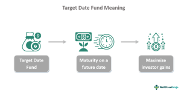

Investing is a multifaceted field offering various strategies tailored to suit diverse risk preferences and investment timelines. Central to effective investment planning is the understanding and management of risk tolerance, which significantly influences the selection of investment vehicles and strategies. Among the well-regarded approaches in investment management are target-date funds and algorithmic trading—each possessing unique characteristics and potential rewards.

Target-date funds and algorithmic trading have emerged as sophisticated tools in the investor's arsenal, reflecting different paradigms in financial strategy. Target-date funds are ideal for those who seek a structured, hands-off investment method, making adjustments in asset allocation as investors approach their target dates, often retirement. This fund type is designed to manage risk across an investor's lifecycle, shifting from high-growth investments in equities to more conservative options, like bonds, as the fund’s maturity date nears.



On the other end of the spectrum, algorithmic trading is a dynamic strategy leveraging computer algorithms to execute trades at precise moments, driven by pre-set conditions. This approach is appealing to investors with a high-risk appetite, providing the ability to harness complex data and market signals for swift decision-making, thereby enhancing the potential for capitalizing on market volatility and inefficiencies.

This article will explore these investment strategies as benchmarks in understanding risk tolerance in investing. By analyzing target-date funds and algorithmic trading, investors can better understand how to strategically align their financial pursuits with long-term goals, ensuring an optimal blend of growth, security, and personal involvement in their investment choices.

## Table of Contents

## Understanding Risk Tolerance

Risk tolerance refers to the level of variability in investment returns that an individual is prepared to endure within their investment portfolio. This concept is fundamental in shaping an individual's approach to investing, as it directly influences the types of assets selected and the overall strategy employed.

Assessing risk tolerance involves a comprehensive evaluation of an investor's ability and willingness to face financial risk, significantly impacting their investment choices. It's important to differentiate between an investor's "capacity" to take risks, which includes their financial ability, and their "willingness," which often relates to emotional factors. 

Several key elements influence risk tolerance:

1. **Investment Goals**: An investor's objectives play a crucial role in determining risk tolerance. Those aiming for long-term growth may be more willing to accept greater risk, while those focused on capital preservation might prefer lower-risk investments.

2. **Time Horizon**: The length of time an investor plans to hold an investment before taking the money out affects their risk tolerance. Generally, the longer the time horizon, the more risk an investor can assume, as there is time to recover from potential losses.

3. **Financial Situation**: An investor’s current financial status, including income, savings, and liabilities, impacts their capacity to absorb losses. A robust financial position may allow for higher risk-taking.

4. **Emotional Capacity**: An investor’s psychological comfort with market volatility and the ability to withstand potential financial losses also factor into their risk tolerance. This aspect often requires introspective consideration and experience with fluctuating market conditions.

Understanding these components can assist investors in aligning their portfolios with their personal risk tolerance, ensuring that financial strategies are consistent with their long-term goals and comfort levels. By effectively assessing and acknowledging risk tolerance, investors can make informed decisions that optimize both potential returns and peace of mind.

## Target-Date Funds: A Risk-Managed Investment

Target-date funds represent a strategic investment option that automatically adjusts its asset allocation as the specified target date approaches, usually corresponding with the investor's anticipated retirement date. These funds are engineered to address varying risk tolerances over an investor's lifespan, transitioning from an aggressive growth-focused strategy to a more conservative income-oriented approach. 

Initially, target-date funds allocate a substantial portion of their assets to equities. Equities are favored during this phase for their potential for high returns, appealing to investors in the early stages of their careers when they have time to recover from market [volatility](/wiki/volatility-trading-strategies). This period of the investment lifecycle prioritizes capital appreciation, leveraging the historical long-term growth potential of stocks. 

As the fund approaches its target date, the asset allocation gradually shifts towards bonds and other stable, income-generating securities. Bonds are inherently less volatile than stocks and provide consistent returns, which cater to investors seeking to preserve capital as they near retirement. This gradual transition is guided by a predefined "glide path," a formula dictating the pace and [volume](/wiki/volume-trading-strategy) of asset reallocation. 

The glide path is central to target-date funds, balancing the trade-off between risk and return. While actual glide paths may vary across fund providers, a common mathematical representation might look like:

$$
\text{Equity Allocation} = \max\left(0, 100 - \frac{t}{n} \times 100 \right)
$$

Here, $t$ denotes the number of years remaining until the target date, and $n$ represents the investor's typical working career length. This formula illustrates the systematic reduction in equity allocation as the target date nearing.

Target-date funds provide a hands-off investment approach, sparing investors the complexity of active portfolio management. This automated rebalancing acts in accordance with the investor’s diminishing risk tolerance, thus aligning with the goal of capital preservation as they transition into retirement. Additionally, the simplicity of these funds makes them accessible to investors with varying levels of financial expertise, contributing to their growing popularity. 

In essence, target-date funds offer a risk-managed investment strategy, effectively tying asset allocation to the investor’s life stage and objectives. This aspect not only aligns the investment with an individual’s evolving risk tolerance but also provides a coherent strategy for pursuing long-term financial goals.

## Algorithmic Trading: Embracing Risks with Precision

Algorithmic trading, often referred to as algo trading, utilizes computer algorithms to perform trades based on pre-defined criteria, such as price, timing, and volume. This approach is characterized by its reliance on mathematical models and complex computations to identify and execute opportunities in financial markets. By leveraging technology, [algorithmic trading](/wiki/algorithmic-trading) provides an efficient mechanism for participating in markets with precision and speed.

One of the core benefits of algorithmic trading is the ability to execute trades at optimal times. Algorithms can analyze market data and execute orders within milliseconds, a feat impossible for human traders. This rapid execution is particularly appealing to investors with a higher risk tolerance, as it allows them to swiftly capitalize on market opportunities and short-term price discrepancies. Furthermore, algorithms are designed to follow consistent trading strategies, potentially reducing the emotional bias and errors inherent in manual trading.

Algorithmic trading uses vast arrays of data, integrating historical price patterns, technical indicators, and real-time market feeds to inform its decisions. For example, a simple moving average crossover strategy involves monitoring moving averages of different periods and generating buy or sell signals when these averages intersect. This strategy can be implemented in Python using libraries such as pandas and NumPy for data manipulation, and matplotlib for visualization. Here's a basic example:

```python
import pandas as pd
import numpy as np
import matplotlib.pyplot as plt

# Example stock data
data = pd.DataFrame({
    'Close': [110, 115, 112, 119, 120, 116, 118, 112, 117, 121]
})

# Calculate moving averages
data['SMA_3'] = data['Close'].rolling(window=3).mean()
data['SMA_5'] = data['Close'].rolling(window=5).mean()

# Generate buy/sell signals
data['Signal'] = np.where(data['SMA_3'] > data['SMA_5'], 1, 0)
data['Position'] = data['Signal'].diff()

# Plot results
plt.figure(figsize=(10, 5))
plt.plot(data['Close'], label='Close Price')
plt.plot(data['SMA_3'], label='3-Day SMA')
plt.plot(data['SMA_5'], label='5-Day SMA')
plt.legend(loc='upper left')
plt.show()
```

Through the use of algorithms, traders can adopt sophisticated strategies that are capable of managing complex market scenarios and processing enormous amounts of data efficiently. These algorithms aim to reduce human error, increase market efficiency, and improve the precision of investment decisions.

Moreover, the use of algorithmic trading has led to an increased role of [artificial intelligence](/wiki/ai-artificial-intelligence) and [machine learning](/wiki/machine-learning) in financial markets. These technologies enhance the ability to predict market movements, adapt to changing conditions, and optimize trading strategies over time.

Overall, algorithmic trading presents substantial opportunities for those inclined to engage with higher market volatility, equipped with the tools and knowledge to leverage data-driven insights. It exemplifies how technological advancements can address the demands of modern high-frequency trading environments.

## Comparing Target-Date Funds and Algorithmic Trading

Target-date funds and algorithmic trading represent two distinct investment strategies, each uniquely contributing to a diversified portfolio by addressing different aspects of risk tolerance and investment horizons.

Target-date funds are structured around a predefined glide path, which gradually shifts the asset allocation from equities to more conservative, fixed-income securities as the fund approaches its target date, often linked to an investor's retirement year. This systematic de-risking is designed for investors with a long-term investment horizon and diminishing risk tolerance over time. It offers a hands-off approach, appealing to those who prefer a steady transition to safer assets as they age, reducing the exposure to market volatility.

Conversely, algorithmic trading is characterized by the use of complex mathematical models and computing power to execute trades rapidly based on pre-set criteria. This strategy capitalizes on short-term market inefficiencies and price discrepancies, making it an attractive option for investors with higher risk tolerance and shorter investment horizons. Algorithmic trading provides the opportunity to incorporate real-time data and multiple market signals, maximizing the potential for profit in volatile markets. This precision and speed aim to reduce human error and enhance decision-making efficiency.

While target-date funds focus on long-term growth with a safety cushion approaching retirement, algorithmic trading thrives on leveraging short-term volatility for potential gains. These approaches, despite their differences, can coexist in a well-rounded portfolio. A target-date fund offers stability, while algorithmic trading presents growth opportunities, allowing investors to tailor their strategies according to their unique risk profiles and financial objectives. By integrating both methods, investors can achieve a balance between capital preservation and growth potential, effectively addressing various dimensions of risk and investment goals.

## Practical Examples and Case Studies

Jane, a hypothetical investor in her early 30s, is a diligent professional aiming to build a robust retirement fund over the [course](/wiki/best-algorithmic-trading-courses) of her career. With a moderate risk tolerance, she opts for a target-date fund aligned with her anticipated retirement date of 2050. At the beginning of her investment journey, the fund is predominantly allocated to equities, offering higher growth potential to capitalize on the long time horizon she has before retirement. As Jane progresses in her career and approaches retirement, the fund gradually transitions to a more conservative allocation, introducing a higher proportion of bonds and income-generating assets. This shift reflects her decreasing risk tolerance as she prioritizes capital preservation and stable income for her impending retirement. By leveraging the automatic rebalancing feature of target-date funds, Jane maintains a disciplined investment strategy that aligns with her evolving risk profile without the need for active management.

In contrast, John is an investor in his late 40s with a high-risk tolerance and a keen interest in leveraging technological advancements to manage his taxable investment account. He employs algorithmic trading strategies to actively engage with markets and capture short-term price discrepancies. By utilizing sophisticated algorithms, John can analyze vast amounts of financial data and execute trades in milliseconds, optimizing his chances of realizing substantial gains from market volatility. Algorithmic trading allows him to respond dynamically to market conditions, applying strategies that include mean reversion, [arbitrage](/wiki/arbitrage), or [momentum](/wiki/momentum) trading to exploit transient inefficiencies. Despite the high-risk nature of this approach, John's substantial experience in trading and robust risk management protocols enable him to seek higher returns while navigating complex market dynamics.

Both examples underscore the importance of understanding one's risk tolerance and selecting investment vehicles that align with individual financial goals. Jane’s target-date fund exemplifies a set-it-and-forget-it strategy, providing a smooth transition to safer investments as retirement nears. Conversely, John's proactive and data-driven approach showcases the potential of algorithmic trading for those comfortable with heightened risk levels. By tailoring their strategies to their respective risk profiles, both investors exemplify how diverse investment tools can effectively meet varying financial objectives.

## Choosing the Right Strategy for Your Risk Profile

Choosing the right investment strategy requires a comprehensive understanding of one’s risk profile and financial objectives. Investors face a distinct choice between target-date funds, which offer a passive and gradual risk-adjustment strategy, and algorithmic trading, which requires a more active approach and willingness to engage with market volatility.

### Assessing Risk Tolerance and Goals

The first step in selecting an optimal investment strategy is to evaluate your risk tolerance and articulate your financial goals. Risk tolerance refers to the degree of variability in investment returns you can comfortably withstand. It includes your capacity and willingness to endure market fluctuations. Financial goals might range from saving for retirement, purchasing a home, or generating short-term income.

Tools like risk-tolerance questionnaires can help quantify your comfort level with risk. These assessments consider factors such as investment horizon, income stability, and personal financial circumstances. For instance, a longer time horizon often supports a higher tolerance for risk, leading investors toward riskier, growth-oriented investments like algorithmic trading. Conversely, shorter-term goals or a lower risk tolerance may make target-date funds more suitable.

### Evaluating Time Commitment

The time commitment you are prepared to dedicate to managing your investments can heavily influence your decision. 

- **Target-Date Funds:** These are designed for minimal investor involvement. The fund managers automatically rebalance the asset mix over time, transitioning from higher-risk equities to lower-risk bonds. This makes them ideal for those who prefer a hands-off approach to investing, dedicating minimal time in portfolio management.

- **Algorithmic Trading:** This sophisticated method necessitates a more hands-on approach, with a focus on monitoring and adjusting algorithms as market conditions change. Investors in algorithmic trading need to stay informed about market data and be adept at making swift, strategic decisions. This strategy suits investors willing to dedicate substantial time and resources to manage their investments actively.

### Professional Guidance

Considering the complexity and potential risks associated with algorithmic trading and the long-term implications of target-date funds, it is advisable for investors to seek professional guidance. Financial advisors or investment professionals can offer tailored advice that aligns with your personal financial landscape and risk appetite. They provide insights into market trends, help diversify portfolios, and offer strategies to mitigate risks.

Professional guidance can also be crucial in preventing common investment mistakes, such as emotional trading or lack of diversification. By leveraging their expertise, investors can refine their strategies to ensure alignment with both short-term and long-term objectives.

In conclusion, choosing the right investment strategy is contingent upon a careful assessment of one’s risk tolerance, financial goals, and the desired level of involvement in managing investments. Whether opting for the structured approach of target-date funds or the dynamic realm of algorithmic trading, informed decisions are key to optimizing investment outcomes.

## Conclusion

Risk tolerance is a pivotal [factor](/wiki/factor-investing) in determining the composition of an investor's portfolio and shaping their investment strategy. Target-date funds and algorithmic trading offer two distinct methodologies that cater to different risk preferences and objectives. 

Target-date funds provide a structured approach to risk management, adjusting the asset allocation from growth-oriented investments to more conservative ones as the target date, often retirement, draws closer. This age-appropriate strategy aims to align with an investor's decreasing risk tolerance, making it suitable for those who prefer a hands-off investment style while safeguarding their capital over time.

On the other hand, algorithmic trading presents opportunities for investors who are comfortable with higher market volatility and have the appetite for embracing risks. By leveraging complex algorithms to execute trades swiftly based on pre-defined criteria, this method capitalizes on short-term market opportunities. It serves those seeking potentially higher returns through calculated risks, relying on data-driven insights and precision.

Understanding the characteristics and interplay of these investment tools empowers investors to make informed decisions. By doing so, they can optimize their portfolios to balance growth potential with security, ensuring their financial strategies align with both their risk tolerance and long-term goals. Whether seeking a structured risk-managed approach with target-date funds or pursuing precision in market exploitation with algorithmic trading, investors can strategically position themselves to achieve a comprehensive blend of growth and stability.

## References & Further Reading

[1]: ["Principles of Institutional Investment Management"](https://www.investopedia.com/articles/financial-theory/11/introduction-institutional-investing.asp) by Frank J. Fabozzi

[2]: ["Advances in Financial Machine Learning"](https://www.amazon.com/Advances-Financial-Machine-Learning-Marcos/dp/1119482089) by Marcos Lopez de Prado

[3]: ["Evidence-Based Technical Analysis: Applying the Scientific Method and Statistical Inference to Trading Signals"](https://www.amazon.com/Evidence-Based-Technical-Analysis-Scientific-Statistical/dp/0470008741) by David Aronson

[4]: ["Machine Learning for Algorithmic Trading"](https://github.com/PacktPublishing/Machine-Learning-for-Algorithmic-Trading-Second-Edition) by Stefan Jansen

[5]: Patton, A. J., & Timmermann, A. G. (2010). ["Monetary Policy and Target-Date Funds: Shifting Glides or Shifting Goals?"](https://www.semanticscholar.org/paper/Monotonicity-in-asset-returns%3A-New-tests-with-to-Patton-Timmermann/49902d7f5efefb1fdb7659fcdb48c3c9292df992) National Bureau of Economic Research.

[6]: ["Quantitative Trading: How to Build Your Own Algorithmic Trading Business"](https://books.google.com/books/about/Quantitative_Trading.html?id=j70yEAAAQBAJ) by Ernest P. Chan

[7]: Goodwin, T. H. (2006). ["The Information Ratio and Performance of Commercially Available Target Date Funds."](https://tsgperformance.com/wp-content/uploads/2020/11/Goodwin-information-ratio.pdf) Financial Analysts Journal, 62(1), 36-43.