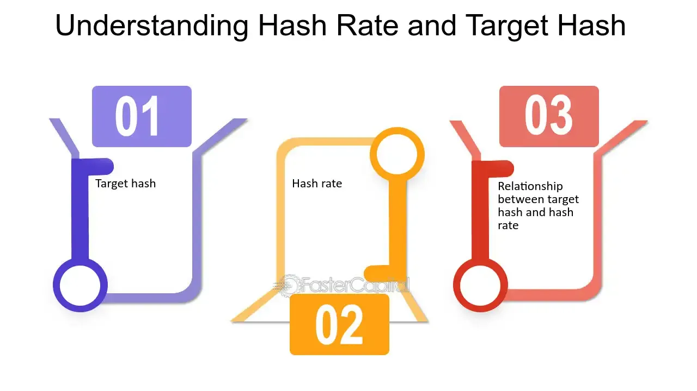

## Table of Contents

## What is a target hash in the context of cryptocurrency?

In the world of cryptocurrency, a target hash is a number that miners try to reach or go below when they are solving complex math problems. These problems are part of a process called mining, which helps to add new transactions to the blockchain, a public record of all transactions. The target hash is important because it determines how hard the mining problem is. If the target hash is lower, the problem is harder, and if it's higher, the problem is easier.

The target hash changes over time to keep the time it takes to mine a new block of transactions steady, usually around 10 minutes for Bitcoin. This change happens through a process called difficulty adjustment. By adjusting the target hash, the system can control how fast new bitcoins are created and how quickly transactions are verified. This helps keep the cryptocurrency network stable and secure.

## How is the target hash used in the mining process?

In cryptocurrency mining, miners use powerful computers to solve math problems. The goal is to find a number, called a nonce, that, when combined with the data of the transactions they want to add to the blockchain, creates a hash that is smaller than or equal to the target hash. This process is like trying to guess a number that fits within a certain range. The target hash acts like the upper limit of this range.

When a miner finds a nonce that makes the hash meet the target, they can add a new block of transactions to the blockchain. This is important because it confirms the transactions and adds them to the public record. The target hash is adjusted regularly to keep the mining process fair and to control how fast new blocks are added. If the target hash is made smaller, the mining problem gets harder, and if it's made bigger, the problem gets easier. This helps keep the time it takes to mine a new block steady, usually around 10 minutes for Bitcoin.

## What is the relationship between the target hash and the difficulty level in cryptocurrency mining?

The target hash and the difficulty level in cryptocurrency mining are closely related. The target hash is a number that miners need to meet or go below when they are solving math problems. If the target hash is a smaller number, it's harder for miners to find a solution that fits, which means the difficulty level goes up. If the target hash is a bigger number, it's easier to find a solution, so the difficulty level goes down.

The difficulty level is adjusted regularly to keep the time it takes to mine a new block of transactions steady. For Bitcoin, this is usually around 10 minutes. If blocks are being mined too quickly, the target hash is made smaller to increase the difficulty. If blocks are taking too long to mine, the target hash is made bigger to decrease the difficulty. This helps keep the mining process fair and makes sure new bitcoins are created at a steady rate.

## How is the target hash calculated in Bitcoin?

In Bitcoin, the target hash is calculated based on the difficulty level, which is adjusted every 2016 blocks, or about every two weeks. The goal is to keep the time it takes to mine a new block around 10 minutes. If blocks are being mined too quickly, the difficulty goes up, making the target hash smaller. If blocks are taking too long to mine, the difficulty goes down, making the target hash bigger. The target hash is a number that miners need to meet or go below when they solve math problems to add new transactions to the blockchain.

The actual calculation of the target hash involves a formula that uses the current difficulty level. The formula is: `target hash = maximum target / difficulty`. The maximum target is a fixed number in Bitcoin, and the difficulty is a number that changes based on how fast blocks are being mined. By adjusting the difficulty, the target hash is changed to keep the mining process steady and fair. This helps control how fast new bitcoins are created and makes sure the blockchain stays secure.

## Can you explain the concept of hash functions and their role in determining the target hash?

Hash functions are like special math tools that take any kind of information and turn it into a unique string of numbers and letters. This string is called a hash. No matter how big or small the information is, the hash will always be the same length. In Bitcoin, miners use a hash function called SHA-256. They take the data from the transactions they want to add to the blockchain, add a special number called a nonce, and then use the hash function to create a hash. The goal is to find a nonce that makes the hash smaller than or equal to the target hash.

The target hash is a number that miners need to meet or go below when they solve their math problems. It acts like a goalpost for the hash that the miners are trying to create. If the target hash is a smaller number, it's harder to find a hash that fits, so the mining problem gets harder. If the target hash is a bigger number, it's easier to find a hash that fits, so the mining problem gets easier. The target hash changes based on the difficulty level, which is adjusted to keep the time it takes to mine a new block around 10 minutes. This helps control how fast new bitcoins are created and keeps the blockchain secure.

## What happens if a miner finds a hash that meets the target hash requirement?

When a miner finds a hash that meets the target hash requirement, it means they've solved the math problem. They can then add a new block of transactions to the blockchain. This new block is like a page in a big book that keeps track of all the transactions. When the new block is added, the transactions in it are confirmed and become part of the public record. This is important because it helps keep the cryptocurrency system working smoothly and safely.

The miner who found the hash gets a reward for their work. In Bitcoin, this reward is new bitcoins and the fees from the transactions in the block. This reward is how new bitcoins are created and given out. The whole process of finding the right hash and adding a new block is called mining. It's like a competition where miners race to solve the math problem first. By doing this, they help keep the cryptocurrency network secure and running well.

## How does the target hash influence the security of a blockchain?

The target hash plays a big role in keeping a blockchain secure. It makes the math problems that miners need to solve hard enough so that it takes a lot of work to find the right answer. This is called proof of work. Because it's hard to solve these problems, it's very tough for someone to cheat and add fake transactions to the blockchain. They would need a lot of computer power and time to do it, which makes it not worth trying.

The target hash also helps keep the blockchain steady and fair. By changing the target hash, the difficulty of the math problems can be adjusted. This keeps the time it takes to add new blocks about the same, usually around 10 minutes for Bitcoin. When the blockchain stays steady, it's harder for anyone to mess with it. This makes the whole system more secure and trustworthy for everyone using it.

## What are the consequences of changing the target hash in a cryptocurrency network?

Changing the target hash in a cryptocurrency network can have big effects on how the system works. If the target hash is made smaller, it means the math problems miners need to solve get harder. This can slow down how fast new blocks are added to the blockchain. It might take longer for transactions to be confirmed, which could make people wait longer to use their cryptocurrency. But it also makes the network more secure because it's harder for someone to try to cheat and add fake transactions.

On the other hand, if the target hash is made bigger, the math problems get easier. This can speed up the process of adding new blocks, so transactions get confirmed faster. People might like this because they can use their cryptocurrency more quickly. But if the problems are too easy, it might make the network less secure. Someone could try to cheat more easily, which could mess up the whole system. So, changing the target hash is a careful balance to keep the network running smoothly and safely.

## How does the adjustment of the target hash maintain the block time in cryptocurrencies like Bitcoin?

In cryptocurrencies like Bitcoin, the target hash is adjusted to keep the time it takes to mine a new block around 10 minutes. This is important because it helps the system run smoothly. If blocks are being mined too fast, the target hash is made smaller, which makes the math problems miners need to solve harder. This slows down the mining process and helps keep the block time steady. On the other hand, if blocks are taking too long to mine, the target hash is made bigger, making the problems easier. This speeds up mining and helps bring the block time back to around 10 minutes.

By adjusting the target hash, Bitcoin can control how quickly new blocks are added to the blockchain. This helps keep the system fair and secure. If the target hash is too easy, someone might try to cheat and add fake blocks. But if it's too hard, it might take too long for transactions to be confirmed. So, the target hash is changed regularly, usually every 2016 blocks or about every two weeks, to keep everything balanced. This way, people can trust that their transactions will be processed in a reasonable amount of time, and the network stays secure.

## What are the differences in target hash mechanisms between Bitcoin and other cryptocurrencies?

Different cryptocurrencies might use different ways to set and adjust their target hash, but the main idea is the same: to control how fast new blocks are added to the blockchain. Bitcoin adjusts its target hash every 2016 blocks, or about every two weeks, to keep the time it takes to mine a new block around 10 minutes. If blocks are being mined too quickly, Bitcoin makes the target hash smaller, which makes the math problems harder. If blocks are taking too long, it makes the target hash bigger, making the problems easier. This helps keep the system running smoothly and securely.

Other cryptocurrencies might have different block times and adjust their target hash more or less often. For example, Litecoin aims for a block time of about 2.5 minutes and adjusts its target hash every 2016 blocks, just like Bitcoin. Ethereum, before it switched to a different system called proof of stake, had a target block time of around 15 seconds and adjusted its target hash every block. Each cryptocurrency tries to find the right balance between speed and security by changing its target hash to fit its own goals and needs.

## How can the target hash be manipulated maliciously, and what are the preventive measures?

Someone could try to mess with the target hash to cheat the system. They might want to make the math problems easier so they can mine more blocks and get more rewards. But doing this is hard because the target hash is set by a lot of miners working together, and it changes based on how fast blocks are being mined. If someone tries to change the target hash to make it easier, other miners will notice and not accept the fake blocks. This makes it tough for anyone to cheat.

To stop people from messing with the target hash, cryptocurrencies like Bitcoin have rules that everyone follows. The target hash is adjusted regularly, usually every 2016 blocks for Bitcoin, to keep things fair. If someone tries to change the target hash on their own, the other miners will see it and ignore their blocks. This keeps the system safe and makes sure that only honest miners can add new blocks to the blockchain. By working together and following the rules, miners help keep the target hash from being manipulated.

## What advanced cryptographic techniques are used to ensure the randomness and security of the target hash?

In cryptocurrencies like Bitcoin, a special math tool called a hash function is used to keep the target hash random and secure. The hash function takes any information and turns it into a unique string of numbers and letters, called a hash. This hash is always the same length, no matter how big or small the original information is. In Bitcoin, the hash function used is SHA-256. Miners take the data from the transactions they want to add to the blockchain, add a special number called a nonce, and then use the hash function to create a hash. The goal is to find a nonce that makes the hash smaller than or equal to the target hash. Because even a tiny change in the input data creates a completely different hash, it's very hard to predict or control the output, which keeps the process random and secure.

To make sure the target hash stays secure, the difficulty level is adjusted regularly. In Bitcoin, this happens every 2016 blocks, or about every two weeks. The adjustment is based on how fast blocks are being mined. If blocks are being added too quickly, the target hash gets smaller, making the math problems harder. If it's taking too long, the target hash gets bigger, making the problems easier. This keeps the time it takes to mine a new block steady, usually around 10 minutes for Bitcoin. By constantly changing the target hash, the system stays fair and hard to cheat. This way, the blockchain remains secure and trustworthy for everyone using it.

## What is a Target Hash?

A target hash is an integral part of the cryptocurrency mining process, particularly within proof-of-work (PoW) systems like Bitcoin. It serves as a threshold that miners aim to meet or surpass in their efforts to append new blocks to the blockchain. In essence, the target hash is a numeric value that a mined block's hash must be less than or equal to for the block to be considered valid.

The process of arriving at a valid block hash involves substantial computational effort. Miners repeatedly modify a small data value, known as a nonce, in the block header and apply the SHA-256 hashing algorithm to generate the block's hash. The goal is to find a nonce that results in a hash value that meets the requirement set by the target hash. Since hash functions produce pseudo-random outputs, miners must often perform numerous calculations to achieve this.

Mathematically, the condition for a valid block can be expressed as:

$$
\text{Hash(Block Header)} \leq \text{Target Hash}
$$

This difficulty of meeting the target hash is dynamically adjusted. For Bitcoin, the network recalibrates the target approximately every two weeks or every 2,016 blocks, striving to sustain a roughly 10-minute interval between block generations. This automatic adjustment of the difficulty not only stabilizes the block generation rate but also ensures the security and robustness of the network. As more computational power is added to the network, the difficulty of finding a valid hash increases, maintaining the balance necessary for efficient transaction processing.

The clever design of the target hash mechanism also plays a vital role in securing the blockchain. By making it computationally expensive to alter the blockchain, it prevents tampering and double-spending, thereby maintaining the integrity of the system. This characteristic is foundational to the decentralized trust model of cryptocurrencies, where consensus and transparency are achieved without relying on a central authority.

## References & Further Reading

[1]: Narayanan, A., Bonneau, J., Felten, E., Miller, A., & Goldfeder, S. (2016). ["Bitcoin and Cryptocurrency Technologies: A Comprehensive Introduction."](https://press.princeton.edu/books/hardcover/9780691171692/bitcoin-and-cryptocurrency-technologies) Princeton University Press.

[2]: Nakamoto, S. (2008). ["Bitcoin: A Peer-to-Peer Electronic Cash System."](https://nakamotoinstitute.org/library/bitcoin/)

[3]: Antonopoulos, A. M. (2014). ["Mastering Bitcoin: Unlocking Digital Cryptocurrencies."](https://books.google.com/books/about/Mastering_Bitcoin.html?id=IXmrBQAAQBAJ) O'Reilly Media.

[4]: Bonneau, J., et al. (2015). ["SoK: Research Perspectives and Challenges for Bitcoin and Cryptocurrencies."](https://ieeexplore.ieee.org/document/7163021) IEEE Symposium on Security and Privacy.

[5]: Peters, G. W., & Panayi, E. (2016). ["Understanding Modern Banking Ledgers through Blockchain Technologies: Future of Transaction Processing and Smart Contracts on the Internet of Money."](https://link.springer.com/chapter/10.1007/978-3-319-42448-4_13) In Banking Beyond Banks and Money. Springer.