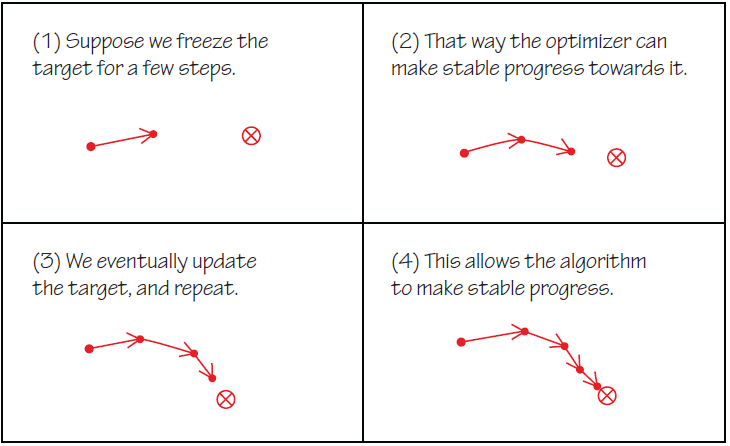

## Table of Contents

## What is a Target Network in machine learning?

A Target Network is a concept used in reinforcement learning, specifically in algorithms like Deep Q-Networks (DQN). It helps to stabilize the learning process by keeping a separate, slower-updating version of the main network. The main network is used to estimate the value of taking actions in different states, while the Target Network is used to calculate the target values for these estimates. By updating the Target Network less frequently, it reduces the risk of the network chasing its own tail, which can lead to unstable learning.

In practice, the Target Network is a copy of the main network but its weights are only updated periodically. For example, every few thousand steps, the weights of the Target Network are set to be the same as the main network's weights. This delay in updating helps to keep the target values more consistent over time, allowing the main network to learn more smoothly. Without a Target Network, the main network might update its estimates based on rapidly changing targets, causing the learning process to become unstable and less effective.

## Why are Target Networks used in reinforcement learning?

In reinforcement learning, a Target Network is used to make the learning process more stable. Imagine you're trying to learn something new, and the goal keeps changing quickly. It would be hard to learn, right? That's what happens in reinforcement learning without a Target Network. The main network tries to learn from its own guesses, which can change a lot. This can make the learning unstable because the network is always chasing its own moving targets.

The Target Network helps by giving the main network a more stable target to aim for. It's like a copy of the main network, but it updates more slowly. Every now and then, the Target Network's weights are set to match the main network's weights. This means the targets don't change as fast, so the main network can learn more smoothly. By using a Target Network, the learning process becomes more reliable and the network can improve its performance over time without getting confused by rapid changes.

## How does a Target Network differ from a regular neural network?

A Target Network is a special kind of [neural network](/wiki/neural-network) used in [reinforcement learning](/wiki/reinforcement-learning), especially in algorithms like Deep Q-Networks (DQN). Unlike a regular neural network, which updates its weights every time it learns something new, a Target Network updates its weights much less often. This slow updating helps keep the learning process stable. Imagine you're trying to hit a moving target with a dart. If the target moves too quickly, it's hard to hit. The Target Network is like a target that moves slowly, making it easier for the main network to learn.

In a regular neural network, the weights are updated after every batch of data to minimize the loss function. For example, if the network is trying to predict the value of taking certain actions, it adjusts its weights to make better predictions next time. In contrast, a Target Network's weights are only updated periodically, maybe every few thousand steps. This means the Target Network provides a more consistent target for the main network to learn from. By doing this, the main network can learn more smoothly and avoid the problem of chasing rapidly changing targets, which can lead to unstable learning.

## What problem does the Target Network solve in Q-learning?

In Q-learning, a Target Network helps solve the problem of unstable learning. Imagine you're trying to learn something new, but the thing you're learning keeps changing quickly. It would be hard to keep up, right? That's what happens in Q-learning without a Target Network. The main network, which is trying to learn the best actions to take in different situations, keeps updating its guesses. These guesses change a lot, making it hard for the network to learn properly.

The Target Network fixes this by giving the main network a more stable target to aim for. It's like a copy of the main network, but it only updates its information every now and then. For example, if the main network updates its guesses every step, the Target Network might only update every 1000 steps. This slow updating means the targets don't change as fast, so the main network can learn more smoothly. By using a Target Network, the learning process becomes more reliable, and the network can improve its performance over time without getting confused by rapid changes.

## How is a Target Network implemented in Deep Q-Networks (DQN)?

In Deep Q-Networks (DQN), a Target Network is a copy of the main Q-network that helps make the learning process more stable. The main Q-network is always learning and updating its weights to guess the best actions to take in different situations. But if it uses its own guesses to learn, it might get confused because its targets keep changing quickly. The Target Network solves this by being a slower-updating version of the main Q-network. Every few thousand steps, the Target Network's weights are set to match the main Q-network's weights. This means the Target Network's guesses don't change as fast, giving the main Q-network a more stable target to learn from.

To implement a Target Network in DQN, you start by creating two identical neural networks: the main Q-network and the Target Network. The main Q-network updates its weights after every step using the standard backpropagation and gradient descent methods. The Target Network, however, only updates its weights periodically. For example, every 1000 steps, you might copy the main Q-network's weights to the Target Network using a simple assignment like ```target_network.load_state_dict(main_network.state_dict())``` in PyTorch. This slow updating helps the main Q-network learn more smoothly because it's aiming at a more consistent target. By doing this, the DQN can improve its performance over time without getting confused by rapid changes in the learning targets.

## What are the steps to update a Target Network?

In Deep Q-Networks (DQN), updating the Target Network is important for stable learning. The main Q-network learns and updates its weights all the time, trying to guess the best actions in different situations. But if it uses its own guesses to learn, it can get confused because those guesses keep changing quickly. The Target Network helps by being a slower-updating version of the main Q-network. It doesn't change as fast, so it gives the main Q-network a more stable target to learn from.

To update the Target Network, you copy the weights from the main Q-network to the Target Network every few thousand steps. For example, if you decide to update every 1000 steps, you would do this: ```target_network.load_state_dict(main_network.state_dict())```. This simple step helps the main Q-network learn more smoothly because it's aiming at a more consistent target. By doing this, the DQN can improve its performance over time without getting confused by rapid changes in the learning targets.

## How often should a Target Network be updated?

The Target Network in Deep Q-Networks (DQN) should be updated periodically, but not too often. A common practice is to update it every few thousand steps, like every 1000 or 10,000 steps. This slow updating helps keep the learning process stable. If you update it too often, the main Q-network might still get confused because the targets would change quickly. But if you update it too rarely, the Target Network might become outdated and not help the main Q-network learn the best actions.

To update the Target Network, you simply copy the weights from the main Q-network to the Target Network. For example, in PyTorch, you would use the code ```target_network.load_state_dict(main_network.state_dict())``` every 1000 steps. This helps the main Q-network learn more smoothly because it's aiming at a more consistent target. By doing this, the DQN can improve its performance over time without getting confused by rapid changes in the learning targets.

## What are the benefits of using a Target Network in training?

Using a Target Network in training helps make the learning process more stable. Imagine you're trying to learn something new, but the thing you're learning keeps changing quickly. It would be hard to keep up, right? That's what happens in reinforcement learning without a Target Network. The main network, which is trying to learn the best actions to take in different situations, keeps updating its guesses. These guesses change a lot, making it hard for the network to learn properly. The Target Network fixes this by giving the main network a more stable target to aim for. It's like a copy of the main network, but it only updates its information every now and then. This slow updating means the targets don't change as fast, so the main network can learn more smoothly.

By using a Target Network, the learning process becomes more reliable, and the network can improve its performance over time without getting confused by rapid changes. In practice, the Target Network is updated periodically, like every 1000 steps, by copying the weights from the main network. For example, in PyTorch, you would use the code ```target_network.load_state_dict(main_network.state_dict())``` to update the Target Network. This helps the main network learn more smoothly because it's aiming at a more consistent target. By doing this, the network can improve its performance over time without getting confused by rapid changes in the learning targets.

## Can you explain the concept of 'soft updates' in Target Networks?

In reinforcement learning, 'soft updates' are a way to update the Target Network more smoothly. Instead of copying the main network's weights to the Target Network all at once, soft updates mix the weights a little bit at a time. Imagine you're slowly turning a dimmer switch to change the light in a room. That's kind of like what soft updates do. They help the Target Network change gradually, which can make the learning process even more stable.

To do a soft update, you use a special formula to blend the weights of the main network and the Target Network. The formula looks like this: $$\theta_{\text{target}} = \tau \theta_{\text{main}} + (1 - \tau) \theta_{\text{target}}$$. Here, $$\theta_{\text{target}}$$ are the weights of the Target Network, $$\theta_{\text{main}}$$ are the weights of the main network, and $$\tau$$ is a small number, like 0.005. This way, the Target Network slowly moves towards the main network's weights without jumping to them all at once. In code, you might see it done like this: ```target_network.load_state_dict({name: tau * main_network.state_dict()[name] + (1 - tau) * target_network.state_dict()[name] for name in main_network.state_dict()})```. Soft updates can help the network learn better because they make the targets change more smoothly.

## How do Target Networks affect the stability of learning algorithms?

Target Networks help make learning algorithms more stable by giving the main network a steady target to aim for. Imagine you're trying to learn something new, but the thing you're learning keeps changing quickly. It would be hard to keep up, right? That's what happens in reinforcement learning without a Target Network. The main network keeps updating its guesses, and these guesses change a lot, making it hard to learn properly. The Target Network fixes this by being a slower-updating version of the main network. It doesn't change as fast, so it gives the main network a more stable target to learn from.

In practice, the Target Network is updated periodically, like every 1000 steps, by copying the weights from the main network. For example, in PyTorch, you would use the code ```target_network.load_state_dict(main_network.state_dict())``` to update the Target Network. This helps the main network learn more smoothly because it's aiming at a more consistent target. By doing this, the learning algorithm can improve its performance over time without getting confused by rapid changes in the learning targets.

## What are some advanced techniques for optimizing Target Network performance?

One advanced technique for optimizing Target Network performance is using soft updates. Instead of copying the main network's weights to the Target Network all at once, soft updates blend the weights a little bit at a time. This is like slowly turning a dimmer switch to change the light in a room. The formula for soft updates is $$ \theta_{\text{target}} = \tau \theta_{\text{main}} + (1 - \tau) \theta_{\text{target}} $$, where $$ \theta_{\text{target}} $$ are the weights of the Target Network, $$ \theta_{\text{main}} $$ are the weights of the main network, and $$ \tau $$ is a small number, like 0.005. This gradual blending helps the Target Network change smoothly, which can make the learning process even more stable. In code, you might see it done like this: ```target_network.load_state_dict({name: tau * main_network.state_dict()[name] + (1 - tau) * target_network.state_dict()[name] for name in main_network.state_dict()})```.

Another technique is to use prioritized experience replay. This means that instead of choosing experiences randomly to learn from, the algorithm picks experiences that are more important or surprising. This can help the Target Network learn faster because it focuses on the most useful experiences. By giving more attention to these key moments, the main network can improve its guesses more quickly, and the Target Network can provide more accurate targets. This technique helps the whole learning process become more efficient and stable, leading to better performance over time.

## How can the use of Target Networks be evaluated in different environments?

To evaluate the use of Target Networks in different environments, you can look at how well the main network learns over time. Imagine you're trying to teach a robot to play a game. Without a Target Network, the robot might struggle because the game keeps changing quickly. But with a Target Network, the robot gets a more stable target to aim for. You can see if the robot gets better at playing the game by checking its score or how many steps it takes to finish. If the robot improves faster and more smoothly with a Target Network, it shows that the Target Network is helping.

Another way to evaluate Target Networks is by comparing them to other methods, like using soft updates. Soft updates blend the weights of the main network and the Target Network slowly, like turning a dimmer switch. The formula for soft updates is $$ \theta_{\text{target}} = \tau \theta_{\text{main}} + (1 - \tau) \theta_{\text{target}} $$. In code, you might see it done like this: ```target_network.load_state_dict({name: tau * main_network.state_dict()[name] + (1 - tau) * target_network.state_dict()[name] for name in main_network.state_dict()})```. By testing both hard and soft updates in different environments, you can see which one works better. If soft updates lead to more stable and faster learning, it might be a better choice for that environment.