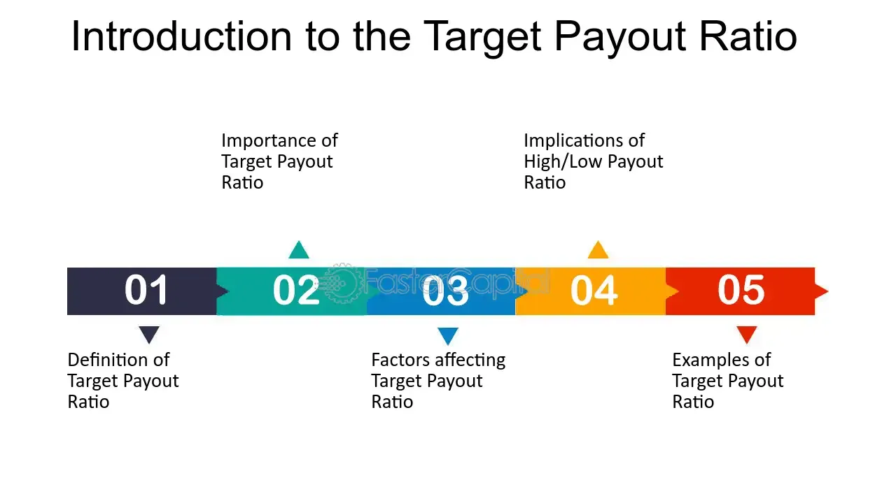

## Table of Contents

## What is a target payout ratio?

A target payout ratio is a goal that a company sets for how much of its earnings it wants to pay out to shareholders as dividends. It's like a plan that helps the company decide how much money to give back to its investors from the profits it makes. Companies use this ratio to balance between giving money to shareholders and keeping some earnings to grow the business or for other needs.

This ratio is important because it shows what the company thinks is the right amount to pay out. If a company has a high target payout ratio, it means it wants to give a lot of its earnings to shareholders. If it's low, the company might want to keep more money for future projects or to save for tough times. The target payout ratio can change based on the company's plans and the economic situation.

## Why is the target payout ratio important for investors?

The target payout ratio is important for investors because it tells them how much money they might get back from the company as dividends. If a company has a high target payout ratio, it means they plan to give a bigger part of their earnings to shareholders. This can be good for investors who want regular income from their investments. On the other hand, if the target payout ratio is low, it means the company wants to keep more of its earnings for other things, like growing the business or saving for the future.

Investors also use the target payout ratio to understand a company's plans and how it manages its money. A stable or increasing target payout ratio can show that the company is doing well and is confident about its future earnings. But if the target payout ratio changes a lot or goes down, it might mean the company is facing challenges or is changing its strategy. This information helps investors decide if they want to buy, hold, or sell their shares in the company.

## How is the target payout ratio calculated?

The target payout ratio is calculated by dividing the target dividend per share by the expected earnings per share. Let's break it down: the target dividend per share is how much the company wants to pay out to each shareholder, and the expected earnings per share is how much profit the company expects to make for each share. So, if a company wants to pay out $2 per share and expects to earn $5 per share, the target payout ratio would be $2 divided by $5, which equals 0.4 or 40%.

This simple calculation helps companies set a goal for how much of their earnings they want to give back to shareholders. It's important because it shows what the company plans to do with its profits. If the target payout ratio is high, it means the company plans to give a lot of its earnings back to shareholders. If it's low, the company might want to keep more earnings for other things, like growing the business or saving for the future.

## What is the difference between payout ratio and target payout ratio?

The payout ratio is the actual amount of earnings a company pays out to its shareholders as dividends. It's calculated by dividing the total dividends paid by the company's total earnings. For example, if a company earned $100 and paid out $30 in dividends, the payout ratio would be 30%. This ratio shows what the company actually did with its earnings in a given period.

The target payout ratio, on the other hand, is a goal or plan that the company sets for how much of its future earnings it wants to pay out as dividends. It's calculated by dividing the target dividend per share by the expected earnings per share. If a company wants to pay out $2 per share and expects to earn $5 per share, the target payout ratio would be 40%. This ratio helps the company and investors understand the company's intentions for future dividends and how it plans to balance between paying shareholders and keeping money for other uses.

## Can you provide a simple example of how a target payout ratio is used in a company?

Imagine a small family-owned bakery called "Sweet Treats." The owners want to share some of their profits with their family members who own shares in the bakery. They decide that they want to give out 25% of their future earnings as dividends. So, if they expect to make $40,000 in a year, they plan to pay out $10,000 to their family shareholders. This 25% is their target payout ratio.

By setting this target payout ratio, the owners of Sweet Treats can plan how much money they will need to set aside for dividends. It also helps their family members know what to expect in terms of dividend payments. If the bakery does better than expected and earns $50,000, they will still aim to pay out 25%, which would be $12,500. This way, everyone knows the plan, and it helps the bakery balance between giving money to shareholders and keeping some for growing the business or other needs.

## What factors influence a company's decision to set a specific target payout ratio?

A company's decision to set a specific target payout ratio depends on many things. One big [factor](/wiki/factor-investing) is how much money the company expects to make in the future. If a company thinks it will earn a lot, it might set a higher target payout ratio because it can afford to give more money to shareholders. Another factor is what the company wants to do with its money. If it wants to grow bigger or start new projects, it might keep more money and set a lower target payout ratio. The company also looks at what other similar companies are doing. If most companies in the same industry pay out a certain percentage, the company might choose a similar target payout ratio to stay competitive.

The company also thinks about what its shareholders want. Some shareholders might want a lot of dividends to live off or use for other investments. If that's the case, the company might set a higher target payout ratio. But if shareholders are more interested in the company growing and becoming more valuable, the company might keep more earnings and set a lower target payout ratio. Finally, the overall economy can play a role. In good economic times, a company might feel more confident and set a higher target payout ratio. But in tough times, it might lower the target payout ratio to save money for unexpected problems.

## How does the target payout ratio affect a company's dividend policy?

The target payout ratio directly affects a company's dividend policy because it sets a goal for how much of the company's earnings should be paid out to shareholders as dividends. When a company decides on a target payout ratio, it is making a plan for the future. For example, if a company sets a target payout ratio of 50%, it means they plan to give half of their earnings to shareholders. This helps the company be consistent with its dividend payments and gives shareholders an idea of what to expect.

If the target payout ratio is high, the company's dividend policy will focus more on paying out a larger portion of its earnings to shareholders. This can be good for investors who rely on dividends for income. On the other hand, a lower target payout ratio means the company's dividend policy will focus more on keeping earnings for other uses, like growing the business or saving for the future. The target payout ratio helps the company balance between rewarding shareholders and keeping money for other important needs.

## What are the potential risks associated with a high target payout ratio?

A high target payout ratio means a company plans to give a lot of its earnings to shareholders as dividends. This can be risky because if the company does not earn as much money as expected, it might not have enough left to pay the planned dividends. If the company has to borrow money or use savings to pay dividends, it could face financial problems. Also, if the company needs money for new projects or to grow, a high target payout ratio means less money is available for these important things. This could slow down the company's growth and make it harder to stay competitive.

Another risk is that investors might start to expect high dividends all the time. If the company can't keep up these payments, it could disappoint shareholders and cause the stock price to drop. This can make it harder for the company to raise money in the future by selling more shares. A high target payout ratio can also make the company less flexible. If something unexpected happens, like an economic downturn, the company might not have enough money saved to handle it because it's been paying out so much in dividends. This could put the company in a tough spot and make it harder to recover from challenges.

## How do companies adjust their target payout ratios in response to economic changes?

When the economy changes, companies often need to adjust their target payout ratios to stay safe and keep growing. If the economy is doing well, and companies are making more money, they might raise their target payout ratio. This means they plan to give more of their earnings to shareholders as dividends. Shareholders like this because they get more money, and it shows that the company is confident about its future earnings. But, if the economy is not doing well, and companies are making less money, they might lower their target payout ratio. This helps them keep more money for tough times or to invest in new projects that can help the company grow when things get better.

Sometimes, companies might also change their target payout ratio based on what their shareholders want. If shareholders are looking for more income, especially during uncertain times, the company might keep the target payout ratio high to meet these needs. But if shareholders are more focused on the company's long-term growth and are okay with less immediate income, the company might lower the target payout ratio to save more money for future growth. By adjusting the target payout ratio, companies can balance between giving money to shareholders and keeping enough for their own needs, no matter what the economy is doing.

## What are the industry standards for target payout ratios, and how do they vary across sectors?

Industry standards for target payout ratios can be different for each sector. Some industries, like utilities and real estate, usually have high target payout ratios. These companies often have steady earnings and shareholders expect regular dividends. So, they might aim to pay out 60% to 80% of their earnings as dividends. On the other hand, technology and biotech companies often have lower target payout ratios, maybe around 20% to 40%. These companies need a lot of money for research and to grow, so they keep more of their earnings instead of paying them out as dividends.

The reasons for these differences are pretty simple. Industries with stable earnings, like utilities, can afford to give more money to shareholders because they know how much they will make each year. But industries like technology are always changing and growing, so they need to keep more money to invest in new projects and stay competitive. This means their target payout ratios are lower. Knowing these standards helps investors understand what to expect from companies in different sectors and make better choices about where to put their money.

## How can an investor use the target payout ratio to assess the sustainability of a company's dividends?

An investor can use the target payout ratio to figure out if a company's dividends are likely to keep coming. If a company has a target payout ratio that is too high, like 90% or more, it might mean they are giving almost all their earnings to shareholders. This can be risky because if the company has a bad year and makes less money, it might not have enough to pay the dividends it promised. A lower target payout ratio, like 30% to 50%, usually means the company is keeping some money for itself. This can be a good sign because it shows the company is being careful and has money saved up for tough times or to grow the business.

By comparing the target payout ratio with the company's actual payout ratio, an investor can see if the company is sticking to its plan. If the actual payout ratio is always higher than the target, it might mean the company is stretching itself too thin to pay dividends. This could be a warning sign that the dividends might not last. On the other hand, if the company's actual payout ratio is close to or a bit lower than the target, it's a good sign that the dividends are sustainable. This way, investors can feel more confident that the company will keep paying dividends in the future.

## What advanced financial models incorporate the target payout ratio in forecasting future dividend payments?

One common financial model that uses the target payout ratio to predict future dividends is the Dividend Discount Model (DDM). This model helps investors figure out what a company's stock is worth based on the dividends it will pay in the future. The target payout ratio is important here because it helps the model guess how much of the company's future earnings will be given out as dividends. If a company has a target payout ratio of 50%, the DDM will use this to estimate that half of the company's future earnings will be paid out to shareholders. This helps investors decide if the stock is a good buy based on the expected dividends.

Another model that includes the target payout ratio is the Gordon Growth Model, which is a special type of DDM. This model assumes that dividends will grow at a steady rate forever. The target payout ratio helps the model predict the starting point for these dividends. If a company plans to pay out 40% of its earnings and expects its earnings to grow by 3% each year, the Gordon Growth Model can use this information to calculate the future value of the dividends. By including the target payout ratio, these models give investors a clearer picture of what to expect from a company's dividend payments over time.

## What is the Understanding of the Target Payout Ratio?

The target payout ratio is a fundamental concept in corporate finance and dividend policy. It represents the proportion of a company's earnings that it plans to distribute to its shareholders in the form of dividends over the long term. This ratio is significant because it reflects the company's intention to balance rewarding shareholders and retaining earnings for future growth and investment.

When setting a target payout ratio, businesses aim to establish a consistent and predictable dividend policy. This approach benefits both the company and its investors. For the company, maintaining stable dividends is essential for managing investor expectations and market perceptions. A stable dividend policy can enhance investor confidence, leading to potentially higher stock valuations. For investors, predictable dividends provide a reliable income stream and a measure of financial health and stability.

However, it is crucial to note that the actual dividend payout ratio, which is the proportion of actual earnings paid out as dividends, may fluctuate in the short term due to variations in company earnings. Such fluctuations can be attributed to different factors, including changes in market conditions, operational challenges, or economic events affecting a company's profitability. Consequently, while the target payout ratio serves as a benchmark, the real payout ratio may occasionally differ, reflecting these short-term financial conditions.

Mathematically, the target payout ratio can be expressed as:

$$
\text{Target Payout Ratio} = \frac{\text{Dividends per Share}}{\text{Earnings per Share}} \times 100\%
$$

This formula provides a quantitative measure of the percentage of earnings allocated for dividends compared to the total earnings.

In strategic terms, the target payout ratio serves as a long-term goal that guides dividend policy decisions, influencing how a company allocates its capital. For instance, a company with vast growth opportunities might choose a lower target payout ratio to reinvest more earnings back into the business, fostering expansion and competitive positioning. Conversely, a mature company with limited growth prospects might adopt a higher target payout ratio, prioritizing shareholder returns through dividends.

In conclusion, understanding the target payout ratio is vital for interpreting a company's dividend strategy and its implications for investors. It is a key indicator of how the company views its balance between shareholder returns and reinvestment in growth, impacting both corporate strategy and investor relations.

## References & Further Reading

[1]: Lintner, J. (1956). ["Distribution of Incomes of Corporations Among Dividends, Retained Earnings, and Taxes."](https://www.semanticscholar.org/paper/DISTRIBUTION-OF-INCOMES-OF-CORPORATIONS-AMONG-AND-Lintner/143efffe75d830c56a943b1098016341e2f17c3c) American Economic Review, 46(2), 97-113.

[2]: Miller, M.H., & Modigliani, F. (1961). ["Dividend Policy, Growth, and the Valuation of Shares."](https://www.jstor.org/stable/2351143) The Journal of Business, 34(4), 411-433.

[3]: Gordon, M.J. (1963). ["Optimal Investment and Financing Policy."](https://onlinelibrary.wiley.com/doi/abs/10.1111/j.1540-6261.1963.tb00722.x) The Journal of Finance, 18(2), 264-272.

[4]: ["The Intelligent Investor: The Definitive Book on Value Investing."](https://www.amazon.com/Intelligent-Investor-3rd-Ed/dp/0063356724) by Benjamin Graham

[5]: Shefrin, H.M., & Statman, M. (1984). ["Explaining Investor Preference for Cash Dividends."](https://www.sciencedirect.com/science/article/pii/0304405X84900254) Journal of Financial Economics, 13(2), 253-282.

[6]: ["Advances in Financial Machine Learning"](https://www.amazon.com/Advances-Financial-Machine-Learning-Marcos/dp/1119482089) by Marcos Lopez de Prado

[7]: ["Machine Learning for Algorithmic Trading"](https://github.com/PacktPublishing/Machine-Learning-for-Algorithmic-Trading-Second-Edition) by Stefan Jansen