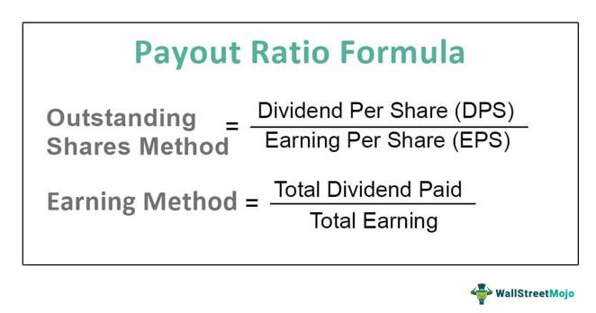

Understanding the intricacies of dividend policy, target payout ratio, and their impacts on financial strategy is crucial for investors and corporate managers alike. Dividend policy, which defines how a company distributes its profits to shareholders, and the target payout ratio, the percentage of earnings directed to dividends, play pivotal roles in shaping a company's financial strategy. These elements not only influence investor sentiment but also affect stock market valuation and dynamics.

In this article, we explore the significance of dividend policy and target payout ratio, shedding light on their influence on financial strategy, and further examining their implications for algorithmic trading. Dividend policies guide how companies allocate resources between shareholder returns and reinvestment for growth, thereby affecting their financial stability and market performance. The target payout ratio serves as a strategic benchmark, aligning a company's current financial condition with its long-term objectives.



For algorithmic traders, understanding dividend policies is key to enhancing investment strategies and decision-making processes. Algorithms can integrate dividend metrics to select stocks that align with specific investment goals, utilizing these ratios to forecast market trends and optimize portfolios. By bridging traditional financial analysis with modern trading technologies, traders can capitalize on valuable insights provided by dividend policies, gaining a competitive edge in the fast-evolving landscape of algorithmic trading. The article aims to identify how companies manage earnings distribution and how these decisions influence stock market movements.

## Table of Contents

## What is a Dividend Policy?

A dividend policy outlines a company's strategic approach to distributing profits to its shareholders in the form of dividends. As a critical component of corporate finance, a well-articulated dividend policy can influence investor sentiment significantly, as well as impact stock prices. 

There are various forms of dividends that a company might choose to distribute, each reflecting different strategic goals and financial conditions. Cash dividends are the most straightforward, involving the distribution of actual cash earnings to shareholders. Stock dividends, on the other hand, involve the distribution of additional shares of stock, offering an alternative means of rewarding investors without depleting cash reserves. Property dividends, though less common, involve disbursing physical assets. Special dividends are typically one-time payments that are not expected to recur regularly.

The establishment of a dividend policy is informed by several financial theories, including the Bird-in-Hand Theory and the Signaling Theory. According to the Bird-in-Hand Theory, investors may value the certainty of dividend payouts higher than potential capital gains, which are inherently riskier. In essence, this theory suggests that predictable returns in the form of dividends can create a perception of reduced risk, thereby enhancing the attractiveness of a stock.

Conversely, the Signaling Theory posits that dividend changes are often viewed as signals of a company's future prospects. A dividend increase can be interpreted as a positive signal, suggesting confidence in future earnings and stability, while a reduction or omission might signal financial distress or a strategic shift towards retaining earnings for reinvestment purposes.

The intricacies of dividend policies underscore their importance in shaping market perceptions and investor relations. Companies may adjust their dividend policies to align with financial goals, manage tax considerations, or respond to market conditions, thereby actively engaging in decisions that affect both shareholder value and corporate reputation.

## Understanding the Target Payout Ratio

The target payout ratio is a fundamental concept in corporate finance and dividend policy. It represents the proportion of a company's earnings that it plans to distribute to its shareholders in the form of dividends over the long term. This ratio is significant because it reflects the company's intention to balance rewarding shareholders and retaining earnings for future growth and investment.

When setting a target payout ratio, businesses aim to establish a consistent and predictable dividend policy. This approach benefits both the company and its investors. For the company, maintaining stable dividends is essential for managing investor expectations and market perceptions. A stable dividend policy can enhance investor confidence, leading to potentially higher stock valuations. For investors, predictable dividends provide a reliable income stream and a measure of financial health and stability.

However, it is crucial to note that the actual dividend payout ratio, which is the proportion of actual earnings paid out as dividends, may fluctuate in the short term due to variations in company earnings. Such fluctuations can be attributed to different factors, including changes in market conditions, operational challenges, or economic events affecting a company's profitability. Consequently, while the target payout ratio serves as a benchmark, the real payout ratio may occasionally differ, reflecting these short-term financial conditions.

Mathematically, the target payout ratio can be expressed as:

$$
\text{Target Payout Ratio} = \frac{\text{Dividends per Share}}{\text{Earnings per Share}} \times 100\%
$$

This formula provides a quantitative measure of the percentage of earnings allocated for dividends compared to the total earnings.

In strategic terms, the target payout ratio serves as a long-term goal that guides dividend policy decisions, influencing how a company allocates its capital. For instance, a company with vast growth opportunities might choose a lower target payout ratio to reinvest more earnings back into the business, fostering expansion and competitive positioning. Conversely, a mature company with limited growth prospects might adopt a higher target payout ratio, prioritizing shareholder returns through dividends.

In conclusion, understanding the target payout ratio is vital for interpreting a company's dividend strategy and its implications for investors. It is a key indicator of how the company views its balance between shareholder returns and reinvestment in growth, impacting both corporate strategy and investor relations.

## Factors Influencing Dividend Policy and Target Payout Ratio

Several key factors influence a company's dividend policy and target payout ratio, playing a critical role in guiding strategic financial decisions. 

**Profitability** is a primary determinant, as it directly affects the amount of earnings available for distribution as dividends. Companies with stable and high profitability are more likely to maintain regular dividend payments. Conversely, firms with volatile earnings may adopt a conservative dividend policy to ensure financial stability during lean periods. 

**Cash Flow** is another significant consideration. Even if a company is profitable, insufficient cash flow can limit its ability to pay dividends. Therefore, firms often assess their cash flow to ensure they can sustain dividend payments without jeopardizing operational liquidity. 

**Growth Opportunities** also influence dividend policy. Companies prioritizing growth may retain a higher percentage of earnings to reinvest in business expansion opportunities, such as research and development, capital expenditures, or acquisitions. In contrast, mature companies with fewer growth prospects may choose to distribute a greater portion of earnings as dividends to reward shareholders. 

**Tax Considerations** can impact the attractiveness of dividends to investors and influence corporate payout policies. For instance, changes in tax laws affecting dividend income can alter investor preferences for dividend payments versus capital gains. Companies need to consider these tax implications to align their dividend policies with shareholder interests. 

**Market Conditions** play a pivotal role in shaping dividend policies. During economic downturns or market volatility, companies might lower dividends to preserve cash, whereas, in buoyant markets, they may increase payouts to capitalize on positive investor sentiment.

**Legal Restrictions** are pertinent as well, as regulatory frameworks in different jurisdictions may impose restrictions on the amount or frequency of dividends. Companies must ensure compliance with these legal requirements when formulating their dividend strategies.

Finally, **Balancing Growth Reinvestment and Shareholder Returns** is a strategic challenge. Companies must strike a balance between reinvesting earnings to foster long-term growth and providing adequate returns to shareholders through dividends. This balance impacts a firm's financial stability and its relationships with investors, as clear and consistent policies can enhance investor confidence and strengthen relationships. 

These factors collectively guide a firm's approach to dividend distribution, influencing both its short-term financial decisions and its long-term strategic objectives.

## Impact on Financial Strategy

Dividend policies and payout ratios play a pivotal role in shaping a firm's financial strategy, influencing decisions surrounding capital allocation, investor communication, and overall business direction. A company's approach to distributing dividends not only reflects its financial health but also signals strategic priorities to investors.

**Capital Allocation**: Dividend policies directly impact how a company allocates its internal resources. A higher payout ratio implies that the company is returning a substantial portion of its earnings to shareholders as dividends. This approach may appeal to investors seeking immediate returns but may limit the company's ability to reinvest in growth opportunities or innovation. Conversely, a lower payout ratio denotes a strategy focused on reinvesting profits back into the business, potentially fueling future expansion or debt reduction.

**Investor Communication**: Transparently communicating dividend policies enhances investor relations as it demonstrates a commitment to shareholder returns and long-term planning. Companies may use stable or progressively increasing dividends to convey confidence in sustained profitability, fostering investor trust. A fluctuating dividend policy, on the other hand, might raise concerns about earnings volatility or underlying financial instability.

Investors closely assess dividend policies and payout ratios to gauge a company's growth prospects and financial stability. High dividends might indicate strong current earnings, but they can also suggest a lack of profitable reinvestment opportunities. Therefore, investors weigh these financial metrics to balance current income with future capital appreciation potential.

Ultimately, an optimal dividend strategy aligns shareholder interests with corporate objectives, promoting sustainable growth while ensuring adequate returns. By carefully crafting dividend policies, companies aim to balance immediate shareholder needs with reinvestment for long-term financial health, thereby reinforcing their market position and driving value creation.

## Role of Dividend Policy and Payout Ratio in Algorithmic Trading

In the context of [algorithmic trading](/wiki/algorithmic-trading), dividend policy and payout ratios serve as influential parameters that can significantly enhance trading models and strategies. Algorithms, which are essentially rules-driven processes, utilize these financial metrics to analyze and select stocks that resonate with predefined trading objectives. The Dividend Payout Ratio (DPR), defined as the proportion of earnings distributed as dividends to shareholders, serves as a criterion within these algorithms. For instance, stocks exhibiting a consistent or increasing DPR might be interpreted as attractive by algorithms prioritizing companies committed to returning cash to shareholders.

The application of DPR data extends further into predictive analytics, where traders forecast future market trends and make informed investment decisions. By leveraging historical and real-time data on payout ratios, algorithms can project potential stock price movements or identify anomalies indicative of shifts in a company’s dividend policy. This perspective is rooted in the signaling theory, which posits that changes in dividend policy can signal management’s insight into a company’s future prospects. For example, a sudden reduction in dividend payouts might prompt a reevaluation of the stock's future valuation due to potential financial instability.

Machine learning (ML) techniques amplify the utility of dividend policy data in trading contexts. The adaptability and learning capabilities of ML algorithms allow them to recognize complex patterns and correlations inherent in financial datasets. Through supervised learning models such as regression analysis or decision trees, ML can correlate DPR changes with stock price fluctuations or market [volatility](/wiki/volatility-trading-strategies). Unsupervised techniques, like clustering, further classify stocks into distinct groups based on dividend trends, enhancing stock selection processes. Here’s a simple Python example using a decision tree for classifying stocks based on DPR:

```python
from sklearn.tree import DecisionTreeClassifier
import numpy as np

# Sample dataset: [DPR, Stock Volatility]
X = np.array([[0.3, 0.2], [0.5, 0.4], [0.6, 0.1], [0.4, 0.3], [0.8, 0.05]])
y = np.array(['Buy', 'Hold', 'Buy', 'Hold', 'Sell'])  # Labels based on a strategy

# Initialize and train the decision tree classifier
clf = DecisionTreeClassifier()
clf.fit(X, y)

# Predicting stock action for a new DPR and Volatility data
new_data = np.array([[0.7, 0.15]])
prediction = clf.predict(new_data)
print("Recommended Action:", prediction[0])
```

In this illustration, the decision tree is trained on example payout ratios and volatility indicators, labeling them with corresponding trading actions. This model can predict strategies for new stocks based on similar input features. Leveraging such intelligent systems enables algorithmic traders to optimize portfolio performance by tailoring strategies to dynamic market conditions, influenced by dividend policies and payouts. These techniques transform dividend policy analysis from a purely theoretical discourse into actionable insights, providing a quantitative edge in the fast-paced landscape of financial markets.

## Conclusion

A comprehensive understanding of dividend policy and payout ratios is essential for navigating today's financial markets. These financial metrics offer a window into a company's strategic decisions, reflecting its stability and its ability to grow over time. Investors often scrutinize these metrics to assess a company's commitment to returning value to shareholders while balancing its capital needs for future investments. Moreover, a company's approach to dividends can signal management's confidence in its ongoing earnings ability, thus influencing investor sentiment and stock market behavior.

As algorithmic trading continues to evolve, integrating dividend analysis into trading systems can offer a competitive advantage. Algorithms designed to include dividend policy metrics can refine stock selection and trading strategies, aligning them with specific investment goals such as dividend yield or growth compatibility. This data-driven approach, enhanced by [machine learning](/wiki/machine-learning) techniques, allows traders to forecast trends and derive actionable insights from dividend-related activity, thereby optimizing portfolio performance.

Ultimately, a well-crafted dividend policy can both enhance shareholder value and fortify a company's standing in the market. By demonstrating a clear strategy for profit distribution, companies can foster trust and attract investment, which contributes to sustained growth and financial resilience. As trading environments and technologies advance, the strategic application of dividend policies remains crucial to achieving and maintaining a strong financial position.

## References & Further Reading

[1]: Lintner, J. (1956). ["Distribution of Incomes of Corporations Among Dividends, Retained Earnings, and Taxes."](https://www.semanticscholar.org/paper/DISTRIBUTION-OF-INCOMES-OF-CORPORATIONS-AMONG-AND-Lintner/143efffe75d830c56a943b1098016341e2f17c3c) American Economic Review, 46(2), 97-113.

[2]: Miller, M.H., & Modigliani, F. (1961). ["Dividend Policy, Growth, and the Valuation of Shares."](https://www.jstor.org/stable/2351143) The Journal of Business, 34(4), 411-433.

[3]: Gordon, M.J. (1963). ["Optimal Investment and Financing Policy."](https://onlinelibrary.wiley.com/doi/abs/10.1111/j.1540-6261.1963.tb00722.x) The Journal of Finance, 18(2), 264-272.

[4]: ["The Intelligent Investor: The Definitive Book on Value Investing."](https://www.amazon.com/Intelligent-Investor-3rd-Ed/dp/0063356724) by Benjamin Graham

[5]: Shefrin, H.M., & Statman, M. (1984). ["Explaining Investor Preference for Cash Dividends."](https://www.sciencedirect.com/science/article/pii/0304405X84900254) Journal of Financial Economics, 13(2), 253-282.

[6]: ["Advances in Financial Machine Learning"](https://www.amazon.com/Advances-Financial-Machine-Learning-Marcos/dp/1119482089) by Marcos Lopez de Prado

[7]: ["Machine Learning for Algorithmic Trading"](https://github.com/PacktPublishing/Machine-Learning-for-Algorithmic-Trading-Second-Edition) by Stefan Jansen