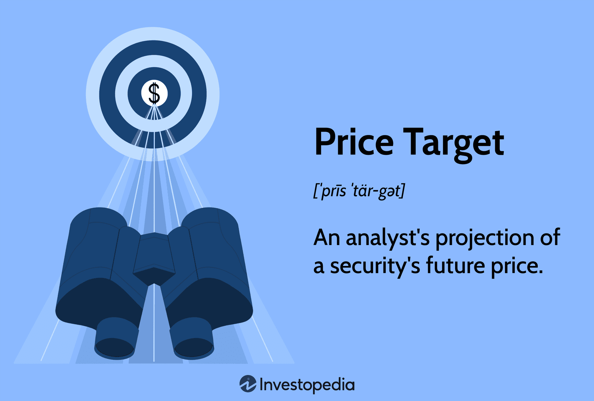

## Table of Contents

## What is a target price in investment?

A target price in investment is a prediction made by analysts about the future price of a stock or asset. It is an estimate of where they think the price will go over a certain period, usually within a year. Investors use these target prices to help them decide whether to buy, sell, or hold onto a stock. If the target price is higher than the current price, it might be a good time to buy because the stock could go up in value. If it's lower, it might be a good time to sell to avoid losing money.

These target prices are based on a lot of research and analysis. Analysts look at things like the company's financial health, how the industry is doing, and what's happening in the economy. They use this information to make their predictions. However, it's important to remember that target prices are just estimates. They can be wrong because the future is unpredictable. So, while they are helpful, investors should not rely on them completely but should use them along with other information to make smart investment choices.

## How is a target price determined?

A target price is figured out by looking at a lot of different things about a company and the world around it. Analysts start by checking the company's money situation. They look at things like how much money the company makes, how much it spends, and how much debt it has. They also think about how fast the company is growing and if it's doing better or worse than other companies in the same business. Besides the company itself, analysts also pay attention to what's happening in the industry and the whole economy. They might look at things like new laws, how people are spending money, and what's going on in other countries.

After gathering all this information, analysts use special math models to guess where the stock price might go. These models help them think about different things that could happen in the future and how those things might change the stock price. They might also talk to people who work at the company or follow the industry closely to get more ideas. Once they have all this information, they come up with a target price that they think is a good guess for where the stock might be in the future. But it's important to remember that this is just a guess, and the real stock price can be different because the future is hard to predict.

## Who sets target prices and why are they important?

Target prices are set by people called analysts who work for big banks, research companies, or investment firms. These analysts spend a lot of time studying companies, industries, and the economy to make smart guesses about where stock prices might go. They use a lot of information and special math to come up with a target price, which is their best guess of where a stock's price will be in the future, usually within a year.

Target prices are important because they help investors make decisions. If an investor sees that the target price for a stock is higher than its current price, they might decide to buy the stock because they think it will go up in value. On the other hand, if the target price is lower than the current price, an investor might decide to sell the stock to avoid losing money. While target prices are just guesses and can be wrong, they give investors useful information to help them make better choices about buying, selling, or holding onto stocks.

## What role do target prices play in investment decisions?

Target prices are very helpful for people who invest money. They are like guesses from experts about where a stock's price might go in the future. If the target price is higher than what the stock costs now, it might be a good time to buy it because the stock could go up in value. But if the target price is lower, it might be smart to sell the stock to avoid losing money. Investors use these target prices to decide if they should buy, sell, or keep holding onto a stock.

Even though target prices are useful, they are not always right. They are just predictions, and the future can be hard to guess. So, while target prices can guide investors, it's important not to rely on them completely. Smart investors look at a lot of different information, not just target prices, to make the best choices about their investments.

## How often are target prices updated?

Target prices are usually updated by analysts when new information comes out that could change their guesses about a stock's future price. This could happen when a company shares its money reports, like how much money they made or lost, or when something big happens in the world that could affect the company or the whole economy. Analysts might also update their target prices if they learn new things from talking to people who work at the company or from following the news closely.

These updates don't happen on a set schedule. Sometimes, an analyst might change their target price a few times in a year if a lot of new information comes out. Other times, they might not change it for a while if nothing big happens. Investors should keep an eye on these updates to help them make good choices about their investments, but they should also remember that target prices are just guesses and not always right.

## What are the common methods used to calculate target prices?

Analysts use different ways to figure out target prices for stocks. One common method is the Discounted Cash Flow (DCF) analysis. This method looks at how much money a company might make in the future and then figures out what that money is worth today. It's like guessing how much a company will earn and then using a special math formula to see what those future earnings are worth right now. Another method is the Comparable Company Analysis, where analysts compare the company they are looking at with other similar companies. They look at things like how much those companies are worth and how much money they make to guess what the stock price of the company they are studying might be.

Another way to calculate target prices is by using technical analysis. This method looks at past stock prices and trading patterns to predict where the price might go next. Analysts use charts and graphs to spot trends and patterns that could tell them if the stock price will go up or down. Finally, there's the Dividend Discount Model (DDM), which is used for companies that pay dividends. This model looks at the dividends the company is expected to pay in the future and figures out what those dividends are worth today, similar to the DCF method but focused on dividends instead of overall cash flow.

All these methods help analysts make their best guess about where a stock's price might go. But it's important to remember that these are just guesses. The future can be hard to predict, so while these methods are useful, they are not always right. Investors should use target prices as one part of their decision-making process, along with other information, to make smart choices about their investments.

## Can target prices be influenced by market sentiment?

Yes, target prices can be influenced by how people feel about the market, which is called market sentiment. When a lot of people are feeling good about the market, they might be more willing to buy stocks, which can push stock prices up. Analysts might see this and think that the good feelings will keep going, so they might set higher target prices because they expect the stock to keep going up.

On the other hand, if people are feeling worried or scared about the market, they might start selling their stocks, which can make stock prices go down. Analysts might see this and think that the bad feelings will continue, so they might set lower target prices because they expect the stock to keep going down. Market sentiment can change quickly, so analysts need to keep an eye on it and update their target prices if the feelings of the market change a lot.

## How do target prices differ across various sectors?

Target prices can be different across various sectors because each sector has its own way of making money and growing. For example, in the tech sector, companies might grow very fast and make a lot of new products. Analysts might set higher target prices for tech stocks because they think the companies will keep growing quickly. On the other hand, in the utility sector, like companies that provide electricity or water, the growth might be slower and more steady. Analysts might set lower target prices for utility stocks because they expect the companies to grow more slowly.

Also, different sectors can be affected by different things happening in the world. For example, the energy sector might be influenced a lot by the price of oil and gas, so analysts might change their target prices based on what's happening with those prices. In the healthcare sector, new laws or new medicines can make a big difference, so analysts might set target prices based on what they think will happen with those things. Because each sector is different, analysts use different information and ways of thinking to set target prices for stocks in each sector.

## What are the limitations and potential inaccuracies of target prices?

Target prices are guesses about where a stock's price might go in the future. They are not always right because the future is hard to predict. Many things can change, like the economy, new laws, or what people feel about the market. These changes can make the stock price go up or down in ways that analysts did not expect. Also, the information analysts use to set target prices can be wrong or not complete. They might miss important news or not see all the risks that could affect the company.

Another problem is that different analysts can have different target prices for the same stock. This happens because they might use different ways to guess the future price or they might see the same information in different ways. This can confuse investors and make it hard to know which target price to trust. In the end, while target prices can be helpful, investors should not rely on them completely. They should use target prices along with other information to make smart choices about their investments.

## How can investors use target prices in conjunction with other financial metrics?

Investors can use target prices along with other financial metrics to make smarter choices about their investments. One way to do this is by looking at a company's earnings per share (EPS), which shows how much money the company makes for each share of stock. If the target price is higher than the current price and the EPS is also growing, it might be a good sign that the stock will go up in value. Another important metric is the price-to-earnings (P/E) ratio, which compares the stock's price to how much money the company makes. If the target price is high but the P/E ratio is also very high, it might mean the stock is too expensive and could be risky.

Investors should also pay attention to the company's debt levels and cash flow. If a company has a lot of debt, it might be harder for them to grow, even if the target price is high. On the other hand, if a company has good cash flow, it might be able to keep growing and reach the target price. By looking at these other financial metrics along with target prices, investors can get a better picture of the company's health and make more informed decisions about buying, selling, or holding onto a stock.

## What historical data supports the effectiveness of target prices in predicting stock performance?

Studies have shown that target prices can be helpful in guessing where a stock's price might go. One big study looked at target prices set by analysts over many years and found that they were often pretty close to the real stock prices after a year. The study showed that if you bought stocks with high target prices and sold stocks with low target prices, you could make more money than if you just picked stocks randomly. This means that target prices can be a good tool for investors to use when they are trying to decide which stocks to buy or sell.

But, it's important to know that target prices are not always right. Another study found that target prices were only about 50% accurate in predicting where the stock price would be after a year. This means that half the time, the stock price ended up being different from what the analysts guessed. So, while target prices can give investors a good idea of where a stock might go, they should not be the only thing investors look at. It's smart to use target prices along with other information to make the best choices about investing.

## How do expert investors adjust their strategies based on discrepancies between market prices and target prices?

Expert investors often look at the difference between the current market price of a stock and the target price set by analysts. If the target price is a lot higher than the market price, it might mean the stock is a good buy. The expert might decide to buy the stock because they think it will go up to reach the target price. But if the target price is lower than the market price, the expert might think the stock is too expensive and could go down. In this case, they might choose to sell the stock to avoid losing money.

However, expert investors don't just follow target prices blindly. They also look at other things like how the company is doing, what's happening in the economy, and what other people think about the stock. If they see a big difference between the market price and the target price, they might do more research to understand why. They might talk to other experts, read more reports, or look at the company's financials in more detail. By using target prices along with other information, expert investors can make smarter choices about when to buy or sell stocks.

## What is the understanding of target prices in investing?

Target prices play a pivotal role in investment decision-making by providing forward-looking estimates of a stock's potential future value. These estimates are grounded in [fundamental analysis](/wiki/fundamental-analysis), which involves assessing the intrinsic value of a stock based on various quantitative and qualitative factors. Key components in determining a target price include earnings estimates, valuation multiples, and other relevant financial data.

Fundamental analysis employs several methodologies to project these target prices. A common approach involves analyzing financial statements to derive indicators like Earnings per Share (EPS), which is a company's net profit divided by the number of outstanding shares. EPS is critical for evaluating a company's profitability on a per-share basis and is used alongside other metrics to construct an educated forecast of a stock's value.

Valuation multiples are another essential element in calculating target prices. These ratios, such as the Price-to-Earnings (P/E) ratio, compare a company's current share price to its per-share earnings. The P/E ratio, for instance, aids investors in determining the market's expectation of earnings growth and potential overvaluation or undervaluation relative to peers.

$$
\text{Target Price} = \text{EPS} \times \text{P/E Ratio}
$$

This formula represents a simplified approach, illustrating how fundamental indicators combine to estimate a stock's potential value. By focusing on these and other metrics, such as revenue growth rates and industry trends, investors can better assess the risk/reward profile associated with the stock.

Target prices serve as benchmarks against which investors can measure a stock's expected performance. Since they are based on objective financial indicators rather than subjective opinions or qualitative ratings, they provide clearer insights into a stock's valuation. This objective grounding helps investors to make informed decisions regarding the timing of buying or selling securities. Investors use target prices to establish entry and [exit](/wiki/exit-strategy) points, ensuring they capitalize on opportunities while minimizing risks.

An accurate target price is crucial for optimizing investment returns. It allows investors to execute timely buying when the market is undervaluing a stock and selling when it reaches or exceeds the projected target. The continuous assessment and adjustment of target prices, as market conditions and company fundamentals shift, help in aligning investment strategies with the evolving financial landscape.

## References & Further Reading

[1]: Bergstra, J., Bardenet, R., Bengio, Y., & Kégl, B. (2011). ["Algorithms for Hyper-Parameter Optimization."](https://papers.nips.cc/paper/4443-algorithms-for-hyper-parameter-optimization) Advances in Neural Information Processing Systems 24.

[2]: ["Advances in Financial Machine Learning"](https://www.amazon.com/Advances-Financial-Machine-Learning-Marcos/dp/1119482089) by Marcos Lopez de Prado

[3]: ["Evidence-Based Technical Analysis: Applying the Scientific Method and Statistical Inference to Trading Signals"](https://www.amazon.com/Evidence-Based-Technical-Analysis-Scientific-Statistical/dp/0470008741) by David Aronson

[4]: ["Machine Learning for Algorithmic Trading"](https://github.com/stefan-jansen/machine-learning-for-trading) by Stefan Jansen

[5]: ["Quantitative Trading: How to Build Your Own Algorithmic Trading Business"](https://www.amazon.com/Quantitative-Trading-Build-Algorithmic-Business/dp/1119800064) by Ernest P. Chan