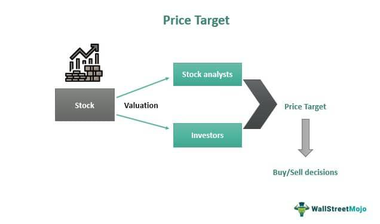

In today's dynamic financial markets, understanding and utilizing target prices plays a pivotal role in informed investing, particularly when combined with the power of automated algorithmic trading strategies. Target prices are estimates that predict the future value of a stock based on comprehensive financial analyses, which include evaluating earnings, market conditions, and valuation multiples. These estimates provide investors with a clear benchmark for assessing stock performance, offering insights that are more reliable than mere opinion-based ratings.

Investors striving for consistent and profitable outcomes can benefit significantly from the synergy between target prices and investment strategies. A well-devised investment strategy acts as a roadmap, incorporating diversified approaches, risk management techniques, and clear objectives to navigate market uncertainties effectively. Whether an investor's focus is long-term value, growth, or quantitative models, aligning strategies with target prices ensures decisions cater to personal financial goals and prevailing market conditions.



Algorithmic trading brings an unprecedented level of precision and speed to this process. Utilizing sophisticated algorithms enables the execution of trades based on predefined criteria, free from human emotions that might cloud judgement. These systems leverage historical data to backtest models, rapidly exploiting market inefficiencies. By integrating target prices, investment strategies, and algorithmic trading, investors can leverage these tools to enhance decision-making efficiency and precision.

This strategic integration enables investors to better time trades, adapt to real-time financial data, and fine-tune their strategies for optimized portfolio performance. This empowers them to navigate the complexities of financial markets with greater confidence and accuracy, maintaining resilience and agility in the ever-evolving financial landscape.

## Table of Contents

## Understanding Target Prices in Investing

Target prices play a pivotal role in investment decision-making by providing forward-looking estimates of a stock's potential future value. These estimates are grounded in fundamental analysis, which involves assessing the intrinsic value of a stock based on various quantitative and qualitative factors. Key components in determining a target price include earnings estimates, valuation multiples, and other relevant financial data.

Fundamental analysis employs several methodologies to project these target prices. A common approach involves analyzing financial statements to derive indicators like Earnings per Share (EPS), which is a company's net profit divided by the number of outstanding shares. EPS is critical for evaluating a company's profitability on a per-share basis and is used alongside other metrics to construct an educated forecast of a stock's value.

Valuation multiples are another essential element in calculating target prices. These ratios, such as the Price-to-Earnings (P/E) ratio, compare a company's current share price to its per-share earnings. The P/E ratio, for instance, aids investors in determining the market's expectation of earnings growth and potential overvaluation or undervaluation relative to peers.

$$
\text{Target Price} = \text{EPS} \times \text{P/E Ratio}
$$

This formula represents a simplified approach, illustrating how fundamental indicators combine to estimate a stock's potential value. By focusing on these and other metrics, such as revenue growth rates and industry trends, investors can better assess the risk/reward profile associated with the stock.

Target prices serve as benchmarks against which investors can measure a stock's expected performance. Since they are based on objective financial indicators rather than subjective opinions or qualitative ratings, they provide clearer insights into a stock's valuation. This objective grounding helps investors to make informed decisions regarding the timing of buying or selling securities. Investors use target prices to establish entry and [exit](/wiki/exit-strategy) points, ensuring they capitalize on opportunities while minimizing risks.

An accurate target price is crucial for optimizing investment returns. It allows investors to execute timely buying when the market is undervaluing a stock and selling when it reaches or exceeds the projected target. The continuous assessment and adjustment of target prices, as market conditions and company fundamentals shift, help in aligning investment strategies with the evolving financial landscape.

## The Role of Investment Strategies

A robust investment strategy is essential for navigating the ever-fluctuating financial markets. Such a strategy mitigates market uncertainties through diversified approaches, risk management, and clear goal setting. By systematically analyzing market conditions and aligning them with personal financial goals, investors can potentially enhance their portfolio performance.

Investment strategies can vary widely, catering to different risk appetites and financial objectives. Long-term value investing focuses on purchasing undervalued stocks with strong fundamentals, expecting their true value to be recognized over time. Growth investing, on the other hand, targets companies with significant potential for growth, often at a higher risk. Both strategies require in-depth [fundamental analysis](/wiki/fundamental-analysis) to make educated predictions about stock performance.

The modern investor can also leverage quant-driven models, which utilize statistical analysis to predict price movements. These models often incorporate large datasets and employ sophisticated algorithms to identify patterns and trends that may not be apparent through traditional analysis. For instance, by using regression models or [machine learning](/wiki/machine-learning) techniques, investors can forecast potential market shifts and make informed decisions.

Adaptability is another cornerstone of an effective investment strategy. As market conditions evolve, so too must the strategies employed. Incorporating new data and continuously monitoring market trends ensure that investors remain responsive to changes. This requires not only a firm grasp of current market dynamics but also the ability to foresee potential developments and adjust strategies accordingly.

In essence, a robust investment strategy functions as a holistic roadmap, guiding investors through the complexities of the market while striving to optimize performance. By balancing diversified investments with advanced analytical methods and adaptability, investors increase their chances of attaining sustainable and profitable outcomes.

## Algorithmic Trading: Enhancing Decision-Making

Algorithmic trading leverages advanced algorithms and comprehensive statistical models to deliver enhanced precision and speed for executing trades according to predefined criteria. The value of these systems lies in their capacity to utilize historical data, constructing backtested models designed to swiftly and accurately seize market inefficiencies. These models, through rigorous testing, aim to predict future market behavior based on past trends, thus providing a data-driven approach to trading.

One of the primary benefits of [algorithmic trading](/wiki/algorithmic-trading) is its ability to eliminate human emotions from trading decisions. Emotional decisions in trading often lead to inconsistent outcomes due to cognitive biases such as fear and greed. By relying on algorithms, trading becomes more disciplined and can potentially lead to more lucrative outcomes. The algorithms are programmed to adhere strictly to the predefined trading strategy, ensuring that trades are executed consistently, maximizing the potential for profit while minimizing human error.

Different algorithmic trading strategies illustrate the adaptability and power of these systems. High-frequency trading ([HFT](/wiki/high-frequency-trading-strategies)) is a strategy characterized by executing a large number of orders at extremely high speeds. HFT takes advantage of small price discrepancies in the market, often holding positions for a very short time. This requires significant computational power and low-latency connections to exchanges. On the other hand, statistical [arbitrage](/wiki/arbitrage) is a strategy that identifies relative price inefficiencies between assets. It uses econometric, statistical, and machine learning techniques to develop trading strategies that capitalize on mean-reversion or convergence-divergence. 

Algorithmic trading also enhances decision-making through the use of sophisticated programming languages like Python. Python, with its extensive libraries such as NumPy, pandas, and scikit-learn, allows traders to develop complex models for data analysis, model building, and [backtesting](/wiki/backtesting). Here is a simple example of a trading algorithm implemented in Python:

```python
import pandas as pd
import numpy as np

# Load historical price data
data = pd.read_csv('historical_prices.csv')
data['Returns'] = data['Close'].pct_change()

# Define moving average strategy
def moving_average_strategy(data, short_window, long_window):
    data['Short_MA'] = data['Close'].rolling(window=short_window, min_periods=1).mean()
    data['Long_MA'] = data['Close'].rolling(window=long_window, min_periods=1).mean()

    data['Signal'] = 0
    data['Signal'][short_window:] = np.where(data['Short_MA'][short_window:] > data['Long_MA'][short_window:], 1.0, 0.0)   
    data['Position'] = data['Signal'].diff()

    return data

# Apply strategy
strategy_data = moving_average_strategy(data, short_window=40, long_window=100)

# Simulate strategy returns
strategy_data['Strategy_Returns'] = strategy_data['Position'].shift(1) * strategy_data['Returns']

# Calculate cumulative returns
cumulative_returns = (1 + strategy_data['Strategy_Returns']).cumprod() - 1
print("Cumulative Returns:", cumulative_returns.iloc[-1])
```

In conclusion, algorithmic trading significantly enhances decision-making by enabling swift, emotionless, and data-driven trade executions. This technological advancement empowers traders to harness strategies like high-frequency trading and [statistical arbitrage](/wiki/statistical-arbitrage), fostering a more effective and systematic trading environment.

## Synergy of Target Prices, Strategies, and Algorithmic Trading

Combining target prices with algorithmic trading systems significantly enhances the precision of entry and exit points in trading strategies. Target prices, determined through fundamental analysis, provide a quantitative benchmark for stocks, guiding algorithmic models to make informed trading decisions. This integration allows for strategic automation, enabling systems to dynamically adjust positions and strategies as new financial information becomes available. 

By leveraging target prices, algorithmic systems can refine their trading models to better mirror realistic market conditions. This alignment ensures that algorithms emphasize not only systematic trading strategies but also the potential market movements that may prompt corrective actions. For instance, when a stock approaches or surpasses its target price, an algorithm may be programmed to execute a sell order, ensuring disciplined adherence to the predefined investment strategy.

The integration of target prices within algorithmic trading serves in filtering actionable signals from market noise, thus improving the accuracy of market forecasts. Python can be employed to program such an algorithmic system, where libraries like pandas and numpy allow for the manipulation of financial datasets, while libraries such as scikit-learn can facilitate the integration of predictive models into the trading strategy. Consider the following pseudocode as an illustration of how these elements might converge:

```python
import pandas as pd
import numpy as np
from sklearn.linear_model import LinearRegression

# Assume df is a pandas DataFrame with historical stock data including 'Price' and 'EPS'.
# 'EPS' is used to calculate predicted prices using a simple model.
X = df[['EPS']].values
y = df['Price'].values

# Train a simple linear regression model
model = LinearRegression()
model.fit(X, y)

# Predict future prices (Target Prices)
target_prices = model.predict(X)

def trading_signal(current_price, target_price):
    if current_price < target_price:
        return 'Buy'
    elif current_price > target_price:
        return 'Sell'
    else:
        return 'Hold'

# Apply the trading signal logic
df['Signal'] = df.apply(lambda row: trading_signal(row['Price'], row['Target Price']), axis=1)
```

Such an approach helps in effectively timing trades, managing portfolio risks, and optimizing performance. When target prices are systematically integrated into algorithmic trading processes, investors benefit from timely and data-driven trading actions. This strategic convergence aids investors in achieving a balanced and optimized portfolio, responsive to dynamic market environments. As trading systems evolve, the role of target prices becomes increasingly crucial in guiding algorithms to react efficiently to both anticipated and unexpected market changes.

## Challenges and Risks

While automated strategies leveraging target prices and algorithmic trading offer significant advantages, they come with their own set of challenges and risks. Central to the success of these automated strategies is the reliance on accurate data and robust market fundamentals. Erroneous or incomplete data can lead to flawed target prices and unreliable trading signals, thus affecting overall investment performance.

Algorithmic errors pose another significant risk. Computational mistakes or programming flaws can result in incorrect trade executions, leading to potential financial losses. For instance, incorrect coding of an algorithm may cause it to behave unpredictably during market anomalies. Additionally, unforeseen market conditions, such as sudden geopolitical events or unexpected economic announcements, can impact automated trading algorithms adversely. These conditions may result in rapid market shifts that were not anticipated by the model, leading to suboptimal trading outcomes.

To mitigate these risks, investors need to maintain vigilance by continuously reviewing and updating their algorithms. Regular audits and recalibrations of trading systems help ensure that algorithms remain aligned with current market conditions and financial goals. Backtesting strategies—where algorithms are tested against historical data—are crucial for identifying potential weaknesses under various market scenarios. By simulating different environments, investors can calculate metrics such as Sharpe Ratio or Maximum Drawdown to assess potential performance and risk levels.

Moreover, robust risk management strategies must be in place to protect investment portfolios. Implementing stop-loss orders, diversifying asset allocations, and setting position size limits are ways to manage risk effectively. Continuous monitoring and adaptive modifications are necessary to enhance the resilience of trading systems against market [volatility](/wiki/volatility-trading-strategies).

Thus, while automated trading using target prices and algorithms can lead to efficient and precise trading activities, the associated risks underline the importance of rigorous data validation, algorithmic review, and comprehensive risk management strategies in maintaining a robust investment approach.

## Conclusion

The integration of target prices, sound investing strategies, and algorithmic trading represents a transformative shift in the landscape of investment efficiency and accuracy. Together, these elements empower investors to harness insights that not only align strategies with market movements but also enhance risk management capabilities. By leveraging the synergy of these tools, investors can secure a competitive edge in increasingly complex financial environments.

As technology continues to advance, staying informed and strategically adaptable becomes crucial. The dynamic nature of financial markets necessitates continuous learning and adaptation to refine investment strategies. Embracing technological advancements and data-driven insights allows investors to navigate uncertainties and capitalize on opportunities more effectively.

This comprehensive approach, centered around the integration of target prices, sound strategies, and algorithmic trading, enables investors to make informed decisions. By optimizing the use of these tools, investors can enhance their investment potential, maintaining a proactive stance in the ever-evolving world of finance. Ultimately, this strategic convergence offers a pathway to sustained financial success, empowering investors to achieve optimized portfolio performance and fulfill their investment objectives.

## References & Further Reading

[1]: Bergstra, J., Bardenet, R., Bengio, Y., & Kégl, B. (2011). ["Algorithms for Hyper-Parameter Optimization."](https://papers.nips.cc/paper/4443-algorithms-for-hyper-parameter-optimization) Advances in Neural Information Processing Systems 24.

[2]: ["Advances in Financial Machine Learning"](https://www.amazon.com/Advances-Financial-Machine-Learning-Marcos/dp/1119482089) by Marcos Lopez de Prado

[3]: ["Evidence-Based Technical Analysis: Applying the Scientific Method and Statistical Inference to Trading Signals"](https://www.amazon.com/Evidence-Based-Technical-Analysis-Scientific-Statistical/dp/0470008741) by David Aronson

[4]: ["Machine Learning for Algorithmic Trading"](https://github.com/stefan-jansen/machine-learning-for-trading) by Stefan Jansen

[5]: ["Quantitative Trading: How to Build Your Own Algorithmic Trading Business"](https://www.amazon.com/Quantitative-Trading-Build-Algorithmic-Business/dp/1119800064) by Ernest P. Chan