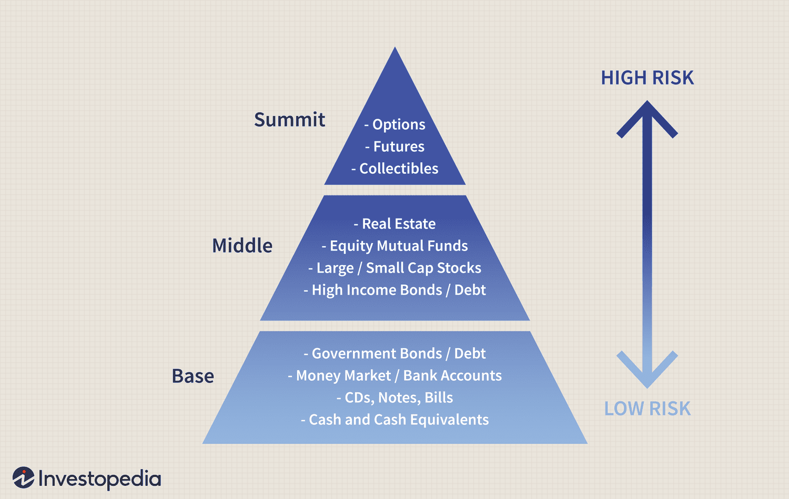

In modern finance, algorithmic trading has emerged as a vital tool for investors looking to optimize their return on investment (ROI). This process leverages computer algorithms to execute trades at speeds and frequencies beyond human capabilities, enhancing the efficiency and effectiveness of trading strategies. Algorithmic trading systems analyze vast datasets to identify profitable opportunities, adjust trades in milliseconds, and minimize human error, thereby increasing the potential for maximizing ROI.

Understanding the concepts of target return and investment expectations is essential when defining realistic financial goals. The target return sets a tangible benchmark for investors, guiding their strategic decision-making and allowing them to measure the performance of their investments against predefined objectives. Investment expectations, on the other hand, provide the necessary framework for anticipating how market movements may affect the ability to reach these financial goals.



This article examines the profound impact that algorithmic trading can have on achieving target return rates, offering insights into setting pragmatic return expectations. By leveraging algorithms, investors can enhance their ability to manage investments effectively, respond to market fluctuations proactively, and devise strategies that align with their financial aspirations. The role of algorithms in trading is pivotal: they not only streamline the investment process but also support the adoption of sophisticated strategies for success. These include risk management and real-time market analysis, which are integral to navigating the complexities of the modern financial landscape.

Overall, algorithmic trading provides investors with a robust mechanism to pursue their financial targets with greater precision and adaptability. As the financial landscape continues to evolve, the integration of algorithmic strategies holds the promise of not only optimizing returns but also redefining the approach to investment management.

## Table of Contents

## Understanding Target Return

Target return refers to the anticipated future profit from an investment, taking into account the time-value of money. This concept plays a crucial role in helping investors establish realistic financial goals by outlining a framework for expected profits. Target return differs from other financial models as it considers not only profitability but also the desired time period for realizing returns.

In financial terms, the time-value of money is the idea that a specific amount of money today is worth more than the same sum in the future due to its potential [earning](/wiki/earning-announcement) capacity. Therefore, the target return calculation often involves discount factors to account for this principle. A basic formula for the target return can be expressed as:

$$
\text{Target Return} = \frac{\text{Future Return}}{(1 + r)^n}
$$

where:
- $\text{Future Return}$ is the expected profit in the future,
- $r$ is the discount rate,
- $n$ is the number of periods until the returns are realized.

For investors, setting a target return involves not just predicting the monetary benefits, but also considering the specific timeline in which these benefits are to be realized. This element of time is what sets target return apart from other metrics like simple profit calculations, as it considers both the profitability and the chronology of the return.

In addition, target return serves as a benchmark against which investors can assess their investment decisions. By knowing how much return is expected and over what period, investors can make informed decisions about portfolio allocations and strategies. This framework helps in maintaining realistic expectations and provides a basis for evaluating performance.

In conclusion, understanding target return is essential for investors seeking to optimize their investment strategies. By fully grasping how future profits are discounted and realizing the importance of the time component, investors can better define their financial objectives and tailor their approaches accordingly.

## Investment Expectations in Algorithmic Trading

Algorithmic trading utilizes sophisticated computer algorithms designed to execute trades with speed and precision, thereby optimizing potential return on investment (ROI) for investors. By automating the trading process, these algorithms minimize human error and take advantage of high-frequency trade opportunities that would be impossible to manage manually. However, to ensure that investors can attain realistic outcomes, setting clear investment expectations is crucial.

Key factors influencing these investment expectations include the investor's risk tolerance, market conditions, and investment horizon. Risk tolerance dictates the acceptable level of [volatility](/wiki/volatility-trading-strategies) or potential loss that an investor is willing to endure. In the context of [algorithmic trading](/wiki/algorithmic-trading), different strategies can be tailored to balance this risk. For example, algorithms can be programmed to execute more conservative trades in volatile markets or aim for more aggressive strategies when conditions appear stable.

Market conditions refer to the current state of financial markets, influenced by economic indicators, geopolitical events, and investor sentiment. Algorithmic trading systems must be adaptable to rapidly shifting conditions. Advanced algorithms often incorporate [machine learning](/wiki/machine-learning) models that analyze historical data and predictive analytics to anticipate potential market movements, thereby adjusting their strategies accordingly.

The investment horizon, the period over which an investor seeks to achieve their financial goals, also plays a critical role. Short-term trading strategies may differ significantly from those intended for long-term growth. Algorithms can be customized to focus on rapid, short-term trades or to build a portfolio intended for extended durations, depending on the investor's objectives.

To maximize efficiency and effectiveness, investors can employ code-based solutions. For instance, a basic Python snippet for calculating potential ROI might look like this:

```python
def calculate_roi(initial_investment, final_value):
    return (final_value - initial_investment) / initial_investment * 100

initial_investment = 10000  # USD
final_value = 12000  # USD
roi = calculate_roi(initial_investment, final_value)
print(f"Return on Investment (ROI): {roi}%")
```

This code succinctly calculates the return on investment, providing a quantitative measure of performance to help inform future trading strategies.

Ultimately, setting clear investment expectations within algorithmic trading involves understanding and balancing these factors to devise strategies that align with an investor's financial aspirations and risk profile. By doing so, investors can harness the full potential of algorithmic trading to enhance their ROI.

## Return Rate Calculation

Return rate is a critical metric in evaluating an investment's performance, providing insight into how well an investment meets or exceeds initial expectations. Precise calculation methods of return rates are essential for accurate assessment and subsequent decision-making.

**Calculation Methods**

1. **Return on Investment (ROI)**: ROI is a straightforward metric that measures the gain or loss generated relative to the investment's cost. It is calculated using the formula:
$$
   \text{ROI} = \frac{\text{Net Profit}}{\text{Cost of Investment}} \times 100

$$

   Where Net Profit represents the difference between the final value and the initial cost of the investment. A higher ROI indicates more successful investment performance.

2. **Annualized Return Rates**: These provide a yearly geometric average of returns, allowing investors to compare performance over various time periods. The formula for annualized returns is:
$$
   \text{Annualized Return} = \left( \frac{\text{Ending Value}}{\text{Beginning Value}} \right)^{\frac{1}{n}} - 1

$$

   Here, $n$ represents the number of years the investment was held. This metric is crucial for assessing the long-term viability of investments.

3. **Adjusted Returns**: Inflation and taxes can significantly impact investment returns. Adjusted returns account for these factors and provide a clearer picture of an investment's real profitability. For inflation, the formula is:
$$
   \text{Real Return} = \frac{1 + \text{Nominal Return}}{1 + \text{Inflation Rate}} - 1

$$

   Similarly, tax-adjusted returns consider the taxation that applies to the invested income, further refining return calculations.

**Algorithmic Trading Tools**

Algorithmic trading provides sophisticated tools to automate return calculations, facilitating more informed investment decisions. Algorithms can continuously monitor market conditions and perform complex computations, including:

- Real-time analysis of ROI and annualized returns for active trading decisions.
- Adjustment of strategies based on inflation forecasts or changes in taxation laws.
- Simulation of investment scenarios to evaluate potential outcomes under different conditions.

For example, a Python script could automate return calculations as follows:

```python
def calculate_roi(net_profit, investment_cost):
    return (net_profit / investment_cost) * 100

def annualized_return(ending_value, beginning_value, years):
    return ((ending_value / beginning_value) ** (1 / years)) - 1

def real_return(nominal_return, inflation_rate):
    return ((1 + nominal_return) / (1 + inflation_rate)) - 1

# Example calculations
roi = calculate_roi(200, 1000)
annualized = annualized_return(1500, 1000, 3)
real_ret = real_return(0.08, 0.02)

print(f"ROI: {roi}%")
print(f"Annualized Return: {annualized:.2%}")
print(f"Real Return: {real_ret:.2%}")
```

By leveraging algorithmic trading and automated calculation tools, investors are better equipped to achieve their desired return rates with greater precision and confidence.

## Strategies for Achieving Target Returns

Developing an effective algorithm that aligns with an investor's strategy is a vital step toward achieving target returns in algorithmic trading. An effective algorithm is designed to analyze market data, identify potential investment opportunities, and execute trades that support the investor's objectives. This involves selecting and fine-tuning algorithms that match the investor's risk profile, investment horizon, and return expectations. A well-designed algorithm maximizes profitability by responding to market indicators with precision and speed.

Risk management is a cornerstone of successful algorithmic trading. An effective risk management strategy involves identifying potential market volatilities and incorporating safeguards into the trading algorithm. This can include setting stop-loss orders, which automatically sell an asset when its price falls below a predetermined level, and using position sizing to limit exposure to any single asset or market condition. Additionally, implementing diversification within the investment portfolio can reduce the impact of market fluctuations on overall returns.

Continuous monitoring and recalibration of algorithms are essential to maintain their effectiveness amid changing market conditions. Markets are dynamic, with prices and volatility influenced by myriad factors such as economic news, geopolitical events, and investor sentiment. Algorithms must be capable of adapting to these changes to avoid becoming obsolete or ineffective. Regular [backtesting](/wiki/backtesting) and analysis of the algorithm's performance against historical data can help identify when adjustments are necessary.

To automate these processes, traders often leverage programming languages such as Python. Python's various libraries, like NumPy for numerical calculations and Pandas for data manipulation, provide robust tools for developing, testing, and optimizing trading algorithms. For example, a simple moving average crossover algorithm, which generates buy or sell signals when short-term and long-term average prices intersect, could be implemented as follows:

```python
import pandas as pd

# Sample moving average crossover strategy
def moving_average_crossover(data, short_window, long_window):

    data['short_mavg'] = data['price'].rolling(window=short_window, min_periods=1).mean()
    data['long_mavg'] = data['price'].rolling(window=long_window, min_periods=1).mean()

    data['signal'] = 0.0  
    data['signal'][short_window:] = np.where(data['short_mavg'][short_window:] > data['long_mavg'][short_window:], 1.0, 0.0)   
    data['positions'] = data['signal'].diff()

    return data

# Example usage
# Assuming 'data' is a DataFrame with a 'price' column
short_window = 20
long_window = 50
result = moving_average_crossover(data, short_window, long_window)
```

This example demonstrates checking moving averages to generate trade signals, reflecting just one of many strategies that can be used and modified to fit specific investment goals and risk tolerances. By implementing such algorithms and continuously refining their parameters, investors can enhance their ability to achieve target returns despite the uncertainties of financial markets.

## Challenges and Risks in Algorithmic Trading

Algorithmic trading, while advantageous, presents unique challenges and risks that can potentially impact its effectiveness. A significant challenge is market volatility. Rapid price fluctuations can result in unpredictable trading outcomes, which may lead to substantial losses if algorithms are not designed to account for such variances. An algorithm that performs well under stable market conditions may falter when confronted with sudden shifts in market sentiment. To mitigate this, risk management techniques such as stop-loss orders and dynamic hedging can be integrated into algorithmic strategies to cushion against adverse price movements.

Another risk inherent in algorithmic trading is technology failure. Algorithms operate on computational technologies that are susceptible to outages, latency issues, and software bugs. Any technical malfunction can result in suboptimal trading decisions or execution delays, affecting the overall investment outcome. Implementing robust fail-safes, redundancy systems, and real-time monitoring can help in identifying and resolving technical glitches swiftly.

Regulatory changes pose additional challenges. The world of finance is subject to stringent regulations that can shift frequently, impacting how trading is conducted. Investors utilizing algorithmic systems must remain compliant with these regulations, which can vary by region. This requires constant vigilance and adaptation of strategies to ensure that they align with the latest guidelines. Failure to comply with regulatory standards can lead to financial penalties and reputational damage.

Most importantly, not all algorithms guarantee success. Each algorithm must undergo rigorous backtesting and validation to ascertain its effectiveness under various market conditions. The process involves simulating trades using historical data to evaluate how well an algorithm would have performed. Even with thorough testing, it is vital to recognize that past performance does not necessarily predict future results. Continuous refinement and adaptation based on current market data are critical to maintaining an algorithm's profitability.

Developers can use Python's backtesting libraries such as `Backtrader` or `Zipline` to perform these validations. A simple example using Python could look like this:

```python
import backtrader as bt

class MyStrategy(bt.Strategy):
    def __init__(self):
        self.data_close = self.datas[0].close

    def next(self):
        if self.data_close[0] < self.data_close[-1]:
            # previous close
            if self.data_close[-1] < self.data_close[-2]:
                # previous close
                self.buy(size=10)
        elif self.data_close[0] > self.data_close[-1]:
            if self.data_close[-1] > self.data_close[-2]:
                self.sell(size=10)

# Initialize cerebro engine
cerebro = bt.Cerebro()
cerebro.addstrategy(MyStrategy)

# Load data
data = bt.feeds.YahooFinanceData(dataname='AAPL', fromdate=datetime(2019, 1, 1),
                                 todate=datetime(2020, 1, 1))
cerebro.adddata(data)

# Run backtest
cerebro.run()
```

This example illustrates a basic moving average strategy. More complex algorithms require sophisticated strategies involving intricate models and machine learning techniques, highlighting the need for a comprehensive understanding of both technology and finance to excel in algorithmic trading.

## Conclusion

Algorithmic trading has emerged as a sophisticated method for investors striving to achieve their target return rates while managing their investment expectations. By harnessing the power of algorithms, investors can execute trades with speed and precision, thus capitalizing on transient market opportunities that might otherwise be missed. This approach not only enhances the potential for higher returns but also allows for better risk management through the implementation of pre-defined trading rules and strategies.

Investors who possess a clear understanding of their financial goals, risk tolerance, and prevailing market trends can effectively leverage algorithmic trading to their advantage. Setting precise objectives is essential in aligning trading algorithms with overall investment strategies. Additionally, by integrating a deep analysis of market trends, investors can fine-tune their algorithms to respond to ever-changing market conditions, increasing the likelihood of achieving their desired returns.

However, it's crucial for investors to engage in continuous learning and adaptation. The financial markets are inherently dynamic, influenced by a multitude of factors ranging from economic indicators to geopolitical events. Consequently, investors need to ensure their algorithms are regularly reviewed and recalibrated to maintain their effectiveness. This could involve updating trading strategies or incorporating new data sources to enhance predictive accuracy.

Moreover, investors should stay informed about technological advancements and regulatory changes that may impact algorithmic trading practices. With this awareness, they can not only remain compliant but also exploit innovations that could improve their trading performance. Implementing robust testing and validation processes for algorithms is equally important, as it helps confirm their reliability and potential profitability under varying market scenarios.

In conclusion, algorithmic trading stands as a valuable tool for attaining target returns when executed with vigilance and insight. By continuously adapting to market dynamics and refining their strategies, investors can maintain a competitive edge in the fast-paced world of finance.

## References & Further Reading

[1]: Bergstra, J., Bardenet, R., Bengio, Y., & Kégl, B. (2011). ["Algorithms for Hyper-Parameter Optimization."](https://dl.acm.org/doi/10.5555/2986459.2986743) Advances in Neural Information Processing Systems 24.

[2]: ["Advances in Financial Machine Learning"](https://www.amazon.com/Advances-Financial-Machine-Learning-Marcos/dp/1119482089) by Marcos Lopez de Prado

[3]: ["Evidence-Based Technical Analysis: Applying the Scientific Method and Statistical Inference to Trading Signals"](https://www.amazon.com/Evidence-Based-Technical-Analysis-Scientific-Statistical/dp/0470008741) by David Aronson

[4]: ["Machine Learning for Algorithmic Trading"](https://github.com/stefan-jansen/machine-learning-for-trading) by Stefan Jansen

[5]: ["Quantitative Trading: How to Build Your Own Algorithmic Trading Business"](https://github.com/LucindaYa/quant-resources/blob/master/Quantitative%20Trading%20How%20to%20Build%20Your%20Own%20Algorithmic%20Trading%20Business.pdf) by Ernest P. Chan