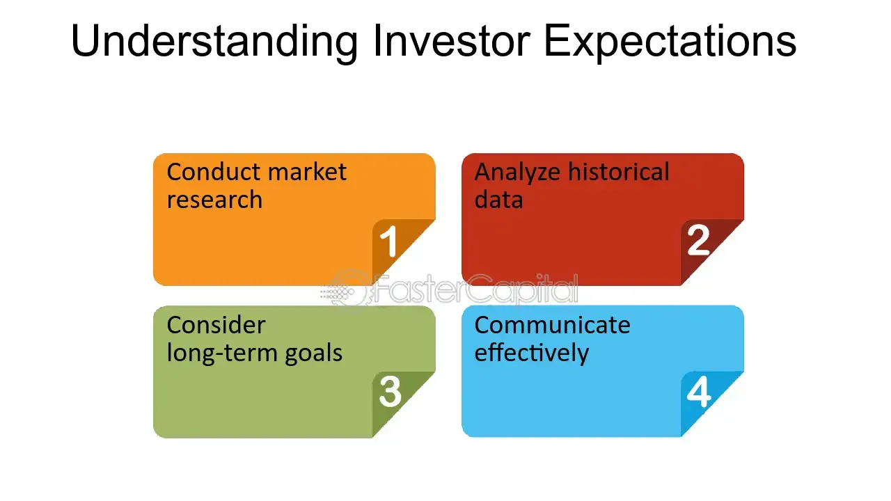

## Table of Contents

## What is target return in investment?

Target return in investment is a specific goal that an investor sets for their investment. It's like deciding how much money you want to make from your investment before you start. For example, if you invest $1000, you might set a target return of 10%, meaning you want to earn $100 on top of your original $1000.

This target helps investors choose the right investments and manage their expectations. Different investments have different levels of risk and potential returns. By setting a target return, investors can decide if a certain investment is worth the risk. If an investment's expected return is lower than the target, the investor might look for a different opportunity.

## How do investors set their expectations for returns?

Investors set their expectations for returns by looking at different things. They think about how much risk they are willing to take. Riskier investments might give higher returns, but they can also lose money. They also look at past returns of similar investments. If a type of investment has usually given a certain return in the past, investors might expect something similar in the future. But, past results don't always mean the same will happen again.

Another thing investors consider is their own financial goals. If they need a lot of money quickly, they might set a higher target return. But if they are saving for something far in the future, they might be okay with a lower return if it's safer. They also pay attention to what's happening in the economy and the world. If things are going well, they might expect higher returns. If things are uncertain, they might lower their expectations to be safer.

Lastly, investors often talk to financial advisors or use tools and research to help set their expectations. These resources can give them a better idea of what's realistic. By combining all these factors, investors can come up with a target return that fits their needs and the current situation.

## What factors influence target return rates?

Investors look at many things to decide their target return rates. One big thing is how much risk they want to take. Risky investments might offer higher returns, but they can also lose money. So, if an investor is okay with more risk, they might set a higher target return. Another thing they consider is what similar investments have done in the past. If an investment usually gives a certain return, investors might expect something close to that. But, they know that past results don't guarantee the future.

Investors also think about their own financial goals when setting target returns. If they need a lot of money fast, they might aim for a higher return. But if they are saving for something far away, they might be fine with a lower, safer return. They also look at what's happening in the economy and around the world. If things are going well, they might expect higher returns. If things are uncertain, they might lower their expectations to be safer.

Talking to financial advisors or using research tools can help investors set their target returns too. These resources can give them a better idea of what's realistic. By looking at all these factors together, investors can decide on a target return that fits their needs and the current situation.

## Can you explain the difference between expected return and target return?

Expected return is what an investor thinks they might get from an investment. It's like a guess based on what has happened before with similar investments. If you look at a stock and see it usually grows by 5% each year, you might expect it to do something like that again. But, remember, it's just a guess. The actual return could be more or less.

Target return is different. It's the specific amount of money an investor wants to make from their investment. It's like setting a goal. For example, if you invest $1000, you might set a target return of 10%, meaning you want to earn $100 on top of your original $1000. This target helps you decide which investments to choose and manage your expectations.

So, expected return is what you think might happen, while target return is what you hope will happen. Both are important for making smart investment choices, but they serve different purposes.

## How does risk tolerance affect investor expectations?

Risk tolerance is how much risk an investor is okay with. It's like deciding if you want to go on a wild roller coaster or a gentle ride. If an investor has a high risk tolerance, they're okay with the chance of losing money if it means they might make more. This means they might expect higher returns because they're willing to take bigger risks. They might invest in things like stocks or new businesses that can be unpredictable but offer big rewards.

On the other hand, if an investor has a low risk tolerance, they want to keep their money safe. They're not looking for the biggest returns, but they want to be sure they won't lose a lot. These investors might expect lower returns because they choose safer investments like bonds or savings accounts. Their expectations are more about protecting their money than growing it quickly. So, risk tolerance shapes what investors think they can get from their investments.

## What role do market conditions play in setting target returns?

Market conditions are really important when investors decide on their target returns. If the economy is doing well and things are stable, investors might feel good about setting higher target returns. They might think that businesses will grow and make more money, so their investments could do well too. But if the market is shaky or there's a lot of uncertainty, like during a recession or a big event, investors might lower their target returns. They know that it's riskier to invest in tough times, so they might aim for smaller, safer gains.

Investors also look at what's happening in specific parts of the market. For example, if technology stocks are doing great, someone investing in tech might set a higher target return. But if real estate is struggling, someone looking at property investments might set a lower target return. By paying attention to these market conditions, investors can set their target returns in a way that makes sense for the current situation.

## How are target returns used in portfolio management?

In portfolio management, target returns help investors decide which investments to pick and how much to put into each one. If an investor wants a certain amount of money from their investments, they'll look for things that can give them that return. They might mix different investments, like stocks, bonds, and real estate, to reach their target return. By setting a target, they can see if their portfolio is doing what they want it to do. If it's not, they might change things around to get closer to their goal.

Target returns also help investors keep an eye on their investments over time. If the market changes or their investments aren't doing well, they can compare what's happening to their target return. This helps them decide if they need to adjust their investments or maybe even change their target return. By using target returns, investors can make smarter choices and keep their portfolio working towards their financial goals.

## What are common benchmarks for measuring target returns?

Common benchmarks for measuring target returns are things that investors compare their investments to. One popular benchmark is the stock market index, like the S&P 500. If an investor wants to see how well their stocks are doing, they might compare their returns to the S&P 500. If their stocks do better than the index, they might feel good about their investments. Another benchmark is the risk-free rate, which is what you might get from very safe investments like government bonds. Investors use this to see if their riskier investments are worth it.

Another common benchmark is inflation. Investors want their money to grow faster than prices go up. So, they might set a target return that's higher than the inflation rate. This way, their money keeps its value over time. Some investors also look at industry-specific benchmarks. For example, if they invest in tech companies, they might compare their returns to a tech industry index. By using these benchmarks, investors can see if they're meeting their goals and make better decisions about their investments.

## How do different asset classes impact target return expectations?

Different types of investments, or asset classes, can change what investors expect to earn. Stocks are often riskier but can give higher returns. So, if an investor puts money into stocks, they might set a higher target return because they hope to make more money even though it's riskier. On the other hand, bonds are usually safer but give lower returns. If an investor chooses bonds, they might set a lower target return because they want to keep their money safe and are okay with smaller gains.

Real estate is another asset class that can affect target returns. It can offer steady income from rent and might grow in value over time. Investors in real estate might set a target return that's in the middle, not as high as stocks but higher than bonds. Each asset class has its own risks and rewards, so investors think about these when deciding what they want to earn from their investments. By understanding how different asset classes work, investors can set realistic target returns that match their goals and how much risk they're willing to take.

## What advanced strategies can investors use to achieve their target returns?

Investors can use a few smart strategies to reach their target returns. One way is called diversification. This means spreading money across different types of investments, like stocks, bonds, and real estate. By doing this, investors can lower their risk because if one investment does badly, the others might do well and balance it out. Another strategy is called rebalancing. This is when investors check their portfolio now and then and adjust it to keep it in line with their target returns. If one investment grows a lot, they might sell some of it and buy more of another to keep things balanced.

Another advanced strategy is using leverage. This means borrowing money to invest more than you have. It can help reach higher returns, but it's also riskier because if things go wrong, you could lose more money. Some investors also use hedging to protect their investments. Hedging is like buying insurance for your investments. For example, if you own a stock, you might buy an option that lets you sell it at a certain price, protecting you if the stock's price falls. By using these strategies, investors can work towards their target returns while managing risk.

## How does the concept of target return apply to institutional investors versus retail investors?

Institutional investors, like big companies or pension funds, often have specific target returns they need to meet. They manage a lot of money and have to think about what their investors expect. They use advanced strategies and tools to try to reach these targets. For example, they might use diversification to spread their investments across many different things, or they might use leverage to borrow money and invest more. They also have to think about rules and laws that might affect what they can do. So, their target returns are often set with a lot of planning and research to make sure they can meet their goals while managing risk.

Retail investors, like regular people saving for their future, also set target returns but usually in a simpler way. They might want to save for a house or retirement and set a target return based on what they need. They often use less complicated investments like stocks, bonds, or mutual funds. Retail investors might not have the same resources as institutional investors, so they might set more conservative targets and focus on safer investments. Their target returns help them decide where to put their money and check if they're on track to meet their financial goals.

## What are the psychological factors that influence investor expectations and target returns?

Psychological factors play a big role in how investors set their expectations and target returns. One important [factor](/wiki/factor-investing) is something called overconfidence. This is when investors think they know more than they really do and expect higher returns because they believe they can pick the best investments. Another factor is loss aversion, where investors are more scared of losing money than they are excited about making money. This can make them set lower target returns because they want to keep their money safe.

Another psychological factor is herd behavior. This is when investors follow what everyone else is doing, even if it might not be the best choice for them. If everyone is investing in a certain stock, an investor might set a high target return for it too, just because others are doing it. Lastly, there's something called the endowment effect, where investors value what they already own more than other investments. This can make them set different target returns for their current investments compared to new ones. Understanding these psychological factors can help investors set more realistic target returns and make better investment choices.

## What is Understanding Target Return?

Target return refers to the anticipated future profit from an investment, taking into account the time-value of money. This concept plays a crucial role in helping investors establish realistic financial goals by outlining a framework for expected profits. Target return differs from other financial models as it considers not only profitability but also the desired time period for realizing returns.

In financial terms, the time-value of money is the idea that a specific amount of money today is worth more than the same sum in the future due to its potential [earning](/wiki/earning-announcement) capacity. Therefore, the target return calculation often involves discount factors to account for this principle. A basic formula for the target return can be expressed as:

$$
\text{Target Return} = \frac{\text{Future Return}}{(1 + r)^n}
$$

where:
- $\text{Future Return}$ is the expected profit in the future,
- $r$ is the discount rate,
- $n$ is the number of periods until the returns are realized.

For investors, setting a target return involves not just predicting the monetary benefits, but also considering the specific timeline in which these benefits are to be realized. This element of time is what sets target return apart from other metrics like simple profit calculations, as it considers both the profitability and the chronology of the return.

In addition, target return serves as a benchmark against which investors can assess their investment decisions. By knowing how much return is expected and over what period, investors can make informed decisions about portfolio allocations and strategies. This framework helps in maintaining realistic expectations and provides a basis for evaluating performance.

In conclusion, understanding target return is essential for investors seeking to optimize their investment strategies. By fully grasping how future profits are discounted and realizing the importance of the time component, investors can better define their financial objectives and tailor their approaches accordingly.

## How do you calculate the return rate?

Return rate is a critical metric in evaluating an investment's performance, providing insight into how well an investment meets or exceeds initial expectations. Precise calculation methods of return rates are essential for accurate assessment and subsequent decision-making.

**Calculation Methods**

1. **Return on Investment (ROI)**: ROI is a straightforward metric that measures the gain or loss generated relative to the investment's cost. It is calculated using the formula:
$$
   \text{ROI} = \frac{\text{Net Profit}}{\text{Cost of Investment}} \times 100

$$

   Where Net Profit represents the difference between the final value and the initial cost of the investment. A higher ROI indicates more successful investment performance.

2. **Annualized Return Rates**: These provide a yearly geometric average of returns, allowing investors to compare performance over various time periods. The formula for annualized returns is:
$$
   \text{Annualized Return} = \left( \frac{\text{Ending Value}}{\text{Beginning Value}} \right)^{\frac{1}{n}} - 1

$$

   Here, $n$ represents the number of years the investment was held. This metric is crucial for assessing the long-term viability of investments.

3. **Adjusted Returns**: Inflation and taxes can significantly impact investment returns. Adjusted returns account for these factors and provide a clearer picture of an investment's real profitability. For inflation, the formula is:
$$
   \text{Real Return} = \frac{1 + \text{Nominal Return}}{1 + \text{Inflation Rate}} - 1

$$

   Similarly, tax-adjusted returns consider the taxation that applies to the invested income, further refining return calculations.

**Algorithmic Trading Tools**

Algorithmic trading provides sophisticated tools to automate return calculations, facilitating more informed investment decisions. Algorithms can continuously monitor market conditions and perform complex computations, including:

- Real-time analysis of ROI and annualized returns for active trading decisions.
- Adjustment of strategies based on inflation forecasts or changes in taxation laws.
- Simulation of investment scenarios to evaluate potential outcomes under different conditions.

For example, a Python script could automate return calculations as follows:

```python
def calculate_roi(net_profit, investment_cost):
    return (net_profit / investment_cost) * 100

def annualized_return(ending_value, beginning_value, years):
    return ((ending_value / beginning_value) ** (1 / years)) - 1

def real_return(nominal_return, inflation_rate):
    return ((1 + nominal_return) / (1 + inflation_rate)) - 1

# Example calculations
roi = calculate_roi(200, 1000)
annualized = annualized_return(1500, 1000, 3)
real_ret = real_return(0.08, 0.02)

print(f"ROI: {roi}%")
print(f"Annualized Return: {annualized:.2%}")
print(f"Real Return: {real_ret:.2%}")
```

By leveraging [algorithmic trading](/wiki/algorithmic-trading) and automated calculation tools, investors are better equipped to achieve their desired return rates with greater precision and confidence.

## References & Further Reading

[1]: Bergstra, J., Bardenet, R., Bengio, Y., & Kégl, B. (2011). ["Algorithms for Hyper-Parameter Optimization."](https://dl.acm.org/doi/10.5555/2986459.2986743) Advances in Neural Information Processing Systems 24.

[2]: ["Advances in Financial Machine Learning"](https://www.amazon.com/Advances-Financial-Machine-Learning-Marcos/dp/1119482089) by Marcos Lopez de Prado

[3]: ["Evidence-Based Technical Analysis: Applying the Scientific Method and Statistical Inference to Trading Signals"](https://www.amazon.com/Evidence-Based-Technical-Analysis-Scientific-Statistical/dp/0470008741) by David Aronson

[4]: ["Machine Learning for Algorithmic Trading"](https://github.com/stefan-jansen/machine-learning-for-trading) by Stefan Jansen

[5]: ["Quantitative Trading: How to Build Your Own Algorithmic Trading Business"](https://github.com/LucindaYa/quant-resources/blob/master/Quantitative%20Trading%20How%20to%20Build%20Your%20Own%20Algorithmic%20Trading%20Business.pdf) by Ernest P. Chan