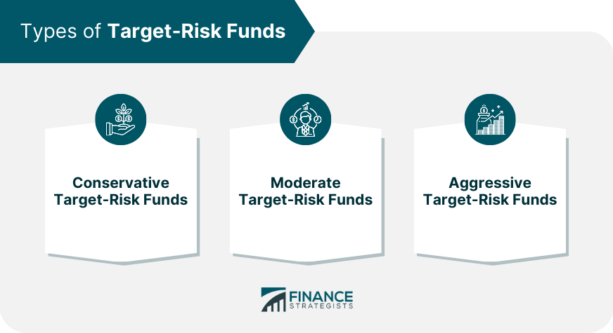

## Table of Contents

## What is a Target-Risk Fund?

A Target-Risk Fund is a type of investment fund designed to maintain a specific level of risk over time. This means that the fund's managers adjust the mix of investments, like stocks, bonds, and cash, to keep the overall risk level steady, no matter what's happening in the market. For example, if the fund aims for a moderate risk level, it might have a balanced mix of stocks and bonds that gets tweaked as needed.

These funds are popular because they help investors who want to keep their risk at a certain level without having to constantly watch and change their investments themselves. If you're someone who wants to invest but doesn't want to spend a lot of time managing your portfolio, a Target-Risk Fund could be a good choice. It's like setting your risk level on "cruise control" and letting the fund managers handle the adjustments.

## How does a Target-Risk Fund differ from a Target-Date Fund?

A Target-Risk Fund and a Target-Date Fund are both investment options, but they work differently. A Target-Risk Fund focuses on keeping the risk level the same over time. It might be set to a low, moderate, or high risk, and the fund managers will adjust the investments to keep that risk level steady. This means if you're okay with a certain amount of risk, this fund will try to stick to that no matter what's happening in the market.

On the other hand, a Target-Date Fund is all about when you plan to use the money, like for retirement. It starts with a mix of investments that might be riskier when you're young and have time to ride out market ups and downs. As the target date gets closer, the fund automatically shifts to safer investments like bonds. So, if you're planning to retire in 2040, a 2040 Target-Date Fund will gradually become less risky as that year approaches.

In short, a Target-Risk Fund is about maintaining a chosen risk level, while a Target-Date Fund is about adjusting risk based on how close you are to your goal date. Both can be good choices, but they serve different needs. If you want a steady risk level, go for a Target-Risk Fund. If you want your investments to get safer as you near a specific date, a Target-Date Fund might be better.

## What are the different risk levels typically offered by Target-Risk Funds?

Target-Risk Funds usually come in three main risk levels: low, moderate, and high. A low-risk fund focuses on safer investments like bonds and cash, aiming to protect your money while still [earning](/wiki/earning-announcement) a bit of interest. This is good if you don't want to take big chances with your money. A moderate-risk fund mixes stocks and bonds to balance growth and safety. It's a middle-of-the-road choice if you're okay with some ups and downs but still want some stability. A high-risk fund is mostly made up of stocks, which can grow a lot but also drop a lot. This is for people who are willing to take bigger risks for the chance of bigger rewards.

Some Target-Risk Funds might also offer other levels like conservative or aggressive, but they all fit into the basic low, moderate, and high categories. The key thing is to pick the level that matches how much risk you're comfortable with. If you're not sure, you might start with a moderate fund and adjust later as you learn more about how much risk you can handle.

## How do Target-Risk Funds manage asset allocation?

Target-Risk Funds manage asset allocation by keeping the mix of investments like stocks, bonds, and cash at a level that matches the risk you want. If you pick a low-risk fund, the managers will put more money into safer things like bonds and cash. If you go for a high-risk fund, they'll invest more in stocks which can go up and down a lot. The goal is to keep the risk level steady, so the managers will check the fund often and make changes if needed to keep it on track.

For example, if the stock market goes up a lot and the fund's risk level gets too high, the managers might sell some stocks and buy more bonds to bring the risk back down. They do this to make sure the fund stays in line with what you signed up for, whether that's low, moderate, or high risk. It's like having someone always watching your investments to keep them at the right risk level for you.

## What are the benefits of investing in a Target-Risk Fund?

Investing in a Target-Risk Fund can be a good choice if you want to keep your risk level steady. These funds are managed by professionals who watch the markets and adjust the mix of investments like stocks and bonds to keep the risk the same. This means you don't have to worry about changing your investments yourself. If you're someone who doesn't want to spend a lot of time managing your money, a Target-Risk Fund can do that work for you.

Another benefit is that you can pick the risk level that feels right for you. Whether you want a low, moderate, or high risk, there's a fund for that. This way, you can invest in a way that matches how much risk you're comfortable with. It's like choosing a setting that fits your personality and financial goals, and then letting the fund take care of the rest.

## What are the potential risks associated with Target-Risk Funds?

Even though Target-Risk Funds try to keep the risk level steady, they still have risks. One risk is that the fund's idea of "steady" might not match what you think. If the market changes a lot, the fund might still go up and down more than you expect. Also, the fund managers have to guess which investments will keep the risk level the same, and they might not always guess right. If they make bad choices, the fund could lose money even if it's supposed to be at a certain risk level.

Another risk is that fees can eat into your returns. All funds have fees, and Target-Risk Funds are no different. These fees can be for managing the fund or for buying and selling investments. If the fees are high, they can take a big chunk out of what you earn. So, even if the fund keeps the risk level steady, the fees might make it less profitable than you hoped. It's important to check the fees before you invest to make sure they're not too high.

## How can an investor choose the right Target-Risk Fund?

Choosing the right Target-Risk Fund means thinking about how much risk you're okay with. Do you want a fund that's low risk, where your money is safer but might not grow as much? Or are you okay with a high-risk fund that could grow a lot but also might lose value? Look at your goals and how soon you'll need the money. If you're saving for something far away, you might pick a higher risk fund. But if you'll need the money soon, a lower risk fund might be better.

Once you know your risk level, check the fees. All funds have fees, and they can take away from what you earn. Look for a fund with low fees so more of your money stays in your pocket. Also, think about the fund company. Are they good at what they do? Do they have a good track record? Reading about the company and looking at how their funds have done in the past can help you pick a good one. It's like choosing a team you trust to manage your money.

## What role do Target-Risk Funds play in a diversified investment portfolio?

Target-Risk Funds can be a useful part of a diversified investment portfolio because they help you keep your risk level steady. If you want to balance out other investments that might be riskier or safer, a Target-Risk Fund can fit right in. For example, if you have some money in stocks that can go up and down a lot, adding a Target-Risk Fund set to a moderate or low risk level can help smooth things out. This way, you're not putting all your eggs in one basket, and you have a mix of investments that work together to reach your goals.

Another way Target-Risk Funds help with diversification is by letting you pick a risk level that matches your comfort zone. If you're someone who likes to play it safe, you can choose a low-risk fund. If you're okay with taking bigger chances, a high-risk fund might be right for you. By having different kinds of investments, like a Target-Risk Fund alongside other types of funds or individual stocks and bonds, you spread out your risk. This can make your overall portfolio stronger and more likely to grow over time, no matter what's happening in the market.

## How do fees and expenses impact the performance of Target-Risk Funds?

Fees and expenses can really affect how well a Target-Risk Fund does. Every fund has costs to run it, like paying the people who manage it or the costs of buying and selling investments. These fees come out of the money in the fund, which means less money is left to grow for you. If the fees are high, they can eat into your returns a lot. So, even if the fund keeps the risk level steady like it's supposed to, high fees might make it so you don't earn as much as you hoped.

Picking a Target-Risk Fund with lower fees can help you keep more of your money. It's a good idea to look at the expense ratio, which tells you how much the fund costs each year as a percentage of your investment. A lower expense ratio means more of your money stays in your pocket. When you're choosing a fund, comparing the fees can help you find one that will let your money grow better over time.

## Can the risk profile of a Target-Risk Fund change over time, and if so, how?

The risk profile of a Target-Risk Fund is meant to stay the same over time. When you pick a low, moderate, or high-risk fund, the managers work to keep it at that level. They do this by changing the mix of investments, like stocks and bonds, to match the risk you want. But even though they try to keep things steady, the risk can still change a little because of what's happening in the market.

Sometimes, big changes in the market can make the fund's risk level go up or down a bit. If the stock market goes crazy, even a low-risk fund might feel a bit more risky than usual. The managers will do their best to fix this by selling some stocks and buying more bonds, but it might take a little time. So, while the goal is to keep the risk the same, the real world can make it shift a bit.

## What are the tax implications of investing in Target-Risk Funds?

When you invest in a Target-Risk Fund, you need to think about taxes. These funds can create taxable events when they buy and sell investments inside the fund. If the fund makes money by selling stocks or bonds at a profit, that's called a capital gain. The fund might pass these gains onto you, and you'll have to pay taxes on them. The tax rate depends on how long the fund held the investment before selling it. If it was less than a year, it's a short-term capital gain, which is taxed at your regular income tax rate. If it was more than a year, it's a long-term capital gain, which usually has a lower tax rate.

Also, if the fund earns interest from bonds or dividends from stocks, you might have to pay taxes on that income too. Interest from bonds is usually taxed as ordinary income, while qualified dividends from stocks might be taxed at the lower long-term capital gains rate. It's a good idea to keep an eye on the tax forms the fund sends you, like the 1099-DIV, which will show you what you owe taxes on. Remember, the tax rules can be different depending on where you live, so it might help to talk to a tax advisor to make sure you're doing everything right.

## How do Target-Risk Funds perform compared to other investment vehicles during different market conditions?

Target-Risk Funds are designed to keep a steady level of risk, so how they do compared to other investments can change depending on what's happening in the market. In good times, when the stock market is going up, a high-risk Target-Risk Fund might do well because it has more stocks. But it might not do as well as a fund that's all stocks because it also has some safer investments like bonds to keep the risk level the same. On the other hand, a low-risk Target-Risk Fund might not grow as much because it's focused on safer investments, but it could still do better than something like a savings account.

In bad times, when the stock market is going down, a low-risk Target-Risk Fund can help protect your money better than a fund that's all stocks. It might lose less money because it has more bonds and cash, which are safer. A high-risk Target-Risk Fund might drop more than a low-risk one, but it could still be safer than a fund that's all stocks because it has some bonds to balance things out. Overall, Target-Risk Funds try to give you a balance between growth and safety no matter what's happening in the market.

## What is Risk Management in Target-Risk Funds?

Managing risk in target-risk funds is a structured process that is crucial for ensuring the stability and predictability of these investment vehicles. The primary objective of a target-risk fund is to uphold a predetermined level of risk exposure, thereby offering investors a reliable instrument for long-term financial planning.

To achieve this consistency, fund managers engage in a continuous process of rebalancing the fund's assets. This involves adjusting the allocation of the portfolio's investments to correspond with the desired risk profile. By doing so, fund managers can respond to market fluctuations and economic shifts while maintaining the fund's set risk level. The formula for portfolio rebalancing can be conceptualized using mathematical optimization to minimize the deviation from the target risk level:

$$

\min\ \| R - R_T \| 
$$

where $R$ represents the actual risk of the portfolio, and $R_T$ is the target risk level.

Rebalancing is done periodically and could be triggered by significant changes in market conditions or asset values. This proactive management reduces the impact of market [volatility](/wiki/volatility-trading-strategies), thus providing a smoother investment experience. Moreover, rebalancing not only conserves the risk exposure but also capitalizes on the "buy low, sell high" strategy, which can enhance overall portfolio returns.

For investors, target-risk funds offer the advantage of predictable risk exposure. This predictability simplifies the planning of long-term financial goals, such as retirement planning or saving for education, as investors can have confidence in the risk-return profile of their investment. The strategy aligns well with risk-averse investors who prefer stability over unexpected fluctuations in their investment portfolios.

In conclusion, the diligent rebalancing of target-risk funds serves as a foundation for effectively managing risk while providing investors with a reliable path for achieving their financial objectives.

## References & Further Reading

[1]: ["Advances in Financial Machine Learning"](https://www.amazon.com/Advances-Financial-Machine-Learning-Marcos/dp/1119482089) by Marcos Lopez de Prado

[2]: ["Evidence-Based Technical Analysis: Applying the Scientific Method and Statistical Inference to Trading Signals"](https://www.amazon.com/Evidence-Based-Technical-Analysis-Scientific-Statistical/dp/0470008741) by David Aronson

[3]: ["Machine Learning for Algorithmic Trading"](https://github.com/stefan-jansen/machine-learning-for-trading) by Stefan Jansen

[4]: ["Quantitative Trading: How to Build Your Own Algorithmic Trading Business"](https://www.amazon.com/Quantitative-Trading-Build-Algorithmic-Business/dp/1119800064) by Ernest P. Chan