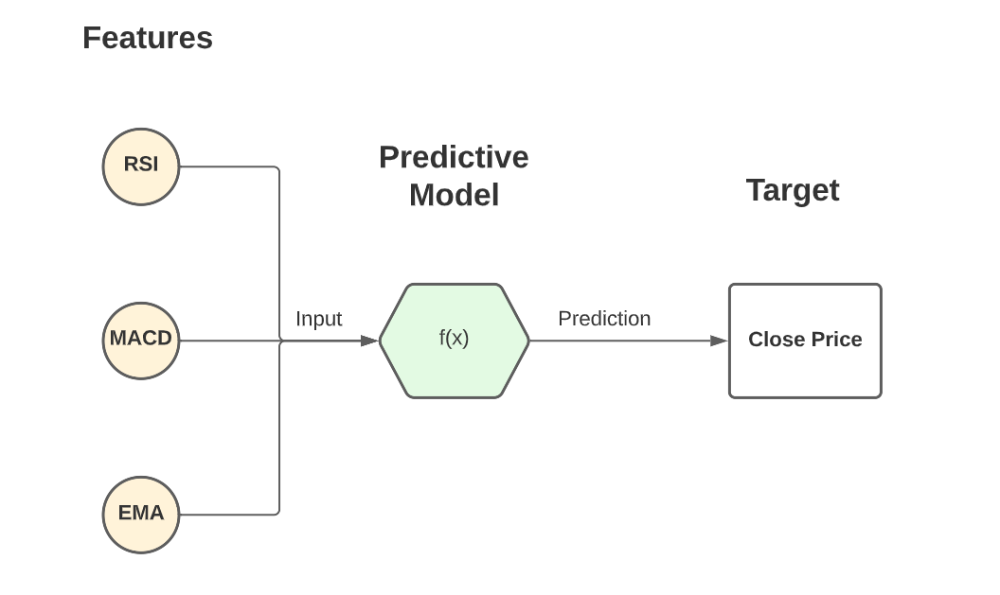

## Table of Contents

## What is target machine learning?

Target machine learning is a type of machine learning where the goal is to predict a specific outcome, called the target variable. This target variable can be something like whether an email is spam or not, the price of a house, or if a patient has a certain disease. The machine learning model uses data, called features, to learn patterns and make these predictions. For example, to predict house prices, features might include the size of the house, its location, and the number of bedrooms.

In target machine learning, the data is split into two parts: a training set and a test set. The training set is used to teach the model how to predict the target variable based on the features. Once the model is trained, it is tested on the test set to see how well it can predict new, unseen data. If the model performs well on the test set, it can be used to make predictions on new data. This process helps ensure that the model is not just memorizing the training data but is actually learning useful patterns that can be applied more generally.

## Why is the target variable important in machine learning?

The target variable is important in machine learning because it is what the model is trying to predict. Imagine you're trying to guess the weather for tomorrow. The target variable would be "rain" or "no rain." The model uses information like today's temperature and humidity to make its guess. Without a clear target variable, the model wouldn't know what to focus on, and it wouldn't be able to learn anything useful.

In more technical terms, the target variable helps the model understand the relationship between the input features and the desired output. For example, if you're predicting house prices, the target variable is the price, and the features might be the number of bedrooms, the size of the house, and its location. The model learns how these features influence the price. This learning process is guided by how well the model can predict the target variable. If the model can predict the target variable accurately, it means it has learned the important patterns in the data.

## How do you select a target variable for a machine learning model?

Selecting a target variable for a [machine learning](/wiki/machine-learning) model starts with understanding the problem you want to solve. If you're trying to predict whether it will rain tomorrow, the target variable would be "rain" or "no rain." You need to think about what you want the model to guess at the end. This could be something like the price of a house, whether an email is spam, or if a patient has a certain disease. The target variable should be something that can be clearly defined and measured, so the model knows exactly what it's aiming to predict.

Once you have a clear idea of the problem, you should look at the data you have available. The target variable must be present in your dataset, and it should be relevant to the features you plan to use. For example, if you're predicting house prices, your data should include the actual prices of houses, along with details like the number of bedrooms and the location. It's important that the target variable is something your data can help the model learn about. If the target variable isn't well-connected to the features, the model might not be able to make good predictions.

## What are the common types of target variables in machine learning?

In machine learning, target variables can be of different types, but the most common ones are categorical and numerical. A categorical target variable is one that has distinct categories, like "yes" or "no," "spam" or "not spam," or different types of fruits like "apple," "banana," and "orange." These are often used in classification problems, where the goal is to put new data into one of these categories. For example, if you're trying to predict if an email is spam, the target variable would be "spam" or "not spam."

A numerical target variable, on the other hand, is a number, like the price of a house or the temperature tomorrow. These are used in regression problems, where the goal is to predict a specific number. For example, if you're trying to predict house prices, the target variable would be the price in dollars. In both cases, the target variable guides the model in learning from the data and making predictions.

Sometimes, target variables can be more complex. For instance, in multi-label classification, the target variable can have multiple categories at the same time. If you're predicting the genres of a movie, it could be both "action" and "comedy." In ordinal regression, the target variable has an order, like ratings from 1 to 5 stars. Understanding the type of target variable is key to choosing the right kind of model and making sure it can learn effectively from the data.

## How does the choice of target variable affect model performance?

The choice of target variable is like [picking](/wiki/asset-class-picking) the goal for your machine learning model. If you pick a target variable that is closely related to the features you have, the model can learn the patterns well and make good predictions. For example, if you're trying to predict house prices and you use the number of bedrooms and the size of the house as features, the model can learn how these things affect the price. But if you pick a target variable that doesn't have much to do with your features, the model might struggle to find useful patterns and won't predict well.

The type of target variable also matters a lot. If your target variable is categorical, like "yes" or "no," you'll use a different kind of model than if it's a number, like a house price. Using the wrong type of model can lead to poor performance. For example, if you try to use a model meant for numbers to predict categories, it might not work well. So, choosing the right target variable and the right type of model for it is key to making sure your machine learning model performs its best.

## What are the challenges in defining a good target variable?

Picking a good target variable can be tricky. One challenge is making sure the target variable is something you can clearly measure and that it fits well with the data you have. If you pick a target variable that is too hard to measure or doesn't relate well to your features, your model might not learn anything useful. For example, if you're trying to predict if someone will like a movie, and you only have data about the weather, the target variable "will like movie" won't work well because the weather doesn't tell you much about movie preferences.

Another challenge is choosing the right type of target variable. If you pick a categorical target variable like "yes" or "no" when you should be using a numerical one like a price, your model might not perform well. This is because different types of models are better at handling different types of target variables. For instance, using a model meant for numbers to predict categories can lead to bad results. So, understanding the nature of your problem and the data you have is key to defining a good target variable that will help your model learn and predict accurately.

## How can you handle imbalanced target variables in machine learning?

Imbalanced target variables happen when one category in your data shows up a lot more than others. For example, if you're trying to predict if an email is spam, you might have way more "not spam" emails than "spam" ones. This can make it hard for your model to learn about the less common category, like "spam," because it doesn't see it often enough. To fix this, you can use a technique called resampling. Resampling means changing the number of examples in each category to make them more even. You can do this by either adding more examples of the less common category (oversampling) or by removing some examples from the more common category (undersampling).

Another way to handle imbalanced target variables is by using different weights for different categories. This means you tell the model to pay more attention to the less common category. For example, if "spam" emails are rare, you can make the model care more about getting those right. You can do this by setting class weights, which are like telling the model, "Hey, these examples are more important, so focus on them." In some models, you can set these weights directly. For example, in a logistic regression model, you might use a parameter like `class_weight` to make the model care more about the less common category. This can help the model learn better and make more accurate predictions for all categories, not just the most common one.

## What techniques can be used to improve the prediction of the target variable?

To improve the prediction of the target variable, one effective technique is feature engineering. This means creating new features or modifying existing ones to help the model learn better patterns. For example, if you're predicting house prices, you might combine the number of bedrooms and the size of the house into a new feature called "bedroom density." This new feature can help the model see important patterns more clearly. Another technique is to use more advanced models like Random Forests or Gradient Boosting Machines, which can capture complex relationships in the data better than simpler models like linear regression.

Another way to boost prediction accuracy is by using cross-validation. This involves splitting your data into different parts and training the model multiple times, each time using a different part of the data for testing. This helps you see how well the model performs on different slices of the data and can prevent overfitting, where the model learns the training data too well but doesn't predict new data accurately. You can also try ensemble methods, where you combine the predictions of multiple models to get a better overall prediction. For example, you might use a technique called "bagging" where you train several models on different subsets of the data and then average their predictions to get a final result. This can often lead to more accurate predictions than using a single model.

## How do you evaluate the performance of a model based on the target variable?

To evaluate how well a model predicts the target variable, you need to look at different measures that tell you how accurate the model is. If your target variable is categorical, like "yes" or "no," you might use accuracy, which is the percentage of correct predictions. But accuracy can be misleading if your data is imbalanced, so you might also use precision, recall, and the F1 score. Precision tells you how many of the positive predictions were actually correct, recall tells you how many of the actual positives were caught by the model, and the F1 score is a balance between precision and recall. If your target variable is numerical, like a house price, you might use the Mean Absolute Error (MAE) or the Root Mean Squared Error (RMSE). MAE is the average of the absolute differences between the predicted and actual values, while RMSE gives more weight to larger errors.

To get these measures, you split your data into a training set and a test set. You train the model on the training set and then use it to make predictions on the test set. By comparing these predictions to the actual values in the test set, you can calculate the performance measures. For example, if you're using accuracy for a categorical target variable, you'd count how many predictions were correct and divide by the total number of predictions. For numerical target variables, you'd calculate the difference between each prediction and the actual value, then use these differences to find the MAE or RMSE. This process helps you see how well your model can predict new, unseen data, which is crucial for knowing if your model will work well in the real world.

## What is the impact of changing the target variable on an existing model?

Changing the target variable in an existing model can have a big impact. It's like changing the goal of the game while you're already playing. If you switch from predicting if an email is spam to predicting the price of a house, the model has to learn a whole new set of patterns. The features that were important for predicting spam, like the words in the email, might not help much when predicting house prices. So, you might need to change the features you use or even the type of model you're using. For example, if you switch from a categorical target variable like "spam" or "not spam" to a numerical one like house prices, you might need to switch from a classification model to a regression model.

This change can also affect how well the model performs. When you change the target variable, the model has to start learning from scratch, which can take time and might not work as well right away. You might need to do more work to find the right features and tune the model to get good predictions again. If the new target variable is not well-connected to the data you have, the model might struggle to find useful patterns and won't predict as accurately. So, changing the target variable is a big decision that can shake up how your model works and how well it predicts.

## How can feature engineering influence the effectiveness of the target variable?

Feature engineering can make a big difference in how well a model predicts the target variable. When you create new features or change existing ones, you're giving the model more or better information to work with. For example, if you're trying to predict house prices, just knowing the number of bedrooms might not be enough. But if you create a new feature called "bedroom density" by dividing the number of bedrooms by the size of the house, the model can see patterns more clearly. This new feature helps the model understand how crowded the house is, which can affect its price. By making these smart changes to the features, you help the model learn better and make more accurate predictions about the target variable.

On the other hand, if you don't do good feature engineering, the model might miss important patterns and struggle to predict the target variable well. Imagine you're trying to predict if someone will like a movie, but you only have data about the weather. The target variable "will like movie" won't be well predicted because the weather doesn't tell you much about movie preferences. By adding or changing features to include things like the movie's genre or the person's past movie ratings, you give the model the right kind of information to learn from. So, feature engineering is key to making sure the model has the best chance of understanding and predicting the target variable accurately.

## What advanced methods exist for optimizing the target variable in complex machine learning models?

One advanced method for optimizing the target variable in complex machine learning models is using techniques like target encoding. This method turns categorical variables into numbers that can help the model predict the target variable better. For example, if you're trying to predict house prices and one of your features is the neighborhood, you can use target encoding to give each neighborhood a number based on the average price of houses in that area. This helps the model see the relationship between neighborhoods and prices more clearly, which can lead to better predictions. You can do target encoding by calculating the mean of the target variable for each category and then using those means as new features.

Another advanced method is using ensemble techniques to improve predictions. Ensemble methods combine the predictions of multiple models to get a better overall prediction. For example, you might use a technique called "stacking," where you train several different models and then use another model to combine their predictions. This can help capture different patterns in the data and make more accurate predictions about the target variable. By using ensemble methods, you can make sure that your model is not missing any important patterns and is using all the information available to predict the target variable as well as possible.

## References & Further Reading

[1]: Géron, A. (2019). [Hands-On Machine Learning with Scikit-Learn, Keras, and TensorFlow: Concepts, Tools, and Techniques to Build Intelligent Systems](https://www.academia.edu/43840124/Hands_On_Machine_Learning_with_Scikit_Learn_Keras_and_TensorFlow_SECOND_EDITION_Concepts_Tools_and_Techniques_to_Build_Intelligent_Systems). O'Reilly Media.

[2]: Murphy, K. P. (2012). [Machine Learning: A Probabilistic Perspective](https://www.cs.ubc.ca/~murphyk/MLbook/pml-toc-1may12.pdf). MIT Press.

[3]: Bishop, C. M. (2006). [Pattern Recognition and Machine Learning](https://www.cs.uoi.gr/~arly/courses/ml/tmp/Bishop_book.pdf). Springer.

[4]: Hastie, T., Tibshirani, R., & Friedman, J. H. (2009). [The Elements of Statistical Learning: Data Mining, Inference, and Prediction](https://link.springer.com/book/10.1007/978-0-387-84858-7). Springer.

[5]: James, G., Witten, D., Hastie, T., & Tibshirani, R. (2013). [An Introduction to Statistical Learning: with Applications in R](https://link.springer.com/book/10.1007/978-1-0716-1418-1). Springer. 

[6]: Kuhn, M., & Johnson, K. (2013). [Applied Predictive Modeling](https://link.springer.com/book/10.1007/978-1-4614-6849-3). Springer.

[7]: Aggarwal, C. C. (2015). [Data Mining: The Textbook](https://link.springer.com/book/10.1007/978-3-319-14142-8). Springer.

[8]: Domingos, P. (2015). [The Master Algorithm: How the Quest for the Ultimate Learning Machine Will Remake Our World](https://www.redalyc.org/pdf/6380/638067264018.pdf). Basic Books.