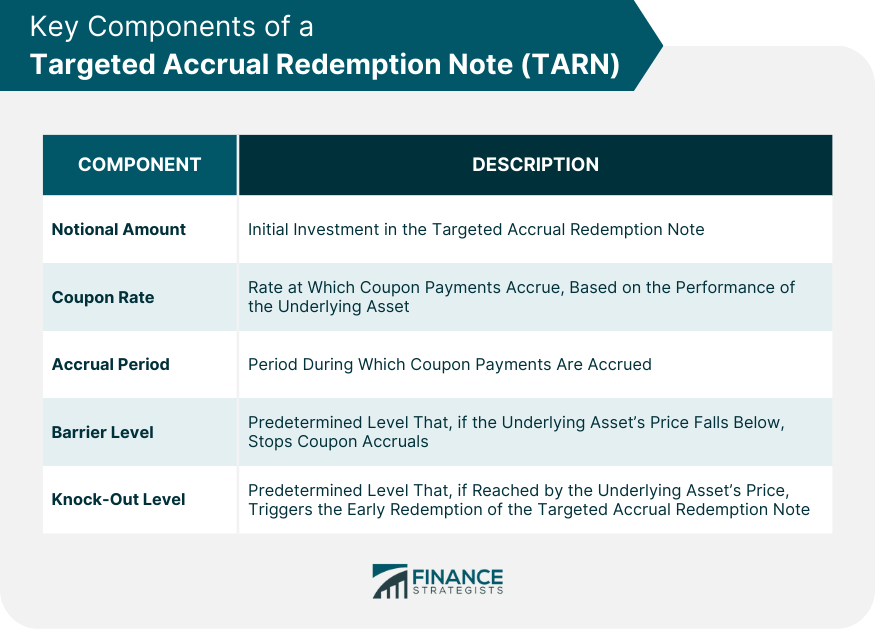

## Table of Contents

## What is a Targeted Accrual Redemption Note (TARN)?

A Targeted Accrual Redemption Note (TARN) is a type of financial product that combines features of bonds and options. It is designed to provide investors with a specific return over a set period. The TARN pays out a fixed interest rate until it reaches a predetermined target amount, at which point it matures early. If the target is not reached within the set time frame, the note continues to pay interest until the end of its term.

TARNs are often linked to the performance of an underlying asset, like a currency exchange rate or an interest rate. If the underlying asset moves in a favorable direction, the note can reach its target quickly, leading to early redemption. However, if the asset moves unfavorably, the note might not reach its target, and investors could end up with lower returns than expected. This makes TARNs a complex and potentially risky investment, suitable mainly for experienced investors who understand the associated risks and rewards.

## How does a TARN work?

A Targeted Accrual Redemption Note (TARN) is a special kind of investment that mixes parts of bonds and options. It's set up to give investors a certain amount of money over time. The TARN pays a fixed interest rate until it hits a target amount. Once it reaches that target, the note ends early, and the investor gets their money back plus the interest earned. If the target isn't reached within the set time, the note keeps paying interest until the end of its term.

TARNs are often tied to things like currency exchange rates or interest rates. If these rates move in a good way for the investor, the note can hit its target quickly, and the investor gets their money back sooner. But if the rates move in a bad way, the note might not reach its target, and the investor could end up with less money than they hoped for. This makes TARNs tricky and risky, so they're usually best for people who know a lot about investing and understand the risks involved.

## What are the key features of a TARN?

A Targeted Accrual Redemption Note (TARN) is a special kind of investment that mixes features of bonds and options. It's designed to give investors a certain amount of money over time. The TARN pays a fixed [interest rate](/wiki/interest-rate-trading-strategies) until it reaches a target amount. Once it hits that target, the note ends early, and the investor gets their money back plus the interest earned. If the target isn't reached within the set time, the note keeps paying interest until the end of its term.

TARNs are often linked to things like currency exchange rates or interest rates. If these rates move in a good way for the investor, the note can reach its target quickly, and the investor gets their money back sooner. But if the rates move in a bad way, the note might not reach its target, and the investor could end up with less money than they hoped for. This makes TARNs tricky and risky, so they're usually best for people who know a lot about investing and understand the risks involved.

## Who typically invests in TARNs?

TARNs are usually invested in by people who know a lot about finance and are willing to take risks. These investors often work for big banks, hedge funds, or other financial companies. They understand how TARNs work and are okay with the chance that they might not get as much money back as they hoped.

These investors like TARNs because they can offer high returns if things go well. But they also know that if the market doesn't move in the right way, they could lose money. That's why TARNs are not for everyone, but for those who understand the risks and rewards, they can be a good choice.

## What are the potential benefits of investing in a TARN?

Investing in a TARN can offer high returns if things go well. If the market moves in the right way, the TARN can reach its target quickly, and you get your money back plus the interest you earned. This means you could make more money in a shorter time than with other investments. It's like getting a bonus for [picking](/wiki/asset-class-picking) the right investment at the right time.

But TARNs are not for everyone. They are best for people who know a lot about finance and are okay with taking risks. If the market doesn't move in the right way, you might not reach the target, and you could end up with less money than you hoped for. So, while TARNs can be a good choice for some, they come with risks that you need to understand before investing.

## What are the risks associated with TARNs?

Investing in TARNs can be risky because they depend a lot on how the market moves. If the market doesn't go the way you expect, the TARN might not reach its target amount. This means you could end up with less money than you hoped for, or even lose some of your investment. It's like betting on a horse race; if your horse doesn't win, you don't get the big prize.

Another risk is that TARNs are complex and hard to understand. They mix features of bonds and options, which can be confusing even for people who know a lot about finance. If you don't fully understand how a TARN works, you might make a bad investment choice. It's important to really know what you're getting into before you invest in a TARN, because the risks can be high if things don't go as planned.

## How is the payoff structure of a TARN determined?

The payoff structure of a TARN is based on how well it does compared to a target amount. The TARN pays a fixed interest rate until it reaches this target. If the market moves in a good way, the TARN can hit the target quickly, and then it ends early. When it ends, you get your money back plus all the interest you earned. It's like getting a bonus for picking the right investment at the right time.

But if the market doesn't move in the right way, the TARN might not reach the target. If that happens, it keeps paying interest until the end of its term. At the end, you get your money back, but you might not get as much interest as you hoped for. This makes TARNs tricky because the payoff depends a lot on how the market moves, and it can be hard to predict.

## Can you explain the role of the accrual cap in a TARN?

The accrual cap in a TARN is like a limit on how much interest you can earn. It's there to stop the TARN from paying out too much money if the market moves in a really good way. If the interest you earn hits this cap, the TARN will end early, and you get your money back plus the interest up to the cap. It's like a safety net for the people who made the TARN, so they don't have to pay out more than they planned.

This cap can be a bit tricky for investors. If the market is doing really well, you might not get all the interest you could have because of the cap. It's important to know about this cap before you invest in a TARN, so you understand how much money you might make. The accrual cap is a key part of how TARNs work, and it can affect how much you earn from your investment.

## How do interest rate movements affect a TARN's performance?

Interest rate movements can really change how well a TARN does. If interest rates move in a good way for the TARN, it can reach its target amount faster. This means the TARN ends early, and you get your money back plus the interest you earned. It's like getting a bonus for picking the right investment at the right time. But if interest rates move in a bad way, the TARN might not reach its target. If that happens, it keeps paying interest until the end of its term, and you might not get as much money as you hoped for.

Because TARNs are tied to interest rates, they can be tricky. If you think interest rates will go up or down in a certain way, you might choose to invest in a TARN. But if the rates don't move like you thought, you could end up with less money. That's why it's important to really understand how interest rates work and how they might affect your TARN before you invest.

## What are the tax implications of investing in a TARN?

Investing in a TARN can have different tax effects depending on where you live and how the TARN is set up. In many places, the interest you earn from a TARN is taxed as regular income. This means you'll have to pay taxes on the interest every year, even if you don't get your money back until the TARN ends. It's like getting a paycheck; you have to pay taxes on it even if you don't spend it right away.

If the TARN ends early and you get your money back, you might also have to pay taxes on any profit you made. This is called capital gains tax. The rules for this can be different depending on how long you held the TARN and the tax laws in your country. It's important to talk to a tax advisor to understand exactly how a TARN will affect your taxes, because the rules can be complicated and change from one place to another.

## How do TARNs compare to other structured notes?

TARNs are a type of structured note, but they have some special features that set them apart from others. Like other structured notes, TARNs mix parts of bonds and options to give investors a certain return over time. But TARNs have a target amount that, if reached, makes the note end early. This means you could get your money back sooner if things go well. Other structured notes might not have this early redemption feature, and they might be tied to different things like stock prices or commodity prices instead of just interest rates or currency exchange rates.

Another big difference is that TARNs have an accrual cap, which limits how much interest you can earn. This cap can make TARNs less risky for the people who make them, but it can also mean you don't get as much money as you could if the market does really well. Other structured notes might not have this cap, so they could offer higher returns if the market moves in the right way. But they can also be riskier because there's no limit on how much you might lose if things go badly. So, while TARNs and other structured notes share some features, the target amount and accrual cap make TARNs unique and can affect how much money you make or lose.

## What advanced strategies can be used to optimize returns from TARNs?

To optimize returns from TARNs, investors can use a strategy called hedging. This means they buy or sell other investments that move in the opposite way to the TARN. If the TARN doesn't do well because of interest rate changes, the other investments might go up in value, helping to balance out any losses. It's like having a backup plan to protect your money. Hedging can be tricky and needs a good understanding of the market, but it can help make your TARN investment safer and possibly more profitable.

Another strategy is to use market timing. This means trying to guess when interest rates or currency exchange rates will move in a good way for the TARN. If you think rates will go up soon, you might buy a TARN that benefits from that. But if you think rates will go down, you might wait or choose a different investment. Market timing is hard to get right, and it's a bit like gambling, but if you're good at it, you can make more money from your TARN. Both hedging and market timing need a lot of knowledge and experience, so they're best for people who really know what they're doing.

## References & Further Reading

[1]: Nassr, I., & Weistroffer, C. (2015). ["Retail Investors and Structured Retail Products"](https://www.sciencedirect.com/science/article/pii/S2214635017300941). OECD Journal: Financial Market Trends.

[2]: Fabozzi, F. J. (2008). ["Handbook of Fixed Income Securities."](https://www.amazon.com/Handbook-Fixed-Income-Securities-Ninth/dp/1260473899) McGraw-Hill Education.

[3]: Clunie, J., Nikkinnen, J., & Puttonen, V. (2012). ["Structured Products in Wealth Management"](https://www.researchgate.net/publication/351993418_Impact_of_Working_Capital_Management_on_Profitability_Empirical_evidence). Palgrave Macmillan.

[4]: Chan, E. (2009). ["Quantitative Trading: How to Build Your Own Algorithmic Trading Business"](https://github.com/ftvision/quant_trading_echan_book). Wiley.

[5]: Chan, E. (2013). ["Algorithmic Trading: Winning Strategies and Their Rationale"](https://github.com/ftvision/quant_trading_echan_book). Wiley.

[6]: López de Prado, M. (2018). ["Advances in Financial Machine Learning"](https://www.amazon.com/Advances-Financial-Machine-Learning-Marcos/dp/1119482089). Wiley. 

[7]: Jansen, S. (2018). ["Machine Learning for Algorithmic Trading: Second Edition"](https://github.com/PacktPublishing/Machine-Learning-for-Algorithmic-Trading-Second-Edition). Packt Publishing.