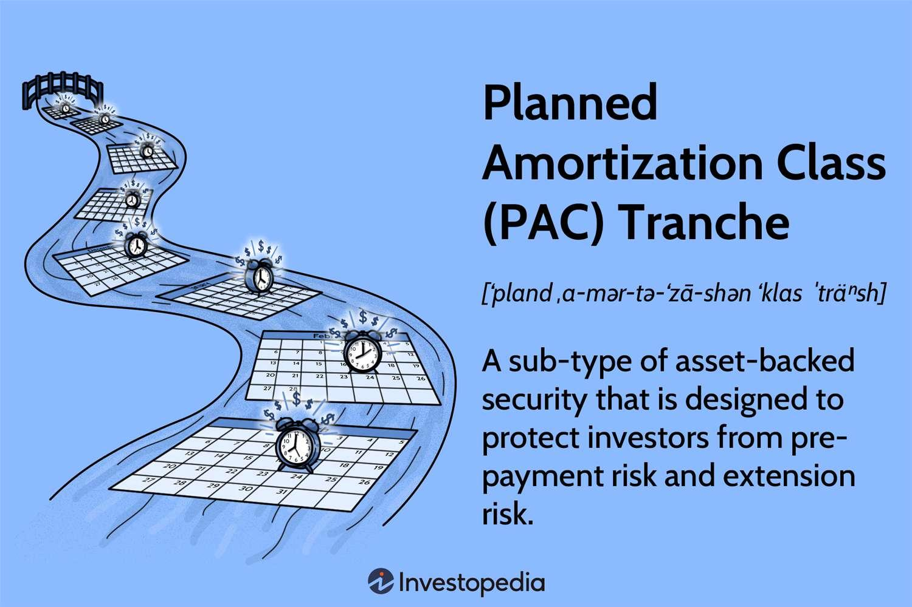

## Table of Contents

## What is a Targeted Amortization Class (TAC)?

A Targeted Amortization Class (TAC) is a type of bond that is designed to protect investors from prepayment risk. Prepayment risk is the chance that people will pay off their loans earlier than expected, which can affect the amount of money investors get back. TAC bonds help manage this risk by having a special structure that aims to give investors a steady stream of payments, even if prepayments happen.

TAC bonds work by setting aside a certain amount of money to cover potential prepayments. This money comes from the principal payments of the underlying loans. If prepayments happen, the TAC bond uses this set-aside money to keep the payments to investors steady. This makes TAC bonds a good choice for investors who want more predictable returns, even though they might not offer the highest possible returns compared to other types of bonds.

## How does a TAC differ from other mortgage-backed securities?

A Targeted Amortization Class (TAC) is different from other mortgage-backed securities because it focuses on protecting investors from prepayment risk. Prepayment risk is when people pay off their home loans earlier than expected, which can mess up the expected income from the bond. TAC bonds have a special plan to handle this. They set aside some money from the loan payments to use if people pay off their loans early. This way, the investors still get their payments on time, even if prepayments happen.

Other types of mortgage-backed securities, like pass-through securities or collateralized mortgage obligations (CMOs), don't have this special protection against prepayment risk. Pass-through securities simply pass along the payments from the underlying mortgages to the investors, so if prepayments happen, the investors get their money earlier but might not get as much in total. CMOs divide the payments into different classes, but they don't have the same kind of prepayment protection that TAC bonds do. So, TAC bonds are a good choice for investors who want more predictable payments, even if it means they might not get the highest possible returns.

## What are the main benefits of investing in a TAC?

One of the main benefits of investing in a Targeted Amortization Class (TAC) is that it helps protect you from prepayment risk. Prepayment risk is when people pay off their home loans earlier than expected, which can mess up the money you expect to get from your investment. TAC bonds have a special plan to handle this. They set aside some money from the loan payments to use if people pay off their loans early. This way, you still get your payments on time, even if prepayments happen.

Another benefit is that TAC bonds can give you more predictable returns. Because they have this protection against prepayments, you can count on getting a steady stream of payments. This makes TAC bonds a good choice if you want to know how much money you'll be getting and when, without the worry of sudden changes due to prepayments. While TAC bonds might not offer the highest possible returns compared to other types of bonds, the predictability can be worth it for many investors.

## Can you explain the structure of a TAC?

A Targeted Amortization Class (TAC) is a type of bond that helps protect investors from the risk of people paying off their home loans too early. This risk, called prepayment risk, can mess up the money you expect to get from your investment. To handle this, TAC bonds have a special plan. They set aside some money from the loan payments into a special account. If people start paying off their loans early, the TAC bond uses this set-aside money to keep your payments steady.

The structure of a TAC bond works like this: it takes the payments from a bunch of home loans and divides them into two parts - the principal (the money people borrowed) and the interest (the extra money they pay for borrowing). The interest payments go straight to the investors. The principal payments get split into two parts. Some of the principal goes into the special account to cover any early loan payoffs. The rest of the principal goes to the investors. This way, even if people pay off their loans early, the TAC bond can still give you your payments on time using the money in the special account.

## How does the amortization process work in a TAC?

In a Targeted Amortization Class (TAC), the amortization process is all about making sure you get your money back in a steady way, even if people pay off their home loans early. When people make their monthly payments on their loans, that money gets split into two parts: the principal, which is the money they borrowed, and the interest, which is the extra money they pay for borrowing. The interest part goes straight to you, the investor. The principal part is where things get interesting. Some of the principal goes into a special account to cover any early loan payoffs, and the rest goes to you.

This special account is what makes TACs different. If people start paying off their loans earlier than expected, the TAC uses the money in this account to keep your payments steady. This way, even if there are a lot of early payoffs, you still get your money on time. The goal is to give you a predictable stream of payments, so you know how much money you'll be getting and when, without the worry of sudden changes due to prepayments.

## What role does the principal repayment play in a TAC?

In a Targeted Amortization Class (TAC), the principal repayment is really important because it helps keep your payments steady. When people make their monthly payments on their home loans, part of that money is the principal, which is the money they borrowed. This principal gets split into two parts. Some of it goes into a special account that the TAC uses to cover any early loan payoffs. The rest of the principal goes straight to you, the investor. This way, even if people start paying off their loans early, the TAC can use the money in the special account to make sure you still get your payments on time.

The special account is what makes TACs different from other types of bonds. It's like a safety net that protects you from the risk of people paying off their loans too early, which can mess up the money you expect to get. By setting aside some of the principal into this account, the TAC can keep your payments steady and predictable. This is great if you want to know how much money you'll be getting and when, without the worry of sudden changes due to prepayments.

## How are interest rates managed within a TAC?

In a Targeted Amortization Class (TAC), interest rates are managed by making sure that the interest payments from the home loans go straight to the investors. When people make their monthly payments, part of that money is interest, which is the extra money they pay for borrowing. The TAC takes this interest and gives it to you without any changes. This means that the interest rate you get is based on the rates of the underlying home loans, and it stays steady as long as those rates don't change.

The TAC also uses the principal payments to help manage the overall payments to investors. Some of the principal goes into a special account to cover any early loan payoffs. This helps keep your payments steady even if interest rates change and people start paying off their loans early. By setting aside part of the principal, the TAC can make sure that you still get your interest payments on time, even if the interest rates on the underlying loans go up or down.

## What are the risks associated with investing in a TAC?

Investing in a Targeted Amortization Class (TAC) can be a good way to get steady payments, but there are some risks you should know about. One big risk is that even though TACs are designed to protect you from people paying off their loans early, they might not work perfectly. If a lot of people pay off their loans much earlier than expected, the special account might run out of money. This could mean your payments might not be as steady as you hoped.

Another risk is that TACs might not give you the highest returns compared to other types of bonds. Because they focus on keeping your payments steady, they might not offer as much money as riskier investments. Also, if interest rates go up a lot, the value of your TAC bond could go down. This is because new bonds might be issued with higher interest rates, making your bond less attractive to other investors. So, while TACs can help you get predictable payments, they come with their own set of risks that you need to think about.

## How does prepayment risk affect a TAC?

Prepayment risk is when people pay off their home loans earlier than expected. This can be a problem for investors in a Targeted Amortization Class (TAC) because it can mess up the steady payments they expect to get. TACs have a special plan to handle this risk. They set aside some money from the loan payments into a special account. If people start paying off their loans early, the TAC uses this set-aside money to keep your payments steady.

Even with this plan, there's still a risk that the special account might run out of money if a lot of people pay off their loans much earlier than expected. If that happens, your payments might not be as steady as you hoped. So, while TACs are designed to protect you from prepayment risk, they might not work perfectly if prepayments are really high.

## What strategies can be used to mitigate risks in a TAC?

One way to lower the risks in a Targeted Amortization Class (TAC) is to keep an eye on the prepayment speeds of the home loans that make up the TAC. If you see that people are paying off their loans faster than expected, you might want to think about selling your TAC bond before the special account runs out of money. This way, you can avoid the risk of your payments becoming less steady.

Another strategy is to mix TAC bonds with other types of investments in your portfolio. By spreading your money across different kinds of bonds and investments, you can lower the overall risk. If the TAC bond doesn't perform as well as you hoped because of high prepayments, the other investments might help balance things out. This way, you're not putting all your eggs in one basket.

Lastly, staying informed about interest rate changes can also help. If interest rates go up a lot, the value of your TAC bond might go down. By keeping an eye on interest rates and being ready to adjust your investments, you can better manage the risk of losing money. Knowing what's going on in the market can help you make smarter choices about when to buy or sell your TAC bond.

## How do TACs perform in different economic conditions?

TACs, or Targeted Amortization Classes, can do well or struggle depending on the economy. When the economy is good and interest rates are steady, TACs usually do well. People are less likely to pay off their home loans early because they're happy with their current rates. This means the special account in the TAC doesn't get used up, and investors get their payments on time and as expected.

But when the economy changes, TACs can face challenges. If interest rates drop a lot, people might want to pay off their old loans and take out new ones with lower rates. This is called prepayment risk. If a lot of people do this, the special account in the TAC might run out of money, and the payments to investors could become less steady. Also, if the economy goes into a recession and interest rates go up, the value of the TAC bond might go down because new bonds with higher rates become more attractive to investors.

## What advanced financial models are used to analyze TAC performance?

To understand how well a Targeted Amortization Class (TAC) might do, people use special math models. One common model is called the Monte Carlo simulation. This model runs many different scenarios to see what might happen to the TAC if people pay off their loans at different times. It helps investors see how the TAC might handle prepayment risk and if the special account will have enough money to keep payments steady.

Another model that's often used is the option-adjusted spread (OAS) model. This model looks at how the TAC's payments might change if interest rates go up or down. It helps investors figure out if the TAC is a good deal compared to other bonds. By using these models, investors can make better guesses about how the TAC will do in different economic situations and decide if it's a smart investment for them.

## References & Further Reading

[1]: ["The Handbook of Mortgage-Backed Securities"](https://academic.oup.com/book/7943) by Frank J. Fabozzi

[2]: ["Collateralized Mortgage Obligations (CMOs) and Other Structured Securities"](https://www.agecroftcapital.com/post/collateralized-mortgage-obligations-guide) by Frank J. Fabozzi

[3]: ["Fixed Income Securities: Tools for Today's Markets"](https://www.amazon.com/Fixed-Income-Securities-Markets-Finance/dp/1119835550) by Bruce Tuckman and Angel Serrat

[4]: ["Algorithmic Trading: Winning Strategies and Their Rationale"](https://www.amazon.com/Algorithmic-Trading-Winning-Strategies-Rationale-ebook/dp/B00CY5HC0U) by Ernest P. Chan

[5]: ["The Concepts and Practice of Mathematical Finance"](https://archive.org/download/quant_books/Concepts%20_%20Practice%20of%20Mathematical%20Finance%20-%20M.%20S.%20Joshi.pdf) by Mark S. Joshi

[6]: ["Interest Rate Risk Modeling: The Fixed Income Valuation Course"](https://www.amazon.com/Interest-Rate-Risk-Modeling-Valuation/dp/0471427241) by Sanjay K. Nawalkha, Gloria M. Soto, and Natalia A. Beliaeva