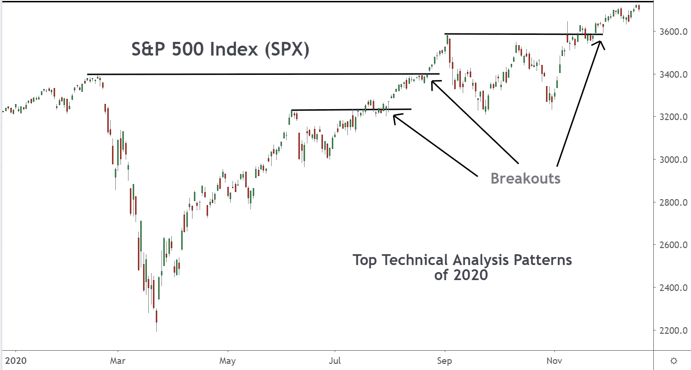

In the fast-paced world of financial markets, traders and investors are in a constant pursuit of innovative strategies to enhance their returns. Among these strategies, breakout strategies have gained notable attention for their ability to capitalize on significant price movements, guided by the principles of technical analysis. These strategies focus on recognizing moments when a security's price crosses key support or resistance levels, potentially signaling the start of a new trend.

The effectiveness of breakout strategies lies in their ability to harness market volatility, a common feature of financial markets. By precisely identifying breakout points, traders can position themselves to enter trades at optimal times, maximizing the potential for profit just as new trends emerge. This approach necessitates a deep understanding of historical price data and pattern recognition, which are fundamental components of technical analysis.



In recent years, the integration of technical analysis with algorithmic trading has emerged as a powerful strategy, offering a competitive edge by enhancing precision and speed. Algorithmic trading utilizes automated systems to execute trades based on pre-defined breakout signals, thereby minimizing the influence of human emotions and improving decision-making efficiency. With algorithms, traders can swiftly respond to breakout signals, ensuring transactions are executed at peak times.

For both seasoned traders and newcomers, grasping the synergy between breakout strategies, technical analysis, and algorithmic trading is essential for navigating the volatile terrain of financial markets. This article provides an extensive examination of these elements, illustrating how their integration can lead to a robust approach in trading. By combining expertise in technical indicators with the mechanical precision of algorithms, traders can significantly boost their trading performance.

Whether seeking to refine current approaches or exploring new methodologies, understanding the complexities and intricacies of breakout strategies is crucial for success in today's dynamic financial landscape.

## Table of Contents

## Understanding Breakout Strategies

Breakout strategies are a widely-used methodology in technical analysis, focusing on identifying critical price levels where significant movements in a security's price are anticipated. These levels are often manifested as resistance and support levels on financial charts. When a price breaks through these levels, it can indicate the beginning of a new trend, presenting opportunities for traders to capitalize on market movements.

The essence of [breakout](/wiki/breakout-trading) strategies lies in recognizing these pivotal points on a chart. Resistance levels are often previous highs where selling pressure exceeds buying pressure, causing prices to retreat. Conversely, support levels are previous lows where buying pressure outweighs selling pressure, halting price declines. A breakout occurs when prices move beyond these established levels, with a breach above resistance suggesting potential upward [momentum](/wiki/momentum) and a breach below support indicating potential downward momentum.

Volatility and momentum are crucial components of breakout strategies. Volatility, the degree of variation in a trading price series over time, creates opportunities for breakouts as it may signal upcoming large price movements. Momentum refers to the speed or strength of price movement. Traders harness these elements by entering trades as new trends begin, aiming to maximize returns from rapid price changes.

The success of breakout strategies hinges on accurately identifying breakout points, which requires a meticulous examination of historical data and patterns. Historical price movements help traders predict future shifts by identifying recurring patterns. Technical tools such as candlestick patterns, trend lines, and [volume](/wiki/volume-trading-strategy) indicators can assist in verifying the authenticity of these breakouts, ensuring that traders react promptly to genuine signals rather than false alarms.

Utilizing statistical analysis and historical data can enhance the precision of breakout identification. For example, calculating historical [volatility](/wiki/volatility-trading-strategies) using standard deviation or employing the Average True Range (ATR) can help set appropriate distance thresholds for potential breakout points. Traders also use moving averages to confirm breakouts, by observing the crossover of short-term and long-term averages.

In summary, breakout strategies revolve around identifying crucial price levels and exploiting the consequential price movements resulting from breaches of these levels. By focusing on resistance and support, volatility and momentum, and utilizing historical data effectively, traders can enhance their ability to profit from new trends in financial markets.

## Technical Analysis: The Backbone of Breakout Strategies

Technical analysis serves as the essential methodology for identifying potential breakout opportunities in financial markets. Breakout strategies capitalize on the movement of asset prices beyond established support or resistance levels, signifying a potential shift in market direction. To effectively pinpoint these instances, traders utilize a repertoire of chart patterns, indicators, and analytic tools.

Chart patterns form the core of technical analysis by depicting the historical price movements and helping predict future behavior. Patterns such as head and shoulders, triangles, and flags serve as visual representations of market psychology, revealing shifts between bullish and bearish states. Identifying these patterns allows traders to anticipate breakout scenarios with higher probability.

Indicators, key components of technical analysis, provide quantitative insights into market trends. Moving averages, for instance, are employed to smooth out price data, offering a clearer picture of the underlying trend. A commonly used setup is the combination of short-term and long-term moving averages; a breakout may be indicated when the short-term average crosses the long-term one, known as a "golden cross" (bullish) or "death cross" (bearish).

Bollinger Bands, another prevalent indicator, consist of a moving average and two standard deviation lines. They highlight price volatility, with prices touching or breaching the bands potentially indicating forthcoming breakouts. Traders often interpret a move above the upper band as a bullish signal and one below the lower band as bearish.

Fibonacci retracements provide insights into potential support and resistance levels. Based on key Fibonacci ratios (e.g., 23.6%, 38.2%, 61.8%), these retracements help identify price levels where breakouts might occur following a market correction. The alignment of price action with these retracements can suggest a continuation or reversal of trends, thereby assisting in identifying breakout points.

Understanding how these tools complement one another is crucial for differentiating between genuine breakouts and false signals. Combining multiple indicators and patterns enhances the reliability of breakout predictions. For instance, corroborating a head-and-shoulders pattern with supportive signals from moving averages and Bollinger Bands can increase the probability of a successful trade.

Technical analysis, therefore, forms the backbone of effective breakout trading. By leveraging historical price data and specialized indicators, traders can accurately assess potential breakout opportunities, facilitating informed decision-making in the dynamic landscape of financial markets.

## Algorithmic Trading: Enhancing Efficiency and Precision

Algorithmic trading significantly enhances the efficacy and precision of executing trades by utilizing sophisticated automated systems that operate based on predetermined criteria. A critical aspect of implementing breakout strategies, [algorithmic trading](/wiki/algorithmic-trading) employs software and algorithms to identify and act upon breakout signals with speed and accuracy. This automation mitigates the impact of human emotions, which often lead to suboptimal decision-making, thereby bolstering trade validity and timing.

Implementing algorithmic systems specifically designed for breakout strategies requires an understanding of how to precisely detect and react to breakout signals. These systems are engineered to recognize patterns and execute trades at the most opportune moments, capturing potential gains from market volatility. The automation of these processes ensures that trading actions are executed consistently, leveraging market data in real-time to make informed decisions.

One fundamental component in designing robust trading algorithms is the use of technical indicators and metrics that accurately characterize market conditions conducive to breakouts. For example, moving averages and Bollinger Bands are commonly employed within these algorithms to detect significant price moves and possible trend reversals. The integration of such tools within an algorithm aids in filtering out noise, helping avoid false signals and improving overall accuracy.

The architecture of an algorithmic trading system typically embodies several core elements. At its foundation, the system should include a robust data acquisition module to capture market data from various sources efficiently. Next, a preprocessing phase cleans and organizes this data, making it suitable for the algorithm's consumption. Subsequently, the breakout detection logic utilizes historical data to identify potential trading signals, supported by mathematical models and statistical techniques. Finally, the execution module swiftly acts on these signals by placing trades, typically interfacing with brokerage APIs to manage order submissions.

In Python, an algorithmic trading system might look like the following simplified example for executing breakout trades based on Bollinger Bands:

```python
import pandas as pd
import numpy as np
import ta  # Technical Analysis library

# Assuming historical_data is a DataFrame with OHLC data
def calculate_bollinger_bands(historical_data, window=20, no_of_std=2):
    rolling_mean = historical_data['Close'].rolling(window).mean()
    rolling_std = historical_data['Close'].rolling(window).std()
    upper_band = rolling_mean + (rolling_std * no_of_std)
    lower_band = rolling_mean - (rolling_std * no_of_std)
    return rolling_mean, upper_band, lower_band

def identify_breakout_signals(historical_data, upper_band, lower_band):
    signals = []
    for index, row in historical_data.iterrows():
        if row['Close'] > upper_band[index]:
            signals.append('Buy')
        elif row['Close'] < lower_band[index]:
            signals.append('Sell')
        else:
            signals.append('Hold')
    return signals

def backtest_signals(historical_data, signals):
    # Implement backtesting logic to assess signal effectiveness
    pass

# Example usage
historical_data = pd.read_csv('market_data.csv')  # Load market data
rolling_mean, upper_band, lower_band = calculate_bollinger_bands(historical_data)

signals = identify_breakout_signals(historical_data, upper_band, lower_band)
backtest_signals(historical_data, signals)
```

Successfully integrating breakout strategies within algorithmic trading frameworks requires ongoing verification, [backtesting](/wiki/backtesting), and optimization. These steps ensure that the strategy remains viable across various market conditions and continues to deliver competitive trading performance. Emphasizing systematized assessments and refinements allows traders to adapt dynamically to evolving markets, maximizing their potential for achieving consistent profitability through breakout strategies.

## Practical Implementation: Developing a Breakout Trading System

Developing a breakout trading system entails an integration of technical analysis tools with algorithmic strategies, aiming for optimized performance in variable market conditions. The process begins with selecting charting tools and indicators that resonate with the trader's objectives. Commonly employed indicators include moving averages, Bollinger Bands, and the Relative Strength Index (RSI). These tools help identify potential breakout points by examining historical price data and patterns.

Once the technical framework is established, the next step is the algorithmic construction of the breakout trading system. The core of this system is an algorithm tailored to detect breakout signals and execute trades accordingly. The algorithm needs to define explicit criteria for identifying breakouts, potentially incorporating parameters such as volatility thresholds and timeframes.

### Key Steps in Developing the Algorithm:

1. **Defining Breakout Criteria:**
   Identify price levels where breakout conditions are met. For instance, a simple moving average (SMA) breakout system might rely on conditions like:
$$
   \text{Price}_t > \text{SMA}_{50}(t)

$$

   Here, $\text{Price}_t$ is the current price, and $\text{SMA}_{50}(t)$ denotes the 50-period simple moving average.

2. **Coding the Algorithm:**
   Program the algorithm to recognize and act upon the predefined breakout criteria. Python, with its robust libraries like `numpy`, `pandas`, and `TA-Lib`, is ideal for this task.

   ```python
   import numpy as np
   import pandas as pd
   from talib import SMA

   def breakout_signal(prices, period=50):
       sma = SMA(prices, timeperiod=period)
       signal = prices > sma
       return signal
   ```

3. **Backtesting:**
   Evaluate the algorithm's historical performance through backtesting. This involves applying the algorithm to past market data to assess its effectiveness across different market conditions.

   ```python
   def backtest(prices, signal):
       # Assume entry at opening price next day and exit strategy
       positions = np.where(signal[:-1], 1, 0)
       returns = np.diff(prices) * positions
       return np.sum(returns)
   ```

4. **Optimization:**
   Continuous optimization is imperative to adapt to evolving market dynamics. This includes adjusting parameters like moving average periods or volatility filters based on the latest backtesting results.

5. **Monitoring and Adaptation:**
   Post-deployment, the trading system requires meticulous monitoring to ensure ongoing performance aligns with expectations. Real-time data monitoring helps identify deviations and adapt the system as necessary.

Developing a breakout trading system is not a one-time task but rather an ongoing process of refinement and adaptation. Employing a systematic approach with rigorous backtesting and real-time monitoring can optimize the effectiveness of such systems. This continuous cycle of assessment and improvement helps sustain the system's competitiveness in the ever-changing financial markets.

## Challenges and Risks Associated with Breakout Strategies

Breakout strategies, while appealing for their potential to capitalize on price momentum, come with a distinct set of challenges and risks. One of the primary challenges associated with breakout strategies is the occurrence of false breakouts. A false breakout occurs when the price moves beyond a significant support or resistance level but fails to sustain the movement, ultimately reversing direction. This scenario can lead traders to enter trades prematurely, resulting in financial losses rather than gains. Identifying genuine breakouts requires careful analysis and the use of complementary indicators to confirm the validity of the breakout.

To mitigate the risk of false breakouts, traders often employ additional technical indicators such as volume analysis or confirmation through subsequent price action. For instance, a true breakout is more likely if the price movement is accompanied by a significant increase in trading volume, signaling genuine interest and strength in the new direction. A possible approach is to use a moving average crossover to validate the breakout, where a faster moving average crossing above a slower one could confirm an upward breakout.

Market conditions add another layer of complexity to breakout strategies. Financial markets are inherently volatile and can experience rapid changes due to economic developments, geopolitical events, or shifts in investor sentiment. As a result, a strategy that works well in one market environment might not perform as expected in another. This necessitates a dynamic approach where traders must be willing to adjust their strategies to adapt to changing market conditions. This can involve recalibrating the breakout criteria, changing the significance of technical indicators, or adjusting risk management practices.

The integration of algorithmic trading can offer a solution to some of these challenges by executing trades swiftly and without emotional bias. However, developing a robust algorithm that can accurately distinguish between false and genuine breakouts requires rigorous backtesting and continuous optimization. A typical Python-based algorithm might involve using libraries such as `pandas` for data manipulation and `numpy` for numerical operations to track moving averages and calculate trading signals, ensuring that these computations align with real-time market data.

For example, a simple Python snippet to track a moving average crossover might look like:

```python
import pandas as pd

def moving_average_crossover(data, short_window=20, long_window=50):
    signals = pd.DataFrame(index=data.index)
    signals['price'] = data['Price']
    signals['short_mavg'] = data['Price'].rolling(window=short_window, min_periods=1, center=False).mean()
    signals['long_mavg'] = data['Price'].rolling(window=long_window, min_periods=1, center=False).mean()
    signals['signal'] = 0.0
    signals['signal'][short_window:] = np.where(signals['short_mavg'][short_window:] > signals['long_mavg'][short_window:], 1.0, 0.0)   
    signals['positions'] = signals['signal'].diff()
    return signals
```

Understanding and anticipating the risks associated with breakout strategies equips traders with the tools needed to navigate the challenges. By continuously refining their approach and staying informed about market dynamics, traders can enhance their prospects for consistent results in their trading endeavors.

## Conclusion

The combination of breakout strategies, technical analysis, and algorithmic trading offers a powerful approach to trading. By synchronizing these elements, traders can significantly improve the accuracy, speed, and profitability of their transactions. Breakout strategies, when effectively executed, capitalize on significant price movements by identifying crucial support and resistance levels in the market. The inclusion of technical analysis provides a robust framework for interpreting market trends and sentiment, utilizing tools like moving averages and Bollinger Bands to distinguish genuine breakouts from false signals.

Algorithmic trading enhances this process further by employing automated systems to execute trades based on predetermined criteria, which include breakout signals. This automation removes human emotion from trading decisions and allows for rapid trade execution, crucial in the fast-moving financial markets. Moreover, the integration of these components streamlines the trading process and allows for effective management of trade executions thereby optimizing results.

Nonetheless, traders must remain vigilant to challenges such as false breakouts and rapidly changing market conditions. Continuous learning and strategy adjustment are vital to managing these risks. The foundation laid in this article provides essential insights into creating a successful breakout strategy within algorithmic trading. By embracing these concepts and continuing to explore new techniques and strategies, traders can develop a well-rounded and adaptable approach to achieving consistent success amidst market volatility.

## References & Further Reading

[1]: Bergstra, J., Bardenet, R., Bengio, Y., & Kégl, B. (2011). ["Algorithms for Hyper-Parameter Optimization."](https://papers.nips.cc/paper/4443-algorithms-for-hyper-parameter-optimization) Advances in Neural Information Processing Systems 24.

[2]: ["Advances in Financial Machine Learning"](https://www.amazon.com/Advances-Financial-Machine-Learning-Marcos/dp/1119482089) by Marcos Lopez de Prado

[3]: ["Evidence-Based Technical Analysis: Applying the Scientific Method and Statistical Inference to Trading Signals"](https://www.amazon.com/Evidence-Based-Technical-Analysis-Scientific-Statistical/dp/0470008741) by David Aronson

[4]: ["Machine Learning for Algorithmic Trading"](https://github.com/stefan-jansen/machine-learning-for-trading) by Stefan Jansen

[5]: ["Quantitative Trading: How to Build Your Own Algorithmic Trading Business"](https://www.amazon.com/Quantitative-Trading-Build-Algorithmic-Business/dp/1119800064) by Ernest P. Chan