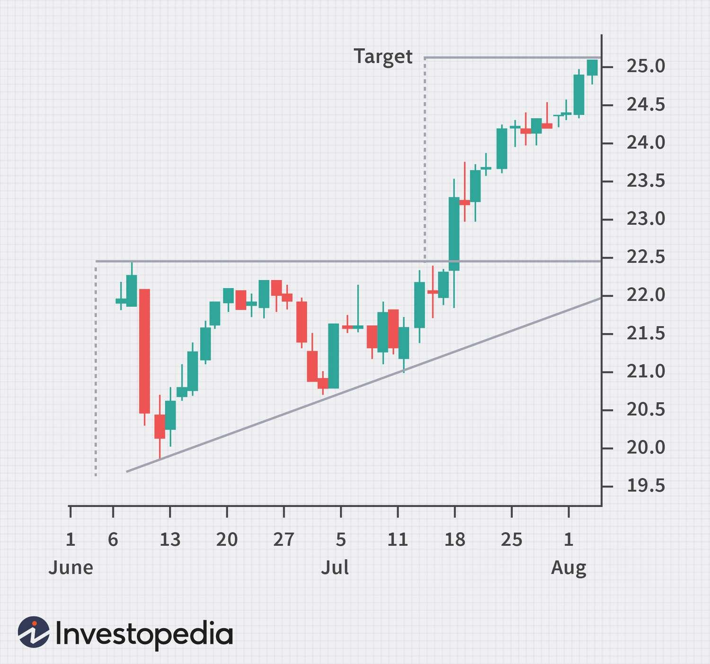

## Table of Contents

## What is a breakout in technical analysis?

A breakout in technical analysis is when the price of a stock or any other asset moves above a resistance level or below a support level. These levels are important because they show where the price has had trouble moving past before. When the price breaks through these levels, it can mean that the asset is starting to move in a new direction. Traders watch for breakouts because they can signal good times to buy or sell.

Breakouts can happen because of news, changes in the market, or just because enough people start trading in the same way. When a breakout happens, it's important to see if it's real or just a short-term move. A real breakout usually keeps going in the new direction and doesn't quickly come back to the old levels. Traders often use other tools, like looking at trading volume, to help them decide if a breakout is something they should act on.

## Why are breakouts important for traders?

Breakouts are important for traders because they show when a stock's price is starting to move in a new direction. Imagine a stock's price has been stuck between two levels for a while. When it finally moves past one of these levels, it's like a signal that something has changed. Traders watch for these moments because they can be good times to buy or sell the stock.

These signals help traders make decisions. If a stock breaks above a high point, traders might think it's a good time to buy because the price might keep going up. If it breaks below a low point, they might sell because they think the price could keep falling. But traders need to be careful. Sometimes a breakout doesn't last, and the price goes back to where it was. That's why traders look at other things, like how many people are trading the stock, to make sure the breakout is real and not just a short-term change.

## How can beginners identify potential breakout points on a chart?

Beginners can identify potential breakout points on a chart by looking for clear levels where the price has stopped moving up or down in the past. These levels are called support and resistance. Support is where the price has bounced back up from before, and resistance is where it has fallen back down from. If the price gets close to these levels again, it might be getting ready to break out. Beginners should draw lines on the chart at these levels to see where the price might break out next.

Another way to spot a potential breakout is by watching how the price moves as it gets close to these levels. If the price starts to move more quickly or if more people start trading the stock, it could mean a breakout is coming. Beginners can use tools like volume indicators to see if more people are trading when the price is near the support or resistance levels. If the price breaks through these levels with a lot of trading, it's a good sign that the breakout might be real and not just a short-term change.

## What are the common chart patterns associated with breakouts?

Some common chart patterns that can lead to breakouts are the triangle, the rectangle, and the head and shoulders. A triangle pattern happens when the price moves between two lines that are coming together. This can be a sign that the price is getting ready to break out in one direction. A rectangle pattern is when the price moves between two flat lines, showing support and resistance. If the price breaks out of this range, it can signal a new trend. The head and shoulders pattern looks like three peaks, with the middle one being the highest. A breakout happens when the price falls below the line connecting the lows of the two smaller peaks.

Traders use these patterns to guess where the price might go next. For example, if the price breaks above the top line of a triangle or rectangle, traders might buy the stock because they think the price will keep going up. If it breaks below the bottom line, they might sell because they think the price will keep going down. With the head and shoulders, a break below the line can mean the price will keep falling. It's important for traders to check if the breakout is real by looking at how many people are trading the stock when the breakout happens. If a lot of people are trading, it's more likely that the breakout will lead to a new trend.

## What indicators should be used to confirm a breakout?

To confirm a breakout, traders often look at the trading volume. If a lot more people are trading when the price breaks through a support or resistance level, it's a good sign that the breakout is real. Think of it like this: if the price moves past a level and lots of people are buying or selling, it shows that many traders believe in the new direction. So, watching the volume can help traders decide if they should trust the breakout.

Another useful indicator is the moving average. A moving average is a line on the chart that shows the average price over a certain time. If the price breaks out and stays above or below this line, it can confirm the breakout. It's like a second opinion that says the new price direction is strong. Traders often use a short-term moving average, like a 20-day one, along with a longer-term one, like a 50-day one, to see if the breakout is supported by the overall trend.

## How do volume levels affect the validity of a breakout?

Volume levels are really important when it comes to figuring out if a breakout is real or not. When the price of a stock breaks through a support or resistance level, it's a big deal. But if not many people are trading when this happens, it might just be a short-term change. On the other hand, if a lot of people are buying or selling at the same time as the breakout, it shows that many traders believe in the new direction. This makes the breakout more likely to be real and not just a fluke.

So, when traders see a breakout, they look at the volume to see if it's backed up by a lot of trading activity. If the volume is high during the breakout, it's a good sign that the price will keep moving in the new direction. This helps traders feel more confident about making decisions to buy or sell the stock. In simple terms, high volume during a breakout means more people agree with the new price movement, making the breakout more trustworthy.

## What are the risks of trading breakouts and how can they be mitigated?

Trading breakouts can be risky because sometimes the price might break through a level but then quickly go back to where it was. This is called a false breakout, and it can trick traders into making bad trades. Another risk is that even if the breakout is real, the price might not move as much as traders hope. This can lead to smaller profits or even losses if the price goes against them. Also, trading breakouts can be stressful because it's hard to know for sure if the breakout will lead to a new trend.

To lower these risks, traders can use a few strategies. One way is to wait for the price to break through the level and then wait a bit longer to see if it keeps going in the new direction. This can help avoid false breakouts. Another way is to use stop-loss orders, which automatically sell the stock if the price goes down too much. This can limit losses if the trade doesn't work out. Lastly, traders can use other tools like volume and moving averages to make sure the breakout is strong and more likely to lead to a new trend. By being careful and using these strategies, traders can make smarter decisions and reduce the risks of trading breakouts.

## Can you explain the difference between a true breakout and a false breakout?

A true breakout happens when the price of a stock moves past a support or resistance level and keeps going in that new direction. It's like the price has found a new path and isn't going back to where it was before. Traders can tell if a breakout is true by looking at how many people are trading when it happens. If a lot of people are buying or selling at the same time as the breakout, it's a good sign that the new price movement is strong and will last.

A false breakout, on the other hand, is when the price seems to break through a level but then quickly goes back to where it was. It's like the price tried to go a new way but couldn't stick with it. False breakouts can trick traders into thinking the price will keep moving, but then they end up losing money when it goes back. To avoid this, traders can wait a bit after the breakout to see if the price keeps going or use other tools to check if the breakout is real.

## How can advanced traders use multiple time frame analysis to enhance breakout trading?

Advanced traders can use multiple time frame analysis to get a better understanding of breakouts by looking at the same stock on different charts, like a daily chart and an hourly chart. By doing this, they can see if the breakout is happening on both the big picture and the smaller details. For example, if a stock breaks out on the daily chart, traders can check the hourly chart to see if the price is also moving strongly in the same direction. If it is, it's a good sign that the breakout is real and not just a short-term change.

This approach helps traders feel more confident in their decisions. If the breakout looks strong on both time frames, it's more likely that the price will keep moving in the new direction. Traders can also use this method to find the best times to enter or exit a trade. For instance, if the daily chart shows a breakout but the hourly chart shows the price is still moving up, traders might wait for a dip on the hourly chart to buy at a better price. By looking at multiple time frames, traders can make smarter choices and improve their chances of making money from breakouts.

## What role does market sentiment play in the success of a breakout?

Market sentiment is like the overall feeling or mood of people who are trading. When a lot of people feel good about a stock, it can help a breakout succeed. If everyone thinks a stock is going to do well, they might buy more of it, pushing the price up. This positive feeling can make the breakout stronger because more people are willing to trade in the direction of the breakout. On the other hand, if people are feeling bad about the stock or the market in general, it can make it harder for a breakout to happen or last. If traders are worried, they might sell the stock, causing the price to fall back down.

Traders can check market sentiment by looking at news, social media, or special tools that measure how people feel about the market. If the sentiment is positive and matches the direction of the breakout, it's a good sign that the breakout might be successful. But if the sentiment is negative or mixed, traders need to be careful. They might want to wait and see if the breakout can overcome the negative feelings before making a trade. Understanding market sentiment can help traders make better decisions about whether to trust a breakout or not.

## How can algorithmic trading strategies be developed to target breakouts?

Algorithmic trading strategies for targeting breakouts start by setting clear rules for when to buy or sell a stock. These rules often include looking at the price levels where a breakout might happen, like support and resistance. The algorithm can be programmed to watch the stock's price and trade when it breaks through these levels. It can also use volume to check if the breakout is real. If the volume is high when the price breaks out, the algorithm might decide to make a trade because it shows that many people believe in the new direction.

Another important part of these strategies is using other tools to confirm the breakout. The algorithm can look at moving averages to see if the price is staying above or below them after the breakout. It can also use multiple time frames to get a better picture of the breakout. For example, if the price breaks out on a daily chart, the algorithm can check the hourly chart to see if the breakout is strong there too. By combining these checks, the algorithm can make smarter trades and reduce the risk of false breakouts. This way, it can help traders make money from real breakouts while avoiding the ones that don't last.

## What are some advanced techniques for managing trades after a breakout has occurred?

After a breakout happens, advanced traders can use a few special techniques to manage their trades better. One technique is called trailing stop-loss orders. This means setting a stop-loss that moves up as the price goes up. If the price keeps going in the direction of the breakout, the stop-loss follows it, helping to lock in profits while still giving the trade room to grow. Another technique is scaling out of a position. This means selling part of the stock as it goes up, taking some profit while leaving the rest of the trade open to catch more gains. By doing this, traders can balance making money with the chance to make even more if the price keeps moving.

Another advanced technique is using multiple time frames to keep an eye on the trade. Even after a breakout, traders can switch between different charts, like daily and hourly ones, to see if the trend is still strong. If the breakout looks good on both big and small charts, it's a sign to keep the trade going. But if the smaller time frame shows the price starting to fall back, it might be time to think about selling. Lastly, traders can use indicators like the Relative Strength Index (RSI) or the Moving Average Convergence Divergence (MACD) to check if the stock is getting overbought or oversold. These tools can help decide when to take profits or hold onto the trade a bit longer.

## How can one practically implement and develop a Breakout Trading System?

Developing a breakout trading system entails an integration of technical analysis tools with algorithmic strategies, aiming for optimized performance in variable market conditions. The process begins with selecting charting tools and indicators that resonate with the trader's objectives. Commonly employed indicators include moving averages, Bollinger Bands, and the Relative Strength Index (RSI). These tools help identify potential breakout points by examining historical price data and patterns.

Once the technical framework is established, the next step is the algorithmic construction of the breakout trading system. The core of this system is an algorithm tailored to detect breakout signals and execute trades accordingly. The algorithm needs to define explicit criteria for identifying breakouts, potentially incorporating parameters such as volatility thresholds and timeframes.

### Key Steps in Developing the Algorithm:

1. **Defining Breakout Criteria:**
   Identify price levels where breakout conditions are met. For instance, a simple moving average (SMA) breakout system might rely on conditions like:
$$
   \text{Price}_t > \text{SMA}_{50}(t)

$$

   Here, $\text{Price}_t$ is the current price, and $\text{SMA}_{50}(t)$ denotes the 50-period simple moving average.

2. **Coding the Algorithm:**
   Program the algorithm to recognize and act upon the predefined breakout criteria. Python, with its robust libraries like `numpy`, `pandas`, and `TA-Lib`, is ideal for this task.

   ```python
   import numpy as np
   import pandas as pd
   from talib import SMA

   def breakout_signal(prices, period=50):
       sma = SMA(prices, timeperiod=period)
       signal = prices > sma
       return signal
   ```

3. **Backtesting:**
   Evaluate the algorithm's historical performance through backtesting. This involves applying the algorithm to past market data to assess its effectiveness across different market conditions.

   ```python
   def backtest(prices, signal):
       # Assume entry at opening price next day and exit strategy
       positions = np.where(signal[:-1], 1, 0)
       returns = np.diff(prices) * positions
       return np.sum(returns)
   ```

4. **Optimization:**
   Continuous optimization is imperative to adapt to evolving market dynamics. This includes adjusting parameters like moving average periods or volatility filters based on the latest backtesting results.

5. **Monitoring and Adaptation:**
   Post-deployment, the trading system requires meticulous monitoring to ensure ongoing performance aligns with expectations. Real-time data monitoring helps identify deviations and adapt the system as necessary.

Developing a breakout trading system is not a one-time task but rather an ongoing process of refinement and adaptation. Employing a systematic approach with rigorous backtesting and real-time monitoring can optimize the effectiveness of such systems. This continuous cycle of assessment and improvement helps sustain the system's competitiveness in the ever-changing financial markets.

## References & Further Reading

[1]: Bergstra, J., Bardenet, R., Bengio, Y., & Kégl, B. (2011). ["Algorithms for Hyper-Parameter Optimization."](https://papers.nips.cc/paper/4443-algorithms-for-hyper-parameter-optimization) Advances in Neural Information Processing Systems 24.

[2]: ["Advances in Financial Machine Learning"](https://www.amazon.com/Advances-Financial-Machine-Learning-Marcos/dp/1119482089) by Marcos Lopez de Prado

[3]: ["Evidence-Based Technical Analysis: Applying the Scientific Method and Statistical Inference to Trading Signals"](https://www.amazon.com/Evidence-Based-Technical-Analysis-Scientific-Statistical/dp/0470008741) by David Aronson

[4]: ["Machine Learning for Algorithmic Trading"](https://github.com/stefan-jansen/machine-learning-for-trading) by Stefan Jansen

[5]: ["Quantitative Trading: How to Build Your Own Algorithmic Trading Business"](https://www.amazon.com/Quantitative-Trading-Build-Algorithmic-Business/dp/1119800064) by Ernest P. Chan