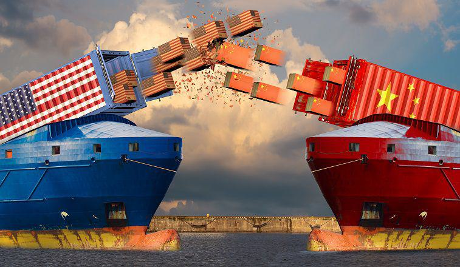

In today's global economy, trade policies significantly influence the shaping of economic landscapes. These policies comprise the rules and regulations that countries apply to international trade, including tariffs, quotas, and trade agreements. They are designed to protect domestic industries, enhance competitive advantages, and promote economic stability. However, the introduction of tariffs, especially when employed as instruments of economic conflict in tariff wars, can disrupt these goals by affecting trade balances and inflating consumer prices. 

Tariff wars—where countries impose tariffs against each other—can create an environment of escalating trade barriers, leading to a decline in trade volumes and a slowdown in global economic growth. A notable example is the recent tariff dispute between the United States and China, which caused significant upheavals in global supply chains and financial markets. The result was not just increased costs for consumers but also adverse effects on industries like agriculture, which suffered from retaliatory tariffs and loss of market access.



In parallel, the rise of algorithmic trading has emerged as a revolutionary force in the financial markets. Algorithmic trading involves using computer programs to execute buy and sell orders automatically at high speeds and volumes. This innovative approach allows for greater market efficiency but also introduces new risks, such as heightened market volatility, particularly during economic disturbances like trade wars. Therefore, the interconnected dynamics of trade policies, tariff disputes, and algorithmic trading create a complex economic environment that must be understood to navigate modern global trade and finance effectively.

By comprehending these aspects, stakeholders—ranging from policymakers to business leaders—can be better equipped to confront the challenges and exploit the opportunities presented by the evolving economic landscape. Adaptability and informed decision-making become crucial in managing the uncertainties of international trade and maintaining economic resilience in the face of global shifts.

## Table of Contents

## Understanding Trade Policy

Trade policy serves as a framework comprising rules, regulations, and agreements that regulate cross-border trade activities. It primarily involves the imposition of tariffs, negotiation of trade agreements, and implementation of regulatory measures, all of which are essential in shaping the economic interactions between nations. Tariffs are taxes levied on imported goods, which often serve to protect domestic industries by making foreign products relatively more expensive and thus less competitive in the local market. Additionally, trade agreements—ranging from bilateral to multilateral scope—facilitate smoother trade relations by reducing trade barriers and fostering economic collaboration between countries.

Countries strategically deploy trade policy to safeguard domestic industries from international competition, thereby preserving employment and industrial capabilities. By adjusting tariffs and negotiating favorable trade agreements, governments can stimulate or restrain specific economic activities, maintain economic stability, and further national interests. A robust trade policy can enable a nation to enhance its bargaining position on the global stage, ensuring the protection and advancement of its economic priorities.

The economic ramifications of trade policies are far-reaching, impacting consumer prices, production costs, and overall market stability. For consumers, changes in tariffs and trade agreements can lead to price variations in everyday goods and services. An increase in tariffs may result in higher prices for imported goods, affecting consumer spending power. Concurrently, firms facing altered trade policies must navigate shifts in import costs, supply chain logistics, and competitive dynamics, potentially affecting employment levels.

To evaluate trade policy impacts, economists often rely on econometric models and simulations. These tools help to predict how changes in tariffs and agreements might influence trade flows, gross domestic product (GDP), and employment. For example, a basic computational model in Python can be used to simulate the impact of a tariff increase on import volumes:

```python
def calculate_import_volume(initial_imports, tariff_rate):
    elasticity_of_demand = -0.5  # Assuming a price elasticity of demand for imports
    new_import_volume = initial_imports * (1 + tariff_rate) ** elasticity_of_demand
    return new_import_volume

initial_imports = 1000  # in million dollars
tariff_rate = 0.10  # 10% tariff
new_volume = calculate_import_volume(initial_imports, tariff_rate)
print(f"New import volume: ${new_volume} million")
```

This hypothetical scenario illustrates how increased tariffs likely reduce import volumes, affecting the broader economy. By understanding these mechanisms, policymakers can craft trade policies that balance domestic protection with international competitiveness, ultimately striving to optimize economic outcomes.

## The Dynamics of Tariff Wars

A tariff war occurs when countries engage in a series of retaliatory tariff impositions against each other, aiming to gain an advantage or protect domestic sectors from foreign competition. This cycle often spirals, as affected countries retaliate by erecting further barriers to trade. One of the most notable examples is the recent tariff conflict between the United States and China, which began in 2018. This conflict arose from the U.S. administration's imposition of tariffs on Chinese goods, targeting issues such as trade imbalances and intellectual property practices.

The U.S.-China tariff war illustrates how such economic conflicts can reverberate globally. For instance, higher tariffs led to increased production costs for U.S. companies reliant on Chinese imports, driving up consumer prices and affecting purchasing power. Moreover, as tariffs were applied and escalated, supply chains were disrupted. Many businesses, accustomed to a globalized supply chain model, faced challenges in adjusting to new regulations and increased costs. This disruption not only impacted the immediate markets involved but also had downstream effects on global trade networks.

These economic conflicts can slow overall economic growth. When goods become more expensive due to tariffs, consumer spending can decrease, curbing economic expansion. For businesses, higher input costs result in reduced profitability, which potentially leads to lower investment and hiring rates. This, in turn, exacerbates economic slowdowns. Although certain industries might benefit in the short term from tariff protections, the broader consensus among economists is that extended tariff wars risk undermining global economic stability.

In conclusion, tariff wars, exemplified by the recent U.S.-China tensions, demonstrate the intricate and often harmful impacts of tariffs when used as instruments of economic policy. They increase consumer prices, disrupt established supply chains, and threaten to slow economic growth, emphasizing the need for careful navigation of international trade relations.

## Economic Impact of Tariff Wars

Tariff wars, characterized by the imposition of taxes on imports between countries, can significantly disrupt economic growth by diminishing trade volumes, inflating costs, and unsettling global markets. The US-China trade war serves as a poignant example of these adverse effects, illustrating how such conflicts can reverberate through various sectors and economies.

One of the primary consequences of tariff wars is the reduction in exports and imports. When countries impose tariffs on each other's goods, it effectively raises the price of foreign products, reducing their demand. This decline in trade [volume](/wiki/volume-trading-strategy) impacts both exporting and importing nations. Exporters face decreased sales in foreign markets, leading to lower revenues and potential job losses in export-dependent industries. Similarly, importers encounter higher costs for foreign products, which can lead to increased prices for consumers.

In the US-China trade war, which began in 2018, the United States imposed tariffs on a wide range of Chinese goods, prompting China to retaliate with tariffs on American products. This tit-for-tat escalation led to substantial disruptions in trade between the two economic giants. According to the Congressional Research Service, by late 2019, the trade war had affected over half a trillion dollars' worth of bilateral trade, highlighting the scope of its impact [1]. 

One of the most visibly affected sectors was agriculture. For instance, US farmers, who heavily relied on exporting products like soybeans to China, faced significant challenges due to retaliatory tariffs imposed by China. The American Farm Bureau Federation estimated that farm income fell considerably as exports dwindled, leading to financial stress among farmers and influencing the US government's decision to provide bailout packages to mitigate the impact [2].

Despite some short-term protective benefits for certain domestic industries—such as steel and aluminum producers, which saw a temporary boost due to tariffs on foreign competitors—tariff wars are generally disadvantageous in the long term. They create uncertainties, undermine business investments, and can trigger supply chain disruptions, ultimately stifling economic prosperity. As companies grapple with the increased costs of doing business globally, their ability to innovate and expand is often curtailed.

Overall, while the intention of tariff wars might be to defend domestic interests and level the playing field, their unintended economic fallout typically outweighs the potential advantages. For sustained economic growth, it is crucial to address underlying trade imbalances through diplomatic negotiations and policy adjustments, rather than resorting to protectionist measures.

---
[1] Congressional Research Service. "U.S.-China Trade Relations." Accessed 2023.  
[2] American Farm Bureau Federation. "Trade Impacts on Agriculture." Accessed 2023.

## Role of Algorithmic Trading in Trade Policy

Algorithmic trading utilizes advanced algorithms to execute buy or sell orders in financial markets rapidly and at high volumes, considerably influencing market dynamics and trading methodologies. These algorithms, often implemented using programming languages such as Python or C++, analyze vast amounts of data to identify trading opportunities, executing trades with minimal human intervention. This process facilitates a more efficient marketplace by enhancing [liquidity](/wiki/liquidity-risk-premium) and reducing transaction costs for traders.

In the context of trade policy, particularly during tariff wars and periods of unpredictable trade regulations, [algorithmic trading](/wiki/algorithmic-trading) can significantly accentuate market fluctuations. Tariff wars often introduce uncertainty and rapid price changes in affected industries. Algorithmic systems respond to these signals, executing trades in milliseconds, potentially leading to rapid market shifts. For example, if a new tariff is announced, these algorithms might immediately adjust valuations or liquidate positions across related asset classes, contributing to increased [volatility](/wiki/volatility-trading-strategies).

Algorithmic trading's capacity to react swiftly provides the advantage of liquidity provision. Liquidity is crucial in financial markets to facilitate the smooth execution of large transactions without causing significant price disruptions. By consistently quoting buy and sell prices, algorithms help stabilize markets amid the turbulence caused by erratic trade policies.

However, the speed and volume at which algorithmic trading operates [carry](/wiki/carry-trading) potential risks, notably the occurrence of flash crashes. These are rapid and deep market sell-offs followed by a quick recovery, often driven by algorithmic trading errors or misinterpretations of market signals. For instance, on May 6, 2010, the infamous Flash Crash saw the U.S. stock market lose nearly $1 trillion in value within minutes, influenced by high-frequency trading algorithms reacting to market data.

To mitigate these risks, regulatory bodies and market participants are exploring measures such as improved risk management strategies for algorithmic systems, the implementation of circuit breakers to halt trading during extreme volatility, and ensuring greater transparency in algorithmic activities. These efforts aim to harness the benefits of algorithmic trading while safeguarding market integrity amid fluctuating global trade policies.

## Navigating the Challenges

As global trade policies continuously evolve, businesses and policymakers face the challenge of minimizing adverse economic impacts. Effectively navigating these challenges requires strategic adaptation to reduce vulnerabilities associated with tariff wars and unpredictable trade policies.

One critical strategy is the diversification of supply chains. By sourcing raw materials and components from multiple countries, businesses can reduce dependence on single markets, thereby mitigating risks associated with sudden tariff increases or trade restrictions. This diversification minimizes disruption and provides companies with the flexibility to pivot to alternative suppliers if necessary. A diversified supply chain model can be quantitatively analyzed by calculating the risk exposure using variance or standard deviation metrics of procurement from various regions, thereby offering a more robust framework for decision-making.

The responsible utilization of technology, particularly algorithmic trading, is another key strategy. Algorithmic trading allows for the execution of trades at speeds and volumes beyond human capability, offering advantages in market liquidity and efficiency. However, its susceptibility to market volatility must be managed cautiously. Risk management measures, such as implementing trading circuit breakers and monitoring algorithms for erratic behavior, can mitigate potential market disruptions and contribute to stable trading environments even amidst policy changes.

Engagement in multilateral trade agreements is also crucial. Such agreements ensure that countries and businesses can benefit from reduced tariffs, standardized regulations, and preferential treatment in foreign markets. These partnerships can soften the impact of bilateral tariff conflicts and provide a platform for negotiating disputes. The World Trade Organization (WTO) serves as a vital forum for multilateral trade discussions, helping to establish and enforce global trade rules.

Furthermore, ongoing dialogue between international stakeholders is essential. Regular communication allows for collaborative solutions to complex challenges and helps build trust among trading partners. This dialogue can facilitate the development of comprehensive trade policies that reflect the interests of multiple parties and contribute to global economic stability.

By adopting these strategies—diversifying supply chains, responsibly leveraging algorithmic trading, participating in multilateral trade agreements, and maintaining open dialogue—businesses and policymakers can effectively navigate the challenges presented by dynamic trade policies and tariff wars, ultimately fostering resilience and long-term economic growth.

## Conclusion

Understanding the interplay between trade policy, tariff wars, and algorithmic trading is crucial for navigating the modern economic environment. The intricate relationships among these elements highlight the need for robust comprehension and strategic planning to address the challenges they present. Trade policies and their subsequent adaptations in response to evolving global relations can significantly influence economic landscapes. Tariff wars, exemplified by recent tensions between major economies, underscore the susceptibility of global trade to political and economic shifts, often leading to increased costs and disrupted markets.

Moreover, algorithmic trading introduces an additional layer of complexity, as its rapid and automated nature can magnify market responses to policy changes, increasing both opportunity and risk. Despite these challenges, proactive measures and international cooperation offer pathways to mitigate adverse effects and foster economic resilience. Engaging in multilateral agreements, diversifying supply chains, and judiciously leveraging technological advancements like algorithmic trading are vital strategies.

As the global economy continues to evolve, staying informed and adaptable will be key to thriving amid uncertainty. Businesses, governments, and investors must remain vigilant, continuously assessing the implications of trade policy developments and technological innovations. By embracing adaptability and fostering collaboration, stakeholders can better navigate the complexities of modern global trade and finance, promoting sustained economic growth and stability.

## References & Further Reading

[1]: Congressional Research Service. ["U.S.-China Trade Relations."](https://crsreports.congress.gov/product/pdf/IF/IF11284) 

[2]: American Farm Bureau Federation. ["Trade Impacts on Agriculture."](https://www.fb.org/farm-bureau-news/farm-bureau-details-trade-tariff-impacts-on-agriculture) Accessed 2023.

[3]: Bown, Chad P. (2019). ["The 2018 US-China Trade Conflict after Forty Years of Special Protection."](https://www.tandfonline.com/doi/full/10.1080/17538963.2019.1608047) National Bureau of Economic Research.

[4]: Haldane, A. G., & May, R. M. (2011). ["Systemic risk in banking ecosystems."](https://www.nature.com/articles/nature09659) Nature, 469(7330), 351-355.

[5]: Kissell, R. (2014). ["The Science of Algorithmic Trading and Portfolio Management."](https://www.sciencedirect.com/book/9780124016897/the-science-of-algorithmic-trading-and-portfolio-management) Academic Press.